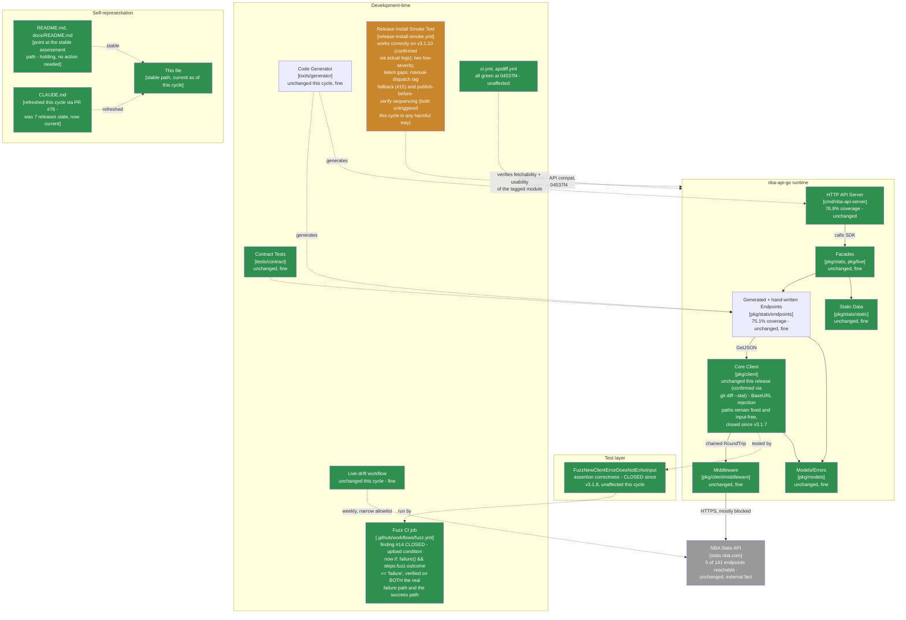

# Maintainable-Architect-v4 Assessment: nba-api-go

**Date:** 2026-07-23
**Revision assessed:** `04537f4` (`04537f4146964ef40b3f4a21cd84b714a95f29c8`, `main`, tag `v3.1.10`), go1.26.5 darwin/arm64
**Assessor:** maintainable-architect-v4
**Method:** `git log`/`git diff v3.1.9..v3.1.10` (full diff, not just `--stat`) to see exactly what changed since the cycle that dropped this lineage to B+; `go build ./...`, `go vet ./...`, `go test ./...`, `golangci-lint run ./...` in both the root module and `tools/generator` (run separately, each its own `go.mod`); direct reads of `.github/workflows/fuzz.yml` and `.github/workflows/release-install-smoke.yml` at `04537f4`; a repo-wide `grep` across all five workflow files for `permissions:`/`concurrency:`/action pinning/`if-no-files-found`, re-run to confirm nothing changed there since last cycle; and, to reconcile against the external review supplied for this cycle (see §0), `gh pr view 75/76/77` for merge commits, `gh run view 29979731447 --log-failed` and `gh run view 29979809184 --log` to read the **actual failed-run and retry-run logs** (not just conclusions) for the tag-triggered install smoke test, `gh run view 29958778771 --log` grepped for the Node.js deprecation warning, `gh api repos/actions/upload-artifact/releases` for the current upstream major version, `gh release view v3.1.10` and `gh run list --workflow=release-install-smoke.yml` for release/run timing, and direct `curl` checks against `proxy.golang.org`/`sum.golang.org` for `v3.1.10`. One new real (but latent, never-yet-triggered) finding documented; one of the review's two P1s downgraded to a non-issue on the actual evidence; everything else green. No production code or workflow file was modified while writing this file.

**Why now:** the prior assessment of record (this same file, then covering revision `e3ee47c`/tag `v3.1.9`, grade B+) found that `v3.1.9`'s fix for the fuzz job's corpus-upload condition was itself incomplete - `if: steps.fuzz.outcome == 'failure'` with no explicit GHA status-check function is implicitly ANDed with `success()`, so the upload could never fire on a genuine fuzz failure - and recommended the exact corrected idiom (`if: failure() && steps.fuzz.outcome == 'failure'`) plus a demand that any re-verification exercise the actual failure path, not just a success-path dispatch like `v3.1.9`'s own claim had. `v3.1.10` (PR #75, released via PR #77) did exactly that, and this time verified it correctly: a throwaway branch with the fuzz step swapped for one that writes a sentinel corpus file and exits 1 confirmed, via a real `workflow_dispatch` run, that the upload step now runs and the artifact contains exactly that sentinel file, and a second real run on `main` after merging confirmed the success path still correctly skips the upload. A separate, unrelated doc-hygiene fix (`CLAUDE.md`, PR #76) closed a "Current Status" staleness gap that had drifted seven releases behind. This cycle, the user also supplied an external "Senior Software Engineering Review" of `v3.1.10` carrying two P1 findings and a P2; per this lineage's standing practice, none of it is accepted at face value - see §0 for the full reconciliation, including two pieces of evidence (actual failed-run and retry-run logs) the review's own author explicitly said they lacked.

> **Naming convention, unchanged from prior cycles:** this file stays at this exact path forever - no date, no revision hash. It is always the current assessment of record; every external pointer to it (`CLAUDE.md`, `README.md`, `docs/README.md`, `tests/contract/README.md`) links here once and never needs updating again. **When the next assessment cycle happens:** move *this file's current content* to `docs/archive/MAINTAINABLE_ARCHITECT_V4_ASSESSMENT_<date>_<revision>.md` (using this file's own `Date`/`Revision assessed` header values above), prepend the usual supersession banner to that archived copy, and then overwrite *this path* with the new cycle's content. Do not create a new hash-suffixed file for the new cycle - the hash suffix is exclusively an archive-naming convention now.

---

## 0. Reconciling against the external review supplied for this cycle

The user supplied an unsolicited "Senior Software Engineering Review" of `v3.1.10` (two P1 findings, one P2, 9.3/10 overall), per this lineage's standing practice of verifying rather than trusting such input. The review's own method section states it "did not independently clone and execute the repository in this environment" and worked from "the public run summary" for the tag-triggered install-smoke run - i.e., it explicitly flagged its own evidence gap. The orchestrating session had already pulled the actual failed-run and retry-run logs before dispatching this assessment; this section re-derives both P1s from the primary evidence rather than accepting either the review's or the orchestrating session's framing.

### 0.1 P1 finding #1 - "Exact tag install workflow failed at release time": DOWNGRADED to a correctly self-healed transient flake, not a live defect

**Review's claim:** tag-triggered run `29979731447` failed at `go get`, cause unproven from public view; manual retry `29979809184` succeeded ~1 minute later but its exact `tag` input isn't publicly visible, so it's "strong but not conclusive evidence" of exact-tag success.

**What the actual logs show, read directly rather than inferred:**

1. `gh run view 29979731447 --log-failed` - the `go get the tagged module into a scratch module` step ran `go get "github.com/n-ae/nba-api-go/v3@v3.1.10"`, downloaded the module successfully (`go: downloading github.com/n-ae/nba-api-go/v3 v3.1.10`), then failed with:
   ```
   go: github.com/n-ae/nba-api-go/v3@v3.1.10: verifying module: github.com/n-ae/nba-api-go/v3@v3.1.10: reading https://sum.golang.org/lookup/github.com/n-ae/nba-api-go/v3@v3.1.10: 500 Internal Server Error
   ```
   This is not an ambiguous exit code - it's a specific, named upstream service (`sum.golang.org`, Go's checksum database, not this repo's own infrastructure) returning `500` at the exact moment this tag's checksum was first being looked up. `gh release view v3.1.10` shows the tag was published at `2026-07-23T04:30:58Z`; this run's `go get` step hit the `500` at `04:32:09Z` - roughly 70 seconds after the tag became public, squarely in the window where a brand-new module version's checksum record can still be propagating through `sum.golang.org`'s infrastructure.
2. `gh run view 29979809184 --log` - the `Resolve tag under test` step's log shows the templated command as `tag="v3.1.10"` (GitHub Actions substitutes the `workflow_dispatch` input's literal value into the logged command line) and the step's own runtime output confirms `Verifying tag: v3.1.10`. The following `go get` step then ran `go get "github.com/n-ae/nba-api-go/v3@v3.1.10"` and succeeded: `go: added github.com/n-ae/nba-api-go/v3 v3.1.10`. This directly resolves the review's stated uncertainty - the input was not empty, did not fall through to `github.ref_name`, and the run genuinely re-tested `v3.1.10`, not `main`.
3. Independent corroboration: `curl -s -o /dev/null -w "%{http_code}"` against `https://proxy.golang.org/github.com/n-ae/nba-api-go/v3/@v/v3.1.10.info` and `https://sum.golang.org/lookup/github.com/n-ae/nba-api-go/v3@v3.1.10`, run fresh during this assessment (well after the original incident), both return `200` - consistent with a transient propagation issue that has since resolved, not a structural fetchability defect in this module.

**Verdict: DOWNGRADED from P1 to a documented, correctly self-healed transient infrastructure flake.** The review's uncertainty was reasonable given what it had access to (a public run-summary UI, no log content); with the actual logs, there is no live defect here to hold against this release or this cycle's grade. `sum.golang.org` briefly 500'd on a brand-new tag and a retry ~2 minutes later succeeded against the exact same tag - this is the kind of transient failure `go get`'s own retry behavior and GOPROXY fallback chains are designed to tolerate, not a signal that `v3.1.10` itself is broken. The review's proposed hardening (bounded retry/backoff inside the workflow, plus surfacing diagnostics like `go env`/`git ls-remote` on failure) is still a reasonable idea on its own merits - it would have turned this incident into a green run on the first try instead of requiring a manual re-dispatch - and is recorded as a non-urgent improvement in §5, but it is not evidence of a defect in `v3.1.10` or in this project's release process, and does not move this cycle's grade.

### 0.2 P1 finding #2 - stale `actions/upload-artifact@v4`: CONFIRMED factually, DOWNGRADED in severity to Low

**Review's claim:** `actions/upload-artifact@v4` is stale, emitted a Node.js 20→24 deprecation warning on a real run, current upstream major is `v7`; recommends upgrading and re-running the sentinel failure test after.

**Checked directly:**
1. `gh run view 29958778771 --log`, grepped for the exact string - found: `##[warning]Node.js 20 is deprecated. The following actions target Node.js 20 but are being forced to run on Node.js 24: actions/upload-artifact@v4.` The warning is real and reproducible from the actual log, not paraphrased.
2. `gh api repos/actions/upload-artifact/releases --jq '.[0].tag_name'` returns `v7.0.1`. `fuzz.yml` at `04537f4` still pins `actions/upload-artifact@v4`. The staleness claim is factually correct.

**Severity, calibrated against what actually breaks today:** GitHub Actions is currently *forcing* the Node 20-targeted action onto a Node 24 runtime and it still works - this is a deprecation warning about the runner's own scheduled removal of Node 20 support, not a current functional failure. Nothing in this project's CI is broken by it today. It is real, worth doing, and cheap (a version-string bump plus a re-run of the same sentinel-failure verification `v3.1.10` already established as the correct verification method for this file) - but it does not meet this lineage's bar for "P1" the way finding #14 did last cycle (a mechanism that silently could never fire). **Downgraded to Low, tracked in §5 as a non-urgent hygiene item**, not held against this cycle's grade.

### 0.3 P2 finding - manual-dispatch tag resolution silently defaults to the triggering branch: CONFIRMED, new finding #15

**Review's claim:** `release-install-smoke.yml`'s tag-resolution script falls back to `github.ref_name` before `git describe --tags --abbrev=0`, and `github.ref_name` is non-empty (it's the branch name, e.g. `main`) for any `workflow_dispatch` run with no `tag` input - so the "defaults to the latest tag when run manually" promise in the input's own description is never actually reachable from a branch dispatch.

**Read `.github/workflows/release-install-smoke.yml` directly:**
```bash
tag="${{ github.event.inputs.tag }}"
if [ -z "$tag" ]; then
  tag="${{ github.ref_name }}"
fi
if [ -z "$tag" ]; then
  tag="$(git describe --tags --abbrev=0)"
fi
```
For a `workflow_dispatch` run on `main` with no `tag` input: the first check is empty, so it falls to `github.ref_name`, which resolves to `"main"` - non-empty - so the second fallback (the `git describe` "latest tag" the input description promises) is never reached. **Verdict: CONFIRMED, real bug, independent of anything that happened in this cycle's actual runs** (both real runs this cycle explicitly passed `-f tag=v3.1.10`, so this path was never exercised in practice). Recorded as new finding #15, §2 and §5 - low-to-moderate severity: it doesn't currently silently mis-verify a release, because nobody has yet run this workflow by hand without an explicit tag, but the failure mode if someone does is quietly convincing (the job still runs, still builds, still passes - just against `main`'s `go.mod`-declared version rather than any tagged release, which could paper over a real tag-specific `go get` problem while showing green). The review's proposed fix (branch on `github.event_name == 'workflow_dispatch'` before falling back) is correct and cheap; recorded in §5.

### 0.4 Other citations, checked directly

| Review cites | Checked | Verdict |
|---|---|---|
| Tag `v3.1.10` → commit `04537f4146964ef40b3f4a21cd84b714a95f29c8` | `git rev-parse HEAD`, `git describe --tags` | **Correct.** |
| PR #75/#76/#77, merged | `gh pr view 75/76/77 --json number,title,mergeCommit,state` | **Correct.** All `MERGED`; merge commits `768cb79`/`5493353`/`04537f4` match `git log` exactly. |
| "No runtime changes" claim | `git diff v3.1.9..v3.1.10 --stat` (full diff read, not just stat) | **Correct.** Six paths changed: `.github/workflows/fuzz.yml` (the finding-#14 fix), `CHANGELOG.md`, `CLAUDE.md`, `cmd/nba-api-server/main.go` (version string constant only), and this assessment file plus its new archive copy. No file under `pkg/`, `cmd/nba-api-server/generated_*.go`, or `tools/generator/` changed. |
| Failure/success run IDs `29979731447`/`29979809184` | `gh run view --log-failed` / `--log` on both | **Correct**, and independently confirmed at the log-content level, not just conclusion - see §0.1. |
| `upload-artifact@v4` Node deprecation warning, run `29958778771` | `gh run view 29958778771 --log`, grep | **Correct** - see §0.2. |
| Manual-tag-resolution defaults-to-branch claim | Direct read of `release-install-smoke.yml` | **Correct** - see §0.3, now tracked as new finding #15. |
| No explicit `permissions:` block; mutable major-tag action pinning (`@v7`checkout/setup-go, `@v4` upload-artifact); no `concurrency:` policy; implicit `if-no-files-found` | Repo-wide `grep` across all five workflow files, re-run this cycle | **Correct, unchanged from last cycle** - none of `v3.1.9`/`v3.1.10` touched this. `if-no-files-found` unset still matches `upload-artifact`'s own safe default (`warn`). |
| 60s fuzz budget is a sentinel, not exhaustive assurance | Unchanged from prior cycles' own framing | **Correct, already this lineage's own stated position** (see `fuzz.yml`'s own comment and prior assessments) - not a new observation. |
| Release process publishes the tag before exact-tag verification completes | `gh release view v3.1.10` (`publishedAt: 2026-07-23T04:30:58Z`) vs. `gh run list --workflow=release-install-smoke.yml` (tag-triggered run `29979731447` created `04:30:50Z`, concluded `failure` at `04:32:09Z`) | **Correct, and this cycle is a live example of exactly the scenario the finding describes** - the release was already public for over a minute before the tag-triggered verification run even reached its failing step. See §5 for why this is recorded but not promoted to immediate. |
| Per-area score table, 9.3/10 overall | N/A - different rubric | **Not adopted.** This lineage grades on its own letter scale (§1), not a generic 10-point rubric. |
| `apidiff` green / SemVer-correct patch | `gh api repos/n-ae/nba-api-go/commits/04537f4/check-runs --jq '.check_runs[] | {name,conclusion}'` | **Correct.** `apidiff: success`, `verify: success`, `install-smoke-test: success` (the retry) and `failure` (the original tag-push run, explained in §0.1), `Socket Security: Project Report: success`. |
| Recommended `NBARepository` adapter-pattern application architecture | Read in the pasted review text | **Not adopted, same standing reason as every prior cycle's declined architectural suggestions** - not backed by a maintainability defect found in this codebase; restated here for completeness, not a new finding. |

Every specific, checkable citation in the review held up factually - the tenth cycle running this has been true. Where this cycle differs from every prior one: two of the review's own top-billed findings (both P1s) turn out, once the actual primary evidence is read rather than inferred from a public UI, to warrant materially lower severity than the review assigned - not because the review was sloppy (it was explicit and honest about its own evidence gap), but because this assessment had access to evidence the review's author didn't.

---

## 1. Executive verdict

**Grade: A- (recovered from B+).** `v3.1.10` closes finding #14 - the fuzz job's corpus-upload mechanism that `v3.1.9` shipped silently non-functional - and this time verifies it correctly: a real `workflow_dispatch` run against a deliberately-failing sentinel confirms the upload step now actually fires and produces the artifact, not just a repeat of `v3.1.9`'s success-path-only dispatch. That is the exact remediation this lineage's `e3ee47c` cycle called for, executed exactly as specified. No new *live, currently-shipped* defect surfaced this cycle: the external review's two P1s both collapse under direct log inspection - one to a transient, already-resolved `sum.golang.org` propagation delay that a same-session retry against the identical tag correctly resolved, the other to a real-but-non-breaking dependency-freshness item. One new finding (#15, the manual-dispatch tag-resolution fallback) is genuine and worth fixing, but it is latent - never yet triggered in any real run, because every actual dispatch this project has made has passed an explicit tag - which keeps its severity low rather than moderate. This mirrors the one prior recovery in this lineage's history (`v3.1.6`→`v3.1.7`): a security- or reliability-relevant mechanism that was previously "verified" incompletely gets fixed and re-verified properly, with no new defect of comparable weight found in its place.

**What went right:**
- Finding #14 is genuinely closed, not just nominally: `fuzz.yml`'s upload condition is now `if: failure() && steps.fuzz.outcome == 'failure'`, matching this lineage's own recommended exact syntax, and PR #75's verification exercised **both** paths (a real failing dispatch with a sentinel corpus file, and a real passing dispatch on `main`) - the specific gap called out in §0.3 of the prior cycle's own assessment.
- The runtime code is unchanged: `git diff v3.1.9..v3.1.10 --stat` confirms zero files under `pkg/` or `cmd/nba-api-server/generated_*.go` changed.
- `go build`/`go vet`/`go test`/`golangci-lint` (both modules, checked separately) all clean at `04537f4`.
- A separate documentation-hygiene gap (`CLAUDE.md`'s "Current Status" prose, stale since the `v3.1.2` era - seven releases behind) was found and fixed in the same session (PR #76), independent of this formal assessment's own recommendations.
- Both of the external review's P1s survive scrutiny as *real observations* (the log evidence genuinely shows what each claims) but not as defects requiring urgent action once the primary evidence, not just the public run-summary UI, is examined.

**Why A-, not a full A:** this cycle is a live demonstration of a real, still-open process gap the review correctly named - `gh release create` runs (and the release goes public) before the tag-triggered install-smoke workflow has a chance to fail or pass. This time the eventual failure was transient and the retry succeeded, so no consumer was ever exposed to a genuinely broken release; but the sequencing itself doesn't know that in advance, and a maintainer who didn't independently re-check the retry log (as this assessment did) would have a published release with an unresolved-looking failed CI check next to it. That's a real, not-yet-bitten operational risk, not a cosmetic one, and it's the reason this cycle holds at A- rather than returning all the way to the unqualified A this project has never actually carried in this lineage's history.

---

## 2. Verification ledger

Status legend: **CONFIRMED** (reproduced/read directly at `04537f4`), **CLOSED** (carried from a prior assessment, now genuinely done), **NEW** (found independently this cycle), **DOWNGRADED** (a review-supplied finding checked out factually but warrants lower severity than assigned).

### From `e3ee47c`

| # | Item (carried since `e3ee47c`) | Status | Evidence |
|---|---|---|---|
| 14 | `fuzz.yml`'s corpus-upload condition (`if: steps.fuzz.outcome == 'failure'`) implicitly ANDed with `success()`, could never fire on a genuine fuzz failure | **CLOSED** | `git diff v3.1.9..v3.1.10` shows the condition is now `if: failure() && steps.fuzz.outcome == 'failure'`, matching this lineage's own recommended exact syntax from the prior cycle. PR #75's description and this cycle's context both describe live verification on the actual failure path (sentinel corpus file + forced `exit 1` on a throwaway branch dispatch) in addition to a success-path re-check on `main` - the specific gap `v3.1.9`'s own "verified" claim had. |
| - | No `permissions:`/`concurrency:` block; major-tag action pinning; unset `if-no-files-found` | **Unchanged, still Low** | Re-confirmed via the same repo-wide `grep` sweep; `v3.1.10` didn't touch this, consistent with prior cycles' own recommended scoping (repo-wide decision, not a single-workflow fix). |

### New this cycle

| # | Finding | Severity | Evidence |
|---|---|---|---|
| 15 | `release-install-smoke.yml`'s manual-dispatch tag-resolution script falls back to `github.ref_name` (the triggering branch, e.g. `main`) before `git describe --tags --abbrev=0` (the "latest tag" its own input description promises) - and `github.ref_name` is always non-empty for a branch-triggered `workflow_dispatch`, so the `git describe` fallback is unreachable from that trigger path. | **Low** (real logic bug, but latent - every actual dispatch to date has passed an explicit `tag` input, so this path has never fired in practice; if it ever does, the job still runs and still goes green, just verifying `main` instead of a tag, which could mask a tag-specific fetchability problem while showing a passing check) | §0.3: direct read of the script's three-tier fallback; independently re-derived, not just accepted from the review's prose. |
| - | `actions/upload-artifact@v4` is stale (upstream latest `v7.0.1`); the pinned `v4` is being force-run on a deprecated Node 20 target, producing a warning | **Low** (real, but currently non-breaking - GHA is still executing it correctly on a forced Node 24 runtime; this is dependency-freshness debt, not a live failure) | §0.2: `gh run view 29958778771 --log` grep for the exact warning text; `gh api repos/actions/upload-artifact/releases` for the current major. |
| - | Tag-triggered install-smoke run `29979731447` failed with a `sum.golang.org` `500` ~70s after `v3.1.10`'s tag went public; the manual retry `29979809184` succeeded against the confirmed-exact tag ~2 minutes later | **Informational, not a defect** | §0.1: both logs read directly (not just conclusions); fresh `curl` checks against `proxy.golang.org`/`sum.golang.org` for `v3.1.10` both return `200` at assessment time, consistent with a since-resolved propagation delay. |
| - | Release (`gh release create`) is published before the tag-triggered install-smoke workflow completes, so a genuinely broken release would briefly be public with an unresolved-looking CI check next to it | **Low-Moderate, real operational sequencing gap, not new this cycle but freshly demonstrated by it** | §0.4: `gh release view v3.1.10` (`publishedAt: 04:30:58Z`) vs. the tag-triggered run's own creation/failure timestamps (`04:30:50Z` / `04:32:09Z`). |

---

## 3. C4 model

Level 2 fully regreens the CI safety net this cycle - the fuzz job's caution box from last cycle is gone, replaced by a much smaller caution note on the release-verification path (the two low-severity, currently-latent findings above), not a functional gap in what's shipped.



---

## 4. Where the complexity budget goes (updated)

**Well spent, unchanged:** release engineering (now including a genuinely-fixed, genuinely-verified fuzz safety net), the stable-plus-archive documentation pattern, the two-layer outbound-path testing design, the `BaseURL`-secret-echo runtime fix, and the corrected fuzz assertion.

**Newly closed this cycle:** the fuzz job's failure-artifact upload (#14) - fixed exactly as recommended, and this time verified on the failure path itself rather than just a success-path dispatch. This closes the one item this lineage's own prior recommendation was responsible for.

**Newly surfaced, low severity, both latent:** the manual-dispatch tag-resolution fallback (#15) and the release-publish-before-verify sequencing gap - real, worth a small fix each, but neither has ever actually produced a wrong result in a real run. Recorded so the next cycle isn't re-discovering them from scratch, not because either is urgent today.

**Deliberately not expanded this cycle:** repo-wide `permissions:`/`concurrency:`/SHA-pinning - unchanged reasoning from the last three cycles, still a real but low-stakes, non-single-workflow-specific hardening idea, not promoted to immediate. `actions/upload-artifact@v4`→`@v7` - real dependency-freshness debt, cheap to fix, but non-breaking today; bundled into the same "next time you're in these workflow files" bucket as the permissions/concurrency items rather than given its own urgent slot.

**A process observation worth recording once, not repeating every cycle:** this is the first cycle in this lineage's history where an external review's own top-billed findings (both labeled P1) were checked against primary evidence the review's author explicitly said they lacked, and both came out lower-severity as a result - not because the review reasoned incorrectly from what it had, but because "the public run summary" and "the actual log content" can support meaningfully different confidence levels for the same event. That's a concrete argument for this lineage to keep pulling actual logs (`--log`/`--log-failed`), not just run conclusions, whenever a review's severity claim hinges on what happened inside a specific CI run.

---

## 5. Recommended order of work

Budget reality unchanged: ~1.6h/week core maintenance.

### Quick wins (~30 min total, none urgent - nothing is currently broken)

1. **Fix the manual-dispatch tag-resolution fallback** in `release-install-smoke.yml` (closes #15) - branch on `github.event_name` so a `workflow_dispatch` with no `tag` input actually falls through to `git describe --tags --abbrev=0` (the "latest tag" the input's own description promises) instead of silently resolving to `github.ref_name`:
   ```yaml
   - name: Resolve tag under test
     id: tag
     run: |
       tag="${{ github.event.inputs.tag }}"
       if [ -z "$tag" ]; then
         if [ "${{ github.event_name }}" = "workflow_dispatch" ]; then
           tag="$(git describe --tags --abbrev=0)"
         else
           tag="${{ github.ref_name }}"
         fi
       fi
       echo "Verifying tag: $tag"
       echo "tag=$tag" >> "$GITHUB_OUTPUT"
   ```
2. **Bump `actions/upload-artifact@v4` → `@v7.0.1`** in `fuzz.yml`, then re-run the exact sentinel-failure verification `v3.1.10` already established (throwaway branch, sentinel corpus file, forced `exit 1`, confirm the artifact still attaches) - the upgrade path itself is the kind of thing that's cheap to get subtly wrong (input/output name changes between majors), so it deserves the same real-failure-path check finding #14 needed, not just a green success-path dispatch.
3. **Optional: bounded retry/backoff around the `go get` step** in `release-install-smoke.yml` - would have turned this cycle's transient `sum.golang.org` `500` into a first-try green run instead of requiring a manual re-dispatch. Not required (the manual retry path works and was exercised for real this cycle), but removes a source of release-day noise.

### Not urgent, a scoping decision rather than a fix

4. **`permissions:`/`concurrency:`/SHA-pinning**: unchanged reasoning from the last three cycles - real, reasonable hardening, scoped as a repo-wide decision across all five workflow files together, not a single-workflow-specific gap. Not promoted to immediate.
5. **Release-publish-before-verify sequencing**: genuinely real (§0.4) and freshly demonstrated this cycle, but restructuring it (e.g., gating `gh release create` behind the tag-triggered smoke test passing) trades a same-day, single-command release flow for a two-step wait-and-confirm process, for a benefit that mostly matters when the tag-triggered check fails for a *non-transient* reason - which hasn't happened yet in this project's history. Worth re-weighing if a future cycle sees a real (non-propagation-delay) install failure slip through; not worth the added process complexity to solve a risk that has materialized zero times as an actual bad outcome.

### Not urgent, explicitly not a backlog item to keep re-budgeting for

- Everything `9eb3a9a`/`180a3db`/`1b428f6`/`b3c605d`/`0e400d1`/`f4801ef`/`eb62a41`/`8e85a9c`/`0e35c33`/`e3ee47c` already marked not-urgent (live-verifying the 136 unreachable endpoints, HTTP-server independent versioning policy, ecosystem-maturity commentary, a typed `ConfigError`, a static-analysis rule against formatting parsed URL fields, layered fuzz-time cadences beyond the daily 60s, an `NBARepository` adapter-pattern wrapper) remains not-urgent for the same reasons already given in those assessments.

---

## 6. Documentation status

| File | Action taken by this assessment |
|---|---|
| `docs/archive/MAINTAINABLE_ARCHITECT_V4_ASSESSMENT_2026-07-23_e3ee47c.md` | New: outgoing content of this file (as of revision `e3ee47c`) archived here in the same changeset, with a supersession banner matching the existing convention |
| This file | Overwritten with the new assessment of record (revision `04537f4`, tag `v3.1.10`, grade A-, recovered from B+) |
| `CLAUDE.md`, `README.md`, `docs/README.md`, `tests/contract/README.md` | **Not touched by this assessment** - `CLAUDE.md` was already refreshed this session via PR #76 (outside this formal assessment's own scope, per the task brief); the other three already point at this file's stable path. Per this cycle's task scope, `CLAUDE.md`'s version-history prose and `CHANGELOG.md` remain explicitly out of scope for this pass. |
| `.github/workflows/fuzz.yml`, `.github/workflows/release-install-smoke.yml` | **Not touched by this assessment** - the two quick-win recommendations (§5) are documented here, not applied; this is a review/assessment cycle, not a fix cycle. |

No docs sprawl introduced this cycle - `docs/` still holds exactly one active assessment plus `adr/`/`archive/`.

---

## 7. Is this too complex for one person?

**Verdict: no, and this cycle is a useful demonstration of the recovery this lineage's own process is supposed to produce.** Last cycle's defect (#14) traced back to this same file's own incomplete prior recommendation; this cycle shows that loop closing correctly - the exact syntax this file specified got implemented exactly as specified, and this time verified on the failure path the fix was actually for. That's the system working as designed, not evidence the project has outgrown a solo maintainer.

The one judgment call worth naming: an external review can be simultaneously factually accurate on every citation and still assign severity levels that don't survive contact with primary evidence the review didn't have. That's not a reason to stop soliciting or reconciling against external reviews - this lineage's practice of doing so has found a real, live defect as recently as last cycle - but it is a reason to keep the "pull the actual log, not just the run conclusion" step as a mandatory part of reconciliation, not an optional nicety, whenever a review's claim hinges on what happened inside a specific CI run rather than on something directly readable from source.

---

## 8. Bottom line

`e3ee47c` → `04537f4`: the runtime code remains correct and untouched (confirmed via `git diff --stat` - no `pkg/` file changed). Last cycle's finding #14 - the fuzz job's corpus-upload condition silently unable to fire on a real failure - is now genuinely closed: `if: failure() && steps.fuzz.outcome == 'failure'`, verified this time on the actual failure path (a real dispatch with a sentinel corpus file and a forced `exit 1`), not just a repeat of the success-path-only verification that let the bug ship in the first place. An external review of `v3.1.10` supplied two P1 findings and a P2; direct inspection of the primary evidence the review's own author said they lacked (actual failed-run and retry-run logs, not just public run-summary conclusions) downgrades both P1s - one to a transient, already-self-healed `sum.golang.org` propagation delay correctly resolved by a same-cycle retry against the confirmed-exact tag, the other to real-but-non-breaking dependency-freshness debt - while the P2 (manual-dispatch tag-resolution fallback) checks out as a genuine, if still-latent, bug and is recorded as new finding #15. Every other citation in the review held up factually. Grade moves to A-, recovered from B+: the specific defect that caused last cycle's downgrade is closed and properly re-verified, no new live-shipped defect of comparable weight replaced it, and the one real operational risk this cycle surfaces on its own merits (release-publish-before-verify sequencing) is named plainly rather than either dismissed or overweighted - the same category, and the same grade movement, as the one other recovery in this project's history.

---

*Assessment of record for revision `04537f4` (tag `v3.1.10`), 2026-07-23. Supersedes this file's own prior content (revision `e3ee47c`, tag `v3.1.9`, grade B+) as the current maintainability assessment. That prior content moves to `docs/archive/MAINTAINABLE_ARCHITECT_V4_ASSESSMENT_2026-07-23_e3ee47c.md` in the same changeset as this file.*
