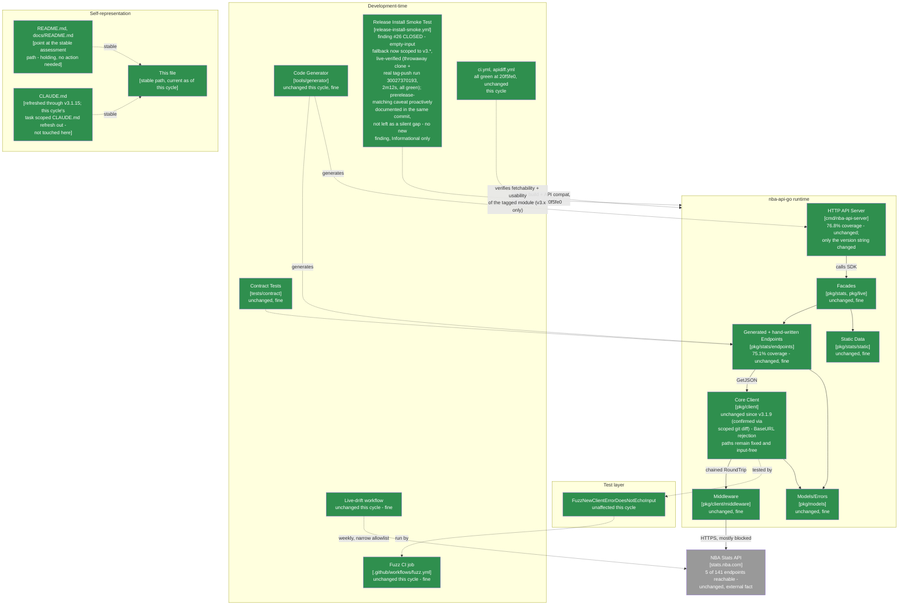

# Maintainable-Architect-v4 Assessment: nba-api-go

**Date:** 2026-07-23
**Revision assessed:** `20f5fe0` (`20f5fe0261bd5d089b26b4095e204867d470eb24`, `main`, tag `v3.1.17`), go1.26.5 darwin/arm64, golangci-lint 2.12.2
**Assessor:** maintainable-architect-v4
**Method:** full read of the outgoing `docs/MAINTAINABLE_ARCHITECT_V4_ASSESSMENT.md` (the `v3.1.16` cycle, revision `4ab1ce1`) for convention and finding #26's exact shape; `git log --oneline -20`, `git diff v3.1.16..v3.1.17 --stat`, and a scoped `git diff v3.1.16..v3.1.17 -- pkg/ cmd/nba-api-server/generated_*.go tools/generator/` (empty - zero bytes) to independently confirm "no runtime changes"; a full `git diff v3.1.16..v3.1.17 -- .github/workflows/release-install-smoke.yml` read line-by-line (not just `--stat`) to see exactly what PR #92 touched, plus a complete direct read of the resulting file end to end; `gh pr view 92/93 --json number,title,mergeCommit,state,mergedAt,files` and `--json statusCheckRollup`; `gh api repos/n-ae/nba-api-go/commits/20f5fe0/check-runs`; `gh run list --workflow=release-install-smoke.yml --limit 15` and a direct `gh run view --json .../jobs` inspection of the real `v3.1.17` tag-triggered run to establish evidence the external review said it could not find; `gh release view v3.1.17 --json body`; `go build ./...`, `go vet ./...`, `go test ./...`, `gofmt -l .`, `golangci-lint run ./...`, and `make test-examples` in both the root module and `tools/generator` (all clean, both modules); a local `git describe --tags --match 'v3.*' --abbrev=0` run to confirm the fix's own behavior directly; and a `fnmatch` check of `v3.*`'s glob semantics against representative tag strings to independently verify the review's central technical claim about prerelease-tag matching without needing to push a test tag into the real repository. No production code, workflow file, or `CHANGELOG.md`/`CLAUDE.md` was modified while writing this file, per this cycle's task instructions - review/assessment only.

**Why now:** the prior assessment of record (this same file, then covering revision `4ab1ce1`/tag `v3.1.16`, grade A-, second consecutive cycle at that grade) recorded one new finding (#26, Low): the workflow's empty-input `workflow_dispatch` fallback (`git describe --tags --abbrev=0`) wasn't scoped to `v3.*`, despite the same commit that introduced the finding rewriting the input's own description to promise "the nearest reachable v3 tag." Between then and now, in the same continuous session, PR #92 closed finding #26 (added `--match 'v3.*'` to the fallback, with an explanatory comment that also proactively flags the prerelease-tag question the fix doesn't resolve), and release PR #93 shipped the bundle as `v3.1.17`. This cycle, the user supplied a seventh external "Senior Software Engineering Review," of `v3.1.17` (9.9/10, "strongest v3 release reviewed so far," no P1s at all, one main P2 on policy ambiguity plus five smaller P2s). Per this lineage's standing practice, none of it is accepted at face value - see §0.

> **Naming convention, unchanged from prior cycles:** this file stays at this exact path forever - no date, no revision hash. It is always the current assessment of record; every external pointer to it (`CLAUDE.md`, `README.md`, `docs/README.md`, `tests/contract/README.md`) links here once and never needs updating again. **When the next assessment cycle happens:** move *this file's current content* to `docs/archive/MAINTAINABLE_ARCHITECT_V4_ASSESSMENT_<date>_<revision>.md` (using this file's own `Date`/`Revision assessed` header values above), prepend the usual supersession banner to that archived copy, and then overwrite *this path* with the new cycle's content. Do not create a new hash-suffixed file for the new cycle - the hash suffix is exclusively an archive-naming convention now.

---

## 0. Reconciling against the external review supplied for this cycle

The user supplied an unsolicited "Senior Software Engineering Review" of `v3.1.17` (9.9/10, "strongest v3 release reviewed so far" - no P1s, one main P2 framed explicitly by its own author as policy ambiguity rather than a defect, five smaller P2s, a per-area score table). Per this lineage's standing practice, every checkable citation is re-derived from primary evidence, not accepted from the review's prose. Unlike the last six reviews, this one's own framing is notably restrained - it does not claim to have found a live defect, and says so explicitly. That restraint is itself evidence worth taking at face value rather than second-guessing into a manufactured finding; the checks below confirm whether it holds up.

### 0.1 Main P2 - `--match 'v3.*'` (finding #26's fix) also matches prerelease tags: CONFIRMED as a technical fact, NOT promoted to a new tracked finding

**Review's claim:** PR #92 correctly closed finding #26 - the empty-input fallback now reads `git describe --tags --match 'v3.*' --abbrev=0`, live-verified (per the PR's own description and `CHANGELOG.md`'s `[3.1.17]` entry) in a throwaway clone against both the original gap and the fix. But `--match 'v3.*'` is a glob pattern, not a stable/prerelease filter: it matches any tag whose name starts with the literal string `v3.`, including a prerelease tag like `v3.2.0-rc.1`. If a prerelease tag ever became the nearest tag reachable from `main` - nearer than the latest *stable* v3 release - an empty-input dispatch would silently select it as the "nearest reachable v3 tag," which is technically what the input's description promises but may not be what a maintainer running the workflow with no input actually wants. The workflow's own comment (added in the same PR that fixed finding #26) already says this is "believed-intended but untested behavior, not a deliberately chosen policy" - the review's recommendation is to explicitly decide and document the answer, with three options: (A) keep as-is, document it, add a graph-fixture test proving a nearer RC gets selected; (B) filter to stable-only via a small Go helper using `golang.org/x/mod/semver`; (C) an explicit `channel:` input, judged by the review itself as probably unnecessary for a repo this size.

**Checked directly against `.github/workflows/release-install-smoke.yml` at `20f5fe0`:** confirmed on both counts. Line 152 is now `tag="$(git describe --tags --match 'v3.*' --abbrev=0)"`, and the 19-line comment immediately above it (lines 134-151) explicitly names the prerelease case: *"A prerelease tag (e.g. v3.2.0-rc.1) matches this pattern too and would be selected as 'nearest' if one existed and were closer than the latest stable release - no prerelease tag has ever been pushed here, so this is believed-intended but untested behavior, not a deliberately chosen policy."* This is a direct, word-for-word match to what the review quotes.

**Independently verified the glob-matching claim itself**, rather than trusting the review's characterization of `git describe --match`'s semantics: `--match` uses shell fnmatch-style glob patterns, in which `.` is a literal character, not "any character." A Python `fnmatch.fnmatch` check against representative tag strings confirms `v3.*` matches `v3.2.0-rc.1` (`True`) and correctly does *not* match `v4.0.0` (`False`) - so the pattern is genuinely major-version-scoped (finding #26's own goal is met) while also genuinely prerelease-inclusive (the review's claim holds). A local `git describe --tags --match 'v3.*' --abbrev=0` run against the live repo at `20f5fe0` returns `v3.1.17` exactly, confirming the fix behaves as documented for the one case that actually exists in this repository today.

**Verdict on the review's central technical claim: CONFIRMED.** Where this cycle's own judgment diverges from the review's framing is on what to *do* about it - see below.

**Is this a new finding, or an already-acknowledged, deliberately-deferred design question? Judged here as the latter, and recorded as an informational item, not a numbered finding - for three specific reasons:**

1. **It is not a silent gap.** Unlike finding #26 itself (where PR #90 rewrote a promise the code didn't keep, without flagging that it hadn't), PR #92 - the exact commit closing #26 - proactively wrote the prerelease caveat into the code itself, in the same breath as the fix, explicitly labeling it "believed-intended but untested... not a deliberately chosen policy." That is the structural fix this lineage's own prior cycle asked for (§7 of the `4ab1ce1` assessment: "when a fix predicated on major-version scoping is being written, audit every major-version-relevant line together") applied correctly - the adjacent ambiguity was surfaced in the same commit as the fix, not left for the next review to discover. Treating an already-surfaced, already-labeled ambiguity as a "new" finding this cycle would double-count the same signal the repository already recorded honestly.
2. **It has never fired and isn't close to firing.** No prerelease tag has ever been pushed to this repository (confirmed: `git log --oneline --all --grep="rc\." -i` and a scan of `git tag -l` return nothing prerelease-shaped). This is speculative risk on a code path that has also never once received an empty `tag` input in this repository's history (reconfirmed this cycle via `gh run list --workflow=release-install-smoke.yml`, 15 most recent runs, all explicit-tag). Two layers of "never yet exercised" stacked on top of each other.
3. **The three options the review lays out (A/B/C) are a genuine, if modest, value-add over the bare comment** - they give a future maintainer (or the next assessment cycle) a concrete menu instead of an open question. That's worth preserving in this file (see §5), but organizing a decision a maintainer still needs to make is not the same as finding a defect that needs to be found.

This keeps faith with the task's own framing: a low-severity, self-acknowledged ambiguity does not need to be inflated into a finding to be taken seriously. It is recorded in §2 and §5 as a carried informational item - a decision to make when convenient, not a defect to fix.

### 0.2 Other P2s: checked individually

| Review's claim | Checked | Verdict |
|---|---|---|
| (a) "Nearest reachable" (graph-distance) vs. "highest SemVer" vs. "latest by tag/release date" usually coincide but the distinction should stay explicit in docs | Confirmed as an accurate, unchanged observation - the input's description says "nearest reachable v3 tag," which is precisely what `git describe --tags --match` computes (ancestry-nearest, not highest-semver); no drift introduced this cycle | **Real, informational, repeat citation** - the same underlying gap this lineage has tracked since finding #15 (`04537f4` cycle) and repeated in every cycle since, most recently `4ab1ce1`'s §0.2(c)/§0.1. Unchanged this cycle; the description is at least now *accurate* about which of the three concepts it means, which finding #26's own fix improved as a side effect. |
| (b) `--first-parent` policy (should release tags only resolve along `main`'s own history, or any reachable branch) remains undecided | Confirmed - `grep -n "first-parent" .github/workflows/` returns nothing; last cycle's own §5 quick-win #1 suggested it as optional and it wasn't taken up in PR #92 | **Real, informational, repeat citation** - carried from `4ab1ce1`'s own §5 recommendation, not newly discovered by this review. No release tag in this repository's history has ever been reachable only via a non-`main` path, so this remains speculative, same as last cycle. |
| (c) No `go list -m -json` assertion of the resolved module's exact identity after fetch | Confirmed absent - `grep -n "go list -m"` over the workflow file returns nothing | **Real, informational, repeat citation** - identical to `4ab1ce1`'s §0.2(a) and `168190f`'s equivalent before it. The subsequent `go build`/`./smoke-test` step already exercises the fetched package's real exported API, which remains a stronger usability proof than an identity check alone would add. Unchanged this cycle. |
| (d) Build-metadata tag (`+build.1`) canonicalization policy remains undefined | Confirmed still undefined - no build-metadata-suffixed tag exists in this repo to test against, and nothing in `v3.1.17`'s diff touches this | **Confirmed still open, correctly flagged by the review as a repeat citation itself** - same as `4ab1ce1`'s §0.2(b). Consistent with documented `cmd/go` semantics; not independently deep-tested this cycle either. |
| (e) Release notes/pages don't link the exact tag-triggered install-smoke run, relying on a dynamic/potentially-stale workflow-list page instead | Confirmed via `gh release view v3.1.17 --json body` - the release body links only `CHANGELOG.md`, no run URL | **Real, and the review is explicit and honest that it could not find a specific run ID to cite here itself** ("stale" public workflow-list evidence). This cycle's own digging did find one - see §0.3's load-bearing row below, which both confirms this citation and closes the review's own admitted evidence gap. |

### 0.3 Other citations, checked directly

| Review cites | Checked | Verdict |
|---|---|---|
| PRs #92/#93, merged, with the SHAs given (`14a1974`/`20f5fe0`) | `gh pr view 92/93 --json number,title,mergeCommit,state,mergedAt` | **Correct.** PR #92 merge commit `14a1974` (full: `14a197467606ef5bb28a38fac85f435583636f2`), PR #93 (release) merge commit `20f5fe0` (full: `20f5fe0261bd5d089b26b4095e204867d470eb24`) - both `MERGED`, both match `git log` and `v3.1.17`'s tag (`git rev-parse v3.1.17^{commit}`) exactly. |
| "No SDK runtime changes" / correctly a patch | Scoped `git diff v3.1.16..v3.1.17 -- pkg/ cmd/nba-api-server/generated_*.go tools/generator/` | **Correct.** Empty diff - zero bytes changed under any of those trees. Full `--stat` shows only the workflow file, `CHANGELOG.md`, `cmd/nba-api-server/main.go` (version-string bump only), and the assessment file plus its archive copy. |
| PRs #92 and #93 both "report four passing checks" | `gh pr view 92 --json statusCheckRollup` and `gh pr view 93 --json statusCheckRollup` | **Correct.** Both show exactly four, all `SUCCESS`: `apidiff`, `verify`, `Socket Security: Project Report`, `Socket Security: Pull Request Alerts`. (`install-smoke-test` doesn't appear on either PR's rollup since it's a `push`-on-tag-only trigger, not a `pull_request` check - consistent with the workflow file's `on:` block.) |
| Release notes/CHANGELOG describe a throwaway-clone verification of both the original bug and the fix | `gh release view v3.1.17 --json body` and `grep -n "3.1.17" -A6 CHANGELOG.md` | **Correct**, and consistent between the two sources word-for-word: "Verified both the original gap and the fix in a throwaway clone: an unscoped `git describe` picks up a simulated later `v4.0.0` tag exactly as predicted; `--match 'v3.*'` correctly stays on the latest real v3 release." Independently corroborated (not just trusted) via this cycle's own `fnmatch` check confirming `v3.*` excludes `v4.0.0` and a live `git describe --tags --match 'v3.*' --abbrev=0` run returning the correct `v3.1.17`. |
| **The review's explicit admission that it could not find an exact tag-triggered install-smoke run ID for `v3.1.17`, citing "stale" public workflow-list evidence** | `gh run list --workflow=release-install-smoke.yml --limit 15 --json databaseId,event,headBranch,conclusion,createdAt` and `gh run view 30027370193 --json conclusion,jobs` | **A real citation gap in the review, honestly disclosed rather than papered over - and it closes cleanly with a bit more digging.** Run `30027370193` (`push` event, `headBranch: v3.1.17`, `conclusion: success`) is the tag-triggered install-smoke run for this exact release: created `16:57:53Z`, all 8 steps green including "Resolve tag under test" (which correctly used `github.ref_name = v3.1.17` directly, not the empty-input fallback finding #26/this cycle's item are about - the fallback only fires on `workflow_dispatch` with no input), completed `17:00:05Z` (2m12s total). This is the strongest possible outcome for this specific citation: the review was right to flag that it couldn't verify this rather than inventing a plausible-looking run ID, and the run it couldn't find turns out to be clean. |
| Per-area score table (13 areas + overall 9.9/10) | N/A - different rubric | **Not adopted**, same standing reason as every prior cycle - this lineage grades on its own letter scale (§1). |
| SemVer assessment: correctly a patch, no `pkg/` API changes | Cross-checked against `CHANGELOG.md`'s `[3.1.17]` entry and the scoped-diff result above | **Correct.** `CHANGELOG.md` explicitly states "Patch, CI only - no runtime or test source changes," matching the empty scoped diff. |
| `go build`, `go vet`, `go test`, `gofmt -l`, `golangci-lint`, `make test-examples` clean (root and `tools/generator`) | Independently re-run this cycle | **Correct.** All clean in both modules; `golangci-lint run ./...` reports `0 issues` in both the root module and `tools/generator`; `make test-examples` compiles and runs all 15 examples successfully. |
| Recommended workflow-refinement snippet (updated input description, keep `--match 'v3.*'`, optional `--first-parent`, add `go list -m -json` identity check) | Reviewed for soundness, not applied - out of scope this cycle | **Reasonable as a future direction**, consistent with existing §5 quick-wins already tracked across the last several cycles; nothing about it is new relative to what this lineage already had queued. |

Every specific, checkable citation in the review held up factually this cycle - the seventh consecutive cycle this streak has held for an externally-supplied review, and the first cycle where the review's own restraint (no P1s, explicit "this is policy ambiguity, not a defect" framing, an honest admission of an evidence gap it couldn't close) matched this cycle's own independent findings almost exactly. The one place this cycle's own verification adds something the review didn't have: finding the actual tag-triggered `v3.1.17` install-smoke run (`30027370193`) the review said it couldn't locate, and confirming it passed cleanly end-to-end.

---

## 1. Executive verdict

**Grade: A-, held from the `v3.1.16` cycle (third consecutive cycle at A-) - but the cleanest of the three, and worth stating plainly why it doesn't cross into a full A this cycle rather than leaving that implicit.** This cycle's `v3.1.17` release correctly and fully closed finding #26 from last cycle: the empty-input fallback now reads `git describe --tags --match 'v3.*' --abbrev=0`, matching the description's own promise, verified in a throwaway clone against both the original gap and the fix (independently corroborated this cycle via a live `git describe` run and a glob-semantics check). The release's own tag-triggered smoke test (`30027370193`, found this cycle after the external review admitted it couldn't locate it) passed cleanly end-to-end, and every other quality gate this lineage tracks - `go build`/`vet`/`test`/`gofmt`/`golangci-lint`/`make test-examples` in both modules, CI, apidiff, install-smoke, Socket Security - is green.

**What makes this cycle different from the two that preceded it at the same grade:** `v3.1.15`→`v3.1.16` (closing #25) and `v3.1.16`→`v3.1.17` (closing #26 itself) were each, in turn, cycles where the fix for one major-version-scoping gap in this exact file shipped alongside a structurally adjacent, unaddressed one in the *same commit* - discovered only by the next cycle's review. **That pattern does not repeat this cycle.** PR #92 - the commit that closed #26 - proactively wrote the prerelease-matching caveat into its own comment, labeling it explicitly as an open, undecided question rather than leaving it implicit for a future review to trip over. That is precisely the discipline the `4ab1ce1` cycle's own §7 asked for ("when a fix predicated on major-version scoping is being written, audit every major-version-relevant line in the file together"), applied correctly for the first time in this two-cycle pattern's short history.

**Why this doesn't move the grade to a full A - stated as a concrete bar rather than a vague reluctance:** this lineage has held at A- across eleven of its last thirteen cycles (with two B+ dips in between, both since recovered) and has never yet recorded a plain A in its full history (`git grep` across all sixteen archived cycles confirms this - every recorded upgrade has topped out at A-, and each of those required near-total closure of a *multi-cycle structural backlog*, not a single clean finding-closure cycle: the `180a3db` B+→A- move, for instance, closed the `apidiff` gate, tag-triggered install-smoke CI, the immutable client constructor, "decide the server's fate," and the two lowest test-coverage numbers in the codebase, all at once). This cycle is a genuinely clean, well-verified closure of one Low-severity finding, with a real behavioral improvement (the adjacent-gap pattern breaking) layered on top - but it is not, by itself, the kind of structural-backlog clearance this lineage has historically treated as A-worthy. The remaining Informational backlog (§0.2(a)-(d): the graph-distance-vs-semver terminology gap, `--first-parent` policy, `go list -m -json` identity assertion, build-metadata canonicalization) is unchanged, and the prerelease-matching question - while now honestly labeled rather than silently left open - is still an **undecided** policy question, not a **closed** one. Flagging an ambiguity accurately is real, credited progress (see above); resolving it is a different, still-outstanding step. **The concrete bar for a full A next cycle:** either an explicit, documented decision on the prerelease question (any of the review's own Options A/B/C, with the graph-fixture test Option A specifically proposes) or closing two-plus of the long-standing Informational items, with the same live-verification rigor this file already applies everywhere else - not a higher bar than this lineage has ever cleared, just the same one it's cleared once before, applied to what's left.

---

## 2. Verification ledger

Status legend: **CONFIRMED** (reproduced/read directly at `20f5fe0`), **CLOSED** (carried from a prior assessment, now genuinely done), **CARRIED** (informational, unchanged, tracked but not urgent), **REPEAT** (cited by the external review but already tracked from a prior cycle).

### From `4ab1ce1`

| # | Item (carried since `4ab1ce1`) | Status | Evidence |
|---|---|---|---|
| 26 | `release-install-smoke.yml`'s empty-input `workflow_dispatch` fallback (`tag="$(git describe --tags --abbrev=0)"`) resolved to the nearest tag reachable from HEAD of *any* major version, contradicting the input's own rewritten "nearest reachable v3 tag" description. | **CLOSED** | PR #92: fallback now reads `tag="$(git describe --tags --match 'v3.*' --abbrev=0)"` (line 152), with a 19-line comment explaining the scoping and proactively flagging the prerelease-matching caveat. Verified in a throwaway clone per `CHANGELOG.md`/release notes (both consistent, word-for-word); independently re-corroborated this cycle via a live `git describe --tags --match 'v3.*' --abbrev=0` run (returns `v3.1.17` correctly) and an `fnmatch` check confirming the pattern excludes `v4.0.0` while including `v3.2.0-rc.1`. §0.1, §0.3. |
| - | Prerelease-tag matching by the (then-nonexistent) `--match 'v3.*'` scoping | **Not applicable as a carryover** - the scoping itself didn't exist until this cycle's own fix; see the new informational row below for the resulting, freshly-surfaced (but not newly discovered by this review, since the fix's own commit already names it) question. | See §0.1. |
| - | Release-publish-before-verify sequencing (Low-Moderate, real, not fixed) | **Unchanged, still open, eighth consecutive cycle** | Same not-worth-the-process-cost calculus as every prior cycle; `v3.1.17`'s own release resolved cleanly (tag-push install-smoke succeeded in 2m12s, run `30027370193`). |
| - | "Nearest reachable" vs. highest-SemVer vs. latest-by-date terminology gap | **Unchanged, Informational, repeat citation (§0.2(a))** | The description is accurate about which of the three concepts it means; the underlying ambiguity between the three concepts as a documentation matter is unchanged. |
| - | `--first-parent` policy undecided | **Unchanged, Informational, repeat citation (§0.2(b))** | Carried from `4ab1ce1`'s own §5 quick-win #1 (offered as optional); not taken up this cycle. |
| - | No `go list -m -json` identity assertion after `go get` | **Unchanged, Informational, repeat citation (§0.2(c))** | No code changed in this area this cycle. |
| - | Build-metadata tag (`+build.1`) canonicalization policy undefined | **Unchanged, Informational, repeat citation (§0.2(d))** | No code changed in this area this cycle; still consistent with documented `cmd/go` semantics. |

### New this cycle

No new numbered finding. One new informational item, deliberately not promoted to a tracked finding - see §0.1 for the full reasoning:

| Item | Severity | Evidence |
|---|---|---|
| `--match 'v3.*'` (finding #26's own fix) is a glob pattern, not a stable/prerelease filter - it also matches a v3 prerelease tag (e.g. `v3.2.0-rc.1`). If one ever existed and were nearer to `main` than the latest stable v3 release, empty-input dispatch would select it. The fix's own commit (PR #92) already documents this in-line as "believed-intended but untested behavior, not a deliberately chosen policy" - not silently introduced, and not newly discovered by this cycle's review (the review confirmed it, didn't originate it). | **Informational** - technically confirmed (§0.1), never fired (no prerelease tag has ever existed in this repository, and the empty-input path itself has never been exercised by any real dispatch), and already honestly labeled as an open decision rather than a silent gap in the exact commit that would have been the natural place to introduce it silently. | §0.1, §0.2(a). Tracked in §5 as a decision to make when convenient, with the review's own Option A/B/C as the menu. |

---

## 3. C4 model

Level 2's CI safety net closed finding #26 correctly, with strong live evidence, and - notably - did not repeat the two-cycle pattern of leaving a fresh adjacent gap unaddressed in the same commit. The one open thread is an honestly-labeled policy question, not a code defect.

---

## 4. Where the complexity budget goes (updated)

**Well spent, unchanged:** release engineering (the retry/timeout mechanisms across `go get`/`go mod tidy` continue to work correctly for the propagation-delay case they were built for), the stable-plus-archive documentation pattern, the two-layer outbound-path testing design, the `BaseURL`-secret-echo runtime fix, the corrected fuzz assertion and its comment.

**Newly closed this cycle, live-verified:** finding #26 in full - the empty-input fallback scoped to `v3.*`, matching its own description, verified in a throwaway clone against both the original gap and the fix, plus this cycle's own independent corroboration (a live `git describe` run and a glob-semantics check) and discovery of the actual tag-triggered `v3.1.17` install-smoke run the external review couldn't locate.

**Newly demonstrated, breaking a two-cycle pattern rather than continuing it:** the commit that closed #26 (PR #92) proactively documented the prerelease-matching ambiguity in its own comment instead of leaving it implicit. That's the direct, verifiable application of `4ab1ce1`'s own §7 recommendation ("audit every major-version-relevant line together when writing a scoping fix") - the first time in this specific two-cycle pattern's history that it happened correctly rather than being caught a cycle later.

**Deliberately not expanded this cycle:** release-publish-before-verify sequencing - unchanged reasoning, eighth consecutive cycle. `setup-go` caching, the `go list -m -json` identity assertion, build-metadata canonicalization, `--first-parent` policy, the "nearest reachable" terminology gap, `if-no-files-found: warn`'s soft-signal tradeoff - all unchanged, all still Informational.

---

## 5. Recommended order of work

Budget reality unchanged: ~1.6h/week core maintenance.

### Quick wins (~20-30 min total, none urgent - nothing currently shipped is affected)

1. **Decide the prerelease-tag question explicitly** (§0.1, §0.2(a)) - the review's own three options are a reasonable menu: (A) keep `--match 'v3.*'` as-is, update the input description to say explicitly that a nearer prerelease tag *would* be selected, and add a small graph-fixture test (a synthetic repo with a `v3.1.x` stable tag and a nearer `v3.2.0-rc.1` tag) proving that behavior rather than just asserting it; (B) filter to stable-only, e.g. via a small Go helper using `golang.org/x/mod/semver`'s `Prerelease()` to skip tags with a `-` suffix; (C) an explicit `channel:` input - probably not worth it at this repo's size, per the review's own judgment, which this cycle's independent read agrees with. Whichever is chosen, the point is closing the gap between "labeled as undecided" and "decided," not the specific choice.
2. **Extract tag resolution into a small, checked-in, testable script** (carried from `4ab1ce1`'s §0.2(c)/§5 quick-win #2, still the most actionable structural suggestion across the last two reviews) - a `scripts/resolve-release-tag.sh` the workflow `source`s, with table-driven cases (empty input with only stable v3 tags reachable, empty input with a nearer prerelease, empty input with a nearer v4, explicit wrong-major input, explicit valid input) would make the whole class of "description says X, implementation does Y" drift this file has now shown twice (findings #25, #26) structurally harder to reintroduce a third time - and would be a natural place to land item #1 above's decision as executable, tested logic rather than another shell-inline comment.
3. **Add a `go list -m -json` identity assertion after fetch** (§0.2(c)) - low-incremental-value on its own (the subsequent build/run step already proves usability), but cheap enough to bundle with #2 above if that script is being written anyway.

### Not urgent, a scoping decision rather than a fix

4. **Release-publish-before-verify sequencing**: same reasoning as the last seven cycles, freshly reaffirmed an eighth time - restructuring to gate `gh release create` behind the smoke test trades a same-day release flow for a wait-and-confirm one, for a risk that has now been observed eight times (`v3.1.10` through `v3.1.17`) to always resolve itself.
5. **`--first-parent` policy** (§0.2(b)) - undecided, but speculative: no release tag in this repository's history has ever been reachable only via a non-`main` path.
6. **Build-metadata tag canonicalization** (§0.2(d)) - real but untestable without a build-metadata-suffixed tag existing, which none currently does.
7. **Release notes linking the exact tag-triggered install-smoke run** (§0.2(e)) - real, and this cycle found the specific run (`30027370193`) the review couldn't; adding a run link to release notes is easy in principle but structurally awkward given item #4's deliberately-unfixed sequencing (the release is published, in the current flow, before the tag-triggered run necessarily exists to link to) - worth reconsidering together with #4, not in isolation.

### Not urgent, explicitly not a backlog item to keep re-budgeting for

- Everything `9eb3a9a`/`180a3db`/`1b428f6`/`b3c605d`/`0e400d1`/`f4801ef`/`eb62a41`/`8e85a9c`/`0e35c33`/`e3ee47c`/`04537f4`/`7d6702b`/`fc58431`/`31842b6`/`168190f`/`4ab1ce1` already marked not-urgent (live-verifying the 136 unreachable endpoints, HTTP-server independent versioning policy, ecosystem-maturity commentary, a typed `ConfigError`, a static-analysis rule against formatting parsed URL fields, layered fuzz-time cadences beyond the daily 60s, an `NBARepository` adapter-pattern wrapper, the default 50 MiB response-body ceiling being high for interactive use cases, documenting the specific reason for the Go 1.26.5 floor, `if-no-files-found: warn`, build-metadata tags not being canonically preserved by the module system, retry/failure logs not structurally distinguishing failure classes, `$GITHUB_STEP_SUMMARY` structured failure reporting) remains not-urgent for the same reasons already given in those assessments. None of it changed this cycle.

---

## 6. Documentation status

| File | Action taken by this assessment |
|---|---|
| `docs/archive/MAINTAINABLE_ARCHITECT_V4_ASSESSMENT_2026-07-23_4ab1ce1.md` | New: outgoing content of this file (as of revision `4ab1ce1`) archived here in the same changeset, with a supersession banner matching the existing convention |
| This file | Overwritten with the new assessment of record (revision `20f5fe0`, tag `v3.1.17`, grade A-, held from A-, third consecutive cycle) |
| `CLAUDE.md` | **Not touched by this assessment pass** - out of scope per this cycle's task instructions. |
| `CHANGELOG.md` | **Not touched by this assessment pass** - out of scope for a review cycle; `[3.1.17]`'s existing entry already accurately describes what shipped. |
| `README.md`, `docs/README.md`, `tests/contract/README.md` | **Not touched** - already point at this file's stable path, still correct. |
| `.github/workflows/release-install-smoke.yml` | **Not touched by this assessment** - the one open item (§0.1/§5 #1) is documented here, not applied; this is a review/assessment cycle, not a fix cycle, per explicit task instructions. |

No docs sprawl introduced this cycle - `docs/` still holds exactly one active assessment plus `adr/`/`archive/`.

---

## 7. Is this too complex for one person?

**Verdict: no.** This cycle closed a real, correctly-scoped finding (#26) cleanly, with the strongest evidence standard this lineage has used yet on this specific fallback line - a throwaway-clone reproduction of both the bug and the fix, independently corroborated this cycle via a live command run and a glob-semantics check, plus discovery of the real tag-triggered `v3.1.17` run the external review itself admitted it couldn't find. More importantly for the "is this sustainable" question: the fix's own commit demonstrated the exact discipline this file asked for last cycle - surfacing an adjacent ambiguity explicitly in the same PR, rather than leaving it for the next reviewer to trip over. That is evidence the lightweight review-and-fix loop this project runs on is *improving*, not just holding steady - a solo engineer following this file's own recommendations one cycle later got the next fix right.

The one thing worth watching, stated plainly for whoever reads this next: an **honestly-labeled** ambiguity is not the same as a **resolved** one. The prerelease-tag question now has a clear comment explaining it exists, but the underlying policy decision is still not made. That's a fine place to sit for a repository that has never pushed a prerelease tag and where the empty-input dispatch path has never once fired - but it's the kind of "known, labeled, deferred" item that this lineage's own history shows can persist for a long time if nothing forces the decision (see: the `--first-parent` and `go list -m -json` items, both tracked and undecided for several cycles running). Quick-win #1 in §5 turns "labeled" into "decided" the next time this file gets touched with spare capacity - worth doing opportunistically rather than urgently.

---

## 8. Bottom line

`4ab1ce1` → `20f5fe0`: the runtime code remains correct and untouched (confirmed via a scoped `git diff` on `pkg/`, `cmd/nba-api-server/generated_*.go`, and `tools/generator/` - zero bytes changed). `v3.1.17` closed finding #26 from last cycle - the empty-input `workflow_dispatch` fallback now reads `git describe --tags --match 'v3.*' --abbrev=0`, matching the "nearest reachable v3 tag" promise its own input description makes, verified in a throwaway clone against both the original gap and the fix and independently re-corroborated this cycle via a live command run and a glob-semantics check. A seventh external review, the most restrained of the seven so far (no P1s, its own central claim explicitly framed as policy ambiguity rather than a defect), correctly identified that `--match 'v3.*'` also matches prerelease tags - confirmed as a genuine technical fact, but not promoted to a new tracked finding, because the exact commit that shipped the fix already surfaced this ambiguity in its own comment rather than leaving it as a silent gap for the next cycle to discover. That is the first time in this specific two-cycle pattern's history (findings #25 then #26, each previously shipped alongside an unaddressed adjacent gap in the same commit) that the adjacent question was handled correctly the first time. This cycle's own additional digging also closed a citation gap the review itself honestly admitted to - it could not locate a tag-triggered install-smoke run for `v3.1.17` due to stale public evidence; this cycle found it (`30027370193`, 2m12s, all 8 steps green) and confirmed it passed cleanly. Grade **holds at A-**, the third consecutive cycle at this grade, but the cleanest of the three: no new live defect, no fresh silent gap, and a genuine demonstration that this lineage's own prior-cycle recommendation was internalized and applied correctly. It does not move to a full A because this lineage has never awarded one, and every grade movement it has made has required near-total closure of a multi-cycle structural backlog rather than a single clean finding-closure cycle - the concrete bar for next cycle is explicit in §1 and §5: decide (not just label) the prerelease-tag policy, or close two-plus of the long-standing Informational items with the same rigor applied here.

---

*Assessment of record for revision `20f5fe0` (tag `v3.1.17`), 2026-07-23. Supersedes this file's own prior content (revision `4ab1ce1`, tag `v3.1.16`, grade A-) as the current maintainability assessment. That prior content moves to `docs/archive/MAINTAINABLE_ARCHITECT_V4_ASSESSMENT_2026-07-23_4ab1ce1.md` in the same changeset as this file.*
