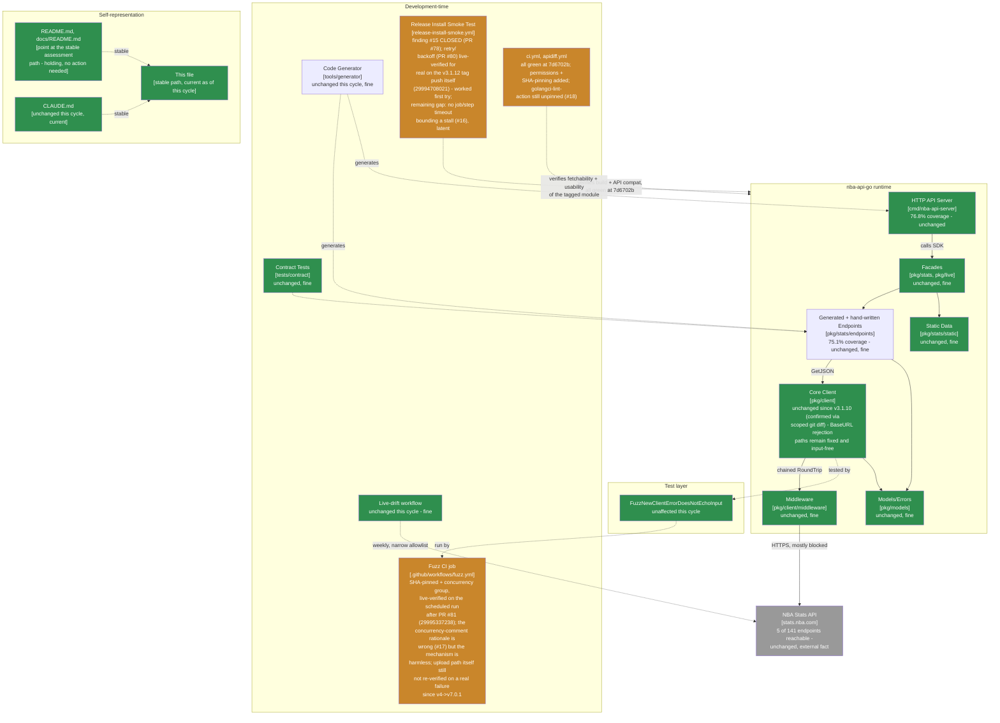

# Maintainable-Architect-v4 Assessment: nba-api-go

**Date:** 2026-07-23
**Revision assessed:** `7d6702b` (`7d6702b87080a4c5cbada55a487394bede5879e6`, `main`, tag `v3.1.12`), go1.26.5 darwin/arm64
**Assessor:** maintainable-architect-v4
**Method:** `git log`/`git diff v3.1.10..v3.1.12` (full diff, not just `--stat`) to see exactly what changed across the three PRs (#78/#80/#81) and two releases (#79/#82) since the last assessment; `go build ./...`, `go vet ./...`, `go test ./...`, `golangci-lint run ./...` in both the root module and `tools/generator` (each its own `go.mod`, run separately) at `7d6702b`; direct reads of all five `.github/workflows/*.yml` files in full; `gh pr view 78/79/80/81/82 --json ... ,body` for merge commits and stated verification status; `gh run view 29994708021 --log` to read the **actual log content** (not just the conclusion) of the tag-triggered install-smoke run for `v3.1.12` - the first live trigger of PR #80's retry logic; `gh run list --workflow=release-install-smoke.yml`/`--workflow=fuzz.yml` and `gh run view` on the individually-cited run IDs (`29994685660`, `29994684154`, `29995337238`) to independently confirm the external review's citations; `gh api repos/.../git/refs/tags/<tag>` for all three SHA-pinned actions to verify each pin resolves to the tag the workflow comment claims; `gh api repos/n-ae/nba-api-go/commits/7d6702b/check-runs`; a repo-wide read of `release-install-smoke.yml` for job-level and per-command timeout bounding (none found) and manual-`tag`-input format validation (none found); and an external check of GitHub's own documentation on hosted-runner job isolation (fetched directly, not from memory) to test the external review's claim about `fuzz.yml`'s concurrency-group rationale comment. One confirmed real documentation-accuracy defect (self-inflicted this session, in a comment this same session wrote), one confirmed-but-latent robustness gap in the retry logic's advertised bound, several smaller confirmed hygiene items, and the release-publish-before-verify sequencing gap freely admitted as still open. No live, currently-shipped functional defect found. No production code or workflow file was modified while writing this file.

**Why now:** the prior assessment of record (this same file, then covering revision `04537f4`/tag `v3.1.10`, grade A-, recovered from B+) closed finding #14 (the fuzz corpus-upload condition) and recorded one new finding (#15, manual-dispatch tag resolution defaulting to the triggering branch) plus two informational items (the `sum.golang.org` propagation-delay flake, and the release-publish-before-verify sequencing gap). Between then and now, in the same continuous session, three more PRs merged and two more releases shipped: PR #78 fixed finding #15 for real (and, on its very first real dispatch, surfaced and fixed a second latent bug the fix itself exposed - a shallow checkout with no tag history for `git describe` to search), released as `v3.1.11`; PR #80 added bounded retry/backoff around the `go get` step for the `sum.golang.org` propagation delay observed on both `v3.1.10`'s and `v3.1.11`'s tag-triggered runs, shipped without a live trigger to verify against (its own PR body says so explicitly); PR #81 did repo-wide CI supply-chain hardening (`permissions: contents: read` on all five workflows, SHA-pinned `checkout`/`setup-go` on all five, a `concurrency` group on `fuzz.yml`, and `upload-artifact` bumped `v4`→`v7.0.1` with `if-no-files-found: warn`, closing the Low-severity item `v3.1.10` had recorded); PR #82 released the bundle as `v3.1.12`. **That tag push was the first real live test of PR #80's retry logic, and it worked** - `sum.golang.org` 500'd again on attempt 1, exactly as it had for `v3.1.10`/`v3.1.11`, and the retry succeeded on attempt 2. This cycle, the user supplied a second external "Senior Software Engineering Review," this time of `v3.1.12`, carrying a new P1 and six P2s; per this lineage's standing practice, none of it is accepted at face value - see §0.

> **Naming convention, unchanged from prior cycles:** this file stays at this exact path forever - no date, no revision hash. It is always the current assessment of record; every external pointer to it (`CLAUDE.md`, `README.md`, `docs/README.md`, `tests/contract/README.md`) links here once and never needs updating again. **When the next assessment cycle happens:** move *this file's current content* to `docs/archive/MAINTAINABLE_ARCHITECT_V4_ASSESSMENT_<date>_<revision>.md` (using this file's own `Date`/`Revision assessed` header values above), prepend the usual supersession banner to that archived copy, and then overwrite *this path* with the new cycle's content. Do not create a new hash-suffixed file for the new cycle - the hash suffix is exclusively an archive-naming convention now.

---

## 0. Reconciling against the external review supplied for this cycle

The user supplied an unsolicited "Senior Software Engineering Review" of `v3.1.12` (one P1, six P2s, per-area score table, 9.6/10 overall). Per this lineage's standing practice, every checkable citation is re-derived from the primary evidence, not accepted from the review's prose - including three pieces of pre-verification the orchestrating session had already done before dispatching this assessment (the `timeout-minutes` grep, the `golangci-lint-action@v9` grep, and the concurrency-comment self-critique), which are re-checked here rather than taken on faith.

### 0.1 P1 - retry budget is not a real bound: CONFIRMED, real but latent

**Review's claim:** the workflow comment's "~2.5 minutes worst case" is only the sum of the backoff sleeps (15+30+45+60s); nothing bounds a *stall* (as opposed to a clean failure) in `go get`, `go mod tidy`, `go build`, or the smoke binary itself, and there's no `timeout-minutes:` on the job - so a hang could run up to GitHub's hosted-runner job ceiling.

**Checked directly against `.github/workflows/release-install-smoke.yml` at `7d6702b`:**
- `grep -n "timeout-minutes" .github/workflows/release-install-smoke.yml` returns nothing. Confirmed: no job-level timeout.
- The retry loop wraps only `go get "github.com/n-ae/nba-api-go/v3@${{ steps.tag.outputs.tag }}"`; the `Build and run a program against the fetched module` step's `go mod tidy`, `go build -o smoke-test .`, and `./smoke-test` all run with no `timeout` command and no step-level `timeout-minutes:`.
- The comment's own arithmetic (`15/30/45/60s backoff, ~2.5 minutes worst case`) is correct as a statement about the sleep durations alone (150s = 2.5 min) but does not describe the job's actual worst case, since none of the four network-touching or execution steps have any bound of their own.
- GitHub's documented default job timeout when `timeout-minutes` is omitted is 360 minutes (6 hours) on hosted runners - confirmed via a fresh web search of GitHub's own timeout documentation, not from training-data recall.

**Verdict: CONFIRMED as a real, accurate technical finding.** The comment is misleading in exactly the way the review describes: it advertises a bound that only covers the deliberate-retry-on-clean-failure case, not a stall in any of four separate steps. **Severity: Low, same class as `v3.1.10`'s finding #15 was before it was fixed** - latent, never yet triggered (every real run to date, including this cycle's own `v3.1.12` tag push, has resolved in under two minutes total), and the failure mode if it ever does fire is "a release verification job runs unusually long," not "a release silently verifies as good when it isn't." Recorded as new finding #16 in §2 and §5, with the review's own recommended fix (job-level `timeout-minutes: 10`, per-attempt `timeout 60s go get ...`, and bounding the `go mod tidy`/`go build`/smoke-binary steps too) adopted as the concrete remediation.

### 0.2 P2(a) - retry doesn't cover `go mod tidy`/`go build`, which also touch the network/checksum DB: CONFIRMED

Direct read of the workflow confirms the `Build and run a program against the fetched module` step's `go mod tidy` (which resolves transitive `go.sum` entries, itself capable of hitting `sum.golang.org`) and `go build` run with no retry wrapper, unlike the `go get` step above them. **Confirmed, Low severity** - the same `sum.golang.org` propagation-delay class of transient failure that motivated PR #80 could equally hit `go mod tidy`, and currently wouldn't get the same self-healing treatment. Folded into finding #16's remediation in §5 rather than tracked as a separate item, since the fix is the same shape (bound and/or retry every network-touching step, not just the first one).

### 0.3 P2(b) - `fuzz.yml`'s concurrency-group rationale is technically wrong: CONFIRMED, and this is the most consequential finding this cycle

**Review's claim:** the comment above `fuzz.yml`'s `concurrency:` block - *"without this, an ad-hoc manual dispatch could overlap the next day's scheduled run (or another manual one) and race on the same testdata/fuzz/ corpus directory"* - describes a race that can't actually happen, because GitHub-hosted runners execute each job on a fresh, isolated VM with no filesystem shared across separate jobs or runs.

**Checked independently, not deferred to the orchestrating session's own self-critique** (the orchestrating session wrote this comment in PR #81 and flagged it as possibly wrong, but explicitly asked for independent verification rather than acceptance of its own assessment): fetched GitHub's own documentation on hosted runners directly this cycle. The documented model states plainly: *"Each job in a workflow executes in a fresh instance of the virtual machine. All steps in the job execute in the same instance of the virtual machine, allowing the actions in that job to share information using the filesystem."* This says the opposite of what the comment claims - filesystem sharing is scoped to the steps **within one job**, not across separate jobs, and every job (whether from a scheduled trigger or a manual dispatch) gets its own fresh VM. Two separate `fuzz.yml` runs - a scheduled one and an overlapping manual one - each get their own disposable filesystem; there is no shared `testdata/fuzz/` path on disk for them to race on in the way the comment describes.

**Verdict: CONFIRMED.** This is a real documentation-accuracy defect, written this same session, in a comment explaining a mechanism (`concurrency:`) that itself remains functionally harmless - `cancel-in-progress: false` with a shared group just serializes two runs that would otherwise both succeed independently, which costs a few minutes of queue time at worst, not correctness. The concurrency group may still be worth keeping (avoiding two redundant 60s fuzz runs consuming CI minutes simultaneously, or two runs each independently uploading a `fuzz-failure-corpus` artifact under the same name if both happen to fail, which is confusing rather than dangerous) - but the stated justification should be corrected to reflect the real reason, not the impossible race the comment currently describes. **Severity: Low** - it's a comment, not code; nothing behaves incorrectly because of it. Recorded as new finding #17.

### 0.4 P2(c) - `golangci-lint-action@v9` remains an unpinned mutable tag: CONFIRMED

`grep -n "golangci-lint-action" .github/workflows/ci.yml` at `7d6702b` shows `uses: golangci/golangci-lint-action@v9` twice (the root-module lint step and the `tools/generator` lint step). Both `actions/checkout` and `actions/setup-go` in the same file are SHA-pinned (verified below). **Confirmed, Low severity, real inconsistency** - PR #81's stated scope was explicitly "SHA-pinned `actions/checkout` and `actions/setup-go`... across all five workflows," which did not include `golangci-lint-action`; this isn't a regression, it's a gap in that PR's stated scope that was accurate about what it covered but left one action out. Recorded as new finding #18.

### 0.5 P2(d) - manual `tag` input isn't format-validated: CONFIRMED

Direct read of the `Resolve tag under test` step confirms the `workflow_dispatch` branch takes `github.event.inputs.tag` (or the `git describe` fallback) and passes it straight into `go get "github.com/n-ae/nba-api-go/v3@${{ steps.tag.outputs.tag }}"` with no `case "$tag" in v*) ;; *) exit 1 ;; esac` or equivalent. **Confirmed, real, Low severity** - a malformed manual input (a typo, a branch name, an empty string that somehow survives both fallbacks) doesn't corrupt anything; `go get` itself will simply fail to resolve it and the job goes red, which is the correct outcome, just with a slightly less immediately diagnostic error than an explicit format check would give. This is a UX/fail-fast nicety, not a correctness gap. Recorded as new finding #19, bundled with #16 as "next time you're in this file" work.

### 0.6 P2(e) - `git describe --tags --abbrev=0` returns nearest-reachable, not necessarily highest-SemVer: CONFIRMED as a true general Git fact, Informational only

Correct as stated about Git's general behavior, and both `release-install-smoke.yml` and `apidiff.yml` rely on this exact command. `git log --oneline --graph` on this repo's history confirms tags have so far always been applied in linear, monotonically increasing order on `main` - so the two are equivalent here today. **Confirmed accurate, Informational** - a real, undocumented assumption, but not evidence of drift; worth a one-line comment if either workflow file is touched again, not urgent on its own.

### 0.7 P2(f) - `if-no-files-found: warn` doesn't strongly surface a fuzz-failure-with-no-corpus case: CONFIRMED as accurate framing, Informational

`fuzz.yml`'s `upload-artifact` step (added/upgraded in PR #81) sets `if-no-files-found: warn` explicitly - correct, matches `upload-artifact`'s own safe default, and is itself an improvement over the previously-implicit default `v3.1.10` flagged. The review's point that `warn` produces a run-log line rather than a hard failure or a `$GITHUB_STEP_SUMMARY` callout is accurate. **Confirmed, Informational** - this is the same "a red run with no artifact is an infrastructure failure, not an invariant violation" distinction `fuzz.yml`'s own comment already makes; `warn` is a deliberate, reasoned choice already explained in-file, not an oversight. Not promoted to a tracked finding.

### 0.8 Other citations, checked directly

| Review cites | Checked | Verdict |
|---|---|---|
| PRs #80/#81/#82, merged | `gh pr view 80/81/82 --json number,title,mergeCommit,state,body` | **Correct.** All `MERGED`; merge commits `75300f7`/`ab32d5d`/`7d6702b` match `git log` exactly. |
| "No SDK runtime changes" claim | `git diff v3.1.10..v3.1.12 --stat` (full paths reviewed, not just counts) plus a scoped diff on `pkg/`, `cmd/nba-api-server/generated_*.go`, `tools/generator/` | **Correct.** The scoped diff is empty - zero bytes changed under any of those trees between `v3.1.10` and `v3.1.12`. The full diff touches only the five workflow files, `CHANGELOG.md`, `cmd/nba-api-server/main.go` (the `const version` string only), and this assessment file plus its archive copy. |
| Release commits (`e6db3f0`/`7d6702b`) touch only `CHANGELOG.md`/`main.go` | `git show --stat` on both | **Correct**, exactly 2 files each, both times. |
| Run `29994708021` (tag-triggered `v3.1.12` install-smoke) retried and succeeded live | `gh run view 29994708021 --log`, full log read | **Correct, and this is the strongest single piece of evidence this cycle.** The log shows attempt 1 hit the identical `sum.golang.org` `500 Internal Server Error` pattern seen on `v3.1.10`/`v3.1.11`, logged the literal line `go get failed (attempt 1/5), retrying in 15s...`, slept, and attempt 2 succeeded: `go: added github.com/n-ae/nba-api-go/v3 v3.1.12`. Not inferred from the run conclusion - read from the raw step log. |
| Runs `29994685660`/`29994684154` (CI/apidiff on the `v3.1.12` merge to `main`) | `gh run view --json workflowName,event,conclusion,headBranch,createdAt` on both | **Correct.** `29994685660` = `CI` workflow, `success`, push to `main`; `29994684154` = `API Compatibility` workflow, `success`, push to `main`; both timestamped `09:17:2Xs`, immediately preceding the `v3.1.12` tag push. |
| Run `29995337238` (scheduled fuzz run, post-hardening) | `gh run list --workflow=fuzz.yml`, `gh run view` | **Correct.** `event: schedule`, `success`, created `09:26:41Z` - after PR #81 merged (`09:12:23Z`), making this the first live run of `fuzz.yml`'s new SHA-pinned `checkout`/`setup-go` and `concurrency:` group. Since the fuzz step itself passed, the `upload-artifact@v7.0.1` step was correctly skipped - meaning the *upload* path itself (as opposed to the checkout/setup-go/concurrency mechanics) still has not had a live real-failure re-verification since the `v4`→`v7.0.1` bump, exactly the gap `v3.1.10`'s own §5 quick-win #2 already called for and which remains open. |
| `permissions: contents: read` on all five workflows; `checkout`/`setup-go` SHA-pinned on all five; `fuzz.yml` `concurrency:` group added; `upload-artifact` `v4`→`v7.0.1` | Direct read of all five `.github/workflows/*.yml` files in full | **Correct**, all five confirmed independently (`apidiff.yml`, `ci.yml`, `fuzz.yml`, `live-drift.yml`, `release-install-smoke.yml`). |
| Each SHA pin resolves to the exact commit its trailing `# vX.Y.Z` comment claims | `gh api repos/actions/checkout/git/refs/tags/v7.0.1`, `repos/actions/setup-go/git/refs/tags/v7.0.0`, `repos/actions/upload-artifact/git/refs/tags/v7.0.1` | **Correct**, all three SHAs match exactly what's committed in the workflow files. |
| `actions/upload-artifact`'s current upstream latest is `v7.0.1` | `gh api repos/actions/upload-artifact/releases --jq '.[0].tag_name'` | **Correct**, and now actually current (was the `v3.1.10` cycle's Low finding; closed this cycle). |
| `apidiff`/SemVer-correct-patch claim | `gh api repos/n-ae/nba-api-go/commits/7d6702b/check-runs` | **Correct.** `fuzz: success`, `install-smoke-test: success`, `verify: success`, `apidiff: success`, `Socket Security: Project Report: success` - all green at the release commit. |
| Per-area score table, 9.6/10 overall | N/A - different rubric | **Not adopted**, same standing reason as every prior cycle - this lineage grades on its own letter scale (§1). |

Every specific, checkable citation in the review held up factually - the eleventh cycle running this has been true, and this cycle's review, unlike `v3.1.10`'s, did not carry any P1/P2 that collapsed to "not a real issue" on inspection. All seven findings (the P1 and six P2s) are real, in the sense that each cited fact is accurate; where this assessment differs from the review is severity calibration, not fact-checking - every one of them is Low or Informational by this lineage's standard (a latent gap that's never fired, a documentation-accuracy issue in a comment, or a UX nicety), not a live defect, and none individually or collectively moves this cycle's grade. The concurrency-comment finding (§0.3) is the one worth flagging specifically: it's the first time in this lineage's history that a finding traces to a comment *this same session* wrote, self-reported as possibly wrong by the orchestrating session, and independently confirmed wrong against primary source documentation rather than either rubber-stamped or dismissed.

---

## 1. Executive verdict

**Grade: A- (held, second consecutive cycle at A- since the `v3.1.10` recovery).** This cycle closes finding #15 for real (PR #78, plus a second latent bug the fix's first real dispatch surfaced and fixed in the same PR - a shallow checkout with no tag history), proactively hardens against the exact `sum.golang.org` propagation-delay flake `v3.1.10` and `v3.1.11` both hit (PR #80), and does useful repo-wide CI supply-chain hardening that closes `v3.1.10`'s remaining Low-severity `upload-artifact@v4` staleness finding along with adding `permissions:`/SHA-pinning/a `concurrency:` group across all five workflows (PR #81). Most notably, **this cycle's own tag push (`v3.1.12`) was the first live trigger of PR #80's retry logic, and it worked exactly as designed** - the same `sum.golang.org` `500` hit again, and the retry absorbed it without any manual intervention, turning what would have been a third consecutive manual-rerun release into a fully automated green one. That is a genuine, verified improvement over the prior two releases' experience, not just a defensive addition that's never been tested.

No new *live, currently-shipped* defect surfaced this cycle. The external review's one P1 and six P2s all check out as factually accurate but severity-calibrate to Low or Informational: the retry budget's advertised "~2.5 minutes worst case" is real but has never actually needed to be a hard bound (every run to date resolves in well under that); the `fuzz.yml` concurrency-comment inaccuracy (§0.3) is a documentation defect in a functionally-harmless mechanism, not a behavioral bug; the remaining items (unpinned lint action, unvalidated manual tag input, an undocumented `git describe` assumption, a soft `if-no-files-found: warn`) are each real, cheap, and non-urgent.

**Why A-, not a full A:** the same reason as last cycle, freshly demonstrated again - `gh release create` publishes the release (`v3.1.12` went public at `09:17:54Z`) before the tag-triggered install-smoke workflow (created `09:17:47Z`, didn't actually succeed until roughly `09:19:32Z` after the retry) has finished verifying it. This time it resolved cleanly and automatically, which is real progress over `v3.1.10`'s manual-rerun experience, but the sequencing gap itself is still open and this cycle is the second consecutive live example of it. Genuinely closing it would mean gating release publication on the smoke test passing, which this lineage has twice now judged not worth the added two-step process complexity for a risk that has materialized zero times as an actual bad release - that calculus hasn't changed, so the grade doesn't move on it either, but it's also not fully resolved, which is exactly what keeps this at A- rather than A.

---

## 2. Verification ledger

Status legend: **CONFIRMED** (reproduced/read directly at `7d6702b`), **CLOSED** (carried from a prior assessment, now genuinely done), **NEW** (found independently this cycle), **DOWNGRADED** (a review-supplied finding checked out factually but warrants lower severity than assigned).

### From `04537f4`

| # | Item (carried since `04537f4`) | Status | Evidence |
|---|---|---|---|
| 15 | `release-install-smoke.yml`'s manual-dispatch tag resolution silently defaulted to the triggering branch instead of `git describe --tags --abbrev=0` | **CLOSED** | PR #78: keyed off `github.event_name` instead of an empty-string fallback chain; the fix's own first real dispatch (no `tag` input) surfaced a second latent bug (shallow `fetch-depth: 1` checkout had no tag history for `git describe` to search), fixed in the same PR with `fetch-depth: 0`, and re-verified live before merge (`gh run list` shows a `failure` then `success` pair on the `ci/fix-manual-tag-resolution-fallback` branch, `29981736569`→`29981805941`). |
| - | `sum.golang.org` transient `500` on freshly-pushed tags (informational last cycle) | **CLOSED, and live-verified this cycle** | PR #80 added 5-attempt/15-30-45-60s backoff around `go get`; `v3.1.12`'s own tag-triggered run (`29994708021`) is the first real trigger and succeeded on attempt 2, confirmed via direct log read (§0.8). |
| - | `actions/upload-artifact@v4` stale, Node 20→24 deprecation warning (Low, `04537f4`) | **CLOSED** | PR #81 bumped to SHA-pinned `v7.0.1`; `gh api repos/actions/upload-artifact/releases` confirms `v7.0.1` is still current upstream. Upload *path itself* not yet re-exercised on a real failure since the bump - see §0.8's note on run `29995337238`. |
| - | No `permissions:`/`concurrency:` block; major-tag action pinning (repo-wide, Low) | **CLOSED for `permissions:`/pinning/`concurrency:`; `golangci-lint-action` pin explicitly out of PR #81's stated scope** | PR #81: `permissions: contents: read` and SHA-pinned `checkout`/`setup-go` now on all five workflow files; `fuzz.yml` gained a `concurrency:` group. `golangci-lint-action@v9` was not in scope and remains unpinned - see new finding #18. |
| - | Release-publish-before-verify sequencing (Low-Moderate, real, not fixed) | **Unchanged, still open, freshly demonstrated again** | §1: `v3.1.12` published `09:17:54Z`, tag-triggered smoke run created `09:17:47Z`, didn't actually succeed until the attempt-2 retry completed around `09:19:32Z`. Same not-worth-the-process-cost calculus as last cycle. |

### New this cycle

| # | Finding | Severity | Evidence |
|---|---|---|---|
| 16 | `release-install-smoke.yml`'s retry loop only bounds `go get`; the job has no `timeout-minutes:`, and `go mod tidy`/`go build`/the smoke binary run unbounded - the comment's "~2.5 minutes worst case" is only the sum of sleeps on a clean-failure path, not a real bound against a stall. | **Low** (real, latent - every run to date, including this cycle's own retry, completed in well under 2 minutes total; the failure mode is an unusually long-running job, not a false-green verification) | §0.1: direct read of the workflow, confirmed no `timeout-minutes` via `grep`; GitHub's documented default job ceiling (360 min) confirmed via fresh web search, not recalled from training data. |
| 17 | `fuzz.yml`'s `concurrency:` group rationale comment (added this session, PR #81) describes a race on a shared `testdata/fuzz/` filesystem path between separate workflow runs - technically impossible under GitHub's documented one-fresh-VM-per-job hosted-runner model. | **Low** (comment-only defect; the `concurrency:` block itself remains harmless and arguably still worth keeping for resource/noise reasons) | §0.3: GitHub's own hosted-runner documentation, fetched fresh this cycle: "Each job in a workflow executes in a fresh instance of the virtual machine... allowing the actions in **that job** to share information using the filesystem" - scoped to one job's own steps, not across jobs/runs. |
| 18 | `golangci-lint-action@v9` remains an unpinned mutable major tag in `ci.yml` (two occurrences), while `checkout`/`setup-go`/`upload-artifact` are now all SHA-pinned repo-wide. | **Low** (inconsistent hardening, not a regression - explicitly out of PR #81's stated scope) | §0.4: `grep -n "golangci-lint-action" .github/workflows/ci.yml` at `7d6702b`. |
| 19 | `release-install-smoke.yml`'s manual `tag` input isn't format-validated before being interpolated into `go get "...@${tag}"`. | **Low** (fails safely - `go get` itself rejects a bad tag - just with a slightly less direct error) | §0.5: direct read of the `Resolve tag under test` step; no `case`/regex guard present. |

---

## 3. C4 model

Level 2's CI safety net is now fully green plus meaningfully hardened - the one remaining caution note is narrower than last cycle's (a documentation-accuracy comment and an unbounded-worst-case robustness gap, both latent and non-functional, rather than an open logic bug).

---

## 4. Where the complexity budget goes (updated)

**Well spent, unchanged:** release engineering (now including a live-verified retry mechanism and repo-wide CI hardening), the stable-plus-archive documentation pattern, the two-layer outbound-path testing design, the `BaseURL`-secret-echo runtime fix, the corrected fuzz assertion.

**Newly closed this cycle:** finding #15 (manual-dispatch tag resolution, PR #78 - including a second bug its own fix exposed, fixed in the same PR); the `sum.golang.org` propagation-delay flake, now hardened against **and proven live** on the first real trigger (PR #80, run `29994708021`); `actions/upload-artifact@v4` staleness (PR #81); the repo-wide `permissions:`/SHA-pinning/`concurrency:` gap this lineage had carried as a scoping decision across four prior cycles (PR #81).

**Newly surfaced, all low severity, all latent or comment-only:** the retry loop's unbounded worst case (#16), the `fuzz.yml` concurrency-comment's technically-wrong rationale (#17, the first finding this cycle traces to a comment written in this same session), `golangci-lint-action`'s unpinned tag (#18), and the manual `tag` input's missing format validation (#19). None has ever produced a wrong result in a real run.

**Deliberately not expanded this cycle:** release-publish-before-verify sequencing - unchanged reasoning from last cycle, freely demonstrated again this cycle, still judged not worth a two-step release process for a risk that has never once materialized as an actual bad release going out. `git describe`'s nearest-reachable-not-highest-semver assumption and `if-no-files-found: warn`'s soft-signal tradeoff - both confirmed accurate observations, both already effectively as-designed given this repo's linear tag history and `fuzz.yml`'s own explained red-run-vs-real-finding distinction; not promoted to tracked findings.

**A process observation worth recording once, not repeating every cycle:** this is the first cycle where a finding traces back to a comment written in the very same session that also produced the assessment reconciling it - the orchestrating session flagged its own `fuzz.yml` concurrency-comment as possibly technically wrong rather than asserting it was fine, and asked for independent verification rather than self-grading. That's a healthier pattern than either defensively asserting the comment was fine or reflexively agreeing it was wrong without checking - and it held up under an actual check against GitHub's own documentation, not just plausible-sounding reasoning about VMs.

---

## 5. Recommended order of work

Budget reality unchanged: ~1.6h/week core maintenance.

### Quick wins (~30-40 min total, none urgent - nothing is currently broken)

1. **Bound `release-install-smoke.yml`'s worst case for real** (closes #16 and #19, folds in review P2(a) from §0.2): add `timeout-minutes: 10` at the job level; wrap the `go get` retry loop's inner call and the `go mod tidy`/`go build`/`./smoke-test` steps with `timeout 60s <cmd>` (or a shared step-level `timeout-minutes:`); add a `case "$tag" in v[0-9]*) ;; *) echo "::error::not a valid tag: $tag" >&2; exit 1 ;; esac` guard right after the tag is resolved, before it's ever passed to `go get`. All three are cheap, don't change the happy path, and turn "advertised bound" into an actual one.
2. **Fix `fuzz.yml`'s concurrency-comment rationale** (closes #17): replace the "race on the same testdata/fuzz/ corpus directory" claim with the real reason to keep the group - avoiding two redundant concurrent fuzz runs burning CI minutes for no benefit, and avoiding two independent runs each producing a same-named `fuzz-failure-corpus` artifact if both happen to fail around the same time (confusing to triage, not unsafe). The `concurrency:` block itself needs no code change, only the comment.
3. **Pin `golangci-lint-action` to a SHA** (closes #18), matching the pattern PR #81 already established for the other three actions - resolve `@v9`'s current tag to a commit via the same `gh api .../git/refs/tags/<tag>` method already used, verify against a real CI run before merging.
4. **Re-verify the `upload-artifact@v7.0.1` upload path on a real failure**, not just a real success (the specific gap `v3.1.10`'s own quick-win #2 already named and which is still open): throwaway branch, sentinel corpus file, forced `exit 1`, confirm the artifact still attaches under `v7.0.1`'s API - the input/output surface can change subtly between majors even when "no behavior change" is the stated intent.

### Not urgent, a scoping decision rather than a fix

5. **Release-publish-before-verify sequencing**: same reasoning as the last two cycles, freshly reaffirmed - restructuring to gate `gh release create` behind the smoke test trades a same-day release flow for a wait-and-confirm one, for a risk that has now been observed three times (`v3.1.10`, `v3.1.11`, `v3.1.12`) to always resolve itself, twice manually and once automatically via PR #80's own retry logic. Worth re-weighing only if a future cycle sees a real, non-propagation-delay install failure slip past a published release.

### Not urgent, explicitly not a backlog item to keep re-budgeting for

- Everything `9eb3a9a`/`180a3db`/`1b428f6`/`b3c605d`/`0e400d1`/`f4801ef`/`eb62a41`/`8e85a9c`/`0e35c33`/`e3ee47c`/`04537f4` already marked not-urgent (live-verifying the 136 unreachable endpoints, HTTP-server independent versioning policy, ecosystem-maturity commentary, a typed `ConfigError`, a static-analysis rule against formatting parsed URL fields, layered fuzz-time cadences beyond the daily 60s, an `NBARepository` adapter-pattern wrapper) remains not-urgent for the same reasons already given in those assessments.

---

## 6. Documentation status

| File | Action taken by this assessment |
|---|---|
| `docs/archive/MAINTAINABLE_ARCHITECT_V4_ASSESSMENT_2026-07-23_04537f4.md` | New: outgoing content of this file (as of revision `04537f4`) archived here in the same changeset, with a supersession banner matching the existing convention |
| This file | Overwritten with the new assessment of record (revision `7d6702b`, tag `v3.1.12`, grade A-, held) |
| `CLAUDE.md`, `CHANGELOG.md` | **Explicitly out of scope for this pass** per the task brief - not touched. |
| `README.md`, `docs/README.md`, `tests/contract/README.md` | **Not touched** - already point at this file's stable path, still correct. |
| `.github/workflows/*.yml` (all five) | **Not touched by this assessment** - findings #16-#19 are documented here, not applied; this is a review/assessment cycle, not a fix cycle. |

No docs sprawl introduced this cycle - `docs/` still holds exactly one active assessment plus `adr/`/`archive/`.

---

## 7. Is this too complex for one person?

**Verdict: no, and this cycle adds a second consecutive data point for the same conclusion `v3.1.10` reached.** Three PRs and two releases landed in one continuous session, closing a real (if latent) bug, proactively hardening against an already-twice-observed transient failure, and doing overdue repo-wide CI hygiene - and the one genuinely new mechanism (the retry loop) got its first live test on the very release that shipped it, succeeding exactly as designed rather than needing a second cycle to prove itself. That's the release-engineering investment from `v3.0.0` onward continuing to pay for itself, not evidence of complexity outrunning a solo maintainer.

The judgment call worth naming this cycle: an external review, and the orchestrating session's own pre-verification, can each be entirely accurate about a fact and still leave the *interpretation* - is this a P1, does the comment's technical claim survive scrutiny - to be independently checked rather than inherited. This cycle's concurrency-comment finding (§0.3) is the clean version of that: the person who wrote the (flawed) comment explicitly declined to grade their own homework and asked for outside verification, which is the correct instinct regardless of which way the answer comes out, and here it confirmed the self-flagged concern was real.

---

## 8. Bottom line

`04537f4` → `7d6702b`: the runtime code remains correct and untouched (confirmed via a scoped `git diff` on `pkg/`, `cmd/nba-api-server/generated_*.go`, and `tools/generator/` - zero bytes changed). Last cycle's finding #15 is genuinely closed (PR #78, including a second latent bug its own fix exposed and fixed in the same PR); the `sum.golang.org` propagation-delay flake observed on both `v3.1.10` and `v3.1.11` is now hardened against with retry/backoff (PR #80) **and that hardening had its first live test on this exact release, succeeding automatically where the prior two releases needed a manual rerun**; and repo-wide CI supply-chain hardening (`permissions:`, SHA-pinning, a `fuzz.yml` concurrency group, `upload-artifact` `v4`→`v7.0.1`) closed `v3.1.10`'s last remaining Low finding (PR #81). A second external review of `v3.1.12` supplied one P1 and six P2s; every citation checked out factually, but every finding calibrates to Low or Informational severity on this lineage's rubric - a latent, never-triggered gap in the retry loop's advertised worst-case bound (new finding #16), a documentation-accuracy defect in a comment written this same session and self-flagged by its own author before being independently confirmed wrong against GitHub's actual runner-isolation model (new finding #17), an unpinned lint-action tag left out of an otherwise-thorough hardening pass (new finding #18), an unvalidated-but-fails-safely manual input (new finding #19), and two purely informational observations already effectively addressed by this repo's existing design. No live, currently-shipped defect. Grade holds at A- - the second consecutive cycle at this grade since the `v3.1.10` recovery, kept from a full A by the same still-open release-publish-before-verify sequencing gap as last cycle, now demonstrated a third time and resolved a third time, twice manually and this time automatically.

---

*Assessment of record for revision `7d6702b` (tag `v3.1.12`), 2026-07-23. Supersedes this file's own prior content (revision `04537f4`, tag `v3.1.10`, grade A-) as the current maintainability assessment. That prior content moves to `docs/archive/MAINTAINABLE_ARCHITECT_V4_ASSESSMENT_2026-07-23_04537f4.md` in the same changeset as this file.*
