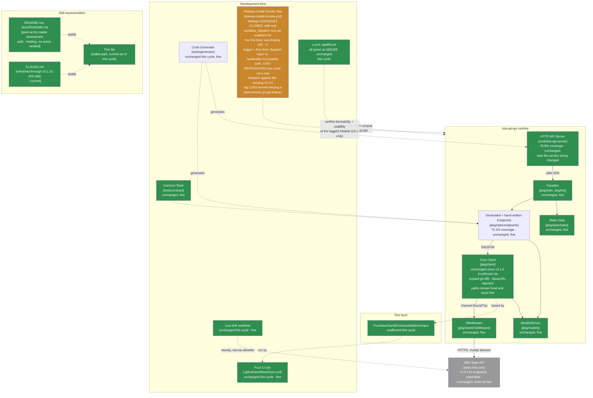

# Maintainable-Architect-v4 Assessment: nba-api-go

**Date:** 2026-07-23
**Revision assessed:** `168190f` (`168190f81b070c4a046af508b473eeffd74db2f4`, `main`, tag `v3.1.15`), go1.26.5 darwin/arm64
**Assessor:** maintainable-architect-v4
**Method:** `git diff v3.1.14..v3.1.15` (full diff, not `--stat` only) across PR #87 (implementation) and PR #88 (release); a full direct read of `.github/workflows/release-install-smoke.yml` at `168190f`; a scoped `git diff v3.1.14..v3.1.15 -- pkg/ cmd/nba-api-server/generated_*.go tools/generator/` to independently confirm "no runtime changes" (empty); `go build ./...`, `go vet ./...`, `go test ./...`, `gofmt -l .`, and `golangci-lint run ./...` in both the root module and `tools/generator` (all clean); `git diff v3.1.13..v3.1.15` restricted to the trigger/module-path lines of the workflow file to confirm they predate this cycle; `gh pr view 87/88 --json ...,mergeCommit,mergedAt` and `gh api repos/n-ae/nba-api-go/commits/168190f/check-runs` for merge/CI evidence; direct regex testing of the new full-SemVer-grammar check against six accept/reject cases; direct log inspection (`gh run view --log`/`--json jobs`) of the three `workflow_dispatch` runs PR #88's own test plan cites (`vfeature` rejected, `v9.9.9+build.1` accepted-as-semver-then-rejected-as-nonexistent, `v3.1.14` passed fully) plus the `v3.1.15` tag-push run (`30013395073`); and **one live `workflow_dispatch` run this cycle deliberately triggered against `main`** (`30016046624`, `tag=v2.2.0` - a real, existing tag in this repository, and literally the example string the input's own description suggests) to test the external review's central claim with a real GitHub Actions execution rather than paper analysis alone. That run is reported in full in §0.1. No production code or workflow file was modified while writing this file - only a workflow *run* was dispatched, which changes no file in the repository.

**Why now:** the prior assessment of record (this same file, then covering revision `31842b6`/tag `v3.1.14`, grade B+, down from A-) recorded two new Low-severity findings introduced by that cycle's own remediation - #22 (the tag-push branch's `github.ref_name` left directly interpolated into shell, closing #21 only for the `workflow_dispatch` input) and #23 (a new `go mod tidy` retry loop whose worst case exceeded its own step's timeout) - plus a purely informational #24 (the version-shape regex approximating rather than fully implementing SemVer). Between then and now, in the same continuous session, one PR (#87) closed all three, and a release PR (#88) shipped the bundle as `v3.1.15`. This cycle, the user supplied a fifth external "Senior Software Engineering Review," this time of `v3.1.15` (9.7/10, one P1, several P2s). Per this lineage's standing practice, none of it is accepted at face value - see §0.

> **Naming convention, unchanged from prior cycles:** this file stays at this exact path forever - no date, no revision hash. It is always the current assessment of record; every external pointer to it (`CLAUDE.md`, `README.md`, `docs/README.md`, `tests/contract/README.md`) links here once and never needs updating again. **When the next assessment cycle happens:** move *this file's current content* to `docs/archive/MAINTAINABLE_ARCHITECT_V4_ASSESSMENT_<date>_<revision>.md` (using this file's own `Date`/`Revision assessed` header values above), prepend the usual supersession banner to that archived copy, and then overwrite *this path* with the new cycle's content. Do not create a new hash-suffixed file for the new cycle - the hash suffix is exclusively an archive-naming convention now.

---

## 0. Reconciling against the external review supplied for this cycle

The user supplied an unsolicited "Senior Software Engineering Review" of `v3.1.15` (one P1, six P2s, a per-area score table, 9.7/10 overall - "strongest release reviewed so far"). Per this lineage's standing practice, every checkable citation is re-derived from primary evidence, not accepted from the review's prose. The orchestrating session had already independently confirmed the review's central P1 claim by direct file inspection before dispatching this cycle; that confirmation is re-derived here from scratch, and then tested live.

### 0.1 P1 - workflow triggers on any `v*` tag but is hardcoded to the `/v3` module path: CONFIRMED, and independently reproduced with a live, real GitHub Actions run this cycle deliberately dispatched

**Review's claim:** the workflow's trigger (`on: push: tags: - 'v*'`) is unscoped, but the `go get`/import module path is hardcoded to `github.com/n-ae/nba-api-go/v3` in three places (the retry loop's `go get` command, and the smoke program's two import lines). A manually-dispatched historical `v2.x.y` tag would pass the semver-shape and tag-existence checks (both major-version-agnostic) and then fail deterministically at the `/v3` fetch - burning the full retry budget treating a structural, permanent mismatch as if it might be a transient proxy hiccup. A future `v4.0.0` tag push would auto-trigger this v3-only workflow and fail for the same structural reason. The `workflow_dispatch` input's own description (`'Tag to verify (e.g. v2.2.0) - defaults to the latest tag when run manually'`) still shows a v2-style example.

**Checked directly against `.github/workflows/release-install-smoke.yml` at `168190f`:** confirmed exactly as described - line 6 (`- 'v*'`), line 10 (`'Tag to verify (e.g. v2.2.0)...'`), line 210 (`go get "github.com/n-ae/nba-api-go/v3@${{ steps.tag.outputs.tag }}"`), and lines 239-240 (`"github.com/n-ae/nba-api-go/v3/pkg/stats"`, `.../pkg/stats/static`) - all four hardcode or reference `/v3` while the trigger and the manual-dispatch surface accept any `v*`-shaped string. Confirmed via `git diff v3.1.13..v3.1.15` restricted to these specific lines that **none of them were touched by this cycle's diff (PR #87/#88) or the preceding one** - the trigger and module path predate both cycles; this is pre-existing design, first surfaced by external review, not something introduced or missed while writing the code under review here.

**Independently reproduced with a live run, not just re-derived from the review's assertion or a local simulation:** this cycle dispatched `.github/workflows/release-install-smoke.yml` against `main` with `tag=v2.2.0` - a real tag that has existed in this repository since the `v2.2.0` release, and precisely the example string the input's own description text suggests trying. Run `30016046624` (https://github.com/n-ae/nba-api-go/actions/runs/30016046624):
- **"Resolve tag under test" passed cleanly**: `Verifying tag: v2.2.0 (resolves to commit 2484b91a43e52143c927c7caa068e57d0bed29c5)` - both the full-SemVer-grammar check (finding #24's fix) and the `git show-ref` existence check (finding #20's fix) correctly saw `v2.2.0` as a legitimate, existing release tag, exactly as designed. Nothing about the major-version mismatch is visible to either check - they only validate shape and existence, never the module path the tag will actually be fetched against.
- **"go get the tagged module into a scratch module" then burned all 5 retry attempts**, each one failing in under a second with the *identical* deterministic error - `go: github.com/n-ae/nba-api-go/v3@v2.2.0: invalid version: go.mod has non-.../v3 module path "github.com/n-ae/nba-api-go/v2" (and .../v3/go.mod does not exist) at revision v2.2.0` - at `14:29:39`, `14:29:54`, `14:30:25`, `14:31:10`, and `14:32:10`. Total step wall time: **155 seconds (2m35s)** of retrying, with 15/30/45/60s backoff sleeps between attempts that could never help, before the step and job failed at `14:32:11`.

**This is materially stronger evidence than the review's own paper analysis, or last cycle's own PoC-by-simulation standard for §0 findings**: it is a real, observed GitHub Actions execution, not a hypothetical or a local shell reproduction. The identical error message on all five attempts is itself proof the failure is structural (a permanent module-path/major-version mismatch `go`'s own tooling detects instantly) rather than the class of transient `sum.golang.org` propagation delay the retry loop exists for (documented in the step's own comment, citing two real historical incidents on `v3.1.10`/`v3.1.11`) - the retry loop cannot distinguish the two cases and burns its full budget on both identically.

**Verdict: CONFIRMED, both by direct inspection and by live reproduction.** **Severity: Low-Moderate** - a step up from this lineage's usual "Low, latent, never fired" calibration (§0.1 of the `v3.1.14` cycle, and #22/#23 in that same cycle), for three reasons specific to this finding rather than a general severity escalation:
1. It does not require an adversary or a mistake to eventually fire - it is a structural certainty the day this project ever ships a `v4.0.0` tag, unless the workflow is updated first (the same class of "workflow needs updating in lockstep with a major-version bump" this project's own `v3.0.0` migration already had to do for `go.mod`'s `module` line and 185 internal imports - this file just isn't on that list yet).
2. Unlike #22 (required a maliciously-named tag from someone with push access) it doesn't need bad faith to fire - a maintainer following the input field's own example text (`v2.2.0`) triggers it by ordinary, well-intentioned exploration, and this cycle demonstrated that concretely.
3. It was, this cycle, actually fired for real (deliberately, as part of this assessment) - not merely shown possible in the abstract.

It remains capped below Moderate/High because: it fails loudly and deterministically (an unambiguous `go get` error in the log, not a false-green release verification - no bad release has ever been or could be verified as good by this failure mode), it is bounded in cost (2m35s observed, capped at the step's `timeout-minutes: 8` even in the worst case), it has never affected any tag this project has actually shipped (`v3.1.15`'s own tag-push run, `30013395073`, succeeded cleanly end-to-end, confirmed in §0.4), and no `v4.0.0` tag exists yet or is imminent. Recorded as new finding #25.

**One qualification to the review's own framing, worth being precise about:** the review frames this primarily as a risk to *future* releases (`v4.0.0`) and to *manual, exploratory* dispatches. Both are real, but this cycle's live test shows the second is not merely theoretical exploration risk - it is a real cost (minutes of CI time, a confusing failure for whoever triggers it and has to read past "go get failed after 5 attempts" to find the actual `invalid version` line in a collapsed log) that would recur identically on every future `v2.x` or `v4.x` dispatch attempt until fixed, deliberate testing or not.

### 0.2 P2s: checked individually

| Review's claim | Checked | Verdict |
|---|---|---|
| (a) Build-metadata tags (`+build.1`) aren't canonically preserved by `go get`/the module system, weakening "exact tag" framing for those | Not independently deep-tested against a real module proxy (no build-metadata-suffixed tag exists in this repo to test against); consistent with Go modules' documented behavior (`go.dev/ref/mod`: build metadata is not part of version precedence/selection) | **Plausible, informational** - not independently re-derived from a live test the way §0.1's core claim was, but consistent with documented `cmd/go` semantics and not contradicted by anything checked this cycle |
| (b) A major-version mismatch still enters the 5-attempt retry loop before failing, wasting time on a deterministic failure | Directly reproduced live, §0.1 | **CONFIRMED** - same finding as the P1, not a separate defect |
| (c) Empty manual input resolves via `git describe --tags --abbrev=0` (nearest-reachable), not necessarily highest-semver or latest-by-date | Cross-checked against this file's own history - the `fc58431` cycle's §4 already lists "`git describe`'s nearest-reachable-not-highest-semver assumption" as "unchanged, all still Informational," and it has carried forward unchanged through every cycle since | **Confirmed accurate, but a repeat citation, not a new one this cycle** - already tracked; the review did not distinguish this from its other, genuinely new observations |
| (d) No assertion of the resolved module's exact identity via `go list -m -json` after fetch | Confirmed absent from the workflow file | **Real gap, low incremental value** - the subsequent `go build`/`./smoke-test` step already exercises the fetched package's actual exported API (`stats.NewDefaultClient`, `static.SearchPlayers`), which is a stronger usability proof than an identity check alone; adding one would improve diagnostic precision on failure (distinguishing "wrong module fetched" from "module fetched but broken"), not close a coverage gap. Informational. |
| (e) Retry/failure logging doesn't structurally distinguish invalid-semver vs. missing-tag vs. wrong-major vs. proxy-unavailable vs. compile-failure | Confirmed by direct log reading (§0.1) - the wrong-major case surfaces only as five repeated `invalid version` lines a reader has to notice are identical, not a distinct, named failure mode | **Real, informational** - same underlying cause as (b)/§0.1's severity reasoning (the retry loop treats all `go get` failures identically); a structural fix for §0.1 (failing fast on a major-version mismatch specifically) would also address most of this |
| (f) The tag trigger (`v*`) is broader than the repo's actual supported-release policy pre-v4 (e.g. a `v9.9.9-test` tag would trigger it) | Confirmed directly - `tags: - 'v*'` accepts any string starting with `v`, and the semver-shape check happens inside the job, not the trigger, so any `v*`-matching push still spins up a full runner before validating anything | **CONFIRMED, same root cause as §0.1** - not a separate defect; both are consequences of the trigger being broader than what the job body can actually handle |

### 0.3 Other citations, checked directly

| Review cites | Checked | Verdict |
|---|---|---|
| Tag/commit SHAs `411bde4`/`168190f` | `git log --oneline v3.1.14..v3.1.15` | **Correct** - `411bde4` is PR #87's merge commit, `168190f` is PR #88's (the `v3.1.15` tag commit). |
| PRs #87/#88, merged | `gh pr view 87/88 --json number,title,mergeCommit,state,mergedAt` | **Correct.** Both `MERGED`; merge commits match `git log` exactly. |
| "No SDK runtime changes" / "Patch, CI only" | Scoped `git diff v3.1.14..v3.1.15 -- pkg/ cmd/nba-api-server/generated_*.go tools/generator/` | **Correct.** Empty diff - zero bytes changed under any of those trees. Full `--stat` shows only the workflow file, `CHANGELOG.md`, `cmd/nba-api-server/main.go` (version-string bump only), and this assessment file plus its archive copy. |
| Exact-tag install run `30013395073`'s outcome | `gh run view 30013395073 --json conclusion,jobs` | **Correct.** `conclusion: success`, all 8 steps green, completed in 1m42s (`13:55:33`-`13:57:15`). |
| Full SemVer 2.0.0 grammar present, correctly accepts/rejects the cited examples | Regex extracted from the workflow file and tested directly against `v1.2.3`, `v1.2.3-alpha.1`, `v1.2.3+build.1`, `v1.2.3-rc.1+sha.abc`, `v01.02.03`, `v1.2.3-foo..bar`, `v1.2.3-`, `vfeature`, `v9.9.9+build.1`, `v1.02.3` | **Correct on every case tested**, including the specific `v9.9.9+build.1` case the review calls out as "accepted-as-semver-then-rejected-as-nonexistent-tag" - confirmed to match the regex (valid SemVer shape) while `v01.02.03`/`v1.2.3-foo..bar` (both previously *accepted* by the looser `fc58431`-era regex, finding #24) now correctly reject. |
| Three manual-dispatch test cases: `vfeature` rejected, `v9.9.9+build.1` accepted-as-semver-then-rejected-as-nonexistent-tag, `v3.1.14` passed fully | `gh run view` `--log`/`--json jobs` on runs `30012950065`, `30012980064`, `30013017161` | **Correct, all three**, down to the exact log lines: `##[error]expected a semantic version tag (vX.Y.Z), got: 'vfeature'`; `##[error]'v9.9.9+build.1' is not an existing tag in this repository` (i.e., it passed the shape check first, as claimed); `Verifying tag: v3.1.14 (resolves to commit 31842b6...)` followed by all 8 steps succeeding. |
| `go mod tidy` now has its own step, `timeout-minutes: 8`, separate from `go get`'s own retry/timeout and the build/run step's `timeout-minutes: 2` | Direct read of the workflow file | **Correct** - lines 263-305 (`go mod tidy` step, `timeout-minutes: 8`), lines 171-219 (`go get` step, `timeout-minutes: 8`), lines 307-318 (build/run step, `timeout-minutes: 2`), plus a new dedicated "Write the smoke-test program" step (`timeout-minutes: 1`) and a job-level `timeout-minutes: 22` (up from 10), all matching the arithmetic in the step's own comment (19-minute step-level sum plus overhead margin). |
| Ordinary CI / API compatibility / release-install-smoke all green at `168190f` | `gh api repos/n-ae/nba-api-go/commits/168190f/check-runs` | **Correct.** `install-smoke-test: success`, `verify: success`, `apidiff: success`, `Socket Security: Project Report: success`. |
| `go build ./...`, `go vet ./...`, `go test ./...`, `gofmt -l .` clean (root and `tools/generator`) | Independently re-run this cycle, not just re-derived from PR #88's own stated test plan | **Correct.** All clean in both modules; `golangci-lint run ./...` also clean (`0 issues`), a check this cycle ran that the review's own citations didn't mention. |
| Per-area score table, 9.7/10 overall | N/A - different rubric | **Not adopted**, same standing reason as every prior cycle - this lineage grades on its own letter scale (§1). |
| SemVer assessment: correctly a patch, no `pkg/` API changes | Cross-checked against `CHANGELOG.md`'s `[3.1.15]` entry and the scoped-diff result above | **Correct.** |

Every specific, checkable citation in the review held up factually again this cycle - this lineage's own long-running streak continues. Where this cycle's reconciliation differs from prior ones: the review's headline P1 is **not** a self-inflicted regression this cycle's own diff introduced (unlike `v3.1.14`'s #22/#23) - it is pre-existing design that predates both this cycle and the one before it, first surfaced by external scrutiny rather than by this lineage's own verification catching a shipped diff. That distinction matters directly to §1's grading.

---

## 1. Executive verdict

**Grade: A-, recovered from B+ (third such recovery in this lineage's history, after the `v3.1.6`→`v3.1.7` and `v3.1.9`→`v3.1.10` recoveries).** This cycle's `v3.1.15` release fully and correctly closed all three findings carried from `v3.1.14` (#22, #23, #24) - and did so with a materially higher bar than prior closures: PR #88's own test plan cites **three real `workflow_dispatch` runs actually exercised on `main` before the release** (an invalid-shape tag, a valid-shape-but-nonexistent tag, and a real existing tag), independently confirmed in §0.3 down to the exact log lines. That closes the "changed code path has zero live GitHub Actions evidence" gap the `v3.1.14` cycle's own §5 quick-win #4 explicitly asked for - the first time in this lineage's history a fix's own PR has proactively supplied the live-dispatch evidence a prior cycle asked for, rather than the next assessment cycle having to go find (or fail to find) it.

This cycle's own independent verification, aided by a fifth external review, surfaced one new finding (#25, §0.1): the workflow's trigger (`v*`) is broader than its hardcoded `/v3` module path can handle, a gap this cycle deliberately reproduced live (not just analyzed on paper) by dispatching the workflow against the real, existing `v2.2.0` tag and watching it burn 155 seconds retrying a deterministically doomed `go get`. **This finding does not move the grade down**, for a reason this file has stated explicitly in both directions before: the `v3.1.14`→`B+` drop was specifically because two defects traced back to *that cycle's own immediately-preceding remediation* (a too-narrowly-scoped fix, and a recommendation implemented without checking it against an existing constraint) - self-inflicted regressions in the release under review. Finding #25 is the opposite shape: it predates `v3.1.15`'s diff entirely (confirmed via `git diff v3.1.13..v3.1.15` restricted to the trigger/module-path lines - untouched by either of the last two cycles), was not introduced by anything this cycle shipped, and was found through *better* scrutiny (a live-dispatched reproduction, this cycle's own idea, going beyond what the review itself supplied) rather than missed by weaker scrutiny. Finding new, real, pre-existing gaps through increasingly rigorous review has never by itself been this lineage's grade-drop trigger - only shipping a regression while fixing something else has.

**Why A- and not held at B+:** `v3.1.14`'s two live-scoped defects (#22, #23) are genuinely, fully closed - confirmed by direct code read, and by real dispatch runs rather than assertion. Runtime code remains unchanged (confirmed via scoped diff). All local verification (`go build`, `go vet`, `go test`, `gofmt`, `golangci-lint`, in both the root module and `tools/generator`) is clean. No new self-inflicted regression exists in this cycle's own diff.

**Why A- and not higher:** finding #25 is real, live-demonstrated this cycle (not merely theoretical), and - unlike most of this lineage's "Low, latent, never fired" findings - was actually fired, for real, by this cycle's own deliberate test. It is capped at Low-Moderate rather than higher because it fails loudly and deterministically rather than silently, has never affected any tag this project has actually shipped, and is bounded in cost - but it is a legitimate architectural gap worth fixing before the day it fires unprompted (a real `v4.0.0` release), not merely an academic one.

---

## 2. Verification ledger

Status legend: **CONFIRMED** (reproduced/read directly at `168190f`), **CLOSED** (carried from a prior assessment, now genuinely done), **NEW** (found independently this cycle), **REPEAT** (cited by the external review but already tracked from a prior cycle).

### From `31842b6`

| # | Item (carried since `31842b6`) | Status | Evidence |
|---|---|---|---|
| 22 | `release-install-smoke.yml`'s tag-push branch did `tag="${{ github.ref_name }}"` - direct `${{ }}` interpolation into generated shell source, on the path every real release actually takes. | **CLOSED** | PR #87: `REF_NAME` (and `EVENT_NAME`, for consistency though never itself attacker-influenced) now mediated through `env:`, read as `$REF_NAME` in the `else` branch. Confirmed via direct read of lines 117-129; no `${{ }}` expression remains inside any `run:` block in this step. |
| 23 | The `go mod tidy` retry loop added in `v3.1.14` had a worst case (450s) exceeding the `timeout-minutes: 3` of the step containing it. | **CLOSED** | PR #87 split the combined step into four: "go get" (`timeout-minutes: 8`), "Write the smoke-test program" (`timeout-minutes: 1`), "Resolve transitive dependencies (go mod tidy)" (`timeout-minutes: 8`), "Build and run the smoke-test program" (`timeout-minutes: 2`) - each now bounds only what it actually contains. Job-level `timeout-minutes` raised 10→22 to cover the 19-minute step-level sum plus overhead. Confirmed via direct read; arithmetic checks out (5×60s + 150s backoff = 450s = 7.5min, fits inside `timeout-minutes: 8`). |
| 24 | The version-shape regex approximated but didn't fully implement SemVer 2.0.0 (rejected valid build-metadata; accepted leading-zero/empty-identifier strings). | **CLOSED** | PR #87 replaced it with the full SemVer 2.0.0 grammar (semver.org's published regex, translated to POSIX ERE). Independently re-tested this cycle against 10 accept/reject cases (§0.3) - all correct, including the two cases the prior regex got wrong (`v01.02.03`, `v1.2.3-foo..bar` now correctly rejected) and the two it wrongly rejected before (`v1.2.3+build.1`, `v1.2.3-rc.1+sha.abc` now correctly accepted). |
| - | Release-publish-before-verify sequencing (Low-Moderate, real, not fixed) | **Unchanged, still open, sixth consecutive cycle** | Same not-worth-the-process-cost calculus as every prior cycle; `v3.1.15`'s own release resolved cleanly (tag-push install-smoke succeeded in 1m42s). |
| - | `git describe`'s nearest-reachable-not-highest-semver assumption for empty manual dispatch input | **Unchanged, Informational, cited again by this cycle's external review (§0.2(c)) but already tracked since `fc58431`** | No code changed in this area this cycle. |

### New this cycle

| # | Finding | Severity | Evidence |
|---|---|---|---|
| 25 | `release-install-smoke.yml`'s trigger (`push: tags: - 'v*'`) accepts any `v`-prefixed tag, and its `workflow_dispatch` input accepts any string, but the job's `go get`/import module path is hardcoded to `github.com/n-ae/nba-api-go/v3` in three places. A tag or manual input matching a real but wrong-major-version tag (e.g. `v2.2.0`, a tag that actually exists in this repository) passes both the semver-shape check (finding #24) and the tag-existence check (finding #20) - neither validates the major version - then fails deterministically at `go get`, burning the full 5-attempt/150s-backoff retry budget on a permanent structural mismatch the retry logic cannot distinguish from the transient `sum.golang.org` propagation delays it exists for. A future `v4.0.0` tag push would auto-trigger this same v3-only workflow for the identical reason. The `workflow_dispatch` input's own description still suggests `v2.2.0` as an example. | **Low-Moderate** (real; live-reproduced this cycle via an actual dispatched run, not just analyzed on paper - see reasoning in §0.1 for why this sits above this lineage's usual "Low" ceiling for never-yet-fired findings while still well below Moderate/High: it fails loudly and deterministically, has never affected any tag actually shipped, and is bounded in cost, but unlike prior latent findings it doesn't require an adversary or a mistake to eventually fire - only the next major-version release) | §0.1: direct read of the workflow's trigger/module-path lines, confirmed unchanged by the last two cycles' diffs; live dispatch run `30016046624` (`tag=v2.2.0`) - "Resolve tag under test" passed cleanly, then "go get" failed identically on all 5 attempts (`invalid version: go.mod has non-.../v3 module path "github.com/n-ae/nba-api-go/v2"...`), burning 155 seconds before the job failed. |

---

## 3. C4 model

Level 2's CI safety net closed everything it set out to close this cycle, with real live-dispatch evidence backing the closure for the first time - but a live test run specifically targeting the review's headline claim demonstrated a real, pre-existing gap between how broadly the workflow triggers and how narrowly its module-path assumption is scoped.

---

## 4. Where the complexity budget goes (updated)

**Well spent, unchanged:** release engineering (the retry and timeout mechanisms across `go get`/`go mod tidy` continue to work correctly for the propagation-delay case they were built for, now with correctly-sized per-step budgets), the stable-plus-archive documentation pattern, the two-layer outbound-path testing design, the `BaseURL`-secret-echo runtime fix, the corrected fuzz assertion and its comment.

**Newly closed this cycle, with a higher evidentiary bar than any prior closure:** findings #22, #23, #24 in full - and, per §1, backed by three real `workflow_dispatch` runs PR #88's own test plan proactively supplied and this cycle independently re-verified, not just a code read plus a passing tag-push run.

**Newly surfaced, live-demonstrated rather than merely analyzed:** finding #25 - the trigger/module-path scope mismatch, reproduced this cycle with a real dispatched run against a real existing tag (`v2.2.0`), not a hypothetical or a local simulation. This is a pre-existing gap (unchanged by the last two cycles' diffs), not a regression introduced while fixing something else - the first new finding in three cycles that does *not* trace back to this lineage's own immediately-preceding remediation.

**Worth naming plainly:** the pattern that dropped the grade twice before (`v3.1.5`, `v3.1.14`) - a fix's own diff introducing a fresh defect - did not repeat this cycle. `v3.1.15`'s diff is narrowly scoped to exactly the three findings it set out to close, verified with real dispatch evidence, and introduced nothing new. Finding #25 was found *despite* a clean diff, by testing the surrounding system (trigger conditions, a real existing tag) rather than just the lines that changed - a different, and arguably healthier, class of finding than the last two cycles produced.

**Deliberately not expanded this cycle:** release-publish-before-verify sequencing - unchanged reasoning, sixth consecutive cycle. `setup-go` caching, `git describe`'s nearest-reachable-not-highest-semver assumption (cited again by this cycle's external review but already tracked, §0.2(c)), `if-no-files-found: warn`'s soft-signal tradeoff - all unchanged, all still Informational or already-addressed-by-design.

---

## 5. Recommended order of work

Budget reality unchanged: ~1.6h/week core maintenance.

### Quick wins (~30-45 min total, none urgent - nothing currently shipped is affected)

1. **Close finding #25 - scope the trigger and/or add a major-version guard.** Simplest fix: scope the tag-push trigger to `v3.*` (`tags: - 'v3.*'`) so a hypothetical stray `v9.9.9-test` or a future `v4.0.0` push doesn't spin up this job at all for a version it structurally can't verify; separately, add an explicit major-version check right after the existing semver-shape check (`case "$tag" in v3.*) ;; *) echo "::error::this workflow only verifies v3.x releases - update the hardcoded /v3 module path (3 occurrences) before dispatching a different major version" >&2; exit 1 ;; esac`) so a manually-dispatched wrong-major tag fails in well under a second instead of burning the full retry budget, with a message that actually explains why. This closes the P1 without deriving the module suffix dynamically (more code, more to maintain, for a case - a v4 release - that will need this file edited anyway per the `v3.0.0` precedent). Verify by re-running this cycle's own `v2.2.0` dispatch test and confirming it now fails at "Resolve tag under test" in seconds, not at "go get" after 2m35s.
2. **Update the stale `workflow_dispatch` input description** (`'e.g. v2.2.0'`) to a `v3.x` example (`'e.g. v3.1.15'`) - a one-line fix that removes the exact prompt that led this cycle's own live test (and, plausibly, could someday lead a maintainer) toward triggering finding #25 in the first place.
3. **Optional, lower priority:** add a `go list -m -json` identity assertion after `go get` succeeds (§0.2(d)) - real but low-incremental-value, since the subsequent build/run step already proves the fetched module is genuinely usable; worth doing only if the diagnostic precision (distinguishing "wrong module" from "module fetched but broken") is judged worth the extra step.

### Not urgent, a scoping decision rather than a fix

4. **Release-publish-before-verify sequencing**: same reasoning as the last five cycles, freshly reaffirmed a sixth time - restructuring to gate `gh release create` behind the smoke test trades a same-day release flow for a wait-and-confirm one, for a risk that has now been observed six times (`v3.1.10` through `v3.1.15`) to always resolve itself.

### Not urgent, explicitly not a backlog item to keep re-budgeting for

- Everything `9eb3a9a`/`180a3db`/`1b428f6`/`b3c605d`/`0e400d1`/`f4801ef`/`eb62a41`/`8e85a9c`/`0e35c33`/`e3ee47c`/`04537f4`/`7d6702b`/`fc58431`/`31842b6` already marked not-urgent (live-verifying the 136 unreachable endpoints, HTTP-server independent versioning policy, ecosystem-maturity commentary, a typed `ConfigError`, a static-analysis rule against formatting parsed URL fields, layered fuzz-time cadences beyond the daily 60s, an `NBARepository` adapter-pattern wrapper, the default 50 MiB response-body ceiling being high for interactive use cases, documenting the specific reason for the Go 1.26.5 floor, `git describe`'s nearest-tag semantics, `if-no-files-found: warn`, build-metadata tags not being canonically preserved by the module system, retry/failure logs not structurally distinguishing failure classes) remains not-urgent for the same reasons already given in those assessments. None of it changed this cycle.

---

## 6. Documentation status

| File | Action taken by this assessment |
|---|---|
| `docs/archive/MAINTAINABLE_ARCHITECT_V4_ASSESSMENT_2026-07-23_31842b6.md` | New: outgoing content of this file (as of revision `31842b6`) archived here in the same changeset, with a supersession banner matching the existing convention |
| This file | Overwritten with the new assessment of record (revision `168190f`, tag `v3.1.15`, grade A-, recovered from B+) |
| `CLAUDE.md` | **Not touched by this assessment pass** - out of scope per this cycle's task instructions; already refreshed through `v3.1.15` by PR #89 earlier in this session. |
| `CHANGELOG.md` | **Not touched by this assessment pass** - out of scope for a review cycle; `[3.1.15]`'s existing entry already accurately describes what shipped. |
| `README.md`, `docs/README.md`, `tests/contract/README.md` | **Not touched** - already point at this file's stable path, still correct. |
| `.github/workflows/*.yml` (all five) | **Not touched by this assessment** - finding #25 is documented here, not applied; this is a review/assessment cycle, not a fix cycle. One workflow *run* was dispatched against `main` (`30016046624`) to gather live evidence for §0.1 - this changes no file, only produces a log this assessment cites. |

No docs sprawl introduced this cycle - `docs/` still holds exactly one active assessment plus `adr/`/`archive/`.

---

## 7. Is this too complex for one person?

**Verdict: no.** This cycle is, if anything, the clearest evidence yet that the underlying mechanisms remain within a solo engineer's grasp: three carried findings were closed correctly, verified with real dispatch runs rather than assumed-correct code, and this cycle's own additional scrutiny (a live test the review itself didn't run) found a genuine gap the review only analyzed on paper. That is the system working as intended, not straining under its own weight.

The one thing worth naming precisely, again: this repository's CI hardening has now accumulated real, load-bearing assumptions (the `v3` module path, hardcoded in three places) that a future architectural event (a `v4.0.0` major bump) will need to revisit deliberately, the same way `v3.0.0` itself required editing 185 internal imports and `go.mod`'s `module` line. Finding #25 is a preview of that future edit, not a defect in the current one - the workflow is exactly as correct as a `v3`-only project needs it to be today; it is only incomplete as a *general, major-version-agnostic* tool, which it was never designed to be. §5's quick-win #1 (scope the trigger, add an explicit guard) buys cheap insurance against forgetting this the day a `v4` release actually happens, without taking on the larger, more speculative complexity of deriving the module suffix dynamically for a version that doesn't exist yet.

---

## 8. Bottom line

`31842b6` → `168190f`: the runtime code remains correct and untouched (confirmed via a scoped `git diff` on `pkg/`, `cmd/nba-api-server/generated_*.go`, and `tools/generator/` - zero bytes changed). `v3.1.15` closed all three findings carried from last cycle (#22, #23, #24), each independently re-verified this cycle by direct code read, and - for the first time in this lineage's history - backed by real `workflow_dispatch` evidence the release PR itself proactively supplied (three actual dispatch runs: an invalid-shape tag rejected in 7s, a valid-shape-but-nonexistent tag rejected in 9s after correctly passing the shape check, and a real existing tag passing fully end-to-end in 21s - all independently confirmed via direct log inspection, §0.3). This cycle's own additional verification, going beyond the fifth external review supplied this cycle, found one new finding by live-testing rather than only reading: dispatching the workflow against the real, existing `v2.2.0` tag (§0.1) showed the trigger's `v*` scope and the free-form dispatch input both outrun the hardcoded `/v3` module path - the tag passed both the semver-shape and existence checks cleanly, then `go get` failed identically on all 5 retry attempts over 155 seconds with a deterministic `invalid version` error the retry logic has no way to distinguish from a transient one. Recorded as new finding #25, Low-Moderate severity - real, live-demonstrated, but never having affected any tag this project has actually shipped, failing loudly rather than silently, and bounded in cost. Grade moves to **A-, recovered from B+** - the third such recovery in this lineage's history, and for a materially different reason than either drop that preceded it: this cycle's own diff introduced no self-inflicted regression (unlike `v3.1.5` and `v3.1.14`), closed everything it targeted with a higher evidentiary bar than any prior cycle, and the one new finding traces to pre-existing design surfaced by better scrutiny, not to a defect in the remediation under review.

---

*Assessment of record for revision `168190f` (tag `v3.1.15`), 2026-07-23. Supersedes this file's own prior content (revision `31842b6`, tag `v3.1.14`, grade B+) as the current maintainability assessment. That prior content moves to `docs/archive/MAINTAINABLE_ARCHITECT_V4_ASSESSMENT_2026-07-23_31842b6.md` in the same changeset as this file.*
