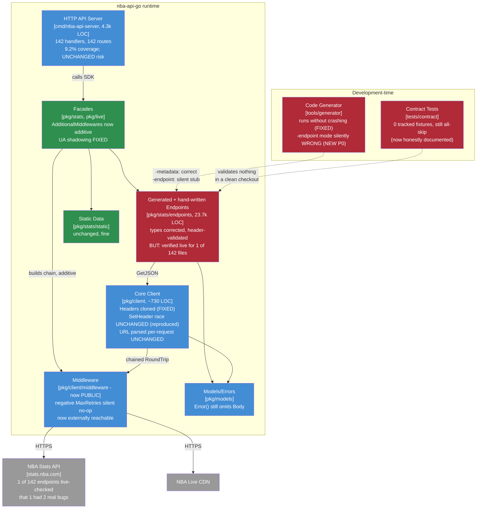

# Maintainable-Architect-v4 Assessment: nba-api-go

**Date:** 2026-07-20
**Revision assessed:** `8549390` (`main`, = `v2.0.0` + field-name-override commit + this session's hand-written-endpoint header-validation/LeagueLeaders-bug-fix commit), go1.26.5 darwin/arm64
**Assessor:** maintainable-architect-v4
**Method:** Direct verification of every load-bearing claim against source at HEAD - file reads, greps, `go build`/`go vet`/`go test ./...`, `go test -race` on core packages, `go test -cover`, `make lint`, `make test-examples`, an actual generator invocation (not just a read of the source), and - unlike the prior assessment, which had no network access - **live requests against `stats.nba.com`** for one endpoint (`LeagueLeaders`, both `PerMode` variants), reproduced with `curl` and through the SDK, plus a throwaway `-race` repro for the header-mutation race claimed-but-not-reproduced in the prior assessment. No production code was modified while writing this file; the one prior fix this file references (`leagueleaders.go`, committed as `8549390`) was made and committed before this assessment began, in direct response to the prior assessment's stated verification gap. A follow-up endpoint-level `httptest` regression suite now covers the accepted and rejected header paths for all four hand-written endpoints; it improves local protection but does not change the live-verification finding.

**Input documents:**

1. `docs/archive/MAINTAINABLE_ARCHITECT_V4_ASSESSMENT_2026-07-19_2363f46.md` (after this file supersedes it) - the prior assessment of record, grade C+, revision `2363f46`.
2. `docs/archive/REPOSITORY_ASSESSMENT_2026-07-19_2363f46.md` - its same-revision companion direct review.
3. `CHANGELOG.md`'s `[1.3.0]`, `[2.0.0]`, and `[Unreleased]` entries - the record of work done in response to (1)'s recommended order of work, read against source rather than trusted at face value.

---

## 1. Executive verdict

**Grade: B-.** Every P0 finding from the prior C+ assessment that was actionable without live network access has been fixed, precisely, and the fixes hold up under re-verification: User-Agent shadowing is gone, `Config.Headers` is cloned, all 121+ metadata-covered endpoints were regenerated with reviewed field types (not `inferGoType` guesses), and positional result-set indexing was replaced by name-keyed lookup with header validation across effectively the entire endpoint surface - 140 of 142 endpoint files call `findResultSet`/`validateHeaders` directly, and the two exceptions (`leagueleaders.go`, `internationalbroadcasterschedule.go`) have their own justified non-generic handling rather than a gap. Docs sprawl - four generations of maintainability assessment across three locations - is fully consolidated. CLAUDE.md no longer self-contradicts. This is real, substantial, correctly-scoped work, not a paper exercise.

**It earned a letter grade, not two.** Two things hold this back from B/B+:

First, **the header-validation architecture's central promise - that it's actually correct, not just present - remains almost entirely unverified against live NBA.com traffic**, exactly as `[2.0.0]`'s own changelog flags. This session got real network access and checked exactly one endpoint end-to-end (`LeagueLeaders`) and found it was *completely non-functional* - silently returning zero results on every call, for a reason (a singular `resultSet` envelope instead of the standard array) that header validation doesn't even address, plus a missing `TEAM_ID` column, plus a genuine API quirk (column set varies by `PerMode`) that would have made a naive fix hard-fail the most common call pattern. One-for-one, the first endpoint checked against live data had two real, previously-invisible bugs. That is not proof the other 141 are broken, but it is concrete evidence the unverified-by-construction confidence this project has been operating on is not free of risk, and 138 of 142 endpoints (all but `LeagueLeaders`, `PlayerCareerStats`, and the 2 non-standard-shape files) remain exactly that: unverified.

Second, **a new, more serious version of an old problem**: the prior assessment's "generator cannot be run via any documented workflow" (P1 #10) is now half-fixed in a way that makes it more dangerous, not less. The generator now runs without crashing - but `go run . -endpoint X -dry-run`, CLAUDE.md's own documented preview/regenerate command (and the only one a maintainer would reach for reflexively), **never loads any metadata file** regardless of endpoint name, silently produces an empty stub struct, and prints `✅ Code generation complete`. The old bug failed loudly (`open .../endpoint.tmpl: no such file or directory`); this one fails silently and would overwrite a correct generated file with an empty one if run without `-dry-run`. See finding #1 below - this is the highest-priority item in this assessment, ahead of anything carried over from the prior one.

Everything else carried forward from the prior C+ ledger that wasn't explicitly worked - the client concurrency bugs, the retry-config footgun, the server's 4,257(→4,291) LOC of hand-duplicated, 9.2%-covered handlers, the phantom config knobs, the unbounded metrics map - is still there, unchanged, and re-confirmed below rather than assumed.

---

## 2. Verification ledger

Status legend: **CONFIRMED** (reproduced/read at `8549390`), **FIXED** (true at `2363f46`, no longer true), **UNCHANGED** (true at `2363f46`, still true, re-verified not assumed), **NEW** (not present or not identified at `2363f46`).

### P0 - New this cycle

| # | Finding | Status | Evidence |
|---|---|---|---|
| 1 | **The generator's `-endpoint` flag - CLAUDE.md's own documented preview/regenerate command - never loads metadata for any endpoint, silently writes an empty stub, and reports success.** `main.go`'s `GenerateSingleEndpoint(name, dryRun)` path builds `EndpointMetadata{Name: name, Endpoint: strings.ToLower(name)}` with zero parameters/result-sets and renders the template directly - there is no metadata-directory lookup by endpoint name anywhere in this code path. `go run . -endpoint AssistLeaders -dry-run` (a real, metadata-backed endpoint, confirmed present in `metadata/tier8_batch.json`) prints an empty `AssistLeadersRequest{}`/`AssistLeadersResponse{}` and exits 0 with `✅ Code generation complete`; the identical command with `-metadata metadata/tier8_batch.json` added produces the full, correct struct. Every actual regeneration in `[2.0.0]`'s history used `-metadata` explicitly (confirmed by CHANGELOG wording throughout), so this path was never exercised by the work that "fixed" the generator - it was fixed to *run*, not to be *correct* | **NEW** |
| 2 | **Live verification of the header-validation risk is ~1% discharged, not closed.** Confirmed by doing it: `LeagueLeaders` (the one endpoint checked live this session) was silently returning zero results on every call, for reasons header validation alone doesn't catch (wrong envelope shape) plus one it does (missing column) plus one that would have broken under naive validation (`PerMode`-dependent column set - see `CHANGELOG.md`'s `[Unreleased]` entry and `leagueleaders.go`, fixed as part of `8549390`). 138 of 142 endpoint files remain unverified against live traffic | **NEW** (surfaced by this session's own fix work, not previously identified) |

### P0 → Carried forward, now fixed

| # | Finding (prior ledger #) | Status | Evidence |
|---|---|---|---|
| 3 | Generated types silently corrupt data (#1) | **FIXED** | `fieldtypes.json`/`fieldtype_overrides.json` (854 fields, 48 global corrections + per-endpoint overrides) now drive `resolveFieldGoType`; 121 of 135 metadata-covered endpoints regenerated with corrected types (`[2.0.0]`); `TestAllMetadataFieldsHaveExplicitTypes` fails CI on an unreviewed field |
| 4 | Positional parsing, no header validation (#2) | **FIXED**, with the live-verification caveat above | `findResultSet`/`validateHeaders`/`jsonTags` in `pkg/stats/endpoints/types.go`; 140 of 142 endpoint files call `findResultSet` directly (grep-verified at HEAD); the remaining 2 (`leagueleaders.go`, `internationalbroadcasterschedule.go`) have their own justified non-generic handling, not a gap - see finding #2 for the discovered cost of shipping this unverified |
| 5 | UA shadowing (#5) | **FIXED** | `pkg/client/client.go:18-24` - `DefaultUserAgent` is no longer injected in `NewClient`; comment states the core client is generic, each facade's `DefaultMiddlewares` owns the real UA via `middleware.WithUserAgent`. Confirmed for both `pkg/stats` and `pkg/live` |
| 6 | `Config.Headers` aliased (#12) | **FIXED** | `client.go:96-102`: `headers := config.Headers.Clone()`, comment explains why |

### P1 - Reconfirmed unchanged (real, not newly discovered, not yet worked)

| # | Finding (prior ledger #) | Status | Evidence |
|---|---|---|---|
| 7 | `SetHeader`/`AddHeader`/`SetHeaders` race with in-flight `Get` | **UNCHANGED - reproduced, not just inspected, this cycle** | Wrote a throwaway `-race` test (two goroutines, one calling `SetHeader` in a loop, one calling `Get` against an `httptest.Server`, both through only exported API): `go test -race` reports a genuine `WARNING: DATA RACE` between `Client.SetHeader` (`client.go:222`, unsynchronized `http.Header.Set`) and `Client.Get` (`client.go:143`, unsynchronized range over the same map). No `sync` import anywhere in `client.go`. Test was not committed (scratch verification only) |
| 8 | `RetryConfig.MaxRetries < 0` silently yields `(nil, nil)` | **UNCHANGED, now more reachable** | `middleware/retry.go:47` - `for attempt := 0; attempt <= config.MaxRetries; attempt++` never executes when `MaxRetries` is negative, so both named returns stay zero-valued. The prior assessment downgraded this to P3 specifically because `RetryConfig`/`WithRetry` were `internal`-only; **that mitigation is gone** - `pkg/client/middleware` is now a public package (see #12 below), so any consumer using `stats.Config.AdditionalMiddlewares` or building a client from scratch can reach this. Re-ranked P1 |
| 9 | Transport error classification retries permanent failures | **UNCHANGED** | `middleware/retry.go:97` - `isPermanentTransportError` still only recognizes `context.Canceled`/`context.DeadlineExceeded`; TLS/scheme/some-DNS failures still retried |
| 10 | Base URL parsed per request; `NewClient` returns no error | **UNCHANGED** | `client.go:58` - `func NewClient(config Config) *Client` (no error return); `client.go:191` - `buildURL` calls `url.Parse(c.baseURL)` inside every `Get` |
| 11 | Oversized *error* responses lose upstream status mapping | **UNCHANGED** | `client.go:161-169` - the `len(body) > c.maxResponseBytes` check still precedes the `resp.StatusCode >= 400` mapping check, same order as before |
| 12 | Contract tests are a no-op in a clean checkout | **UNCHANGED, but now honestly documented instead of misleadingly silent** | `tests/contract/.gitignore` still ignores `fixtures/*.json` with the keep-lines still commented out (`git ls-files tests/contract/fixtures/` = 0); 19 test functions still all skip on a clean checkout. `[1.3.0]`'s changelog explicitly acknowledges this rather than claiming it's fixed, and `tests/contract/README.md` was rewritten to state it plainly - a real, if partial, improvement in honesty, but the structural gap (zero committed fixtures, so CI's contract-test job currently verifies nothing) is unchanged. This session recorded 17 real fixtures locally via `UPDATE_FIXTURES=1 INTEGRATION_TESTS=1` while live-verifying `LeagueLeaders`; none are committed, per the existing convention |
| 13 | Server is a 4.3k-LOC hand-duplication surface at ~9% coverage | **UNCHANGED (marginally larger)** | 142 `handle*` methods (unchanged count), 4,291 LOC (was 4,257), `go test -cover`: 9.2% (was 8.7%). "Decide the server's fate" (`[2.0.0]`'s own recommended item 4) was not acted on |
| 14 | `requestsByPath` grows without bound; latency stats freeze after first N samples | **UNCHANGED** | `cmd/nba-api-server/metrics.go:46-49` (every distinct path stored forever), `:51` (`if len(m.responseTimes) < m.maxResponseTimes` - first-N sample, not rolling) |
| 15 | Phantom configuration: `LOG_LEVEL` unused, `NBA_API_TIMEOUT` unread, CORS hardcoded `*` despite "configurable" docs | **UNCHANGED (docs now honest about it)** | `main.go:26,30` (`logLevel` read and logged once, filters nothing); `main.go:142` (`Access-Control-Allow-Origin: *`, no env override); `NBA_API_TIMEOUT` still has zero source references. `[1.3.0]` amended ADR 002 and `docker-compose.yml` to note the timeout gap rather than closing it - an honesty fix, not a functionality fix |
| 16 | No scheduled live-drift workflow | **UNCHANGED** | `.github/workflows/` still contains only `ci.yml`; no `schedule:`/`cron` trigger anywhere in it |
| 17 | No `apidiff`/public-API semver-break gate in CI | **UNCHANGED** | No `apidiff` or equivalent reference anywhere in `ci.yml`. (Note: `v2.0.0`'s breaking changes were deliberate and loudly flagged in the changelog, so this gap didn't cause an *accidental* break this cycle - but nothing would stop one next time) |
| 18 | Response metadata is a hardcoded placeholder `(200, "", nil)` | **UNCHANGED** | Still matches in 140 of 142 endpoint files (grep-recounted at HEAD, same as prior count) |
| 19 | `Error()` omits the diagnostic `Body` | **UNCHANGED** | `pkg/models/errors.go:34-39` - unchanged |

### P1 → Fixed this cycle

| # | Finding (prior ledger #) | Status | Evidence |
|---|---|---|---|
| 20 | Built-in middleware locked under `internal/`, unconfigurable (#14) | **FIXED** | `internal/middleware` no longer exists; contents live at `pkg/client/middleware` (`headers.go`, `retry.go`, `ratelimit.go`, `logging.go`, `middleware.go`), fully public, matching CLAUDE.md's documented import path |
| 21 | Any custom middleware silently replaces all defaults (#15) | **FIXED** | `stats.Config`/`live.Config` gained `AdditionalMiddlewares []client.Middleware`, appended onto `DefaultMiddlewares()` rather than requiring the caller to reconstruct the default chain (`stats.go:83-84`, `live.go:73-74`) |
| 22 | 101 hardcoded `Season = "2023-24"` call sites (#11) | **FIXED** | `grep '"2023-24"' cmd/nba-api-server/*.go` = 0 hits. `handlers.go`'s `currentSeasonDefault()` derives the season from an injectable `nowFunc`, called from a single `queryOrDefaultSeason` helper; one tested function instead of 101 literals |
| 23 | CI lint/govulncheck unpinned (#9 partially) | **FIXED** | `ci.yml`: `golangci-lint-action@v9` pinned to linter `v2.12.2`; `govulncheck@v1.6.0` now version-pinned (was `@latest`) |
| 24 | Generator fails from every documented invocation (#10) | **PARTIALLY FIXED, see finding #1** | Templates are now `go:embed`ded (no more CWD-relative `open ...: no such file or directory`); `defaultOutputDir()` resolves via `runtime.Caller` instead of CWD. The generator *runs* now. Whether it runs *correctly* depends entirely on which flag you use - `-metadata` works; `-endpoint` alone silently doesn't, see #1 |
| 25 | No `-race` job in CI | **FIXED, with a gap** | `ci.yml:29-34` runs `go test -race` across `pkg/client/...`, `pkg/stats/...`, `pkg/live/...`, `cmd/nba-api-server/...`. It does not, and structurally cannot, catch finding #7 above - there is no existing test that exercises concurrent `SetHeader`+`Get`, so `-race` has nothing to trip over. Passing CI is not the same as race-free |
| 26 | CLAUDE.md self-contradicts on version/grade/paths (#30) | **FIXED** | Grade section now points at "the current assessment of record" instead of hardcoding a number (see this file's own header for the convention this enables); stale `cmd/generator`/`docs/DEPLOYMENT.md`/`docs/PYTHON_MIGRATION.md` paths corrected per `[1.3.0]`'s changelog entry (spot-checked: `cmd/generator` no longer appears in CLAUDE.md) |
| 27 | Docs sprawl: 4 generations of assessment across 3 locations | **FIXED** | `docs/` now holds 8 active files + `adr/` + `archive/` (15 files); root holds exactly `README.md`/`CHANGELOG.md`/`CONTRIBUTING.md`/`DEPLOYMENT.md`/`CLAUDE.md`. This assessment continues the convention: the prior assessment and its companion move to `archive/` in the same commit as this file (see section 7) |

### This cycle's own work (hand-written-endpoint header validation + LeagueLeaders fix, `8549390`)

| # | Finding | Status | Evidence |
|---|---|---|---|
| 28 | 4 of 6 hand-written endpoints (no generator metadata) did name-based lookup but never called `validateHeaders` | **FIXED for 3; the 4th needed different handling** | `commonplayerinfo.go`, `playergamelog.go`, `teamgamelog.go` now call `findResultSet`/`validateHeaders` against `jsonTags`, identical to generated code. `handwritten_headers_test.go` exercises each accepted and rejected raw-response path locally; `leagueleaders.go`'s singular-envelope and name-keyed path is covered there too. |
| 29 | `LeagueLeaders` silently returned zero results on every call | **FIXED, live-verified** | See finding #2's detail above and `CHANGELOG.md`'s `[Unreleased]` entry. `LeagueLeader` gained a `TeamID int` field; parsing now looks columns up by header name (the one endpoint in this codebase where a fixed column count/order genuinely doesn't hold, confirmed live for both `PerMode=Totals` and `PerMode=PerGame`) rather than reusing the generic `validateHeaders` exact-match, which would hard-fail `PerMode=PerGame` specifically - the most common real usage |

---

## 3. C4 model

Updated from the prior assessment's diagrams to reflect current risk distribution. Same convention note applies: if adopted as living documentation these belong as `.d2` sources under `docs/diagrams/c4/`; out of scope here.

### Level 1 - System context

Unchanged from the prior assessment - no new external actors or systems. See `docs/archive/MAINTAINABLE_ARCHITECT_V4_ASSESSMENT_2026-07-19_2363f46.md` section 3 if needed; not worth re-rendering identically.

### Level 2 - Containers (risk redistributed)

The shape is unchanged - still right for a solo maintainer. What moved: two of the four development/runtime risk boxes from the prior diagram (facades' UA shadowing, and result-set-name-keying's *absence*) are now green. The generated-endpoint box and the generator box both stay red, but for a subtly different reason than before: not "known wrong," but "correct by construction, unverified by evidence" - which this session's one live check shows is not the same thing as actually correct.

---

## 4. What the prior assessment's plan got right, and where reality diverged

The prior assessment (`2363f46`) proposed a three-phase plan: pre-v1.2.1 trust repairs (~6-8h), v1.3.0 verification infrastructure (~20-25h), v2.0.0 correctness release. Git history between `2363f46` and this revision shows **all three phases were actually executed**, in the proposed order, each as its own tagged release (`v1.2.1`-equivalent trust repairs at `00d0f11`, `v1.3.0` at `c15f68c`, `v2.0.0` at `40fc30a`, plus follow-on work). That is a rare, worth-noting outcome: the plan wasn't just written, it was carried out, on roughly the proposed shape.

Where reality diverged from the plan's stated scope:

- **The plan's v1.3.0 item "real contract tests: raw upstream fixtures (committed)... fail on missing fixtures in CI" was descoped to "fixtures uncommitted, but now honestly documented as such."** That's a legitimate call given no network access existed at the time to record real fixtures - but it means the single highest-value testing investment the prior assessment identified (its own words: "this is the single highest-value testing investment in the repository") remains undone, seven items down a list that otherwise mostly got done.
- **The plan's v1.3.0 item "make the generator runnable" was interpreted narrowly** (fix the crash) rather than end-to-end (fix the crash *and* verify the primary documented command path actually produces correct output). Finding #1 above is the direct result.
- **The plan's v2.0.0 item 2 ("immutable client... `NewClient` returns `(client, error)`... header setters removed") was not done.** The header-mutation race (#7) and per-request URL parse (#10) it would have fixed are both still present and reproduced above.
- **The plan's v2.0.0 item 4 ("decide the server's fate") was not done.** The server is unchanged in shape and marginally larger.

None of this is a criticism of *skipping* work - a solo maintainer triaging a 55-70h backlog against 1.6h/week has to cut somewhere, and the cuts made (contract fixtures, generator's non-`-metadata` path, client immutability, server fate) are exactly the four hardest, most time-consuming items on the original list. The point of naming them precisely is that "v1.3.0 verification infrastructure" and "v2.0.0 the correctness release" are confident names for what shipped, and the actual verification coverage is narrower than those names suggest - this section exists so the next person calibrates trust correctly rather than reading the release names at face value.

---

## 5. Where the complexity budget goes (updated)

**Well spent, unchanged from prior assessment:** core client design, real behavioral tests, ADRs, static data.

**Newly well spent:** the field-type correction methodology (three independent verification passes - naming-context reading, codebase-consensus cross-reference, and now this session's one live-traffic check - each catching different bugs, is genuinely rigorous work for a solo project); docs consolidation (the four-generations-in-three-locations problem is fully solved, and the "archive the superseded assessment in the same commit" rule this file itself follows is a good one).

**Still leaking, mostly unchanged:** 23,714 LOC of endpoint code at 1.5% test coverage (up from 22,787/1.1% - the ratio didn't improve, the code grew slightly faster than its own test suite); 4,291 LOC of hand-written server duplication at 9.2% coverage; phantom configuration knobs, now at least honestly labeled as phantom.

**Newly leaking:** the generator's `-endpoint` mode is a trap that costs more than the crash it replaced - a crash stops you immediately; a silent empty stub costs you only when you check the diff (or don't, and ship it). Given `-dry-run` doesn't change this behavior (the empty stub prints either way), a maintainer previewing a regeneration gets no signal anything is wrong.

---

## 6. Recommended order of work

Budget reality unchanged: ~1.6h/week, ~21h/quarter. This backlog is smaller than the prior one (much of it shipped) but the remaining items are concentrated in exactly the places a solo maintainer can least afford to be wrong - live-traffic correctness and concurrency bugs.

### Immediate (before this ships as a patch release, ~3-4h)

1. **Fix or guard the generator's `-endpoint`-only path** (~1.5h): either make `GenerateSingleEndpoint` actually search `metadata/*.json` for an entry matching the endpoint name (restoring the documented behavior), or - faster and safer - make it return an error when no metadata is found instead of silently rendering an empty struct, and update CLAUDE.md's examples to lead with `-metadata`. The second option is a one-line change (`if len(metadata.Parameters) == 0 && len(metadata.ResultSets) == 0 { return fmt.Errorf(...) }` or equivalent) and turns a silent trap back into the loud failure it used to be, which is strictly safer even if less convenient.
2. **Add one committed regression test for the header-mutation race** (~1h): an `httptest.Server`-backed test with concurrent `SetHeader`+`Get`, matching the scratch repro used to verify finding #7 in this assessment, so the existing `-race` CI job actually has something to catch. This doesn't fix the race, but it stops it from silently regressing further and documents it as known, tracked behavior rather than an inspection-only claim.
3. **Re-rank the `RetryConfig.MaxRetries < 0` footgun to match its new public reachability** (~0.5h documentation, or ~1h to add a one-line guard in `WithRetry` that clamps negative values or documents the contract loudly in the `RetryConfig` doc comment - either is fine, silence is not).

### Next (~15-20h, one focused push)

1. **Live-verify the remaining 3 hand-written endpoints** (`commonplayerinfo`, `playergamelog`, `teamgamelog`) the same way `LeagueLeaders` was verified this session, and commit at least those fixtures (~2-3h once network access is available - this session's attempts were rate-limited by `stats.nba.com` after a handful of requests; budget for a session with more headroom, e.g. spread across a few days rather than back-to-back).
2. **Commit a rotating sample of contract fixtures and make missing-required-fixture a CI failure, not a skip** - this is the single item from the prior assessment's plan that was explicitly descoped for lack of network access, and that access now exists (demonstrated this session). Even 10-15 fixtures spanning the highest-traffic endpoints would convert "19/19 skip, `ok`" into a real signal (~4-5h).
3. **Immutable client constructor** (`NewClient` returns `(*Client, error)`, base URL parsed once, header setters either removed or made safe): this simultaneously closes #7 and #10 rather than patching them separately (~4-5h, source-breaking, needs a minor-or-major version decision).
4. **Decide the server's fate** - this recommendation is now two cycles old. Either commit to generating its 142 handlers from the same metadata the endpoint generator already reads (closing the coverage gap structurally instead of by writing 142 tests by hand), or measure actual usage and consider demoting it to an example if nothing depends on it (~5-8h either direction, but the decision itself, even unstarted, is cheap and overdue).
5. **`apidiff` or equivalent CI gate** now that `v2.0.0` proved this project *will* ship deliberate breaks - the gate's job is to catch the *accidental* one next time (~2h).

### Not urgent, but don't let it silently re-sprawl

Docs are clean now. The rule stated in section 7 (supersede in the same commit) is the only maintenance this needs - don't add a fourth generation of assessment in a fourth location next year.

---

## 7. Documentation status

Fully consolidated as of this revision - no action needed beyond what this file itself does:

| File | Action taken by this assessment |
|---|---|
| `docs/MAINTAINABLE_ARCHITECT_V4_ASSESSMENT_2026-07-19_2363f46.md` | Archived (moves to `docs/archive/` in the same commit as this file, with a supersession banner) |
| `docs/REPOSITORY_ASSESSMENT_2026-07-19_2363f46.md` | Archived alongside it (same-revision companion, same treatment) |
| This file | New assessment of record |
| `CLAUDE.md`, `README.md`, `docs/README.md`, `tests/contract/README.md` | Updated so active documentation points at this file; historical references point at the archived prior assessment |

The `[1.3.0]` consolidation (8 files archived, `LINT_CLEANUP_PLAN.md` deleted, dead links fixed) was thorough; this cycle updates the active navigation and historical references required by the new archive move.

---

## 8. Is this too complex for one person?

**Unchanged verdict from the prior assessment, for the same reasons: the core, no; the full system, yes, at the edges - and the edges are the same edges.** What's different this cycle is that the "unverified surface" is smaller in *kind* (types are now right by construction, not by luck) but the live-verification gap - the thing that would actually confirm "by construction" holds against the real, undocumented, occasionally-inconsistent upstream API - is still almost entirely open. This session's one data point (`LeagueLeaders`, 2 real bugs on first live check) is a small sample, but it points the same direction the prior assessment predicted: automation that hasn't been checked against reality yet is a claim, not a fact.

The two structural fixes the prior assessment proposed (working generator + real fixture replay; or shrinking the server surface) remain the honest paths to making this durably one-person-sized. Neither is done. Both are now more tractable than they were - the generator's core embedding problem is fixed, and network access to actually verify against `stats.nba.com` has now been demonstrated as available (with a caveat: it appears to be rate-limited after a handful of requests, budget accordingly) - so the remaining work is smaller than it was, not different in kind.

---

## 9. Bottom line

`2363f46` → `8549390`: real, verifiable, correctly-sequenced progress. The plan the prior assessment wrote was executed close to as written, and the highest-leverage item on it - making "type-safe" actually true - is done and precisely verified, not just claimed. What holds this at a B- instead of higher: the project's own stated central risk (header validation, unverified live) turned out to hide a real, complete-functional-failure bug in the one endpoint this session actually checked, and the generator - the tool meant to keep the whole endpoint surface trustworthy going forward - has a newly-discovered failure mode that is quieter and more dangerous than the one it replaced. Fix the generator trap and add the one missing race-repro test first (a few hours); then spend the next available block live-verifying more of the endpoint surface, since that is now demonstrably possible and demonstrably finds real bugs. The path forward is exactly as short and boring as last time - it's just aimed slightly differently now that the type-correctness work is actually behind this project instead of ahead of it.

---

*Assessment of record for revision `8549390`, 2026-07-20. Supersedes `docs/MAINTAINABLE_ARCHITECT_V4_ASSESSMENT_2026-07-19_2363f46.md` (revision `2363f46`) as the current maintainability assessment. That file and its same-revision companion, `docs/REPOSITORY_ASSESSMENT_2026-07-19_2363f46.md`, move to `docs/archive/` in the same commit as this file.*
