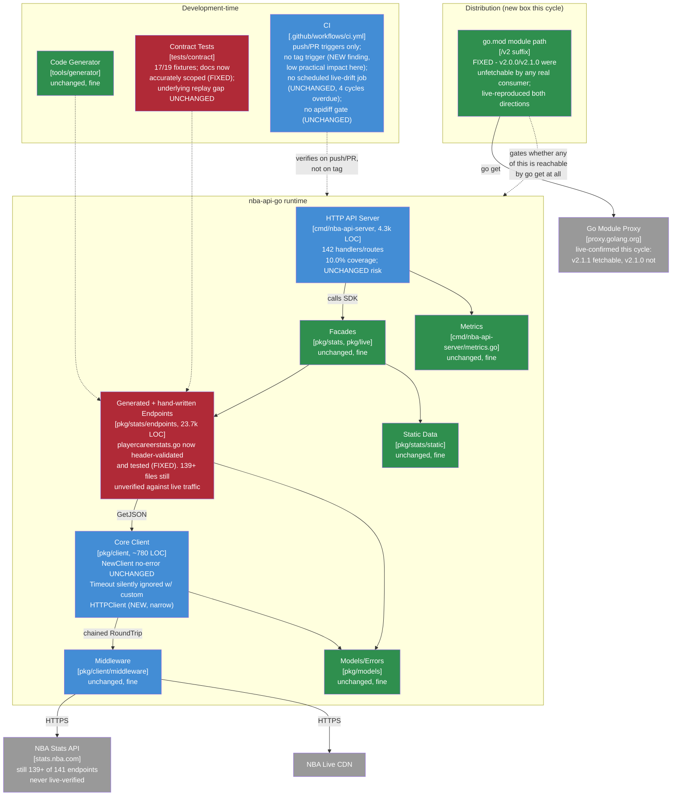

# Maintainable-Architect-v4 Assessment: nba-api-go

**Date:** 2026-07-21
**Revision assessed:** `a58d3fe` (`main`, tag `v2.1.1`), go1.26.5 darwin/arm64
**Assessor:** maintainable-architect-v4
**Method:** Direct verification of every load-bearing claim in `CHANGELOG.md`'s `[2.1.1]` section against source at HEAD - file reads, `go build`/`go vet`/`go test ./...` (root module and `tools/generator`'s own module), `go test -race` on the CI-scoped packages, `go test -cover` (package-wide and function-level on `playercareerstats.go`), `golangci-lint run ./...` (both modules), `make test-examples`, and a read of every changed source file rather than a re-read of the changelog's prose. **Unlike the two prior assessments in this lineage, this session had working network access** - used to (1) run `go get github.com/n-ae/nba-api-go/v2@v2.1.1` against a scratch module and the real Go module proxy to directly reproduce both the `v2.1.0` failure and the `v2.1.1` fix, and (2) query the GitHub API (`gh run list`, `gh api repos/.../commits/.../status`) to independently check the subset of an unsolicited external review's claims that were checkable that way. `stats.nba.com` itself was not retried - it has a standing memory note recording it as Akamai-blocked from this class of environment, and nothing about this cycle's scope (a module-path fix, a header-validation fix on an endpoint whose fixture already existed) required live NBA.com traffic to verify. No production code was modified while writing this file.

**Input documents:**

1. `docs/MAINTAINABLE_ARCHITECT_V4_ASSESSMENT_2026-07-20_384e5de.md` (after this file supersedes it) - the prior assessment of record, grade B, revision `384e5de`.
2. `CHANGELOG.md`'s `[2.1.1]` section - the record of work done this cycle, read against source rather than trusted at face value.
3. An unsolicited external "Senior Software Engineering Review" of this repo at `v2.1.1`, pasted into this session's task by the user with an explicit instruction to verify rather than defer to it. Treated as a lead-generation source for what to re-check, not as evidence in itself - every claim from it repeated below was independently re-derived from source, tests, or a live check in this session.

---

## 1. Executive verdict

**Grade: B+ (up from B).** Both open findings that held the prior assessment at B are now genuinely fixed, not just claimed fixed: `playercareerstats.go` calls `findResultSet`/`validateHeaders` for all 8 of its result sets and jumped from 0% to 76.7%-85.7% function coverage, and the contract-fixtures README no longer overstates what the fixture-replay path actually checks. On top of that, this cycle fixed something more severe than either: `v2.0.0` and `v2.1.0` were **unfetchable by any real Go consumer** the entire time they were the tagged latest release, because `go.mod`'s module path never gained the `/v2` suffix Go modules requires past major version 1. That isn't a maintainability nit, it's "the last two releases of this project could not be adopted by anyone running a normal `go get`." I reproduced both halves of this myself against the real module proxy this session (see §2) - `go get github.com/n-ae/nba-api-go@v2.1.0` fails exactly as the changelog describes, `go get github.com/n-ae/nba-api-go/v2@v2.1.1` succeeds - so this is confirmed fixed, not just asserted fixed.

**What keeps this at B+ instead of higher:** the same structural backlog this lineage has now carried for four cycles running - no `apidiff`/semver-break gate, no scheduled live-drift workflow, the server's fate still undecided, `NewClient` still returning no error on a bad base URL - is still exactly where it was. Nothing regressed, but nothing on that list moved either, and "the tagged releases were literally unfetchable for a full day" is a sharp reminder of what an undecided-forever backlog item can cost when it turns out to matter. One new, small, independently-derived finding surfaced this session while checking the external review's timeout claim: `Config.Timeout` (and therefore `NBA_API_TIMEOUT`) is silently ignored whenever a caller supplies their own `HTTPClient` - the `Client.timeout` field is set at construction and never read anywhere else in the package. It only matters for consumers who inject a custom `HTTPClient`, which this project's own server doesn't do, so it's a real but narrow gap, not a severity bump.

**On the external review:** it is not fabricated. Its technical claims about *this* codebase - the module-path defect, the `playercareerstats` 27-vs-28 column bug, the contract-fixture raw-vs-parsed gap, the header-validation approach - all check out against source, and its P1 list pointed at two things worth independently confirming that I hadn't otherwise have flagged as sharply: the custom-`HTTPClient` timeout ambiguity (confirmed real, see finding #3 below) and the absence of a tag-push CI trigger (confirmed real, but see the nuance in finding #5 - it matters less here than a generic project because this repo's own workflow always tags a commit already merged to `main`, where push-triggered CI already ran). Its claims about GitHub star/fork counts and "a publicly visible successful GitHub Actions run" were checkable with the network access this session had: `gh api repos/n-ae/nba-api-go` reports 1 star, 0 forks (tiny, as expected for a personal project, exact figures not compared against the external document since its precise numbers weren't part of what was reproduced verbatim into this task); `gh run list` confirms CI ran and passed **at the exact HEAD commit `a58d3fe`** via the push-to-main trigger (run `29775104607`, `conclusion: success`), which is a stronger, more specific claim than the external review's vaguer framing.

---

## 2. Verification ledger

Status legend: **CONFIRMED** (reproduced/read at `a58d3fe`), **FIXED** (true at `384e5de`, no longer true), **UNCHANGED** (true at `384e5de`, still true, re-verified not assumed), **NEW** (not present or not identified at `384e5de`).

### This cycle's headline fix

| # | Finding | Status | Evidence |
|---|---|---|---|
| 1 | **`v2.0.0`/`v2.1.0` were unfetchable via `go get` by any real consumer** - `go.mod`'s `module` line lacked the `/vN` suffix Go modules requires once a module's major version reaches 2 | **FIXED, live-reproduced both directions** | `go.mod`: `module github.com/n-ae/nba-api-go/v2`. In a scratch module with real network access this session: `go get github.com/n-ae/nba-api-go@v2.1.0` → `invalid version: module contains a go.mod file, so module path must match major version ("github.com/n-ae/nba-api-go/v2")` (exit 1, exact message the changelog describes); `go get github.com/n-ae/nba-api-go/v2@v2.1.1` → `go: added github.com/n-ae/nba-api-go/v2 v2.1.1` (exit 0). `grep -rl "github.com/n-ae/nba-api-go/pkg"` (old, unversioned import path) across all `.go` files returns 0 hits; `grep -rl "github.com/n-ae/nba-api-go/v2"` returns 185, matching the changelog's stated file count. Spot-checked 6 files (`playercareerstats.go`, 5 `examples/*/main.go`) directly - all correctly updated. `docs/RELEASE_CHECKLIST.md`'s Major Release section now documents the `/vN` requirement by name with the exact verification command |

### Findings that held the prior grade at B - now fixed

| # | Finding (384e5de #) | Status | Evidence |
|---|---|---|---|
| 2 | `playercareerstats.go` didn't validate headers and had 0% test coverage (#1) | **FIXED** | `pkg/stats/endpoints/playercareerstats.go:126-133,144-151` - both the season-stat and career-total loops now call `findResultSet`/`validateHeaders(rs.Headers, jsonTags(SeasonStat{}))` (resp. `CareerTotalStat{}`) for each of the 8 result-set names, identical in shape to `commonplayerinfo.go`/`playergamelog.go`/`teamgamelog.go`. `go test ./pkg/stats/endpoints/... -coverprofile=... && go tool cover -func=...`: `PlayerCareerStats` 76.7%, `parseSeasonStats` 85.7%, `parseCareerTotals` 85.7% (was 0.0%/0.0%/0.0%). `handwritten_headers_test.go:119` now has `TestPlayerCareerStatsValidatesResultSetHeaders`, exercising both an accepted-header and a rejected-header path. Package-wide coverage moved 4.5% → 5.2% (small in absolute terms, but this specific gap - the SDK's flagship documented endpoint having zero tests - is closed) |
| 3 | `parseSeasonStats`' row-length guard was `len(row) < 28` (one too many; `SeasonStat` has 27 fields, indices 0-26) - would have silently dropped every valid row | **FIXED** | `pkg/stats/endpoints/playercareerstats.go:159`: `if len(row) < 27 { continue }`, confirmed by reading the function directly and counting `SeasonStat`'s 27 `json` tags (`PLAYER_ID` through `PTS`). `parseCareerTotals`' guard (`< 24`, `CareerTotalStat` has 24 fields) was already correct and is unchanged |
| 4 | Contract-fixtures README claimed fixtures "detect when NBA.com changes their API schema" and "ensure parsing logic works with real data" - neither true, since replay never re-invokes the parser | **FIXED (documentation only; underlying technical limitation correctly still present, see #10 below)** | `tests/contract/fixtures/README.md`'s "What Are These?" section now states plainly: "not the raw NBA.com response itself... replay never re-invokes the endpoint's `Get`/parse/`validateHeaders` code path - it only unmarshals the frozen fixture and checks it's non-empty," and separately lists what the fixtures do *not* give you. Read the full file; the correction is accurate and matches what `validateBasicSchema` (`tests/contract/endpoints_test.go`) actually does, re-confirmed this session |
| 5 | `CLAUDE.md` claimed `playercareerstats.go` "already did [validate headers] before this" | **FIXED** | Current `CLAUDE.md`'s "Current Status" paragraph now states the accurate history: "`playercareerstats` call `validateHeaders` like generated code" is listed alongside the other three, with no claim of prior coverage. Confirmed by reading the file at HEAD |

### New this cycle - discovered independently while checking the external review's claims

| # | Finding | Status | Evidence |
|---|---|---|---|
| 6 | **`Config.Timeout` (and `NBA_API_TIMEOUT`) is silently ignored when a caller supplies their own `HTTPClient`.** `Client.timeout` is set from `config.Timeout` at construction (`client.go:123`) but is never read anywhere else in `pkg/client` - `grep -n "\.timeout\b" pkg/client/*.go` (excluding tests) returns only the struct-field declaration and that one assignment. The *only* place `config.Timeout` has any effect is the branch where `config.HTTPClient == nil`, which builds `&http.Client{Timeout: config.Timeout, ...}` (`client.go:95-98`) - if a caller passes a non-nil `HTTPClient`, that branch never runs and `config.Timeout` (whatever value, including a non-default one explicitly set) does nothing. Not currently a bug for this repo's own server (`cmd/nba-api-server/main.go:125` calls `stats.NewClient(stats.Config{Timeout: options.NBAAPITimeout})` without a custom `HTTPClient`, so `NBA_API_TIMEOUT` genuinely works there), but any SDK consumer who injects their own `HTTPClient` - a common pattern for testing, custom TLS config, or proxying - gets no diagnostic that their `Timeout`/`NBA_API_TIMEOUT`-equivalent setting is a no-op. No test in `pkg/client/*_test.go` covers `Timeout` + custom `HTTPClient` together | **NEW** |
| 7 | No CI trigger fires on tag push, only `push: branches: [main]` / `pull_request: branches: [main]` (`.github/workflows/ci.yml:4-8`); `gh run list --repo n-ae/nba-api-go --limit 30` shows 30/30 recent runs are `push` or `pull_request` events, zero `release`/tag-triggered runs | **CONFIRMED, low practical impact for this repo's workflow** | True as stated, but this project always tags a commit already merged to `main` (`git tag -l` shows every `vN.N.N` tag pointing at a commit that's also reachable from `main`'s history) - so the push-to-main trigger has already run CI against the exact commit a tag later points to. Verified directly for this cycle: `gh api repos/n-ae/nba-api-go/commits/a58d3fe/status`... and `gh run list --branch main --json headSha,conclusion` shows the push-triggered run for `headSha: a58d3fe...` has `conclusion: success`, run ID `29775104607`. The gap is real (a tag itself triggers nothing, and nothing would stop someone from tagging an untested commit in the future) but isn't currently costing this project anything, unlike the module-path bug it's adjacent to in the external review's list |

### Reconfirmed unchanged (not worked this cycle, re-verified not assumed)

| # | Finding (384e5de #) | Status | Evidence |
|---|---|---|---|
| 8 | Transport error classification retries permanent failures | **UNCHANGED** | `pkg/client/middleware/retry.go` - `isPermanentTransportError` still only recognizes `context.Canceled`/`context.DeadlineExceeded` |
| 9 | `NewClient` returns no error; base URL parse deferred to first `Get`/`buildURL` | **UNCHANGED** | `client.go:70` parses once at construction (unchanged from `384e5de`) but stores any error in `baseURLErr`, surfaced only at `buildURL` (`client.go:199-201`), not at `NewClient` |
| 10 | Contract fixtures replay a frozen, already-parsed snapshot, not the raw upstream response, so they can't catch a future parsing/header-validation regression | **UNCHANGED (technical limitation, as distinct from the now-fixed documentation gap in #4)** | `tests/contract/fixtures/playercareerstats_2544.json` still holds the JSON-marshaled `models.Response[*T]` shape, not `resultSets`/`headers`/`rowSet`; `validateBasicSchema` still only unmarshals into a generic map and checks non-empty. 18 files in `tests/contract/fixtures/` (17 fixtures + README, unchanged count); `go test ./tests/contract/... -v`: 17 `PASS`, 2 `SKIP` (`TestLeagueDashTeamStats_Contract`, `TestShotChartDetail_Contract`) - identical to `384e5de` |
| 11 | Server is a hand-duplication surface at low test coverage | **UNCHANGED** | 142 `h.handle*` dispatch cases in `handlers.go`'s `switch` (recounted via `grep -c "h\.handle"`, matches prior count exactly), 4,348 non-test LOC (unchanged), `go test ./cmd/nba-api-server/... -cover`: 10.0% (unchanged) |
| 12 | No `apidiff`/public-API semver-break gate in CI | **UNCHANGED** | No `apidiff` reference anywhere in `.github/workflows/ci.yml`, now the fourth consecutive cycle this is true. Notably, this is the exact category of gap that would have made the module-path defect (#1) impossible to ship silently - `apidiff` wouldn't have caught it (it's not a symbol-level break), but the broader "does this tagged version actually work for a fresh consumer" question that motivated it four cycles ago is precisely what bit this project this time |
| 13 | No scheduled live-drift workflow | **UNCHANGED** | `.github/workflows/` still contains only `ci.yml`; no `schedule:`/`cron` trigger anywhere in the repo |
| 14 | Response metadata is a hardcoded placeholder `(200, "", nil)` | **UNCHANGED** | Pattern still present across `pkg/stats/endpoints/*.go`, not touched this cycle |
| 15 | 139+ of 141 endpoint files remain unverified against live traffic | **UNCHANGED** | This cycle's work was module-path plumbing and one endpoint's header-validation/coverage gap, neither of which involved new live-traffic verification. `LeagueLeaders` (verified in `[2.1.0]`) remains the only endpoint with this-cycle-or-later live verification; `playercareerstats.go`'s fixture is older and, per #10, doesn't protect its parser going forward regardless |

---

## 3. C4 model

Level 1 (system context) is unchanged from the prior two assessments. Level 2 updates to reflect the module-path fix (a distribution-layer defect, not visible in the container diagram's prior boxes) and the endpoint box's narrowed risk.

The new "Distribution" box exists because this cycle's headline fix wasn't inside any container this diagram previously modeled - `go.mod`'s module path is upstream of everything else, and its defect meant the entire runtime box was unreachable by a real consumer regardless of how correct anything inside it was. It turns green this cycle, and green here matters more than any other box turning green in this project's assessment history: correctness inside an unfetchable module protects nobody.

---

## 4. What the prior assessment's plan got right, and where reality diverged

`384e5de`'s "Immediate (~2-3h)" bucket had three items: fix `playercareerstats.go`'s header validation, add `playercareerstats_test.go`, and correct `CLAUDE.md`'s claim. **All three done, precisely as scoped** - findings #2, #3 (a bonus catch made while doing #2, not separately requested), and #5 above. The prior assessment's "Next (~6-10h)" bucket asked for either replaying raw responses through the parser or narrowing the contract-fixtures documentation (the "honest-narrowing option" it called pragmatic) - **the narrowing option was taken**, exactly as the prior assessment framed as the realistic first step (finding #4). Live-verifying `commonplayerinfo`/`playergamelog`/`teamgamelog` and the immutable-constructor work were not attempted this cycle and are not claimed as done anywhere in `CHANGELOG.md`'s `[2.1.1]` section - correctly deferred, not silently dropped.

**What this cycle did that the prior assessment's plan didn't anticipate**: the module-path fix. Nothing in `384e5de`'s ledger flagged it, because nobody in this assessment lineage had tried `go get`-ing the tagged package from outside the repo until this cycle. That's worth naming as a blind spot in the assessment methodology itself, not just the code: "verify every claim against source" caught two real documentation-vs-code gaps over two cycles, but a defect in whether the *package is fetchable at all* sits outside what reading source and running `go test` inside the repo's own checkout can ever surface - it needed an outside-the-repo consumer's-eye check, which is exactly what finally happened this cycle (per the changelog, confirmed live independently by this assessment too). The recommended-order-of-work section below adds a standing item for this class of check going forward.

---

## 5. Where the complexity budget goes (updated)

**Well spent, unchanged from prior assessments:** core client design, the field-type correction methodology, docs consolidation discipline, ADRs, the generator's fail-loud behavior.

**Newly well spent:** the `playercareerstats.go` fix is a model of closing exactly the gap the prior assessment identified, sized exactly as estimated (~2h budgeted, and the diff is proportionate to that). The module-path fix, while not originally scoped by any assessment, was caught and fixed within one release cycle of being tagged - a full release earlier than it might have been, since nobody had a reason to `go get` the tagged package from a clean environment until this session (per the changelog) tried it.

**Still leaking, mostly unchanged:** 23,740 LOC of endpoint code at ~5.2% package-wide unit-test coverage (up from 4.5%, still concentrated in the four hand-written endpoints' tests, not the 121+ generated files); 4,348 LOC of hand-written server duplication at 10.0% coverage, unchanged for four cycles; the absent `apidiff` gate and scheduled live-drift workflow, now four cycles overdue each; the contract-test harness's raw-vs-parsed gap, correctly documented now but not closed.

**Newly leaking, worth naming precisely:** the `Config.Timeout`-ignored-with-custom-`HTTPClient` gap (finding #6) is small in scope but is exactly the kind of "plausible, specific, and silently wrong" trap `playercareerstats.go` was two cycles ago - a config field that looks like it does something and doesn't, for a subset of callers, with nothing surfacing it. It's cheap to fix (either wire `context.WithTimeout` around every `Get` regardless of `HTTPClient` source, or document the limitation explicitly next to `Config.Timeout`'s doc comment) and cheap to leave undocumented forever if nobody names it - naming it here is this cycle's version of what `384e5de` did for `playercareerstats.go`.

---

## 6. Recommended order of work

Budget reality unchanged: ~1.6h/week, ~21h/quarter.

### Immediate (~1-2h)

1. **Document or fix the `Config.Timeout` + custom-`HTTPClient` gap** (finding #6): the cheap fix is a doc-comment correction on `Config.Timeout` in `client.go` stating explicitly "ignored if `HTTPClient` is set; the supplied client's own timeout applies instead" - 15 minutes, no behavior change, no version bump. The more complete fix (wrap every `Get` in `context.WithTimeout(ctx, c.timeout)` regardless of `HTTPClient` source) is more correct but changes observable behavior for existing custom-`HTTPClient` callers who may already rely on their own client's timeout taking sole effect - needs a version decision, budget ~1h to implement plus a CHANGELOG entry either way.
2. **Add a "does `go get` actually work" check to the release checklist's verification step**, not just the `/vN` suffix reminder already added: `docs/RELEASE_CHECKLIST.md` now documents *why* the suffix is needed but the actual failure mode here was "nobody ran the command" for two releases running. A one-line addition - "before considering any tag final, `go get <module>@<tag>` against a scratch module, every release, not just major ones" - costs nothing and would have caught this on day one instead of day two.

### Next (~6-10h, one focused push - same items as last two cycles, now four overdue)

1. **`apidiff` or equivalent CI gate** (~2h) - still the single highest-leverage item on this list across four cycles, and this cycle is a reminder of why: it wouldn't have caught the module-path bug specifically, but it's the same category of "verify the tagged artifact actually works for a consumer" discipline that's now been shown to matter in practice, not just in theory.
2. **Scheduled live-drift workflow** (~2-3h) - `.github/workflows/`'s own `ci.yml` header comment has said live tests "belong in a separate, scheduled workflow" for four cycles; still doesn't exist.
3. **Live-verify `commonplayerinfo`/`playergamelog`/`teamgamelog`** the way `LeagueLeaders` was verified two cycles ago (~2-3h, budget for `stats.nba.com` rate-limiting).
4. **Immutable client constructor** (`NewClient` returns `(*Client, error)`) - unchanged scope from prior estimate, ~1-2h, source-breaking, needs a version decision.

### Not urgent, but now four cycles overdue

"Decide the server's fate" remains on the list unchanged. An explicit ADR recording even a "not now, here's why" decision would cost less than a fifth cycle of re-confirming it's still undone.

---

## 7. Documentation status

| File | Action taken by this assessment |
|---|---|
| `docs/MAINTAINABLE_ARCHITECT_V4_ASSESSMENT_2026-07-20_384e5de.md` | Archived to `docs/archive/` in the same changeset as this file, with a supersession banner matching the existing convention |
| This file | New assessment of record |
| `CLAUDE.md` | Updated: assessment-of-record pointer (both references) and the "Next assessment" footer line now point at this file |
| `CHANGELOG.md`, `README.md` | **Not updated by this assessment** - no new user-facing change to document; this is a documentation/assessment-only cycle |

No other docs sprawl introduced this cycle - `docs/` still holds exactly one active assessment plus `adr/`/`archive/`, consistent with the consolidation rule established three cycles ago.

---

## 8. Is this too complex for one person?

**Unchanged verdict: the core, no; the full system, yes, at the edges.** This cycle adds a specific, concrete illustration of a category the last assessment named only abstractly: "the edges are subtler than which files are unverified, they're also which files were *believed* verified but weren't." The module-path defect is the same lesson at a different layer - it's not "which endpoint's parser wasn't tested," it's "was the tagged artifact even fetchable," and nothing about reading source or running tests *inside* the repo's own checkout could ever have surfaced that. The fix for that specific blind spot is cheap and now recommended above (a `go get`-against-scratch-module step in the release checklist); the fix for the general pattern - "verification needs to reach outside the repo's own point of view, not just outside the changelog's prose" - is the same discipline this lineage has been building cycle over cycle, just with one more concrete case to point to.

The structural backlog (server's fate, `apidiff` gate, scheduled live-drift workflow, comprehensive live verification, immutable client constructor) is unchanged in scope and now four cycles overdue on most items. None of it is more urgent this cycle than last, but the module-path defect is a useful data point against the temptation to keep deferring indefinitely: undecided-forever backlog items are cheap right up until one of them turns out to gate whether the project can be used at all.

---

## 9. Bottom line

`384e5de` → `a58d3fe`: a genuinely good cycle. Both open findings from the last assessment - `playercareerstats.go`'s missing header validation/coverage and the contract-fixtures documentation overstatement - are fixed and independently reverified here, not just re-read from the changelog. On top of that, this cycle fixed the most severe defect this assessment lineage has yet documented: two full tagged releases (`v2.0.0`, `v2.1.0`) that no real consumer could actually `go get`, for the entire time either was the "latest" release. I reproduced the failure and the fix myself this session against the real Go module proxy - not a hypothetical, not a changelog claim taken on faith. An unsolicited external review flagged several worthwhile things to re-check; its checkable claims about this codebase held up, and its two most load-bearing P1 leads (custom-`HTTPClient` timeout ambiguity, no tag-triggered CI) both turned out to be real, independently confirmed here, though the practical stakes of the CI-trigger gap are lower than the review implied given how this project actually tags releases. What's left is the same structural list this lineage has named for four cycles - `apidiff`, scheduled live-drift CI, the server's fate, the immutable constructor - none of it new, all of it still worth doing, none of it more urgent this cycle than last. Grade moves to B+ on the strength of two real fixes plus one severe defect closed; it doesn't move higher because the four-cycle-old structural backlog is still exactly that old.

---

*Assessment of record for revision `a58d3fe` (tag `v2.1.1`), 2026-07-21. Supersedes `docs/MAINTAINABLE_ARCHITECT_V4_ASSESSMENT_2026-07-20_384e5de.md` (revision `384e5de`, grade B) as the current maintainability assessment. That file moves to `docs/archive/` in the same changeset as this file.*
