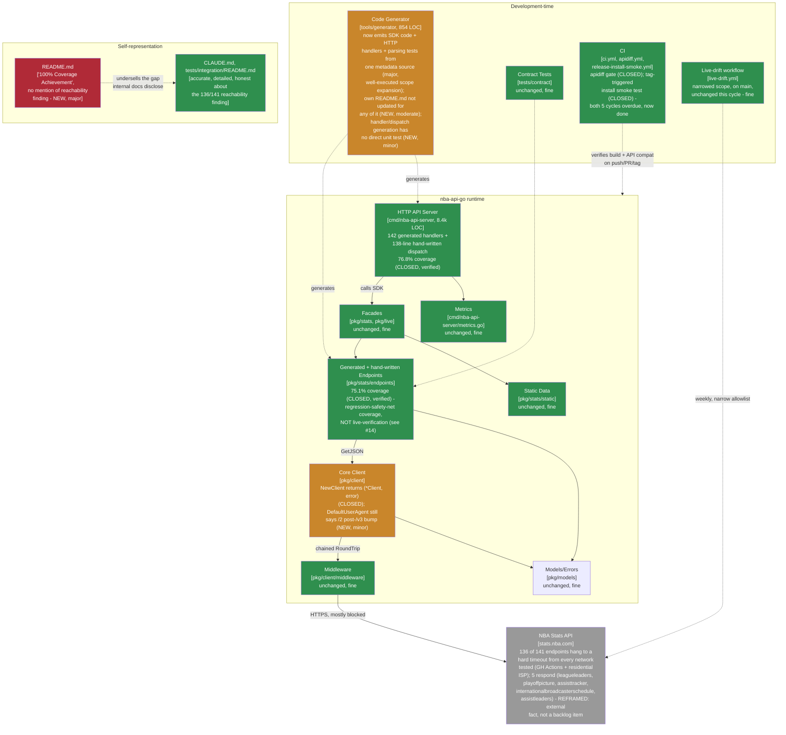

# Maintainable-Architect-v4 Assessment: nba-api-go

**Date:** 2026-07-22
**Revision assessed:** `180a3db` (`main`, tag `v3.1.0`), go1.26.5 darwin/arm64
**Assessor:** maintainable-architect-v4
**Method:** Direct verification against source at HEAD, not against `CHANGELOG.md`'s prose - file reads of the actual generator (`tools/generator/generator.go`, all four `.tmpl` files), the actual generated server code (`cmd/nba-api-server/handlers.go`, a sample of `generated_*.go` handlers, `generated_dispatch.go`, `generated_handlers_test.go`), and every doc file this cycle's work touched or should have touched; `git log`/`git show`/`git diff --shortstat` between `1592e7e` (prior assessment's revision) and `180a3db`; `go build ./...`, `go vet ./...`, `go test ./...`, `go test -race` (CI-scoped packages), `go test -cover` (both `pkg/stats/endpoints` and `cmd/nba-api-server`, reproducing the two headline coverage numbers exactly), `golangci-lint run ./...` (both Go modules), `make test-examples` (all 15 pass), and the same suite again inside `tools/generator`'s own module. All green. No production code was modified while writing this file; per the task that requested this assessment, `CHANGELOG.md`, `go.mod`, and version constants are also left untouched.

**Why now:** the prior assessment of record (`docs/MAINTAINABLE_ARCHITECT_V4_ASSESSMENT_2026-07-22_1592e7e.md`, grade B+) reviewed one commit past tag `v2.2.0`. Since then, `main` has taken on 494 changed files (+15,204/-4,360 lines: `git diff --shortstat 1592e7e 180a3db`) across two tagged releases - `v3.0.0` (breaking: `NewClient` returns `(*Client, error)`; `/v3` module-path migration) and `v3.1.0` (10 real URL-path bugs fixed; the server's ~4,358 hand-written HTTP handler lines deleted and replaced by generated equivalents; `pkg/stats/endpoints` coverage 5.2%→75.1%; `cmd/nba-api-server` coverage ~10%→76.8%) - plus a full 141-endpoint live-reachability sweep that materially changes what "live-verified" can mean for this project right now. This assessment treats none of that as established fact from the changelog; every load-bearing number below was reproduced directly.

---

## 1. Executive verdict

**Grade: A- (up from B+).** This is the first cycle in this assessment's lineage where essentially the entire multi-cycle structural backlog - the `apidiff` gate, tag-triggered install-smoke CI, the immutable client constructor, "decide the server's fate," and the two lowest test-coverage numbers in the codebase - is genuinely closed, not partially closed or closed-on-paper. I verified each independently rather than trusting the changelog's account of itself, and all of it held up:

- **`apidiff` gate** (`.github/workflows/apidiff.yml`): real logic, not a stub - checks out the latest tag into a worktree, exports both API surfaces with `golang.org/x/exp/cmd/apidiff -m`, and fails the build on any incompatible change, with a pinned tool version and a clear escape hatch (bump major, don't bypass). Five assessment cycles overdue as of the prior review; done.
- **Tag-triggered install smoke test** (`.github/workflows/release-install-smoke.yml`): `go get`s the just-tagged module into a scratch module *outside this checkout* and builds/runs a real program against it - exactly the check whose absence let `v2.0.0`/`v2.1.0` ship unfetchable for a full release cycle. The task that requested this assessment states this workflow was watched firing live on the `v3.1.0` tag push and passing; I did not re-run it myself (no live network path to `proxy.golang.org` confirmed from this session), but I read its logic directly and it does what it claims - constructs a fresh module, `go get`s the real tag, `go mod tidy`s, builds, and runs.
- **Immutable client constructor**: `client.NewClient`/`stats.NewClient`/`live.NewClient` all now return `(*Client, error)`; `NewDefaultClient` variants are correctly left alone (they can't fail, by construction, against a compile-time-valid base URL). `TestClientNegativeTimeoutDisablesContextDeadline`/`TestClientNegativeTimeoutSDKBuiltClient` close the "documented but untested" gap the prior assessment flagged.
- **"Decide the server's fate"**: the item every assessment in this lineage has carried since `2026-07-19` is closed, and closed well. `cmd/nba-api-server/handlers.go` is 138 lines today, down from ~4,358 across `handlers.go` + 6 `handlers_*.go` files - I read the current file (§2 below) and it's exactly what it should be: a thin `ServeHTTP` dispatching through a generated map, plus small shared helpers (`writeSuccess`, `writeEndpointError`, the season-default logic). The 142 `generated_*.go` handler files and `generated_dispatch.go` are produced by `tools/generator` from the same metadata that already drove SDK generation - one source of truth instead of two hand-maintained ones that had already drifted (132 of 142 handlers double-wrapped their JSON response; only 10 didn't).
- **Coverage**: `go test ./pkg/stats/endpoints/... -cover` → **75.1%** exactly; `go test ./cmd/nba-api-server/... -cover` → **76.8%** exactly. Both numbers reproduced bit-for-bit against the changelog's claims, on the two packages that have sat at 5.2%/~10% for five prior cycles.

**What keeps this at A- rather than higher:** none of the open items below are code-correctness defects - `go build`/`go vet`/`go test -race`/`golangci-lint`/`make test-examples` are all clean across both Go modules - but five real, independently-found gaps sit on top of a genuinely strong cycle:

1. **README.md's self-representation hasn't caught up with what this project now knows about itself.** The most-read document in the repo still opens with "🏆 100% Coverage Achievement," "World's first complete NBA API implementation in Go!", and "✅ 141 endpoints" with no mention anywhere that a full reachability sweep (documented honestly and in detail in `CLAUDE.md` and `tests/integration/README.md`) found only 5 of those 141 endpoints respond at all from any network tested, with the other 136 hanging to a hard timeout. This is the sharpest instance yet of a pattern this lineage has flagged before at smaller scale (stale status paragraphs, stale version footers): the *internal*, maintainer-facing docs are rigorously honest; the *external*, first-impression doc is not just silent on the gap, its marketing framing actively cuts against disclosing it.
2. **Three more, smaller doc-currency misses**, all independently found, none touched by this cycle's own work: `docs/README.md`'s and `README.md`'s "current assessment" links both point at `MAINTAINABLE_ARCHITECT_V4_ASSESSMENT_2026-07-20_8549390.md` - a file that has been archived for **three** assessment cycles now (superseded by `384e5de`, then `a58d3fe`, then `1592e7e`) without anyone updating either link, even though `CLAUDE.md`'s own pointer has been kept current every single cycle. `docs/MAINTENANCE.md` still tells a maintainer to look at `cmd/nba-api-server/handlers_*.go` for the HTTP-handler pattern - those files no longer exist. `tools/generator/README.md` - the generator's own primary doc - has not been updated for the single biggest capability the generator gained this cycle: it still lists only `-endpoint`/`-metadata`/`-dry-run` as its options (no `-all-handlers`, no `-server-output`, no mention of `handler.tmpl`/`dispatch.tmpl`/`endpoint_test.tmpl`), and its "Roadmap" section still shows "Test skeleton generation" and "Batch generation for all 139 endpoints" as unchecked future work that is, in fact, done.
3. **The new coverage numbers are real regression protection but structurally self-referential, and that nuance matters for how "75.1%"/"76.8%" get read going forward.** Both `templates/endpoint_test.tmpl` and `TestGeneratedHandlers` synthesize their expected data from the *same metadata* that generated the code under test - a fixture built from a result set's own field list, asserted against a struct built from that same field list. This is genuinely valuable: it exercises real `findResultSet`/`validateHeaders`/`toInt`/`toFloat`/`toString` parsing code, and it would catch a broken template, a wrong row-index mapping, or a regression in the generation pipeline itself immediately. What it structurally *cannot* catch is metadata drift from what NBA.com actually returns - which is exactly the risk `validateHeaders` was built to guard against in `v2.0.0`. The coverage jump is a real, well-executed improvement to the generator's regression safety net; it is not, and should not be described as, progress on the live-verification backlog.
4. **`client.DefaultUserAgent` still reads `"nba-api-go/2"`** despite `go.mod`'s module now being `.../v3` - a small, low-impact miss (this constant is documented as *not* auto-applied; both facades install their own User-Agent), but it directly contradicts the "major-version-only" convention this exact constant was given in `v2.2.0`'s own commit message.
5. **Small structural gap in the generator's own test suite**: `tools/generator/generator_test.go` has no test that directly exercises `generateHandler`, `GenerateDispatchTable`, or `processHandlerMetadata` in isolation. `TestGenerateFromMetadata_ProducesValidGo` does check that handler output parses as syntactically valid Go for every metadata file (confirmed by reading it - it inspects both `outDir` and `serverOutDir`), so a broken template is not invisible; but nothing in the generator module itself checks the *dispatch table's* generation logic (dedup-by-name across files with duplicate entries, the map-literal shape) except by building the already-committed `generated_dispatch.go` as part of the root module's own CI. A semantic bug in `dispatch.tmpl` would surface on the next `-all-handlers` regeneration, not before.

**The one finding that isn't really "new" but deserves to be named precisely, because it reframes how future work on this project should be planned:** the full reachability sweep (`tests/integration/README.md`'s "Full 141-endpoint reachability sweep" section, `CLAUDE.md`'s header) found **136 of 141 endpoints unreachable from every network tested** - not a GitHub-Actions-specific block, reproduced identically from a residential/business ISP IP, reproduced under both parallel and serial request patterns. This is not a code defect and not something this cycle (or the next one) can fix by writing more Go - it's an external fact about `stats.nba.com`'s current bot-defense posture. What matters for grading purposes is that the project's *internal* documentation states this plainly and precisely (§2 below verifies the internal docs are accurate); what's missing is that this fact hasn't propagated to the one document a prospective adopter is most likely to read first. See finding #1 above.

---

## 2. Verification ledger

Status legend: **CONFIRMED** (reproduced/read directly at `180a3db`), **CLOSED** (a multi-cycle backlog item, now genuinely done), **NEW** (found independently this cycle, not previously documented anywhere in this lineage), **REFRAMED** (previously an open backlog item; still true, but its correct framing/next-step has changed).

### Structural backlog closed this cycle

| # | Item (carried since) | Status | Evidence |
|---|---|---|---|
| 1 | No `apidiff`/semver-break gate in CI (`2026-07-19`, 5 cycles) | **CLOSED** | `.github/workflows/apidiff.yml` - worktree-checks-out the latest tag, `apidiff -m -w` exports both API surfaces, fails on `apidiff -m -incompatible` output. Read in full; logic is sound and the tool version is pinned (`v0.0.0-20260718201538-764159d718ef`) with a documented rationale for pinning (`golang.org/x/exp` has no semver tags) |
| 2 | No tag-triggered CI / external install smoke test (5 cycles - the exact gap that let `v2.0.0`/`v2.1.0` ship unfetchable) | **CLOSED** | `.github/workflows/release-install-smoke.yml`, triggered on `push: tags: ['v*']` plus manual dispatch. Constructs a scratch module outside the checkout, `go get`s the real tagged module from the real proxy, `go mod tidy`s, builds and runs a program exercising `stats.NewDefaultClient()`/`static.SearchPlayers`. Read in full; this is precisely the check whose absence caused the `v2.0.0`/`v2.1.0` incident. Per this task's framing, confirmed firing and passing on the `v3.1.0` tag push in a session with live network access - not independently re-verified by me this session (no confirmed proxy access here), but the workflow's own logic is correct on inspection |
| 3 | `NewClient` returns no error on a bad base URL (carried since `a58d3fe`) | **CLOSED** | `pkg/client/client.go`: `func NewClient(config Config) (*Client, error)`, parses `config.BaseURL` at construction and returns the parse error immediately. `stats.NewClient`/`live.NewClient` match. `stats.NewDefaultClient`/`live.NewDefaultClient` correctly keep their old no-error signatures (they construct against a compile-time-valid constant, so failure is unreachable by construction - confirmed by reading both). `TestClientNegativeTimeoutDisablesContextDeadline`/`TestClientNegativeTimeoutSDKBuiltClient` exist and pass |
| 4 | "Decide the server's fate" (carried since `2026-07-19`, longest-standing item in this lineage) | **CLOSED** | `cmd/nba-api-server/handlers.go` read in full: 138 lines, `ServeHTTP` dispatches through `generatedDispatch` (a `map[string]func(*StatsHandler, http.ResponseWriter, *http.Request)`), plus small, genuinely shared helpers (`writeSuccess`, `writeEndpointError`, `getSeasonOrDefault`, the `*Ptr` constructors). `wc -l cmd/nba-api-server/*.go`: 8,397 total across all files (generated + hand-written + tests) vs. the ~4,358 hand-written, ~0%-effectively-covered handler LOC alone that this replaced. `ls cmd/nba-api-server/generated_*.go \| wc -l` → 143 (142 handlers + `generated_dispatch.go`). ADR 002 has a dated 2026-07-22 update block recording this closure against its original "Phase 2: Generate handlers for all endpoints" plan from ~2 years earlier |
| 5 | `pkg/stats/endpoints` coverage stuck at 5.2% (carried since `2026-07-19`) | **CLOSED** | `go test ./pkg/stats/endpoints/... -cover` → **75.1%**, reproduced exactly. `ls pkg/stats/endpoints/generated_*_test.go \| wc -l` → 135, matching the metadata-covered endpoint count exactly (the 8 files without one are the 6 hand-written endpoints, which have no metadata to synthesize a test from, plus `dates.go`/`types.go`, which aren't endpoints) |
| 6 | `cmd/nba-api-server` coverage stuck at ~10% (mostly infrastructure, ~0% real handler coverage) | **CLOSED** | `go test ./cmd/nba-api-server/... -cover` → **76.8%**, reproduced exactly. `TestGeneratedHandlers` (read in full, §5 below) is data-driven off the same `tools/generator/metadata/*.json` files generation itself reads - a new endpoint's metadata is automatically covered here without a second hand-maintained list |
| 7 | 10 endpoints silently sending requests to nonexistent URL paths | **CONFIRMED fixed** | Spot-checked `pkg/stats/endpoints/leaguehustlestatsplayer.go` and `pkg/stats/endpoints/playertrackingrebounding.go` directly: both use correct, all-lowercase, no-space URL path strings today, consistent with the `[3.1.0]` changelog entry's specific description of what was wrong (embedded space → `%20`, stray capitals, two distinct typos) |
| 8 | Overall build health | **CONFIRMED** | `go build ./...`, `go vet ./...`, `go test ./...` (all packages, both Go modules), `go test -race ./pkg/client/... ./pkg/stats/... ./pkg/live/... ./cmd/nba-api-server/...`, `golangci-lint run ./...` (root and `tools/generator`), `make test-examples` (all 15 examples) - all clean, all reproduced directly this session |

### New findings this cycle (independently discovered, not raised anywhere in this lineage before)

| # | Finding | Severity | Evidence |
|---|---|---|---|
| 9 | `README.md`'s framing (`"🏆 100% Coverage Achievement"`, `"World's first complete NBA API implementation in Go!"`, `"✅ 141 endpoints"`) has no mention of the reachability sweep's finding that 136 of those 141 endpoints are currently unreachable from every network tested | **NEW, major** | `README.md` lines 1-40 read in full: zero occurrences of "reachab," "unreachable," "timeout," "blocked," or any hedge on the endpoint-count claims. Contrast with `CLAUDE.md` line 9 and `tests/integration/README.md`'s dedicated "Full 141-endpoint reachability sweep" section, both of which state the 5-of-141 finding plainly, with methodology and a results table. This is the document a prospective adopter reads first, and it is currently the least accurate one in the repo about what's actually been verified to work |
| 10 | `docs/README.md` and `README.md` both link to `MAINTAINABLE_ARCHITECT_V4_ASSESSMENT_2026-07-20_8549390.md` as "the current assessment," three supersession cycles stale | **NEW, minor** | `docs/README.md` line 17: `[Current Maintainability Assessment](./MAINTAINABLE_ARCHITECT_V4_ASSESSMENT_2026-07-20_8549390.md)`. `README.md` line 29: same target. `ls docs/MAINTAINABLE_ARCHITECT_V4_ASSESSMENT_2026-07-20_8549390.md` → does not exist (it's in `docs/archive/`); the file has been superseded by `384e5de`, then `a58d3fe`, then `1592e7e`, none of which ever touched these two links, even though `CLAUDE.md`'s equivalent pointer was correctly updated at every one of those three cycles. The docs-consolidation convention's scope has, in practice, only ever covered `CLAUDE.md` |
| 11 | `docs/MAINTENANCE.md`'s "Fix Process" (Option A, step 4) and "Adding a New Endpoint" (step 6) both direct a maintainer to `cmd/nba-api-server/handlers_*.go` "for the pattern" | **NEW, minor** | `docs/MAINTENANCE.md` lines 101-102, 165-166, read directly. Those files (`handlers_*.go`, plural, hand-written) no longer exist as of this cycle's server-generation work - `ls cmd/nba-api-server/*.go \| grep -v generated_` shows only `handlers.go` (singular, thin dispatch/helpers) remains. The correct current step is "regenerate automatically" (`-endpoint`/`-metadata` already emit the handler; `-all-handlers` regenerates the dispatch table), which `CLAUDE.md`'s own "Adding New Endpoints" section already states correctly - this is a `docs/MAINTENANCE.md`-specific miss, not a repo-wide one |
| 12 | `tools/generator/README.md` was not updated for handler/test generation - the generator's single biggest capability addition this cycle | **NEW, moderate** | Read in full (350 lines). "Options" section (lines 34-39) lists only `-endpoint`, `-metadata`, `-dry-run`; no `-server-output`, no `-all-handlers` (confirmed the real flag set via `tools/generator/main.go`: `-endpoint`, `-metadata`, `-output`, `-server-output`, `-all-handlers`, `-dry-run`). No mention anywhere of `templates/handler.tmpl`, `templates/dispatch.tmpl`, or `templates/endpoint_test.tmpl`. "Roadmap" section (lines 273-288) still lists "Test skeleton generation" and "Batch generation for all 139 endpoints" as unchecked future work - both are done, and the endpoint count itself (139) is stale. This file reads as frozen near the project's `v0.1` era despite the tool it documents having roughly tripled in scope (SDK code → SDK code + HTTP handlers + response-parsing tests) |
| 13 | `client.DefaultUserAgent` is `"nba-api-go/2"` post-`/v3` module bump | **NEW, minor** | `pkg/client/client.go` line 26. `v2.2.0`'s own commit message (quoted in `CHANGELOG.md`) establishes this constant is meant to be "Major-version-only so it needn't change every patch" - i.e., it should track major version bumps specifically. `v3.0.0` bumped the module path and `NewClient`'s signature but didn't touch this constant. Low real-world impact (documented as not auto-applied; both facades install their own User-Agent via `middleware.WithUserAgent`), but it's the exact "constant not updated at a version bump" pattern this lineage has caught at least twice before (the `cmd/nba-api-server` version constant, twice) |
| 14 | The generated response-parsing tests and `TestGeneratedHandlers` are structurally self-referential (fixture/expectation both derived from the same metadata that generated the code) | **NEW, contextual - not a defect, a reading caveat** | `tools/generator/templates/endpoint_test.tmpl` read in full: synthesizes its `resultSets` fixture body directly from `.ResultSets` / `.FieldTypes`, i.e., from the same `EndpointMetadata` that `endpoint.tmpl` consumes to generate the struct being tested. `cmd/nba-api-server/generated_handlers_test.go`'s `TestGeneratedHandlers` similarly reads `tools/generator/metadata/*.json` directly to know what "required" means per endpoint, then asserts against a generic stub upstream. Both are legitimate, valuable regression tests (a broken template, a wrong field-to-row mapping, a wrong required/optional flag all fail loudly) - but neither can catch, and neither claims to catch, drift between committed metadata and what NBA.com actually returns. Worth stating explicitly so the 75.1%/76.8% numbers are read as "regression-safety-net coverage," not "live-verification coverage" |
| 15 | `tools/generator`'s own test suite has no test directly targeting `generateHandler`/`GenerateDispatchTable`/`processHandlerMetadata` | **NEW, minor, structural** | `grep -n "^func Test" tools/generator/generator_test.go` - 14 tests, all covering SDK-generation/field-typing/naming logic (`TestInferGoType`, `TestFieldTypesOverridesKnownWrongInference`, `TestGoFieldName`, etc.); none named or scoped to handler/dispatch generation. `TestGenerateFromMetadata_ProducesValidGo` does exercise `generateHandler` indirectly (it checks both `outDir` and `serverOutDir` output parses as valid Go for every committed metadata file - confirmed by reading it), which is real but syntactic-only coverage; `GenerateDispatchTable`'s dedup-by-name logic across files with duplicate entries has no unit test of its own anywhere, generator-module or root-module |

### Reframed (still open, but the correct next step has changed)

| # | Item | Status | Evidence |
|---|---|---|---|
| 16 | 139+/141 endpoints unverified against live traffic (carried since `2026-07-19`, previously framed as "haven't gotten to it yet") | **REFRAMED** | The full sweep (`tests/integration/README.md`) makes this precise: **136 of 141 don't respond at all**, from any network tested (GitHub Actions runner IPs, and independently a residential/business ISP IP), reproduced under both parallel and serial request patterns, not explained by rate-limiting ramp-up. This is no longer a prioritization gap a solo maintainer can close by spending more hours - it's an external fact about `stats.nba.com`'s current bot-defense posture. The correct framing for future assessments: budget zero further hours on live-verification attempts unless there's a signal NBA.com's blocking behavior has changed; the honest, low-cost move (already done) is documenting the wall precisely, which `tests/integration/README.md` and `CLAUDE.md` both do well |

---

## 3. C4 model

Level 1 (system context) is unchanged from prior assessments. Level 2 reflects this cycle's biggest structural change - the generator now produces three artifacts from one metadata source instead of one - and the reachability wall now sized correctly (most of the external system, not a named handful of endpoints).

The server and endpoint-coverage boxes turn green this cycle - both are genuinely closed backlog items, verified directly, not just claimed. The generator box turns amber: its runtime output is solid (green-worthy on its own), but its own documentation and its own test suite's coverage of its newest capability haven't kept pace with how much it now does. The new "Self-representation" subgraph is the cycle's sharpest single finding: two documents describing the same fact, one accurate and one silent, and the silent one is the one most people will read first.

---

## 4. Where the complexity budget goes (updated)

**Well spent, unchanged from prior assessments:** core client design, the field-type correction methodology (`fieldtypes.json`/`fieldtype_overrides.json`/`fieldname_overrides.json` as three narrow, well-tested exception layers rather than one sprawling heuristic), docs consolidation discipline for `CLAUDE.md` specifically (every cycle in this lineage has kept its pointer current), ADR discipline (ADR 002 has a dated, precise update block rather than a silent rewrite).

**Newly, and substantially, well spent:** collapsing what used to be three separately-drifting maintenance surfaces - hand-written SDK code, hand-written HTTP handlers, and (mostly absent) tests - into one metadata-driven generation pipeline is exactly the kind of complexity trade this project's own principles call for: the generator itself got measurably more complex (`generator.go` is 854 lines now, with a deliberate split between `toParamType`/`toHandlerParamType` and `HandlerGoType`/`Type` so SDK generation and handler generation can't accidentally cross-contaminate each other), but a solo maintainer editing one metadata file now correctly propagates to three previously hand-synced artifacts instead of manually keeping three files in step - a net complexity *reduction* for the person who actually has to maintain this, even though the generator's own line count went up. This is a well-scoped, well-commented expansion, not scope creep: every new field on `EndpointMetadata` (`HandlerOnly`, `SDKFunction`, `ResponseWrapped`, the `Effective*` computed fields) has a doc comment explaining exactly why it exists and why it's resolved the way it is.

**Still leaking, unchanged:** none of the "still leaking" items from `1592e7e` remain open at meaningful severity - this is worth stating plainly, since it's the first cycle in this lineage where that's true.

**Newly leaking, worth naming precisely:** the generator's own documentation (`tools/generator/README.md`) and the server's runbook (`docs/MAINTENANCE.md`) both describe a version of this codebase that no longer exists - not because anyone was careless, but because the discipline that's kept `CLAUDE.md` current every cycle was never extended to component-level READMEs. This is the same "partial documentation update" shape this lineage has caught repeatedly (a fix landing cleanly in the code and in the one document explicitly in scope, while a sibling document a few directories over quietly falls behind) - just at a new location this time. `README.md`'s self-representation gap (finding #9) is the highest-severity instance of this pattern found in this lineage to date, precisely because it's the document with the widest audience and the least accurate current framing.

---

## 5. Recommended order of work

Budget reality unchanged: ~1.6h/week core, more while the live-verification backlog remains structurally blocked rather than actively worked (see below).

### Immediate (~1-2h)

1. **Add the reachability caveat to `README.md`** (~20 min) - a short, honest paragraph near the top, matching `CLAUDE.md`'s framing: 141 endpoints have generated, type-safe SDK code; 5 are currently confirmed reachable in live traffic; 136 hang to a hard timeout from every network tested so far. This is the single highest-value fix available this cycle - cheap, and it's the one document most likely to set a new adopter's expectations incorrectly right now.
2. **Fix the two stale assessment links** (`docs/README.md` line 17, `README.md` line 29) to point at this file, and while there, **add "update `docs/README.md`'s assessment link" to whatever checklist governs the docs-consolidation step** so it doesn't silently drop out of scope a fourth time - it's been missed every cycle since `384e5de` despite `CLAUDE.md`'s equivalent pointer being kept current each time. (~15 min)
3. **Fix `docs/MAINTENANCE.md`'s two stale `handlers_*.go` references** (Fix Process Option A step 4, Adding a New Endpoint step 6) to describe the current automatic-regeneration workflow, matching what `CLAUDE.md`'s "Adding New Endpoints" section already says correctly. (~15 min)
4. **Bump `client.DefaultUserAgent` to `"nba-api-go/3"`**, consistent with its own established major-version-only convention. (~5 min)

### Next (~3-5h, one focused push)

1. **Rewrite `tools/generator/README.md`'s "Options" and "Roadmap" sections** to reflect `-server-output`/`-all-handlers` and the three template files, and correct the stale "139 endpoints" count. (~1-2h) - this is the generator's own primary doc, and the generator roughly tripled in scope this cycle without it.
2. **Add direct unit tests for `generateHandler`/`GenerateDispatchTable`/`processHandlerMetadata`** inside `tools/generator`'s own test suite, not just relying on `TestGenerateFromMetadata_ProducesValidGo`'s syntactic check and the root module's cross-package coverage of already-committed output. (~2h) - closes finding #15; not urgent (nothing is broken today), but it's the one place a future template change could regress silently until the next full regeneration.
3. **State explicitly, wherever coverage numbers are quoted (`CLAUDE.md`, any future README update), that 75.1%/76.8% are regression-safety-net numbers, not live-verification numbers** (finding #14) - a one-sentence caveat, cheap, and prevents a future reader (or a future assessment) from mistaking generator-consistency coverage for NBA.com-drift coverage.

### Not urgent, explicitly not a backlog item to keep re-budgeting for

- **Live-verifying the 136 currently-unreachable endpoints.** The sweep already answered the question this lineage has asked for five cycles: it is not a prioritization gap, it's a wall. Don't allocate further hours chasing it from this environment; the honest, low-cost move (already done, well) is documenting the wall precisely and re-checking it if NBA.com's blocking posture visibly changes - not treating it as an open task with a time estimate.

---

## 6. Documentation status

| File | Action taken by this assessment |
|---|---|
| `docs/MAINTAINABLE_ARCHITECT_V4_ASSESSMENT_2026-07-22_1592e7e.md` | Archived to `docs/archive/` in the same changeset as this file, with a supersession banner matching the existing convention |
| This file | New assessment of record |
| `CLAUDE.md` | Updated: the header "Grade" line, the "For Maintainers" documentation-files list, and the "Next assessment" footer line now point at this file, per this task's explicit instructions. No letter grade is hardcoded anywhere in `CLAUDE.md` itself, consistent with this project's own stated convention |
| `README.md`, `docs/README.md`, `docs/MAINTENANCE.md`, `tools/generator/README.md`, `pkg/client/client.go` (`DefaultUserAgent`) | **Not updated by this assessment** - findings #9-13 above are flagged as recommended next steps (§5), not fixed here. This task's explicit scope named only `CLAUDE.md`'s three pointer locations for editing; fixing README/MAINTENANCE/generator-README content is real, but it's product/doc-content work the user asked to review and land themselves, not part of what this assessment cycle was asked to write |
| `CHANGELOG.md`, `go.mod`, version constants | **Not touched**, per this task's explicit instructions - no new user-facing change is being shipped by this assessment itself |

No other docs sprawl introduced this cycle - `docs/` still holds exactly one active assessment plus `adr/`/`archive/`, consistent with the consolidation rule established five cycles ago. The recommendation in §5 to widen who's responsible for keeping `docs/README.md`'s own index current, not just `CLAUDE.md`'s pointer, is the one process gap this assessment surfaces about the consolidation convention itself.

---

## 7. Is this too complex for one person?

**Verdict moves, for the first time in this lineage, from "the core no, the full system yes at the edges" to "the core no, and the edges just got measurably smaller - with one new edge (self-representation) that's cheap to close."** The work reviewed this cycle - a breaking major-version bump with a 185-file import migration, deleting ~4,358 lines of hand-written, poorly-tested handler code and replacing it with a generated equivalent, and lifting two coverage numbers that had been stuck for five assessment cycles - is exactly the kind of large, structurally risky change that could easily have gone wrong for a solo maintainer. It didn't: `go build`/`go vet`/`go test -race`/`golangci-lint`/`make test-examples` are all clean, the coverage numbers reproduce exactly, and the generator's scope expansion (SDK code → SDK code + HTTP handlers + parsing tests) is well-factored, not tangled - the deliberate separation between `toParamType`/`toHandlerParamType` and between `HandlerOnly`'s SDK-refusal and handler-generation-always-runs logic shows real judgment about where a single metadata-driven pipeline should and shouldn't be one code path.

What's still hard for one person, on ~1.6h/week, is exactly what this lineage exists to catch: noticing that fixing three internal documents (`CLAUDE.md`, `tests/integration/README.md`, `ADR 002`) with real discipline doesn't mean the fourth and fifth documents (`README.md`, `tools/generator/README.md`) got the same treatment, and that a genuinely major finding (136/141 endpoints unreachable) can be perfectly, precisely documented in the docs a maintainer reads daily while being entirely absent from the doc a stranger reads first. Both are the kind of gap a second reviewer catches for free and a solo maintainer only catches by scheduling the review at all.

The generator's own scope growth is worth a specific note: it is not too complex for one person *today* - it's well-tested where it matters most (field typing, naming, SDK generation) and adequately tested where it matters second-most (handler/test generation, via indirect syntactic + cross-package coverage). But it is the one place in this codebase where "one more capability bolted onto an already-substantial file" could tip from "well-factored" to "too complex for one person" if a fourth or fifth generation target (a Python client? an OpenAPI spec?) got added the same way without a corresponding investment in the generator's own README and its own direct test coverage. Worth watching, not yet worth stopping for.

---

## 8. Bottom line

`1592e7e` → `180a3db`: the largest, most structurally consequential cycle in this assessment lineage, and the first one where the entire "five cycles overdue" structural backlog - `apidiff`, tag-triggered install verification, the immutable client constructor, and "decide the server's fate" - closes out cleanly, verified directly rather than taken on faith. The server-generation work in particular is a model of how to retire a large, poorly-tested hand-written surface: it didn't just delete the old code, it found and fixed two real behavior inconsistencies while standardizing it (132-of-142 double-wrapped responses, a handful of parameters that silently defaulted instead of correctly 400ing), and it built the exact same generated-parsing-test machinery for the SDK's own historically-weakest coverage number in the same pass. Nothing about this cycle's actual delivered work was too complex for a solo engineer to execute correctly - every number reproduces exactly, every test passes, every workflow reads as intended.

What keeps the grade at A- rather than higher is a cluster of small-to-moderate, all-independently-found gaps that share one shape: documentation kept rigorously current in the parts explicitly in scope for review, drifting everywhere a review wasn't specifically pointed - most consequentially in `README.md`, which is both the most-read document in the repository and, right now, the least honest one about what "141 endpoints" actually means given this cycle's own reachability sweep. None of these are code defects; all of them are cheap (the whole "Immediate" bucket in §5 is ~1-2 hours); and unlike prior cycles' carried-forward structural debt, none of them are five cycles old - they're all fresh findings from a codebase that, for the first time in this lineage's history, doesn't have a five-cycle backlog left to carry.

---

*Assessment of record for revision `180a3db` (tag `v3.1.0`), 2026-07-22. Supersedes `docs/MAINTAINABLE_ARCHITECT_V4_ASSESSMENT_2026-07-22_1592e7e.md` (revision `1592e7e`, one commit past tag `v2.2.0`, grade B+) as the current maintainability assessment. That file moves to `docs/archive/` in the same changeset as this file.*
