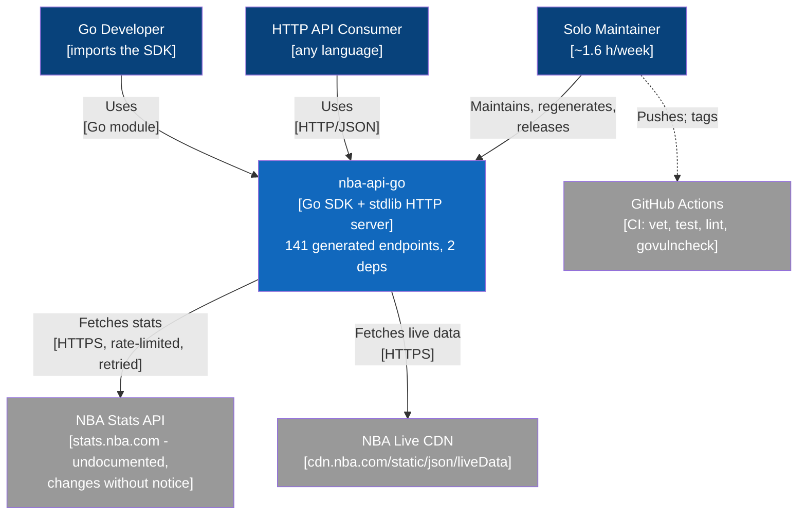
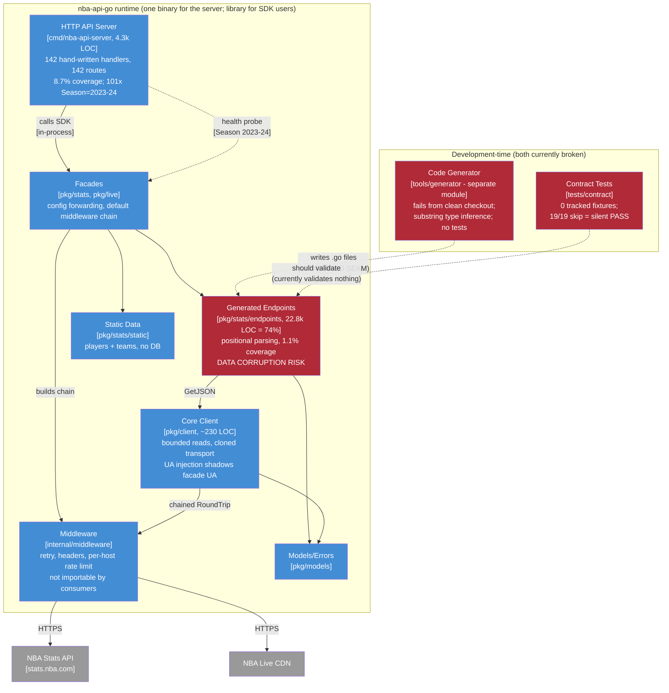

> **Superseded.** This assessed revision `2363f46` (grade C+). The current assessment of record is
> [`docs/MAINTAINABLE_ARCHITECT_V4_ASSESSMENT_2026-07-20_8549390.md`](../MAINTAINABLE_ARCHITECT_V4_ASSESSMENT_2026-07-20_8549390.md),
> covering revision `8549390` and later (grade B-). Retained here for history; see that document's
> section 4 ("What the prior assessment's plan got right, and where reality diverged") for what
> carried forward vs. what changed, and its verification ledger for the item-by-item status of every
> finding below.

# Maintainable-Architect-v4 Assessment: nba-api-go

**Date:** 2026-07-19
**Revision assessed:** `2363f46` (`main`, = `v1.2.0` + 6 CI/tooling commits), go1.26.5 darwin/arm64
**Assessor:** maintainable-architect-v4
**Method:** Synthesis of two prior reviews plus direct verification of every load-bearing claim against source at HEAD (file reads, greps, `go test ./...`, `go vet ./...`, `go test -race` on core packages, `go test -cover`, a clean `git archive` contract-test run, and an attempted generator dry run). No production code, CI, or docs were modified other than creating this file.

**Input documents:**

1. `docs/REPOSITORY_ASSESSMENT_2026-07-19_2363f46.md` - direct repository review of exactly this revision, same date (grade C+).
2. `external-v1.2.0-senior-review.md` - external consumer-perspective senior review of the `v1.2.0` tag (`733f990`), rating 7.2/10 (session artifact, not in-repo; path at review time: `/private/tmp/claude-501/-Users-username-dev-nba-api-go/bd734adf-a31d-4f6b-89f2-bd02dc1faeab/scratchpad/external-v1.2.0-senior-review.md`).

Prior in-repo assessments for context: `docs/MAINTAINABILITY_ASSESSMENT_2026-07-19.md` (v1.1.7, maintainable-architect-v4, grade B-), `docs/REPOSITORY_REVIEW_2026-07-19.md` (v1.1.7).

---

## 1. Executive verdict

**Grade: C+.** The hand-written core (~2,100 LOC across `pkg/client`, `internal/middleware`, `pkg/models`, and the two facades) is genuinely good boring Go: two direct dependencies, cloned default transport, bounded reads, protocol-aware retries, race-clean tests, a non-root container. If the project were only that core, it would grade A-.

It is not only that core. 74% of the codebase (22,787 of 30,747 non-test LOC) is generated endpoint code whose headline promise - "type-safe access to 141 endpoints" - is verifiably false for a meaningful subset of fields: player display names are typed `float64` and silently become `0`, textual range buckets are typed `int` and silently become `0`, and decimal shooting percentages are typed `string` and silently become `"0"`. The safety net that is supposed to catch this (contract tests) runs 19 tests that all skip in a clean checkout while the package reports `ok`. The tool that would fix it (the generator) fails from every documented invocation. And the v1.2.0 release broke public API in a minor version, shipped with a red CI run, and its changelog makes a compatibility claim the v1.1.7 tag disproves.

**The "Grade A (93/100), production-ready" claim in CLAUDE.md is not defensible.** It is a self-assessment from 2025-11-05 that predates the discovery of the type-corruption class of defects, and the repository's own newer v4 assessment (v1.1.7, 2026-07-19) already downgraded to B-. CLAUDE.md also contradicts itself internally (header says v1.2.0, "Version Information" section says 1.0.0) and points at three paths that no longer exist. A grade is only useful if it survives contact with the evidence; this one does not.

The one-sentence story: **an A-grade core wrapped in an unverified generated surface, with the verification layer switched off and release discipline slipping.** All of it is repairable by one person, but not silently within a 1.6 h/week budget - see section 7.

---

## 2. Verification ledger

Every finding below was checked against source at `2363f46`. Status legend:

- **CONFIRMED** - reproduced or read directly in source at HEAD
- **FIXED POST-TAG** - true at `v1.2.0`, no longer true at HEAD
- **CORROBORATED** - not independently re-executed, but consistent with strong in-repo evidence
- **CORRECTED** - directionally right, detail adjusted

### P0 - Product correctness and trust (my re-prioritization)

| # | Finding | Source | Status at HEAD | Evidence |
|---|---|---|---|---|
| 1 | Generated types silently corrupt data: display names as `float64`, range buckets as `int`, decimal stats as `string`; coercion helpers swallow every mismatch | Repo review (P1) | **CONFIRMED** | `pkg/stats/endpoints/commonallplayers.go:23-24,69-70` (`DISPLAY_FIRST_LAST float64` via `toFloat(row[2])`); `playerdashptshots.go:68,88,108,128` (`SHOT_CLOCK_RANGE int` etc. via `toInt(row[2])`); `leaguedashplayershotlocations.go` (`FG_PCT_RA string`, `FG_PCT_IN_PAINT string`); `types.go:14-51` (`toFloat`/`toInt` return 0 for strings, `toString` uses `%.0f` so 0.357 becomes "0") |
| 2 | Parsing is positional with no header/result-set-name validation; a reordered or inserted column shifts every later field without error | Repo review (P1) | **CONFIRMED** | 136 endpoint files index `rawResp.ResultSets[n]`; only 3 `.Name ==` checks exist across all generated files; rows mapped as `row[n]` |
| 3 | Contract tests are a no-op: zero fixtures tracked, all tests skip in a clean checkout, package reports `ok` | Repo review (P1) | **CONFIRMED (reproduced)** | `tests/contract/.gitignore` ignores `fixtures/*.json` (the "keep these" lines are commented out); `git ls-files` shows 0 tracked JSON fixtures; clean `git archive` run: **19/19 tests SKIP, package `ok`**. Note: 19 tests, not the 18 the input review stated |
| 4 | Fixtures record already-parsed SDK output, so replay validates the parser against its own output | Repo review (P1) | **CONFIRMED** | `tests/contract/endpoints_test.go:51-57` - record path calls the typed endpoint then `json.MarshalIndent(resp)`; raw `resultSets`/`headers`/`rowSet` are never preserved |
| 5 | Default Stats User-Agent is shadowed: every default-config request emits `nba-api-go/1.0`, not the browser UA the facade installs | External review (P0) | **CONFIRMED** - and it also affects `pkg/live`, which the external review did not flag | `pkg/client/client.go:94-96` injects `DefaultUserAgent` into stored headers at construction; `client.go:136-140` copies stored headers onto the request *before* `transport.RoundTrip` runs the chain; `internal/middleware/headers.go:35-37` (`WithUserAgent` only sets when absent); `pkg/live/live.go:42` uses the same pattern |

### P1 - Release discipline and maintenance machinery

| # | Finding | Source | Status at HEAD | Evidence |
|---|---|---|---|---|
| 6 | v1.2.0 broke public API in a minor release (`Headers map[string]string` to `http.Header`, `Timeout int` to `time.Duration`, `NewAPIError`/`HTTPStatusToError` gained a body param) | External review (P0) | **CONFIRMED** | `git show v1.1.7:pkg/stats/stats.go` shows `Headers map[string]string` / `Timeout int`; `git show v1.1.7:pkg/models/errors.go` shows the 4-arg/2-arg signatures; HEAD has the new shapes |
| 7 | CHANGELOG claims the old shapes "never appeared in a tagged release" - factually wrong | External review (P0) | **CONFIRMED** | `CHANGELOG.md:36-37,286` vs. the v1.1.7 tag content above. The nuance the changelog leans on (fields were ignored until v1.1.7-era commits) does not change *source* compatibility |
| 8 | The v1.2.0 tag commit's CI run failed at golangci-lint | External review (P0) | **CORROBORATED** | Tag's `ci.yml` used `golangci-lint-action@v6` + `version: latest` (resolves to a v1.x linter that refuses a go 1.26.5 module - documented in HEAD's own `ci.yml` comments); the two commits immediately after the tag (`805885b`, `c6c7da2`) are lint-action fixes. GitHub API not re-queried from this environment. Tags are immutable: v1.2.0 stays red forever |
| 9 | CI lint tooling unpinned | External review (P2) | **FIXED POST-TAG** | HEAD `ci.yml:34,44`: action `@v9`, linter pinned `v2.12.2`; Dependabot added (`2b3c401`). Residual: `govulncheck@latest` still unpinned (`ci.yml:50`); actions tag-pinned, not SHA-pinned |
| 10 | Generator cannot be run via any documented workflow | Repo review (P1) | **CONFIRMED (reproduced)** | `cd tools/generator && go run . -endpoint PlayerGameLog` fails: `open tools/generator/templates/endpoint.tmpl: no such file or directory` (`generator.go:106` resolves relative to CWD; no `go:embed`). Generator module has no tests; CI only builds it (`ci.yml:52-54`) |
| 11 | 101 HTTP handlers default `Season` to `"2023-24"`; the health probe uses it too | Repo review (P1) | **CONFIRMED (exact count)** | 101 `getQueryOrDefault(r, "Season", "2023-24")` calls across `handlers_{player,team,league,common,game}.go` (30+22+29+18+2); `healthcheck.go:74`. In 2026 this silently serves three-season-old data |
| 12 | `Config.Headers` aliased at construction: client mutates and shares the caller's map | External review (P1) | **CONFIRMED** | `client.go:90-96` mutates `config.Headers`, `client.go:109` stores it directly. (`SetHeaders` clones - `client.go:226-232` - the constructor does not) |
| 13 | `SetHeader`/`AddHeader`/`SetHeaders` race with in-flight requests | External review (P1) | **CONFIRMED (by inspection)** | `client.go:214-232` mutate `c.headers` unsynchronized while `Get` iterates it (`client.go:136-140`). Existing `-race` tests pass because no test mutates during flight |
| 14 | Built-in middleware locked under `internal/`, unconfigurable | External review (P1) | **CONFIRMED** | `WithRetry`, `RetryConfig`, `WithPerHostRateLimit`, header middlewares all in `internal/middleware`; only the assembled `DefaultMiddlewares()` closures are public |
| 15 | Any custom middleware silently replaces all defaults | External review (P1) | **CONFIRMED, mitigated by docs** | `pkg/stats/stats.go:63-67`, `pkg/live/live.go:60-64`; the replacement semantics are now clearly documented in both Config doc comments with the `append(DefaultMiddlewares(), ...)` recipe |
| 16 | No scheduled live drift workflow | External review (P1) | **CONFIRMED** | `.github/workflows/` contains only `ci.yml`, whose own comment says live tests "belong in a separate, scheduled workflow" - which does not exist |

### P2 - Server, observability, and configuration truth

| # | Finding | Source | Status at HEAD | Evidence |
|---|---|---|---|---|
| 17 | Server adapter is a hand-written duplication surface at 8.7% coverage | Repo review (P2) | **CONFIRMED** | 142 `handle*` methods on `StatsHandler` (not 141), 142 route cases, 4,257 LOC; `go test -cover`: server 8.7%, generated endpoints 1.1% |
| 18 | `requestsByPath` grows without bound; latency stats freeze after the first 1,000 requests | Repo review (P2) | **CONFIRMED** | `metrics.go:46-49` (every new path string stored forever), `metrics.go:51-53` (`if len < max { append }` - first-1,000 sample, not rolling). Mutex is held, so no data race - growth only |
| 19 | `/metrics` returns JSON while DEPLOYMENT.md claims Prometheus can scrape it | Repo review (P2) | **CONFIRMED** | `DEPLOYMENT.md:208-217` (prometheus.yml snippet) vs. `main.go:213` (`Content-Type: application/json`) and a JSON-tagged snapshot struct |
| 20 | `LOG_LEVEL` read but never used; `NBA_API_TIMEOUT` documented/composed but never read; CORS hard-coded `*` despite "configurable" claims | Repo review (P2) | **CONFIRMED** | `main.go:26,30` (logged once, filters nothing); `docker-compose.yml:13` + `docs/adr/002:224` vs. zero source references; `main.go:142-144` |
| 21 | Oversized *error* responses lose upstream status mapping (`ErrResponseTooLarge` instead of `APIError`) | External review (P2) | **CONFIRMED** | `client.go:152-165` - size check precedes status mapping |
| 22 | Base URL parsed per request, constructors return no error | External review (P2) | **CONFIRMED** | `client.go:183-197` (`buildURL` calls `url.Parse` every call) |
| 23 | Transport-error classification retries permanent failures (TLS, scheme, some DNS) | External review (P2) | **CONFIRMED** | `retry.go:96-98` - only `context.Canceled`/`DeadlineExceeded` are permanent |
| 24 | No `-race` in CI; no regeneration clean-tree check | External review (P2) | **CONFIRMED** | `ci.yml:27` plain `go test`; no regen/diff step. (Local `-race` on the five core packages passes) |
| 25 | `Error()` omits the diagnostic `Body` | External review (P2) | **CONFIRMED** | `errors.go:34-39` |
| 26 | Custom `HTTPClient` timeout precedence undocumented | External review (P2) | **CONFIRMED** | `client.go:52-88` - `Timeout` only shapes the internally built `http.Client`; stored but unused when `HTTPClient` is supplied |
| 27 | Active docs contain executable inaccuracies | Repo review (P2) | **CONFIRMED** | `CLAUDE.md` references `cmd/generator` (x4), `docs/DEPLOYMENT.md` (x2), `docs/PYTHON_MIGRATION.md` - none exist (actual: `tools/generator`, root `DEPLOYMENT.md`, `docs/MIGRATION_GUIDE.md`); `docs/README.md:35` links deleted `tests/http-api/README.md`; contract README claims fixtures are version-controlled |

### P3 - Cosmetic / bounded

| # | Finding | Source | Status at HEAD | Evidence |
|---|---|---|---|---|
| 28 | 140 endpoints construct response metadata as `(200, "", nil)` | Repo review (P3) | **CONFIRMED** | 140 files match `200, "", nil`; `GetJSON` discards `RawResponse` metadata |
| 29 | `RetryConfig` unvalidated; negative `MaxRetries` yields `(nil, nil)` | External review (P2) | **CONFIRMED, downgraded to P3** | `retry.go:47,91` - loop skipped, both returns nil. Type is `internal`-only and `DefaultRetryConfig` is sane, so no external caller can reach it today |
| 30 | CLAUDE.md self-contradicts on version and inflates counts | Neither review (net-new) | **CONFIRMED** | Header: "Current Status: v1.2.0"; Version Information: "Current Version: 1.0.0"; "14 examples" vs. 16 example dirs (15 Go programs per `make test-examples`); "Grade A (93/100)" vs. the repo's own B- (v1.1.7) and this C+ |

### Corrections to the input reviews

- Contract tests: **19** test functions all skip (input said 18).
- Server: **142** handler methods (input said 141); route cases 142 as stated.
- Positional parsing: **136** files (input said ~135).
- The "at least 59 string-typed decimal fields" count: not re-derived exactly; a conservative pattern (`RANGE|RATING|FREQUENCY|RATIO` as `string`) matches 49 declarations, and the `FG_PCT_*` string fields confirm the decimal-precision-loss class. Order of magnitude verified.
- External review scored "Type safety 8/10". That score was assigned from the API surface without inspecting generated parsing; findings #1-2 refute it. Where the two reviews conflict, the internal evidence wins.

---

## 3. C4 model

Rendered inline as Mermaid so this file is self-contained. If adopted as living documentation, these belong as numbered `.d2` sources under `docs/diagrams/c4/{context,container}/` per convention - creating those files is out of scope for this review.

### Level 1 - System context

### Level 2 - Containers (with trust-boundary annotations)

The architecture *shape* is right for a solo maintainer: modular monolith, one binary, in-process calls, no database. The problem is not the boxes - it is that the two red development-time boxes are the only things standing between an undocumented upstream API and 74% of the code, and both are switched off.

---

## 4. Reconciling the two input reviews

**They are complementary, not contradictory.** The external review looked at the client/API surface and release discipline of the tag; the internal review looked at the generated surface, server, and docs at HEAD. Their combined coverage is close to complete; their overlap is small.

**Where they agree** (and I confirm): middleware extensibility gaps (internal implementations, replacement semantics), missing scheduled drift detection, missing `-race` and regeneration checks in CI, and that the v1.2.0 core-client work (bounded reads, transport cloning, Retry-After, context handling, config forwarding) is a real, substantial improvement over v1.1.7.

**Where they conflict:** the external review's "Type safety 8/10" versus the internal review's "silent data corruption". Both cannot be true, and the source settles it: `DISPLAY_FIRST_LAST float64` is committed code. The external score measured the *shape* of the API (typed request/response structs - genuinely better than `map[string]interface{}`), not the *correctness* of what fills them. Lesson worth keeping: consumer-perspective reviews validate ergonomics, not data.

**What the post-tag commits fixed** (all six are CI/tooling): golangci-lint-action pinned and compatible (`805885b`, `c6c7da2`, `4f44f58`), checkout/setup-go bumped (`98d6d0e`), Dependabot added (`2b3c401`), stale comment fix (`2363f46`). This addresses exactly one external finding (unpinned lint tooling) and the *cause* of the red tag run - for future tags. Nothing else from either review is fixed at HEAD.

**What neither review caught** (net-new here): the Live facade suffers the same User-Agent shadowing as Stats; CLAUDE.md contradicts itself on the current version (v1.2.0 vs 1.0.0) within one file; the docs sprawl is worse than the internal review's list - there are *four* generations of maintainability assessment across *three* locations (root `MAINTAINABILITY.md` 2025-11-02, `docs/MAINTAINABILITY_ASSESSMENT.md` 2025-11-05, `docs/archive/MAINTAINABLE_ARCHITECT_ASSESSMENT.md`, `docs/MAINTAINABILITY_ASSESSMENT_2026-07-19.md`), plus root-level `MANUAL_REGENERATION_GUIDE.md` describing a workflow the broken generator cannot perform.

---

## 5. Where the complexity budget goes

**Well spent (keep and protect):**

- Core client + middleware + facades: ~2,100 LOC, 2 dependencies, stdlib server, no framework. This is the boring tech the whole project should be judged by.
- Real behavioral tests where they exist: retry/backoff/Retry-After, header idempotency, limiter concurrency, config-reaches-the-wire facade tests, endpoint inventory drift test. `go vet`, full unit suite, and `-race` on core packages all pass at HEAD.
- ADRs exist and are load-bearing (ADR 003 documents the transport decision with revisit conditions - exactly what ADRs are for).
- Static player/team data compiled in: no database to operate. Correct call.

**Leaking (this is where the grade went):**

- **22,787 LOC of generated code with 1.1% coverage and no offline verification.** Breadth without verification is not an asset; it is 74% of the codebase you cannot trust. The 43x generation productivity claim counted code written, not code verified.
- **4,257 LOC of hand-written server handlers duplicating the SDK.** 142 handlers x (parse params, default season, build request, call, wrap) at 8.7% coverage, with the same season literal pasted 101 times. This is mechanical code a registry should generate - or code that should not exist (see section 8).
- **Nonfunctional configuration surface:** `LOG_LEVEL` that filters nothing, `NBA_API_TIMEOUT` that nothing reads, "configurable" CORS that is hard-coded, a "Prometheus" endpoint that emits JSON. Every phantom knob costs debugging time at 2 a.m. - someone will turn it and observe nothing.
- **Documentation sprawl:** ~17 active docs plus archive, four generations of overlapping assessments, three stale paths in the primary orientation file. Scattered docs are scattered thoughts; here they actively mislead (CLAUDE.md sends you to `cmd/generator`).

---

## 6. Recommended order of work

Budget reality first: 1.6 h/week is ~6.5 h/month, ~21 h/quarter. The repair backlog below totals roughly 55-70 h. **Treat the repair as a project with a one-time budget, not as maintenance** - at maintenance pace alone this stretches across a year while corrupted data ships. Sequence and scope:

### Before any v1.2.1 tag (trust repairs, ~6-8 h)

1. **Fix User-Agent precedence** (~2 h): stop injecting `DefaultUserAgent` in `client.NewClient` (policy does not belong in the generic core); let each facade's middleware own the default; add one facade-level test asserting the final received `User-Agent`/`Referer`/`Accept` at an `httptest.Server`. Covers stats *and* live.
2. **Clone `Config.Headers` at construction** (~0.5 h): `client.go:90-109`. Cheap, removes the shared-map mutation class entirely.
3. **Correct the CHANGELOG** (~1 h): the v1.2.0 compat statement is false and it is in writing. State plainly that v1.2.0 contains narrowly scoped source breaks relative to v1.1.7, and add a known-issues note (UA shadowing, type defects).
4. **Add a "known type defects" section to the README** (~1 h): list the affected field families (display names, `*_RANGE` buckets, string-typed decimals). Honesty is cheaper than a support thread, and the real fix is breaking (item below), so users need the warning now.
5. **Pin `govulncheck`** (~0.5 h) and keep the lint pin. Process rule going forward: **tag only a commit whose CI run is green** - v1.2.0's red tag is permanent.
6. Stretch, if the hours exist (~2-3 h): commit 3-5 *raw* upstream fixtures and make missing required fixtures fail (not skip) in CI. Otherwise this is the first v1.3.0 item.

Explicitly **not** in v1.2.1: correcting the generated field types. Those are public struct fields; changing `float64` to `string` is source-breaking and belongs in a planned major, not a patch.

### v1.3.0 (verification infrastructure, ~20-25 h, one focused quarter)

1. **Make the generator runnable**: `go:embed` the templates, derive the output root explicitly, fix the documented commands, add unit tests for every `inferGoType` rule, run `go test` + lint for `tools/generator` in CI (~4-5 h).
2. **Real contract tests**: raw upstream fixtures (committed), replayed through `httptest.Server` into the actual endpoint functions; assert result-set names, column headers, and representative values; fail on missing fixtures in CI (~6 h). This is the single highest-value testing investment in the repository - it is the tripwire for both upstream drift *and* generator regressions.
3. **Centralize the season default**: one tested function with an injected clock (or make `Season` required at the HTTP boundary); 101 call sites become 1 (~3 h).
4. **Scheduled drift workflow**: weekly, small endpoint set, classifies CDN blocking separately from schema mismatch, updates a single issue (~3 h).
5. **CI hardening**: `-race` job on core packages, `apidiff` (or public-symbol snapshot) gate so semver breaks cannot ship unnoticed again, regeneration clean-tree check once the generator works (~3 h).
6. **Expose middleware configuration additively**: either promote implementations to `pkg/client/middleware` or add `stats.WithRetryConfig(...)`-style options; consider `AdditionalMiddlewares` so custom middleware stops silently disarming retries (~3 h).
7. **Docs consolidation** per section 7 (~3 h).

### v2.0.0 (the correctness release)

1. **Explicit per-field type metadata in the generator** (inference demoted to a reviewed bootstrap), regenerate all 141 endpoints with corrected types, and switch parsing to result-set-name keying with upstream-header validation that *errors* on mismatch instead of shifting columns. This is the release that makes "type-safe" true.
2. Immutable client: constructor options, `NewClient` returns `(client, error)` with the base URL parsed once, header setters removed.
3. Additive-by-default middleware semantics.
4. **Decide the server's fate** (section 8): generate handlers from a registry, or demote the server to an example. Do not carry 4.3k hand-written LOC into v2.
5. Real response metadata (or delete the placeholder fields - either is fine; lying fields are not).

---

## 7. Documentation consolidation plan

Current state: 17 files in `docs/` plus 6 in `docs/archive/`, plus 4 doc files at repo root beyond README/CHANGELOG/CONTRIBUTING. Four generations of maintainability assessment in three locations. Target: one active assessment, one active review, history in `archive/` with supersession banners, zero broken links.

| File | Action | Reason |
|---|---|---|
| `CLAUDE.md` (root) | **Fix now** | Stale paths (`cmd/generator` x4, `docs/DEPLOYMENT.md` x2, `docs/PYTHON_MIGRATION.md`), self-contradictory version (v1.2.0 vs 1.0.0), stale grade "A (93/100)", stale example count. This is the orientation file; wrong here is worse than missing |
| `docs/README.md` | Fix link | Links deleted `tests/http-api/README.md` |
| `MAINTAINABILITY.md` (root) | Archive | 2025-11-02 generation; superseded twice over; wrong location |
| `docs/MAINTAINABILITY_ASSESSMENT.md` | Archive | 2025-11-05 (v2 agent); superseded |
| `docs/MAINTAINABILITY_ASSESSMENT_2026-07-19.md` | Banner + archive | v1.1.7 assessment; accurate for its revision, stale for HEAD |
| `docs/REPOSITORY_REVIEW_2026-07-19.md` | Banner + archive | v1.1.7 review; several findings since fixed |
| `docs/REPOSITORY_ASSESSMENT_2026-07-19_2363f46.md` | Keep (current) | Same revision as this file; cross-referenced |
| This file | Keep (current) | Current v4 assessment of record |
| `docs/IMPROVEMENTS_COMPLETED.md`, `docs/IMPLEMENTATION_SUMMARY.md`, `docs/V1.0.0_RELEASE_SUMMARY.md`, `docs/RELEASE_NOTES_v1.0.0.md` | Archive | Historical status reports; CHANGELOG is the durable record |
| `docs/LINT_CLEANUP_PLAN.md` | Delete (or issue) | "Not started" tracking doc from 2026-07-09; plans that live in docs rot - track work in issues |
| `MANUAL_REGENERATION_GUIDE.md` (root) | Archive after generator fix | Describes a manual workaround for the broken generator; fixing the generator obsoletes it |
| `tests/contract/README.md` | Rewrite with fix | Claims fixtures are version-controlled; they are not |
| `docs/adr/` (001-003) | Keep; amend 002 | ADR 002 documents `NBA_API_TIMEOUT`, which nothing reads - amend or implement |
| `docs/BENCHMARKS.md`, `docs/MIGRATION_GUIDE.md`, `docs/API_USAGE.md`, `docs/MAINTENANCE.md`, `docs/RELEASE_CHECKLIST.md`, `DEPLOYMENT.md` | Keep; audit claims | `DEPLOYMENT.md` needs the Prometheus claim fixed and the Go 1.21 Dockerfile example bumped to match `go.mod` (1.26.5); `API_USAGE.md` documents the stale season default |

Going forward, adopt the `NNNN-` numbering convention for new assessments and ADRs so "which is current" stops being archaeology. One rule prevents this entire section from recurring: **when a new assessment lands, the superseded one moves to `archive/` in the same commit.**

---

## 8. Is this too complex for one person?

**The core: no - it is a model of what one person should run.** ~2,100 LOC, 2 dependencies, no database, one binary, boring stdlib patterns throughout. Weekly ops on that core genuinely fits 1.6 h/week.

**The full system as currently built: yes, at the edges - not in size but in unverified surface.** One person cannot hand-verify 141 endpoints x N fields against an undocumented upstream, plus 142 hand-written handlers, on 96 minutes a week. Nobody can; that is what the automation was for, and the automation is switched off (contract tests skip, generator broken, drift workflow absent). The current state is the worst of both worlds: generated breadth with hand-maintained trust.

Two honest ways to make it one-person-sized again:

1. **Automate the trust** (the v1.3.0/v2.0.0 plan): working generator with explicit types, raw-fixture replay, drift alerts, registry-generated handlers. Then the 74% generated surface costs near-zero marginal attention, and the claimed ~1.6 h/week becomes real again.
2. **Shrink the surface**: the HTTP server doubles the per-endpoint surface for an audience that may not exist (it is a thin proxy any consumer could write from the SDK in an afternoon). If no measured users depend on it, demoting it to an example deletes 4,257 LOC and 142 test obligations. Deleted code has no bugs. Measure first - then delete.

Do either (ideally the first, considering the second) and this is comfortably a one-person project. Do neither and the maintenance estimate is fiction: the gap will be paid as incident response, at 2 a.m., in the currency of user trust.

---

## 9. Bottom line

v1.2.0's engineering direction is right and the core improvements are real - both input reviews agree on that, and verification bears it out. But at revision `2363f46` the project's central promise (type-safe, verified access to 141 endpoints) is not yet true: types are wrong in committed source, the verification layer verifies nothing, the generator cannot run, and the release process shipped a semver break with a red CI run and an incorrect changelog claim. Grade **C+**: an A-grade core that has not yet earned trust at its most important boundary. The path back is short, boring, and entirely within one person's reach - fix the trust seam first (v1.2.1), rebuild the verification machinery (v1.3.0), then make the types true (v2.0.0) - and update CLAUDE.md's grade only when the contract tests can fail.

---

*Assessment of record for revision `2363f46`, 2026-07-19. Supersedes `docs/MAINTAINABILITY_ASSESSMENT_2026-07-19.md` (v1.1.7) as the current maintainability assessment. Companion document: `docs/REPOSITORY_ASSESSMENT_2026-07-19_2363f46.md` (same revision, direct review).*
