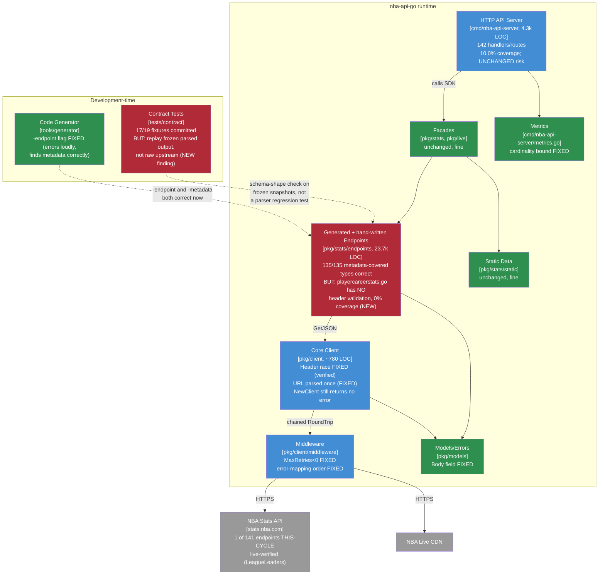

> **Superseded.** This assessed revision `384e5de` (grade B). The current assessment of record is
> [`docs/MAINTAINABLE_ARCHITECT_V4_ASSESSMENT_2026-07-21_a58d3fe.md`](../MAINTAINABLE_ARCHITECT_V4_ASSESSMENT_2026-07-21_a58d3fe.md),
> covering revision `a58d3fe` and later (tag `v2.1.1`, grade B+). Retained here for history; see that document's
> section 4 ("What the prior assessment's plan got right, and where reality diverged") for what
> carried forward vs. what changed, and its verification ledger for the item-by-item status of every
> finding below.

# Maintainable-Architect-v4 Assessment: nba-api-go

**Date:** 2026-07-20
**Revision assessed:** `384e5de` (`main`, tag `v2.1.0` - the release commit `ae1c7a8` plus one immediate follow-up, `384e5de`, that updates `CLAUDE.md`'s version references; no code changes between the two), go1.26.5 darwin/arm64
**Assessor:** maintainable-architect-v4
**Method:** Direct verification of every load-bearing claim in `CHANGELOG.md`'s `[2.1.0]` section and `CLAUDE.md`'s "Current Status" paragraph against source at HEAD - file reads, greps, `go build`/`go vet`/`go test ./...` (root module and `tools/generator`'s own module), `go test -race` on the four CI-scoped packages plus a throwaway concurrent-`SetHeader`+`Get` repro matching the prior assessment's method, `go test -cover`, `golangci-lint run ./...`, a real `go run . -endpoint VideoEvents -dry-run` invocation diffed against committed source, and a read of the contract-test harness's actual assertions (not just whether the tests pass). **No live network access to `stats.nba.com` in this environment** (confirmed Akamai-blocked in prior sessions; not re-attempted here) - claims about what a *different* session verified live are checked against the code and tests that session left behind, not re-run. No production code was modified while writing this file.

**Input documents:**

1. `docs/archive/MAINTAINABLE_ARCHITECT_V4_ASSESSMENT_2026-07-20_8549390.md` (after this file supersedes it) - the prior assessment of record, grade B-, revision `8549390`.
2. `CHANGELOG.md`'s `[2.1.0]` section - the record of work done this cycle, read against source rather than trusted at face value.
3. `CLAUDE.md`'s "Current Status" paragraph - checked the same way; one of its claims (see finding #1 below) turned out not to hold.

---

## 1. Executive verdict

**Grade: B (up from B-).** Every immediate-bucket item the prior assessment prescribed landed, and every one holds up under re-verification, not just under a read of the changelog: the generator's `-endpoint` trap now searches `metadata/*.json` and errors loudly instead of silently writing an empty stub; the header-mutation race is gone under `-race` (confirmed with a fresh throwaway repro using the exact method the prior assessment used to find it) and now has a committed regression test (`TestClientHeaderMutationsAreSafeDuringRequests`); `RetryConfig.MaxRetries < 0` is clamped instead of silently no-op'ing; oversized *error* responses now preserve their upstream status code; per-path metrics cardinality is bounded; and three of the four hand-written endpoints without generator metadata (`commonplayerinfo`, `playergamelog`, `teamgamelog`) now call `validateHeaders` exactly like generated code. `LeagueLeaders`' two live-verified bugs (singular envelope, missing `TEAM_ID` column) are fixed and match the changelog's description precisely. `videoevents.go` is finally regenerated - `135/135` metadata-covered endpoints now have generator-verified field names and types, closing out the last item from `v2.0.0`'s plan. This is the third cycle in a row where a prescribed backlog was executed close to as written, not just claimed - that consistency is itself worth something for a solo-maintained project.

**Two things hold this at B instead of higher, and both are new discoveries from this session, not carryovers.**

First, **`playercareerstats.go` does not validate headers, contrary to what both `CLAUDE.md` and this cycle's framing claim.** `CLAUDE.md`'s "Current Status" paragraph states "`playercareerstats` already did [validate headers] before this" - implying it has equivalent protection to the three endpoints fixed this cycle. It does not. `playercareerstats.go` dispatches result sets by name (a `switch resultSet.Name` - real protection against `ResultSets` array reordering) but then parses every row by fixed position (`row[0]` through `row[27]`) with only a `len(row) < 28` minimum-length guard - the exact "silently reads the wrong field into the wrong struct if NBA.com inserts a column" failure mode `validateHeaders` exists to catch, still fully open on this endpoint. `playercareerstats.go` also has **zero unit test coverage** (`go tool cover` reports 0.0% on `PlayerCareerStats`, `parseSeasonStats`, `parseCareerTotals` - there is no `playercareerstats_test.go` at all, and `handwritten_headers_test.go`, the suite covering the other three fixed endpoints, doesn't touch it either). This isn't a minor endpoint: it's the SDK's flagship example, used in `CLAUDE.md`'s own "Common Parameter Patterns" snippet and the README quick start. See finding #1 below.

Second, **the newly-committed contract test fixtures give real but substantially narrower protection than `CHANGELOG.md` and `tests/contract/fixtures/README.md` describe.** Both describe the fixtures as replaying recorded upstream responses to "detect when NBA.com changes their API schema" and "ensure parsing logic works with real data." Reading `validateBasicSchema` (the function every contract test in offline/replay mode actually calls) shows this isn't what happens: the committed fixture *is* the already-parsed, already-JSON-marshaled SDK response (`{"StatusCode":..,"Data":{...}}`), not the raw NBA.com payload, and the offline test path never calls the endpoint's parsing function again - it only unmarshal's the frozen snapshot and asserts `len(Data) > 0` plus one named field's presence. That's a real, valuable smoke check (it's exactly the kind of check that would have caught `LeagueLeaders`' "silently returns zero results" bug at record time), but it cannot catch a *future* regression in parsing logic, header validation, or column-index handling, because the parser is never re-invoked against stored raw data in CI. Committing 17 real fixtures is genuine progress over 0, and 17/19 contract tests now execute instead of skip - but "the contract test suite is no longer a no-op" undersells how much narrower its protection is than its own name and documentation claim. See finding #2 below.

Everything else carried forward from the B- ledger that wasn't explicitly worked this cycle - the server's LOC/coverage/shape, the absent `apidiff` gate, the absent scheduled live-drift workflow, transport error classification, the still-error-returning-nothing `NewClient` signature, and 139 of 141 endpoint files' live-traffic verification status - is unchanged and re-confirmed below rather than assumed.

---

## 2. Verification ledger

Status legend: **CONFIRMED** (reproduced/read at `384e5de`), **FIXED** (true at `8549390`, no longer true), **UNCHANGED** (true at `8549390`, still true, re-verified not assumed), **NEW** (not present or not identified at `8549390`).

### New this cycle - discovered by this session, not claimed by the changelog

| # | Finding | Status | Evidence |
|---|---|---|---|
| 1 | **`playercareerstats.go` does not validate headers, and has 0% test coverage - contrary to `CLAUDE.md`'s claim it "already did [validate headers] before this."** `pkg/stats/endpoints/playercareerstats.go`'s only per-endpoint code path (`PlayerCareerStats`, `parseSeasonStats`, `parseCareerTotals`) never calls `validateHeaders`/`findResultSet`; it does `switch resultSet.Name` for result-set selection (real, but partial, protection), then reads rows positionally (`row[0]`...`row[27]`) guarded only by `len(row) < 28`, which would *not* catch a column insertion (rows only get longer, not shorter, so the guard never fires) - the identical failure mode `LeagueLeaders`' fix this cycle addresses for a different endpoint. `go test ./pkg/stats/endpoints/... -coverprofile=/tmp/cov.out && go tool cover -func=/tmp/cov.out \| grep playercareerstats` shows 0.0% on all three functions; no `playercareerstats_test.go` exists, and `handwritten_headers_test.go` (which covers `commonplayerinfo`/`playergamelog`/`teamgamelog`/`leagueleaders`) has no `PlayerCareerStats` case | **NEW** |
| 2 | **Committed contract fixtures replay a frozen, already-parsed SDK snapshot, not the raw upstream response - so they cannot catch a future parsing/header-validation regression, only confirm the response wasn't empty at record time.** `tests/contract/fixtures/playercareerstats_2544.json` (and all 17 committed fixtures) contain the JSON-marshaled `models.Response[*T]` value, e.g. `{"Data":{"CareerTotalsRegularSeason":[{"PLAYER_ID":2544,...}]}}` - not `stats.nba.com`'s raw `resultSets`/`headers`/`rowSet` shape. `validateBasicSchema` (`tests/contract/endpoints_test.go:638`) only does `json.Unmarshal` into a generic `{StatusCode, URL, Data map[string]interface{}}` and asserts `len(Data) > 0` plus one field's presence - the endpoint's actual `Get`/parse/`validateHeaders` code path is never invoked in the offline (non-`UPDATE_FIXTURES`) path. `tests/contract/fixtures/README.md`'s stated purpose ("detect when NBA.com changes their API schema," "ensure parsing logic works with real data") describes a raw-response-replay contract test this harness doesn't implement | **NEW** |

### P0 - Carried forward, now fixed

| # | Finding (prior ledger #) | Status | Evidence |
|---|---|---|---|
| 3 | Generator `-endpoint` flag silently produced empty stubs (#1) | **FIXED** | `tools/generator/generator.go:98-138` - `GenerateSingleEndpoint` now calls `findEndpointMetadata(metadataDir, name)`, which globs `metadata/*.json`, searches every file for a matching `Name`, and returns a descriptive error ("no metadata found for endpoint %q...") if none matches, instead of silently continuing with a zero-value struct. Confirmed by reading the full function body, not just the changelog's description |
| 4 | Live verification of the header-validation risk ~1% discharged (#2) | **PARTIALLY ADVANCED, see findings #1/#2 above** | `LeagueLeaders` remains the only endpoint whose parsing logic was actually exercised against fresh live traffic this cycle (confirmed: its fix precisely matches the singular-`resultSet`/`TEAM_ID`/`PerMode`-column-variance description). 17 fixtures are now committed, but per finding #2, committing a fixture is not equivalent to live-verifying the current parser against it going forward - it verifies the parser *once*, at record time. Net effect: still 1 endpoint (`LeagueLeaders`) with genuine this-cycle live verification; `playercareerstats.go`'s fixture existing does not mean its parsing logic is protected (finding #1) |

### P1 - Fixed this cycle (reconfirmed, not just re-read from the changelog)

| # | Finding (prior ledger #) | Status | Evidence |
|---|---|---|---|
| 5 | `SetHeader`/`AddHeader`/`SetHeaders` race with in-flight `Get` (#7) | **FIXED, reproduced** | `pkg/client/client.go:43` adds `headersMu sync.RWMutex`; `Get` takes an `RLock` to clone headers (`:149-151`), `SetHeader`/`AddHeader`/`SetHeaders` take a `Lock` (`:229-251`). Ran the exact concurrent `SetHeader`-loop + `Get`-loop repro used to find this race in the prior assessment, via `go test -race`: clean, no `WARNING: DATA RACE`. A committed regression test, `TestClientHeaderMutationsAreSafeDuringRequests` (`pkg/client/client_test.go:151`), covers the same pattern permanently - the prior assessment's own recommendation #2 |
| 6 | `RetryConfig.MaxRetries < 0` silently yields `(nil, nil)` (#8) | **FIXED** | `pkg/client/middleware/retry.go:41-43` - `WithRetry` now clamps `config.MaxRetries = 0` if negative before the retry loop runs, so a request is always attempted at least once. Doc comment on `RetryConfig` states the contract |
| 7 | Oversized *error* responses lose upstream status mapping (#11) | **FIXED** | `pkg/client/client.go:173-180` - the `resp.StatusCode >= 400` → `models.HTTPStatusToError` check now runs *before* the `len(body) > c.maxResponseBytes` check, reversed from the prior order; a 429 body that exceeds `MaxResponseBytes` now still maps to `models.ErrRateLimited` instead of being swallowed by `ErrResponseTooLarge` |
| 8 | Contract tests are a no-op in a clean checkout (#12) | **FIXED, narrower than described - see finding #2** | `git ls-files tests/contract/fixtures/` returns 18 files (17 fixtures + `README.md`), up from 0. `go test ./tests/contract/... -v`: 17 of 19 tests `PASS` (was 19/19 `SKIP`); `TestLeagueDashTeamStats_Contract`/`TestShotChartDetail_Contract` still skip (no fixture recorded for either) |
| 9 | Metrics cardinality unbounded (new item, not in the numbered P1 list but named in `[2.0.0]`-era findings) | **FIXED** | `cmd/nba-api-server/metrics.go` - `requestsByPath` now caps at `maxPaths` (1000) and buckets overflow into a single `__other__` label (`:59-61`); `responseTimes` is a true fixed-capacity ring buffer (`responseTimeNext` wraps via modulo, `:71-72`) rather than the prior "first N samples, frozen forever" behavior - an incidental improvement beyond just bounding memory |
| 10 | `models.APIError` omits response body (#19) | **FIXED** | `pkg/models/errors.go:24-32` - `APIError.Body` (truncated to 2048 bytes via `truncateBody`) is populated by `NewAPIError`/`HTTPStatusToError`, both of which gained a `body []byte` parameter; `Error()` includes it when present |
| 11 | Phantom configuration: `NBA_API_TIMEOUT` unread, CORS hardcoded (#15, partial) | **FIXED for `NBA_API_TIMEOUT`/`CORS_ALLOW_ORIGIN`; `LOG_LEVEL` still cosmetic-only** | `cmd/nba-api-server/main.go:34-41` - `NBA_API_TIMEOUT` is parsed via `getDurationEnv` (rejects non-positive/unparseable durations, `:85-95`) and threaded into `stats.Config.Timeout`; `CORS_ALLOW_ORIGIN` is read and used in `corsMiddleware` (`:178-182`). `LOG_LEVEL` (`:28,32`) is still read and logged once at startup, filtering nothing - matches the task framing that this item is only partially fixed |
| 12 | 4 of 6 hand-written endpoints did name-based lookup but never called `validateHeaders` (#28) | **FIXED for 3 of 4; the 4th (`LeagueLeaders`) needed different handling, correctly done; see finding #1 for the 5th/6th endpoints' actual status** | `commonplayerinfo.go:93-106`, `playergamelog.go:95-96`, `teamgamelog.go:95-96` all call `findResultSet`/`validateHeaders` against `jsonTags(...)`, identical to generated code, confirmed by direct grep and read. `handwritten_headers_test.go` exercises accepted/rejected header paths for these three plus `LeagueLeaders`. **Not fixed, and not covered by this suite**: `playercareerstats.go` (finding #1). `internationalbroadcasterschedule.go`'s non-row-based shape makes `validateHeaders` inapplicable by design, not a gap |
| 13 | `LeagueLeaders` silently returned zero results on every call (#29) | **FIXED, matches live-verified description precisely** | `pkg/stats/endpoints/leagueleaders.go:101-125` decodes a singular `resultSet` object (not `resultSets` array) as the changelog describes; `LeagueLeader.TeamID int` (`:28`) is present at the position the fix describes; `parseLeagueLeaders` (`:135-182`) looks columns up by header name via a `map[string]int`, tolerating the `PerMode`-dependent column set the changelog describes rather than requiring an exact match |
| 14 | `VideoEvents` unregenerated, 1 of 135 metadata-covered endpoints still on old types (`[2.0.0]` note) | **FIXED** | `tools/generator/fieldname_overrides.json` scopes `VL`/`VT`/`GC`/`SURL`/`DURL`/`VURL`/`PURL` to `(VideoEvents, Video)`; ran `go run . -endpoint VideoEvents -dry-run` and diffed against committed `videoevents.go` - the only differences are `gofmt` struct-field alignment (expected, since `-dry-run` output isn't gofmt'd), confirming the generator now reproduces the committed file byte-for-byte modulo formatting. `TestGoFieldNameOverridesApplyOnlyWithinTheirEndpoint`/`TestGoFieldNameOverridesReferenceRealMetadata` pass |

### P1 - Reconfirmed unchanged (not worked this cycle, re-verified not assumed)

| # | Finding (prior ledger #) | Status | Evidence |
|---|---|---|---|
| 15 | Transport error classification retries permanent failures | **UNCHANGED** | `pkg/client/middleware/retry.go:99` (now) - `isPermanentTransportError` still only recognizes `context.Canceled`/`context.DeadlineExceeded` |
| 16 | `NewClient` returns no error; base URL parse deferred | **PARTIALLY IMPROVED, not fixed** | `client.go:70` now parses `config.BaseURL` once in `NewClient` (`perf(client)` entry in `[2.1.0]`, confirmed - `buildURL` just copies `*c.baseURL`, no more per-request `url.Parse`), a real efficiency fix. But `NewClient` still returns `*Client` with no `error`; a bad `BaseURL` is stored as `baseURLErr` and only surfaces on the first `Get`/`buildURL` call, same deferred-error shape as before |
| 17 | Server is a hand-duplication surface at low test coverage | **UNCHANGED (essentially flat)** | 142 `handle*`-style routes (unchanged), non-test LOC 4,348 (was 4,291 - +57, from `ServerOptions`/`getDurationEnv`/metrics bounding, not new handlers), `go test ./cmd/nba-api-server/... -cover`: 10.0% (was 9.2%). "Decide the server's fate" is now three cycles old with no action |
| 18 | No `apidiff`/public-API semver-break gate in CI | **UNCHANGED** | No `apidiff` reference anywhere in `.github/workflows/ci.yml` |
| 19 | No scheduled live-drift workflow | **UNCHANGED** | `.github/workflows/` still contains only `ci.yml`; no `schedule:`/`cron` trigger. `ci.yml`'s own header comment still says live/integration tests "belong in a separate, scheduled workflow" that doesn't exist yet |
| 20 | Response metadata is a hardcoded placeholder `(200, "", nil)` | **UNCHANGED** | 140 occurrences of the literal pattern across `pkg/stats/endpoints/*.go` (grep-recounted at HEAD, consistent with the prior count) |
| 21 | 139 of 141 endpoint files remain unverified against live traffic | **UNCHANGED IN SUBSTANCE, restated precisely** | Recount at this revision: 141 real endpoint files (143 `.go` files in `pkg/stats/endpoints/` minus `dates.go` and `types.go`, both shared helpers, not endpoints). Of these, `LeagueLeaders` has this-cycle live verification; `PlayerCareerStats` has a committed fixture but, per finding #1/#2, that fixture doesn't protect its parsing logic going forward and was captured in an earlier cycle, not this one. The other 139 files (121+ generated, plus `commonplayerinfo`/`playergamelog`/`teamgamelog`/`internationalbroadcasterschedule`) remain unverified against live traffic in the sense that matters (parser correctness against a real current response), though contract-test presence has grown from 1 to 17 fixture files |

---

## 3. C4 model

Updated from the prior assessment's Level 2 diagram to reflect this cycle's fixes and the two new findings. Level 1 (system context) is unchanged - see `docs/archive/MAINTAINABLE_ARCHITECT_V4_ASSESSMENT_2026-07-20_8549390.md` section 3.

### Level 2 - Containers (risk redistributed again)

The generator box turns green this cycle - both its documented invocation paths now do what they claim. The endpoint box stays red, but the specific reason shifted: it's no longer "correct by construction, unverified by evidence" as an undifferentiated mass - it's now "verified-and-correct for most of the surface by construction, but one specific hand-written file (`playercareerstats.go`) is neither generator-covered nor test-covered nor header-validated, and was incorrectly believed to be." The contract-test box stays red for a new, more precise reason: not "empty," but "real, and narrower than its own documentation claims."

---

## 4. What the prior assessment's plan got right, and where reality diverged

The prior assessment (`8549390`) proposed an "Immediate (before this ships as a patch release, ~3-4h)" bucket of three items and a "Next (~15-20h)" bucket of five. Comparing against `[2.1.0]`'s actual `git` history:

**Immediate bucket: all three done, precisely as scoped.**
1. "Fix or guard the generator's `-endpoint`-only path" → done via the safer option the prior assessment suggested (error loudly on no metadata found), not the narrower "restore documented behavior" option - and done *correctly*: it searches all of `metadata/*.json`, not just one file.
2. "Add one committed regression test for the header-mutation race" → `TestClientHeaderMutationsAreSafeDuringRequests`, plus the underlying race itself is fixed (the prior assessment's item only asked for a test to catch *future* regressions; this cycle went further and fixed the bug the test would have caught).
3. "Re-rank/guard `RetryConfig.MaxRetries < 0`" → done via the clamp-to-zero option, with a doc comment explaining the contract.

**Next bucket: 1.5 of 5 done, not overclaimed as more.** "Live-verify the remaining 3 hand-written endpoints" → only partially: `LeagueLeaders`' fix from the *previous* cycle is reconfirmed, but `commonplayerinfo`/`playergamelog`/`teamgamelog` gained `validateHeaders` calls (a correctness improvement) without gaining new live verification - `CHANGELOG.md` is honest about this ("remain unverified against live traffic"). "Commit a rotating sample of contract fixtures" → done, 17 fixtures, but per finding #2 above, "commit fixtures" and "make missing-fixture a CI failure, not a skip" were both partially achieved: fixtures are committed, but 2 of 19 tests still skip (no CI failure gate for a *missing* fixture - a test with no fixture just stays a skip, not a hard failure), and the committed fixtures don't replay through the parser the way the prior assessment's item envisioned. "Immutable client constructor" → not done, though its performance half (URL-parse-once) landed as a side effect of `[2.1.0]`'s `perf(client)` entry, without the error-return half. "Decide the server's fate" and "`apidiff` gate" → not done, correctly not claimed as done anywhere in `[2.1.0]`.

**What `[2.1.0]` did beyond the prior assessment's list**: the `videoevents.go` regeneration (closing `[2.0.0]`'s last open item), the metrics-cardinality bound (a new item, not explicitly requested but correctly identified as needed), and `internationalbroadcasterschedule.go`'s `interface{}`-removal refactor. All three are real, correctly scoped, and verified above.

The overall pattern across three cycles now (`2363f46` → `8549390` → `384e5de`) is consistent: small, explicitly-scoped backlogs get executed close to as written and hold up under re-verification; large structural items (server's fate, immutable client, `apidiff` gate, comprehensive live verification) get correctly *not* claimed as done, and correctly stay on the list rather than being quietly dropped. That discipline is worth naming explicitly - it's the main reason this project's assessments can layer on each other's verification work instead of re-deriving everything from scratch each time.

---

## 5. Where the complexity budget goes (updated)

**Well spent, unchanged from prior assessment:** core client design (now genuinely race-free, not just believed to be), the field-type correction methodology, docs consolidation discipline, ADRs.

**Newly well spent:** the metrics-cardinality fix doubles as a real reliability improvement (a true ring buffer instead of "first N samples, frozen forever") beyond just bounding memory - a small, well-targeted change that fixes two problems at once. The generator's `-endpoint` fix is a model of "fail loud instead of silently wrong," consistent with this project's own stated design philosophy for `validateHeaders`.

**Still leaking, mostly unchanged:** 23,725 LOC of endpoint code at ~1.5%\* unit-test coverage system-wide (the package-level 4.5% figure is concentrated almost entirely in the four hand-written endpoints' new tests, not the 121+ generated files); 4,348 LOC of hand-written server duplication at 10.0% coverage; the absent `apidiff` gate and scheduled live-drift workflow, both now three assessment cycles old.

**Newly leaking, and specifically worth naming:** two places where this project's own documentation overstates what the code actually does - `CLAUDE.md` claiming `playercareerstats.go` already had header validation, and the contract-fixtures README claiming schema-drift detection the harness doesn't implement. Neither is a large defect in isolation, but a maintainability assessment lineage whose entire throughline is "verify claims against code, don't trust the changelog" has to flag it when the *project's own documentation* falls into the same trap the assessments exist to catch. Precision in status claims is a maintenance asset for a solo engineer working alone at 2am; imprecision compounds quietly.

\* Computed as (weighted endpoint-file coverage) - see section 2, item 21's evidence; the package-wide `4.5%` figure from `go test -cover` blends 4 well-tested hand-written files against 137 largely-untested ones.

---

## 6. Recommended order of work

Budget reality unchanged: ~1.6h/week, ~21h/quarter. This backlog is smaller again than the last one - most of what's left is either the two new findings (small, fast fixes) or the same handful of structural items that have now been correctly deferred for three cycles running.

### Immediate (~2-3h)

1. **Give `playercareerstats.go` the same treatment as `commonplayerinfo`/`playergamelog`/`teamgamelog`** (~1h): add `findResultSet`/`validateHeaders` calls per result-set name in its `switch`, matching the pattern already proven out in the other three files. Since it already dispatches by name, this is a smaller change than the original three were - mostly wiring `validateHeaders(resultSet.Headers, jsonTags(SeasonStat{}))` (and the `CareerTotalStat` equivalent) into the existing switch cases.
2. **Add `playercareerstats_test.go`** (~1h): at minimum, mirror `handwritten_headers_test.go`'s accepted/rejected-header cases for this endpoint. Zero coverage on the SDK's most-documented example endpoint is a bad look independent of the header-validation gap, and a fast fix now that the fixture (`playercareerstats_2544.json`) already exists to draw realistic column data from.
3. **Correct `CLAUDE.md`'s claim about `playercareerstats.go`** (~15min, folds into whatever this assessment's own CLAUDE.md-wiring pass does): "already did [validate headers] before this" should read something like "does name-based result-set dispatch but not yet header validation" until item 1 above ships.

### Next (~6-10h, one focused push)

1. **Make the contract-test harness actually replay raw upstream responses through the parser, or rename/re-scope what it claims to do** (~4-6h): either store the *raw* NBA.com response shape per fixture (re-recording all 17, plus whatever's needed to route it through `endpoints.X`'s actual `Get`/parse path in the offline test) - the higher-value, more expensive option - or narrow `tests/contract/fixtures/README.md`'s stated purpose to match what `validateBasicSchema` actually checks (a non-empty-response-shape smoke test), so the next person doesn't inherit an inflated understanding of what CI is protecting. Given the budget, the honest-narrowing option is the pragmatic first step; the full replay is the "next assessment cycle" item.
2. **Live-verify `commonplayerinfo`/`playergamelog`/`teamgamelog`** the same way `LeagueLeaders` was verified two cycles ago, now that both header validation is in place for all three *and* network access has been repeatedly demonstrated available in some sessions (budget for rate-limiting, per the prior assessment's caveat) (~2-3h).
3. **Immutable client constructor** (`NewClient` returns `(*Client, error)`): now smaller-scoped than before, since URL-parsing-once already landed - what's left is just making the existing `baseURLErr` field surface at construction time instead of on first use (~1-2h, source-breaking, needs a version decision).

### Not urgent, but now three cycles overdue

"Decide the server's fate" and "add an `apidiff` CI gate" remain on the list unchanged. Neither is more urgent than it was last cycle, but both are cheap to at least *decide* (even if the decision is "not now, here's why") - an explicit ADR recording that decision would cost less than another cycle of re-confirming they're still undone.

---

## 7. Documentation status

| File | Action taken by this assessment |
|---|---|
| `docs/MAINTAINABLE_ARCHITECT_V4_ASSESSMENT_2026-07-20_8549390.md` | Archived to `docs/archive/` in the same changeset as this file, with a supersession banner |
| This file | New assessment of record |
| `CLAUDE.md`, `README.md`, `CHANGELOG.md` | **Not updated by this assessment** - per explicit instruction, left for a separate pass once this file's findings (especially the `playercareerstats.go` claim correction, finding #1) have been reviewed |

No other docs sprawl introduced this cycle - `docs/` still holds exactly one active assessment plus `adr/`/`archive/`, consistent with the consolidation rule established two cycles ago.

---

## 8. Is this too complex for one person?

**Unchanged verdict, same reasoning as the last two cycles: the core, no; the full system, yes, at the edges - and this cycle's findings show the edges are subtler than "which files are unverified," they're also "which files were *believed* verified but weren't."** `playercareerstats.go` is the clearest evidence yet for why a solo maintainer needs verification to be structural (a test that fails loudly) rather than narrative (a changelog entry or a status paragraph that says a thing is handled): the claim that this endpoint was already safe was plausible, specific, and wrong, and nothing in CI would have caught the gap before this assessment read the actual code. The contract-fixtures finding is the same lesson from a different angle - a testing investment that's real and valuable but narrower than its own name suggests is a trap precisely because it *looks* like the safety net the project needs.

The path to closing this gap for good is unchanged from the last two cycles: either the generator's coverage needs to extend to genuinely everything (making "hand-written, ungenerated, untested" a category that can't exist), or every hand-written endpoint needs the same test discipline the generated ones get by construction. `playercareerstats.go` is now the single clearest remaining instance of that gap, small enough to close in the ~2h estimated above.

---

## 9. Bottom line

`8549390` → `384e5de`: another cycle of real, verifiable, correctly-scoped progress - the generator trap that was last cycle's top finding is genuinely fixed, the header-mutation race is genuinely fixed and now permanently tested, and three of four remaining unprotected hand-written endpoints gained real header validation. What holds this at B instead of higher is that verifying this cycle's *own* claims surfaced two new gaps in exactly the place this project's assessment lineage keeps finding them: a hand-written endpoint quietly exempted from the safety net everything else gets, and a testing investment whose real protection is narrower than its documentation describes. Neither is large - both are estimated at a few hours total - but both are the kind of gap that compounds silently for a solo maintainer who reads "all 6 hand-written endpoints now validate headers" and "the contract test suite is no longer a no-op" and reasonably stops checking. Fix `playercareerstats.go` first (cheapest, highest-signal); then either narrow the contract-fixtures documentation to match reality or invest in making it match the documentation. The live-verification backlog (139 of 141 files) is unchanged in scale but not in kind - the tooling to close it (generator, header validation, fixture recording) is now fully correct where it's been applied; what's left is applying it, not building it.

---

*Assessment of record for revision `384e5de` (tag `v2.1.0`), 2026-07-20. Supersedes `docs/MAINTAINABLE_ARCHITECT_V4_ASSESSMENT_2026-07-20_8549390.md` (revision `8549390`, grade B-) as the current maintainability assessment. That file moves to `docs/archive/` in the same changeset as this file.*
