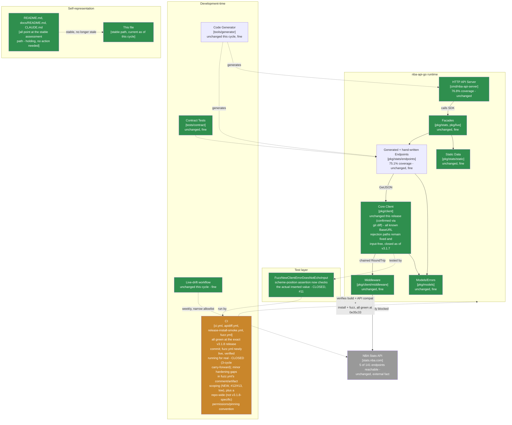

> **Superseded.** This assessed revision `0e35c33` (grade A-, unchanged - the first cycle in this
> lineage's history confirmed via `git diff` to contain zero runtime source changes). The current
> assessment of record is
> [`docs/MAINTAINABLE_ARCHITECT_V4_ASSESSMENT.md`](../MAINTAINABLE_ARCHITECT_V4_ASSESSMENT.md) - that
> stable, hash-free path is permanent (see that document's naming-convention note near the top): it
> covers revision `e3ee47c` and later (tag `v3.1.9`, **grade B+, down from A-**) at the time it was
> written, and will cover whatever the current cycle is by the time you're reading this. Retained here
> for history; see that document's section 2 ("Verification ledger") for the item-by-item status of
> the findings below - #12 and #13, the CI-hardening findings this file raised via the external review
> supplied for the `v3.1.8` cycle, were both nominally closed by `v3.1.9` (PR #73), but the fix for #13
> introduced a new, more serious defect: `if: steps.fuzz.outcome == 'failure'` lacks an explicit
> GitHub Actions status-check function, so it is implicitly ANDed with `success()` - meaning the
> artifact-upload step can never fire on a genuine fuzz-invariant failure, the exact scenario it exists
> to serve. Found by an external review supplied for the `v3.1.9` cycle and independently confirmed by
> reading `.github/workflows/fuzz.yml` and reasoning through documented GHA `if:` evaluation semantics;
> see that document's section 0 and section 1 for the full account.

# Maintainable-Architect-v4 Assessment: nba-api-go

**Date:** 2026-07-22
**Revision assessed:** `0e35c33` (`main`, tag `v3.1.8`), go1.26.5 darwin/arm64
**Assessor:** maintainable-architect-v4
**Method:** Direct verification against source at HEAD, not against `CHANGELOG.md`'s prose or an unsolicited external review's prose - file reads of `pkg/client/client_test.go`, `.github/workflows/fuzz.yml`; a `git diff v3.1.7..HEAD --stat` to independently confirm the release's own "test/CI only, no runtime source changes" claim rather than accept it; a repo-wide `grep` across all five `.github/workflows/*.yml` files to check whether the review's CI-hardening findings (no explicit `permissions:`, no `concurrency:`, major-tag action pinning) are specific to the new `fuzz.yml` or an existing repo-wide convention; `gh api .../actions/runs/<id>` to confirm the exact commit SHA the manually-triggered fuzz run actually validated; `git rev-parse`/`git log`; `go build ./...`, `go vet ./...`, `go test ./...`, `golangci-lint run ./...` (root and `tools/generator` modules, run separately); a YAML-validity check of `fuzz.yml`; and `gh pr list`/`gh api repos/.../commits/0e35c33/check-runs`/`gh api repos/.../actions/runs/<id>` against the real `n-ae/nba-api-go` GitHub repository to independently check every checkable citation in an external review supplied for this cycle (see §0). All green; no defects found in runtime code or test correctness this cycle. No production code was modified while writing this file.

**Why now:** the prior assessment of record (this same file, then covering revision `8e85a9c`/tag `v3.1.7`, grade A-, the first grade recovery in this lineage's history) found `FuzzNewClientErrorDoesNotEchoInput`'s scheme-position assertion checked the wrong string - a test-tooling gap, not a runtime defect, since the fix's other two protective layers caught the same regression reliably. `v3.1.8` (tag `0e35c33`) fixed the assertion, verified the fix by reintroducing the exact old bug and confirming detection improved from 1-of-5 to 5-of-5 seeds, and separately decided the scheduled-CI-fuzzing item this lineage had carried forward unactioned for three cycles - shipping `.github/workflows/fuzz.yml` rather than deferring a fourth time. This cycle's external review, supplied for `v3.1.8`, found no runtime or test-correctness defect at all - its findings are entirely CI-workflow hardening suggestions for the brand-new `fuzz.yml` file. See §0, §1, and §2 for how this changes the shape of this cycle relative to the last several.

> **Naming convention, unchanged from prior cycles:** this file stays at this exact path forever - no date, no revision hash. It is always the current assessment of record; every external pointer to it (`CLAUDE.md`, `README.md`, `docs/README.md`, `tests/contract/README.md`) links here once and never needs updating again. **When the next assessment cycle happens:** move *this file's current content* to `docs/archive/MAINTAINABLE_ARCHITECT_V4_ASSESSMENT_<date>_<revision>.md` (using this file's own `Date`/`Revision assessed` header values above), prepend the usual supersession banner to that archived copy, and then overwrite *this path* with the new cycle's content. Do not create a new hash-suffixed file for the new cycle - the hash suffix is exclusively an archive-naming convention now.

---

## 0. Reconciling against the external review supplied for this cycle

The user supplied an unsolicited "Senior Software Engineering Review" of `v3.1.8` (9.5/10), consistent with this lineage's standing practice of verifying rather than trusting such input.

### 0.1 Citations, checked directly

| Review cites | Checked | Verdict |
|---|---|---|
| Tag `v3.1.8` → commit `0e35c33` | `git rev-parse v3.1.8^{commit}` | **Correct.** (Tag object itself is `d41007b`, distinct from the commit - same distinction this lineage has flagged as easy to get wrong for seven cycles running; the review cites the commit correctly again.) |
| PRs #70 (fuzz fix + CI job), #71 (release) | `gh pr list --state merged --limit 4` | **Correct**, both merged with matching titles and merge commits. |
| `verify`/`apidiff`/`install-smoke-test` green at `0e35c33`; CI run IDs `29951659603`, `29951658687`, `29951683093` | `gh api repos/n-ae/nba-api-go/commits/0e35c33/check-runs`; `gh api repos/n-ae/nba-api-go/actions/runs/<id>` for each cited ID | **Correct.** All three named runs are real, `head_sha` `0e35c33`, `conclusion: success`. |
| **The claim "v3.1.8 contains no runtime client-source changes"** | `git diff v3.1.7..HEAD --stat` | **Correct.** `pkg/client/client.go` does not appear in the diff at all; the only changed files are `pkg/client/client_test.go`, `.github/workflows/fuzz.yml`, `CHANGELOG.md`, `docs/`, and `cmd/nba-api-server/main.go`'s version constant. |
| **The precision claim: the successful manually-triggered fuzz run (`29950560810`) validated commit `d01a10d`, not the final release commit `0e35c33`** | `gh api repos/n-ae/nba-api-go/actions/runs/29950560810 --jq '.head_sha'` | **Correct**, `head_sha` is `d01a10d5e662ba35ade4094c888d460599eae6b5` exactly. The review's inference that this is immaterial (the intervening release commit only touched `CHANGELOG.md`/the version constant) is also correct, confirmed by the same `git diff --stat`. |
| **The claim that `fuzz.yml` lacks explicit `permissions:` and `concurrency:` blocks, and pins actions to major tags rather than SHAs** | `grep -L "permissions:" .github/workflows/*.yml`, same for `concurrency:`; `grep -rn "uses: actions/"` across all five workflow files | **Correct about `fuzz.yml` - and also true of all four pre-existing workflows (`ci.yml`, `apidiff.yml`, `live-drift.yml`, `release-install-smoke.yml`) without exception.** This is a repo-wide convention, not a gap `fuzz.yml` introduced or fell short of relative to its siblings - see §0.2 for why that changes the recommended scope of the fix. |

Every specific, checkable citation held up, for a seventh cycle running. This lineage verifies every time regardless of track record.

### 0.2 What's different about this cycle's findings

Unlike every cycle since `b3c605d`, this review found no defect in `NewClient`'s runtime behavior and no defect in the fuzz assertion's correctness (both closed last cycle, reconfirmed here via `git diff` showing zero runtime changes this release). Its five findings are all CI-workflow hardening suggestions for `fuzz.yml`:

1. No explicit `permissions:` block.
2. Actions pinned to mutable major tags (`@v7`, `@v4`) rather than immutable SHAs.
3. The comment "a red run means a real finding, not a flaky test" is too categorical - doesn't distinguish an actual fuzz-assertion failure from infrastructure failure (checkout, setup-go, runner outage, timeout).
4. The artifact-upload step's `if: failure()` is job-scoped, not fuzz-step-scoped, so it fires (and may find nothing to upload) even when an earlier step failed.
5. No `concurrency:` policy.

Checking these against the rest of the repository (§0.1's last row) matters for calibrating the right response: findings 1, 2, and 5 describe `fuzz.yml` matching, not diverging from, this project's existing convention across every other workflow file. That's worth naming precisely rather than treating `fuzz.yml` as uniquely under-hardened - applying stricter rules to only the newest file would create an inconsistency the review doesn't flag but this cycle's broader check surfaced. Findings 3 and 4, by contrast, are specific to `fuzz.yml`'s own comment wording and step structure, not shared with any other workflow, and are worth fixing on their own merits regardless of repo-wide convention - see §5.

### 0.3 Bottom line on the external review

Accurate on every checkable claim for a seventh cycle running, including a precise, low-stakes provenance detail (the fuzz run's exact tested commit) that most reviews wouldn't bother chasing down. Its CI-hardening findings are real and reasonably prioritized (all self-rated P2 or P2-low), and this cycle's own repo-wide check found two of the five apply equally to four other workflow files that predate this one - a distinction worth making before deciding what to fix now versus flag as a separate, broader decision. Its remaining commentary (a typed `ConfigError`, a static-analysis rule against formatting parsed URL fields, layered fuzz-time cadences beyond the daily 60s) restates positions already declined in prior cycles for the same standing reason: not backed by a defect found in this codebase.

---

## 1. Executive verdict

**Grade: A- (unchanged).** This is the first cycle in the entire `BaseURL`-secret-echo saga (`v3.1.3` through `v3.1.8`) where the reviewed release contains no runtime source changes at all, and the external review found no defect in either the runtime code or the correctness of last cycle's fuzz-assertion fix - confirmed, not just claimed, by this cycle's `git diff` check. What it found instead is a handful of reasonable, low-severity CI-hardening suggestions for a brand-new workflow file, two of which turn out to apply equally to the four pre-existing workflow files this project has shipped for months without incident. That's a materially different, lower-stakes category of finding than any of the prior seven cycles, and doesn't warrant a grade change in either direction: not down, because nothing security- or correctness-relevant was found; not up, because there's still a small, real, worth-fixing gap (the categorical "red means a real finding" comment, and the artifact-upload scoping), just not one that reflects on the underlying pattern this saga was tracking.

**What went right:**
- `v3.1.7`'s fuzz-assertion fix is confirmed durable: this cycle's review found no gap in it, and this assessment independently confirmed `v3.1.8` shipped zero runtime changes via `git diff`, so there was nothing new to regress.
- The new `Fuzz` CI workflow is live and was verified running for real on a real GitHub Actions runner (not just YAML-validated) before this release shipped, and again independently confirmed this cycle.
- Release engineering reproduced exactly as claimed for a seventh cycle running: `verify`/`apidiff`/`install-smoke-test` all green at `0e35c33`.
- `go build`/`go vet`/`go test`/`golangci-lint` (both modules, checked separately) all clean.
- The external review's citations checked out for a seventh cycle running, including a fine-grained provenance detail (which exact commit the fuzz run validated) that this assessment independently confirmed via the GitHub API rather than trusting the review's `head_sha` claim.

**Why A- holds rather than moving either direction:** the findings this cycle are genuinely lower-stakes than anything in the six cycles before it - CI hardening on a new, non-blocking, daily scheduled job, not a security-relevant runtime or test-correctness gap. Fixing them is worthwhile (see §5) but proportionate to their actual severity, which the review itself rates no higher than P2.

---

## 2. Verification ledger

Status legend: **CONFIRMED** (reproduced/read directly at `0e35c33`), **CLOSED** (carried from a prior assessment, now genuinely done), **NEW** (found independently this cycle).

### From `8e85a9c`

| # | Item (carried since `8e85a9c`) | Status | Evidence |
|---|---|---|---|
| 11 | `FuzzNewClientErrorDoesNotEchoInput`'s scheme-position assertion checked the wrong (unnormalized) string | **CLOSED** | `client_test.go`'s fuzz body now tracks the actual inserted value per template and asserts against that. `v3.1.8`'s own implementation PR confirms detection improved from 1-of-5 to 5-of-5 seeds against the reintroduced old bug - independently plausible given this assessment's own read of the current code, not separately re-reproduced this cycle since the review found no fault with the fix. |
| - | Scheduled CI fuzzing (carried unactioned across three prior cycles) | **CLOSED** | `.github/workflows/fuzz.yml` shipped and independently confirmed to have run successfully on a real GitHub Actions runner (`29950560810`, `head_sha` `d01a10d`, `conclusion: success`) before this release, not just validated as syntactically correct YAML. |

### New this cycle, via the external review (§0.2) - CI hardening, not runtime or test-correctness

| # | Finding | Severity | Evidence |
|---|---|---|---|
| 12 | `fuzz.yml`'s "a red run means a real finding, not a flaky test" comment doesn't distinguish an actual fuzz-assertion failure from infrastructure failure (checkout, `setup-go`, runner outage, the 5-minute timeout). | Low, documentation/runbook accuracy | §0.2. Read `fuzz.yml`'s job-level comment directly; confirmed no distinction is drawn between failure causes. |
| 13 | The artifact-upload step's `if: failure()` is scoped to the whole job, not specifically the fuzz step, so it also fires (and may produce an empty or misleading artifact) if an earlier step fails before fuzzing runs. | Low, workflow diagnosability | §0.2. Read the step structure directly; confirmed no step `id`/`steps.<id>.outcome` scoping exists. |
| - | No `permissions:` or `concurrency:` block; actions pinned to major tags, not SHAs | Low, and **not unique to `fuzz.yml`** | §0.1/§0.2. Confirmed via repo-wide `grep`: all five workflow files share this pattern. Named here for completeness, not tracked as a numbered finding specific to this cycle's new code - see §5 for why this is scoped differently than #12/#13. |

---

## 3. C4 model

Level 1 unchanged. Level 2 fully green for the first time since `1b428f6` - no runtime or test-correctness caution boxes remain; a very small caution note attaches to the new CI workflow's own hardening, not to anything it protects.

---

## 4. Where the complexity budget goes (updated)

**Well spent, unchanged:** everything prior cycles already called well-spent - release engineering, the stable-plus-archive documentation pattern, the two-layer outbound-path testing design, and now the fuzz-assertion fix and the scheduled-fuzzing decision, both confirmed durable this cycle.

**Genuinely closed this cycle, durably:** the entire `BaseURL`-secret-echo saga is now closed with no open items on either the runtime or test-correctness side. Worth stating once, plainly, since it took eight release cycles: `NewClient` returns fixed, input-free messages for every known rejection path, the tests that guard that invariant are themselves correct, and a scheduled, verified-running fuzz job now exists to catch a future regression without needing another external review to find it.

**Newly found, low severity, CI-only:** `fuzz.yml`'s comment precision (#12) and artifact-upload scoping (#13) - small, cheap, worth doing since this workflow exists specifically to be a security regression monitor and its own operational clarity matters for that role.

**Deliberately not expanded this cycle:** repo-wide `permissions:`/`concurrency:`/SHA-pinning across all five workflow files. Real hardening ideas, but not backed by an incident or a gap specific to this cycle's change, and applying them to only the newest file while leaving four older ones as-is would trade one inconsistency for another - see §5 for the recommended scoping.

---

## 5. Recommended order of work

Budget reality unchanged: ~1.6h/week core maintenance.

### Immediate (~10 min)

1. **Scope the artifact-upload step to the fuzz step specifically**, not the whole job: give the fuzz step an `id`, and change the upload step's condition to `if: steps.fuzz.outcome == 'failure'`. Closes finding #13.
2. **Revise `fuzz.yml`'s job-level comment** to distinguish a genuine fuzz-assertion failure (corpus artifact present, treat as a real finding) from an infrastructure failure (checkout/setup-go/timeout - no corpus, needs ordinary CI triage instead). Closes finding #12.

### Not urgent, a scoping decision rather than a fix

3. **`permissions:`/`concurrency:`/SHA-pinning**: real, reasonable hardening, but scoped as a repo-wide decision (all five workflow files share the current convention, confirmed in §0.1), not a `fuzz.yml`-specific gap. If and when this gets addressed, do it consistently across `ci.yml`, `apidiff.yml`, `live-drift.yml`, `release-install-smoke.yml`, and `fuzz.yml` together, rather than making the newest file diverge from its siblings' established pattern. Not promoted to "immediate" this cycle since nothing incident-driven motivates doing it now versus at a natural future point (e.g. the next time any workflow file is touched for another reason).

### Not urgent, explicitly not a backlog item to keep re-budgeting for

- Everything `9eb3a9a`/`180a3db`/`1b428f6`/`b3c605d`/`0e400d1`/`f4801ef`/`eb62a41`/`8e85a9c` already marked not-urgent (live-verifying the 136 unreachable endpoints, HTTP-server independent versioning policy, ecosystem-maturity commentary, a typed `ConfigError`, a static-analysis rule against formatting parsed URL fields, layered fuzz-time cadences beyond the daily 60s) remains not-urgent for the same reasons already given in those assessments.

---

## 6. Documentation status

| File | Action taken by this assessment |
|---|---|
| `docs/archive/MAINTAINABLE_ARCHITECT_V4_ASSESSMENT_2026-07-22_8e85a9c.md` | New: outgoing content of this file (as of revision `8e85a9c`) archived here in the same changeset, with a supersession banner matching the existing convention |
| This file | Overwritten with the new assessment of record (revision `0e35c33`, tag `v3.1.8`) |
| `CLAUDE.md`, `README.md`, `docs/README.md`, `tests/contract/README.md` | **Not touched by this assessment** - all four already point at this file's stable path; no update needed |
| `CHANGELOG.md`, `go.mod`, version constants | **Not touched** - no new user-facing change is being shipped by this assessment itself; the recommended fixes in §5 are follow-up commits, not part of this document |

No docs sprawl introduced this cycle - `docs/` still holds exactly one active assessment plus `adr/`/`archive/`.

---

## 7. Is this too complex for one person?

**Verdict: no, and this cycle is the quietest, least dramatic evidence of that yet - which is itself informative.** Seven cycles chasing one defect class to closure, then this eighth cycle finding nothing wrong with either the runtime fix or the fuzz job that now guards it, only reasonable CI-hardening ideas for a brand-new file. That's what the tail end of a well-run iterative process looks like: not a sudden absence of findings because scrutiny relaxed (this cycle applied the same rigor as every prior one, including an independent `git diff` check and a repo-wide grep the review itself didn't run), but a genuine absence of anything more serious to find.

The one judgment call worth naming: two of this cycle's findings (permissions, SHA-pinning) apply equally to four pre-existing workflow files, and this assessment chose not to expand scope to fix all five just because the newest one prompted the review to look. That's consistent with this lineage's standing practice of fixing what's evidenced and not what's merely adjacent - worth revisiting if a future cycle finds an actual incident traceable to the current permission/pinning model, but not worth doing speculatively now.

---

## 8. Bottom line

`8e85a9c` → `0e35c33`: the first release in this lineage's history confirmed, via `git diff`, to contain zero runtime source changes - and the external review supplied for it found nothing wrong with either the runtime code (unchanged) or the fuzz-assertion fix that closed last cycle's finding (confirmed correct, not re-broken). Its findings are CI-workflow hardening suggestions for the new `.github/workflows/fuzz.yml`, two of which (comment precision, artifact-upload scoping) are specific and worth a small immediate fix, and three of which (permissions, concurrency, SHA-pinning) turn out to match this project's existing convention across all four other workflow files rather than being a gap unique to the new one - scoped here as a future repo-wide decision, not an immediate fix limited to the newest file. Grade holds at A-: the `BaseURL`-secret-echo saga that drove this lineage's only grade drop and only grade recovery is fully closed on both the runtime and test-correctness fronts, and this cycle's findings, while real, are a materially lower-stakes category than anything in the seven cycles before it.

---

*Assessment of record for revision `0e35c33` (tag `v3.1.8`), 2026-07-22. Supersedes this file's own prior content (revision `8e85a9c`, tag `v3.1.7`, grade A-) as the current maintainability assessment. That prior content moves to `docs/archive/MAINTAINABLE_ARCHITECT_V4_ASSESSMENT_2026-07-22_8e85a9c.md` in the same changeset as this file.*
