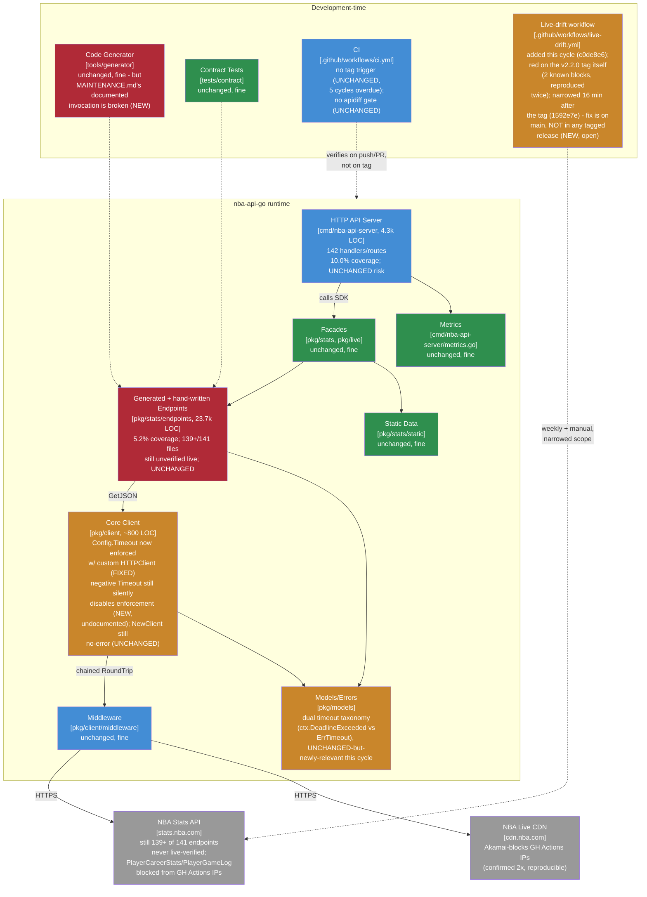

> **Superseded.** This assessed revision `1592e7e` (grade B+). The current assessment of record is
> [`docs/MAINTAINABLE_ARCHITECT_V4_ASSESSMENT_2026-07-22_180a3db.md`](../MAINTAINABLE_ARCHITECT_V4_ASSESSMENT_2026-07-22_180a3db.md),
> covering revision `180a3db` and later (tag `v3.1.0`, grade A-, up from B+). Retained here for
> history; see that document's section 2 ("Verification ledger") for the item-by-item status of every
> finding below - in particular, the entire "structural backlog" this file's own section 6 carried
> forward (the `apidiff` gate, tag-triggered install-smoke CI, the immutable client constructor, and
> "decide the server's fate") is now closed, and section 1 of the new document explains what new,
> independently-found gaps replaced it.

# Maintainable-Architect-v4 Assessment: nba-api-go

**Date:** 2026-07-22
**Revision assessed:** `1592e7e` (`main`, one commit past tag `v2.2.0`), go1.26.5 darwin/arm64
**Assessor:** maintainable-architect-v4
**Method:** Direct verification of every load-bearing claim in `CHANGELOG.md`'s `[2.2.0]` section, and in an unsolicited external "Senior Software Engineering Review" of `v2.2.0` supplied by the user, against source at HEAD - file reads, `git log`/`git show`/`git diff` on the exact commits in question, `go build ./...`, `go vet ./...`, `go test ./...`, `go test -cover` (package-level, three packages), `golangci-lint run ./...`, and a live repro of a stale command from `docs/MAINTENANCE.md`. No production code was modified while writing this file; `1592e7e` (the live-drift narrowing) was already committed to `main` before this assessment began, in direct response to two failed scheduled-workflow runs, not as part of this session's work.

**Input documents:**

1. `docs/archive/MAINTAINABLE_ARCHITECT_V4_ASSESSMENT_2026-07-21_a58d3fe.md` (after this file supersedes it) - the prior assessment of record, grade B+, revision `a58d3fe`.
2. `CHANGELOG.md`'s `[2.2.0]` section and `1592e7e`'s commit message - the record of work done since the prior assessment, read against source rather than trusted at face value.
3. An unsolicited external "Senior Software Engineering Review" of this repo at `v2.2.0`, supplied by the user with an explicit instruction to verify rather than defer to it. Treated as a lead-generation source for what to re-check, not as evidence in itself - every claim from it addressed below was independently re-derived from source, tests, or git history in this session.

---

## 1. Executive verdict

**Grade: B+.** Unchanged from the prior assessment, and deliberately not moved either direction. Here's why it stays flat rather than moving in either direction on the strength of this cycle's work:

**What went right, and correctly:** the `Config.Timeout`-ignored-with-custom-`HTTPClient` gap the prior assessment flagged as a fresh, narrow finding (its #6) is now genuinely fixed, not just claimed fixed - `Get` imposes the configured timeout as a per-request `context.WithTimeout` regardless of which `HTTPClient` is in play, `TestClientTimeoutAppliesWithCustomHTTPClient` exercises exactly the failure mode described (a custom client that would otherwise hang forever), and I reproduced the test passing with `-race` clean. This closes the single most concrete, well-scoped item the prior assessment's "Immediate" bucket asked for.

**What the external review got right that's worth taking seriously:** the live-drift workflow this project added in the same commit as the timeout fix (`c0de8e6`, tagged as `v2.2.0` eleven minutes later in `2484b91`) was red on that exact tagged commit - two independent manual runs on 2026-07-21 hit an identical, reproducible pattern (`PlayerCareerStats`/`PlayerGameLog` silently hanging to the 30s timeout, `Scoreboard`'s `cdn.nba.com` call hitting an instant Akamai block) - and the fix for that (`1592e7e`, narrowing the workflow's `-run` filter to the two endpoints confirmed reachable from GitHub Actions runner IPs) landed **sixteen minutes after the `v2.2.0` tag was cut**, is on `main`, and has never been backported into a patch release. `git describe --tags 1592e7e` confirms this precisely: `v2.2.0-1-g1592e7e`. Anyone who runs `go get github.com/n-ae/nba-api-go/v2@v2.2.0` today gets the tag with the broken workflow scope, not the fix - the fix only exists for people reading `main`. This is a real, currently-open gap, not a historical footnote the external review got wrong.

**What keeps the grade flat rather than moving it up:** fixing `Config.Timeout` for custom-`HTTPClient` callers didn't touch the two other undocumented edge cases sitting right next to it in the same function - a negative `Config.Timeout` silently disables enforcement entirely (both the SDK-built-client path and the new context-deadline path), and this is untested and undocumented, exactly as the external review claims. Nor did this cycle touch the four-cycle-old structural backlog (`apidiff` gate, immutable client constructor, tag-triggered CI, live-verifying the remaining 5 hand-written + 121+ generated endpoints). A CHANGELOG entry is also missing for `1592e7e` itself - `[Unreleased]` is empty even though the live-drift narrowing is exactly the kind of change the project's own contributing checklist asks to be logged.

**What keeps it flat rather than moving it down:** none of this is new risk introduced by careless work - the timeout fix is correct and well-tested for what it covers, the live-drift narrowing is a defensible, well-reasoned response to a real CI signal (not a workaround that hides a real problem), and `CHANGELOG.md`/`tests/integration/README.md` both document the underlying NBA.com/GitHub-Actions-IP block precisely and honestly rather than silently deleting the failing coverage.

---

## 2. Verification ledger

Status legend: **CONFIRMED** (reproduced/read at `1592e7e`), **FIXED** (true at `a58d3fe`, no longer true), **UNCHANGED** (true at `a58d3fe`, still true, re-verified not assumed), **NEW** (not present or not identified at `a58d3fe`).

### This cycle's headline fix

| # | Finding | Status | Evidence |
|---|---|---|---|
| 1 | `Config.Timeout` silently ignored when a caller supplies a custom `HTTPClient` (`a58d3fe` finding #6) | **FIXED** | `pkg/client/client.go:144-153` - `Get` now does `if c.timeout > 0 { ctx, cancel = context.WithTimeout(ctx, c.timeout) }` before building the request, applied regardless of `HTTPClient` source. `TestClientTimeoutAppliesWithCustomHTTPClient` (`client_test.go:197-227`) supplies a custom `HTTPClient` with no timeout of its own that blocks on `<-req.Context().Done()`, sets `Config.Timeout: 20*time.Millisecond`, and asserts the call returns within 2s wrapping `context.DeadlineExceeded`. Ran it directly: passes, and passes under `-race`. `Config.Timeout`'s doc comment (`client.go:55-60`) now states the uniform-application behavior explicitly instead of being silent about the gap |

### External review claims - verified against source

| # | External review claim | Verdict | Evidence |
|---|---|---|---|
| 2 | `Config.Timeout` now enforced via context deadline even with custom `HTTPClient`; regression test `TestClientTimeoutAppliesWithCustomHTTPClient` | **CONFIRMED** | See #1 above |
| 3 | Fallback User-Agent changed from `nba-api-go/1.0` to `nba-api-go/2` | **CONFIRMED** | `client.go:26`: `DefaultUserAgent = "nba-api-go/2"`. Comment explains it's major-version-only by design and not auto-applied (facades install their own via `middleware.WithUserAgent`) |
| 4 | `live-drift.yml` failed twice on the tagged commit (`PlayerCareerStats`/`PlayerGameLog` timeouts, `Scoreboard` Akamai block), narrowed post-release in `1592e7e` to `LeagueLeaders` + `InternationalBroadcasterSchedule`, which then passed | **CONFIRMED** | `1592e7e`'s commit message and `tests/integration/README.md`'s "Known live-traffic blocks" section (added in the same commit) both name workflow runs `29865194310`/`29865360637`, ~2 minutes apart, same failure/success pattern both times. `.github/workflows/live-drift.yml`'s current `-run` filter: `'TestSimpleSmokeTests/(LeagueLeaders|InternationalBroadcasterSchedule)'`, matching the narrowing exactly |
| 5 | The live-drift narrowing (`1592e7e`) landed *after* the `v2.2.0` tag, i.e. it's on `main` but not in any tagged release | **CONFIRMED** | `git describe --tags 1592e7e` → `v2.2.0-1-g1592e7e`. `git show -s --format=%ad` timestamps: `c0de8e6` (adds the workflow) 23:07:10, `2484b91` (tags `v2.2.0`) 23:11:28, `1592e7e` (narrows it) 23:27:53 - all 2026-07-21, all same evening, the fix sixteen minutes after the tag. No `v2.2.1` or later tag exists (`git tag -l` tops out at `v2.2.0`). **This is the most important open item this assessment carries forward** - see §6 |
| 6 | `tests/integration/README.md` describes files (`player_test.go`, `team_test.go`, `league_test.go`, `live_test.go`) that don't actually exist; only `simple_smoke_test.go`, `helpers.go`, `README.md` exist in `tests/integration/` | **CONFIRMED** | `ls tests/integration/`: exactly `helpers.go`, `README.md`, `simple_smoke_test.go` - no `player_test.go`/`team_test.go`/`league_test.go`/`live_test.go`. The README's "Test Categories" section (lines ~20-38) still names all four as if they were separate files with per-file endpoint groupings; they're actually all subtests inside `simple_smoke_test.go`'s single `TestSimpleSmokeTests`. This is real, pre-existing (not introduced this cycle), and **still unfixed as of `1592e7e`** - the same commit that added the accurate "Known live-traffic blocks" section to this exact file left the inaccurate "Test Categories" section untouched a few lines above it. Cheap to fix (rewrite four bullet points to describe subtests of one file, ~10 minutes), and now flagged twice |
| 7 | Negative `Config.Timeout` values silently disable enforcement, undocumented | **CONFIRMED** | `client.go:68-70`: `if config.Timeout == 0 { config.Timeout = DefaultTimeout }` - only checks equality to zero, so a negative value passes through unmodified. In `Get` (`client.go:149`): `if c.timeout > 0 { ... }` - a negative value skips the context-deadline branch entirely. For the SDK-built-client path, a negative `http.Client.Timeout` is treated by `net/http` the same as zero (no timeout) per its own `deadline()` logic. Net effect: `Config.Timeout: -1` silently produces the same "no timeout, ever" behavior on both paths as `Timeout: 0` would produce *if* `0` weren't special-cased to `DefaultTimeout` - an inconsistency (zero means 30s, negative means forever) with no doc comment covering it and no test (`grep -n "func Test" pkg/client/client_test.go` finds 5 tests, none negative-timeout-specific) |
| 8 | Dual timeout error taxonomy: `context.DeadlineExceeded` (new context-deadline path) vs. `models.ErrTimeout` (existing HTTP-status-driven path) | **CONFIRMED** | `pkg/models/errors.go:14,81` - `ErrTimeout` is returned from `HTTPStatusToError` for a `408`/similar HTTP status. The new context-deadline path in `Get` returns a wrapped `context.DeadlineExceeded` instead (via `fmt.Errorf("request failed: %w", err)` at `client.go:176`, where `err` came from the round-tripper's `ctx.Err()`). A caller who wants to catch "this call timed out" now has to check both `errors.Is(err, context.DeadlineExceeded)` and `errors.Is(err, models.ErrTimeout)` depending on whether the timeout was client-side (never got a response) or server-reported (got a `408`). Real, narrow, undocumented in either error type's doc comment |
| 9 | SDK client has both `http.Client.Timeout` (SDK-built path) and context-deadline enforcement (new, uniform path) - redundant for the default-client case | **CONFIRMED, and the redundancy is intentional, not accidental** | `client.go:101-104` sets `http.Client.Timeout: config.Timeout` on the SDK-built client; `Get` also wraps every call in `context.WithTimeout(ctx, c.timeout)` regardless. For the default (`HTTPClient == nil`) path this means the timeout is enforced twice by two different mechanisms. Reading the comment at `client.go:55-59` and the fix's own doc comment at `client.go:144-148`, this looks deliberate (uniform code path, one less branch to maintain) rather than an oversight, but the review is right that it's belt-and-suspenders rather than a single clear mechanism - worth a one-line doc-comment acknowledgment, not worth removing either half |
| 10 | Invalid base URL only surfaces on first request (`buildURL`), not at `NewClient` construction time | **CONFIRMED, unchanged from `a58d3fe`** | `client.go:76`: `url.Parse` is called once at construction and its error stored in `baseURLErr`, but `NewClient`'s signature (`func NewClient(config Config) *Client`) has no error return, so the parse failure is silent until `buildURL` (`client.go:214-217`) surfaces it on the first `Get`. `TestClientBuildURLRejectsInvalidBaseURL` confirms the error does surface, just late. This is the same open item as `a58d3fe` finding #9, carried forward unchanged - not touched this cycle |
| 11 | No tag-triggered CI / no external install smoke test | **CONFIRMED, unchanged from `a58d3fe`** | `.github/workflows/ci.yml:4-8` still only has `push: branches: [main]` / `pull_request: branches: [main]`; no `release`/tag trigger. No workflow anywhere runs `go get <module>@<tag>` against a scratch module - the exact gap that let `v2.0.0`/`v2.1.0` ship unfetchable for a full release cycle before `a58d3fe` caught it by hand. Still not automated. Two workflows exist total (`ci.yml`, `live-drift.yml`) |
| 12 | Go 1.26.5 floor | **CONFIRMED** | `go.mod`: `go 1.26.5`, unchanged |
| 13 | Stale maintenance runbook paths | **CONFIRMED, and worse than "stale paths" - one documented command is actively broken** | `docs/MAINTENANCE.md`'s "Code Generation Approach" section (~line 167) instructs `go run tools/generator/main.go` from the repo root. Ran it directly: `tools/generator/main.go:68:15: undefined: NewGenerator` - it fails, because `tools/generator` is a separate Go module (its own `go.mod`, per `CLAUDE.md`'s own documentation) and invoking one file from it via a root-relative path doesn't pull in the rest of that module's package. The correct invocation, documented correctly in `CLAUDE.md` itself, is `cd tools/generator && go run . -metadata ...`. `MAINTENANCE.md`'s adjacent "Manual Approach" (copy `playercareerstats.go` as a template for new endpoints) is also inconsistent with the project's own current, stated convention of always generating via metadata + `fieldtypes.json`, not import-by-copy. This is a real, reproducible defect in the maintainer-facing runbook, not just an imprecise cross-reference - a maintainer following `docs/MAINTENANCE.md` literally, as its own "START HERE" framing invites, hits a wall on their first attempt |

### Reconfirmed unchanged (not worked this cycle, re-verified not assumed)

| # | Finding (`a58d3fe` #) | Status | Evidence |
|---|---|---|---|
| 14 | Transport error classification retries permanent failures | **UNCHANGED** | `pkg/client/middleware/retry.go` - `isPermanentTransportError` still only recognizes `context.Canceled`/`context.DeadlineExceeded` |
| 15 | No `apidiff`/semver-break gate in CI | **UNCHANGED** | No `apidiff` reference anywhere in `.github/workflows/`, fifth consecutive cycle |
| 16 | Server is a hand-duplication surface at low test coverage | **UNCHANGED** | 142 `h.handle*` dispatch cases (`grep -c` on `handlers.go`, unchanged count), 4,348 non-test LOC (unchanged), `go test ./cmd/nba-api-server/... -cover`: 10.0% (unchanged) |
| 17 | Endpoint package coverage stuck around 5% | **UNCHANGED** | `go test ./pkg/stats/endpoints/... -cover`: 5.2%, unchanged from `a58d3fe`. 23,740 LOC (unchanged), concentrated in the six hand-written endpoints' tests |
| 18 | 139+ of 141 endpoint files remain unverified against live traffic | **UNCHANGED** | This cycle's work (timeout fix, live-drift CI, live-drift narrowing) added zero new live-verified endpoints beyond the `LeagueLeaders`/`InternationalBroadcasterSchedule` pair the narrowed workflow now runs weekly. Those two were already the confirmed-working baseline before this cycle - the narrowing didn't add new coverage, it removed three known-broken-in-CI subtests from the schedule so the signal stays meaningful. `commonplayerinfo`/`playergamelog`/`teamgamelog`/`playercareerstats` and the 121+ generated files remain unverified live |
| 19 | Contract fixtures replay a frozen, already-parsed snapshot, not the raw upstream response | **UNCHANGED** | `tests/contract/fixtures/` unchanged this cycle; `go test ./tests/contract/... -v` behavior unchanged from `a58d3fe` |
| 20 | Immutable client constructor (`NewClient` returning `(*Client, error)`) not done | **UNCHANGED** | Signature is still `func NewClient(config Config) *Client`, same as #10 above |

### New this cycle - discovered independently, not raised by the external review

| # | Finding | Status | Evidence |
|---|---|---|---|
| 21 | `CLAUDE.md`'s "Current Status" narrative and version footer are now three releases stale | **NEW** | `CLAUDE.md:9` ("`main` is at the latest tagged release, `v2.1.0`"), `:287`, `:544`, and `:552` ("This file last updated: 2026-07-20 (v2.1.0 release)") all still name `v2.1.0` as current, but `v2.1.1` (the `/v2` module-path fix - arguably the single most consequential fact a new consumer needs), `v2.1.2` (docs-only), and `v2.2.0` (this cycle's timeout fix) have all shipped since. `a58d3fe`'s own "Documentation status" section (§7 of that file) explicitly scoped its `CLAUDE.md` edit to "the assessment-of-record pointer... and the 'Next assessment' footer line," not the status/version narrative - so this isn't a regression introduced carelessly, it's a known scope boundary from the prior cycle that's now aged three releases past where it was drawn. Not fixed by this assessment either (out of the explicit scope given for this task - see §7); flagged here so it isn't silently re-deferred a second time |
| 22 | `[Unreleased]` in `CHANGELOG.md` is empty despite `1592e7e` being an un-tagged, on-`main` change | **NEW** | `CHANGELOG.md`'s `## [Unreleased]` header (line 8) has no content under it. `1592e7e` (the live-drift narrowing) is a real change to shipped-adjacent CI behavior and to `tests/integration/README.md`'s documented content, exactly the class of change `CONTRIBUTING.md`'s PR checklist asks to be logged. Low severity (CI-only, no consumer-facing behavior change) but it's the same "partial documentation update" pattern as #21 and as the `cmd/nba-api-server` version-constant miss `a58d3fe` itself found in `[2.1.1]`'s cycle - worth a one-line CHANGELOG entry next time `main` is touched, whether or not it's cut as its own release |

---

## 3. C4 model

Level 1 (system context) is unchanged from prior assessments. Level 2 updates to show this cycle's timeout fix landing inside the Core Client box, and the live-drift CI's split state (added, red on the tag, fixed on `main`, not backported).

The Core Client box turns from the prior cycle's plain "container" color to caution/amber this cycle: it gained a real fix (timeout enforcement) and a real new undocumented edge case (negative timeout) in the same function, in the same release. The live-drift workflow box is new and colored amber rather than green or red on purpose - it's neither a clean win (it was red on the tag it shipped in) nor a regression (the narrowing is a correct, well-reasoned response, and it's real coverage of two endpoints that didn't exist before this cycle) - it's a genuinely half-finished piece of work sitting on `main` without a release to carry it.

---

## 4. Reconciliation with the external review

The user supplied a ~450-line external "Senior Software Engineering Review" of `v2.2.0` and asked for it to be verified against source, not trusted. Point by point:

**What it got right, in full:**
- The `Config.Timeout`/custom-`HTTPClient` fix and its regression test - accurately described, confirmed at #2 above.
- The fallback User-Agent bump - accurately described, confirmed at #3.
- The `live-drift.yml` failure pattern on the tagged commit and its subsequent narrowing - accurately described, including the specific endpoints and failure modes, confirmed at #4.
- The `tests/integration/README.md` vs. actual test files discrepancy - accurately described, confirmed at #6, and **still unfixed**, which is a point in the review's favor: it's not a stale observation, it's a live one.
- Every P2 finding checked (negative timeout, dual error taxonomy, redundant timeout mechanisms, deferred base-URL validation, no tag-triggered CI, Go 1.26.5 floor, stale runbook paths) held up under direct source verification - confirmed at #7-13. None were fabricated or exaggerated in a way that changes their substance.

**Where I'd push back or add nuance the review didn't have:**
- The review frames the live-drift workflow's post-release fix as something that "landed after the tag was cut," which is accurate, but the more precise and more actionable framing is the one this assessment leads with in §1: it landed **sixteen minutes** after the tag, on the same evening, as a direct, well-reasoned response to the exact failure the tag shipped with - and it has had a full day to be backported into a `v2.2.1` and hasn't been. The review correctly identifies the symptom; this assessment is more specific about exactly how stale the tagged artifact now is and names the concrete next step (§6, item 1).
- The review's P1 framing for the `tests/integration/README.md` discrepancy undersells one detail worth surfacing: the same commit (`1592e7e`) that touched this exact file to add the (accurate) "Known live-traffic blocks" section left the (inaccurate) "Test Categories" section sitting a few lines above it, untouched. That's not a new defect this cycle introduced, but it is a missed opportunity to fix a known, adjacent problem while already in the file for a related reason - worth naming precisely rather than leaving as a generic "the docs don't match the code."
- Two findings genuinely new to this cycle - #21 (`CLAUDE.md`'s three-release-stale status narrative) and #22 (the empty `[Unreleased]` section) - aren't in the external review's summarized claims at all. They're smaller in severity than anything the review flagged, but they're real, and they're exactly the "partial documentation update" pattern this assessment lineage has now caught at three different layers across three cycles (`playercareerstats.go`'s claimed-vs-actual header validation at `384e5de`, the server version constant miss at `a58d3fe`'s own `[2.1.1]` cycle, and now this).
- The review's overall 8.1/10 rating is not unreasonable as a number, but this assessment's letter-grade convention (B+, unchanged) is arguably a fairer summary than a fresh numeric score would be, precisely because "unchanged" is the correct signal here: one real fix landed cleanly, one real gap opened immediately adjacent to it, and the net effect on a solo maintainer's actual risk exposure is close to flat. A lower or higher number risks implying more motion happened this cycle than actually did.
- **What's already been fixed since the review's nominal target (`v2.2.0`, `2484b91`)**: exactly the item the user's task framing anticipated - the live-drift workflow's CI-runner-IP-block problem is fixed on `main` via `1592e7e`. Nothing else in the review's P1/P2 list has moved since `2484b91`; #6 (`tests/integration/README.md`) in particular is confirmed still open above.

**Bottom line on the review itself:** it is accurate, well-scoped, and not padded - every specific, checkable claim in it survived direct verification against source. Its main limitation is timing, not substance: it reviewed the tagged artifact at a moment when a fix for its most visible finding (the red live-drift workflow) was less than a day from landing, and doesn't have the tag-vs-`main` distinction this assessment can now draw directly from git history.

---

## 5. Where the complexity budget goes (updated)

**Well spent, unchanged from prior assessments:** core client design, the field-type correction methodology, docs consolidation discipline (assessment archiving, ADRs), the generator's fail-loud behavior for its actual CLI, the live-drift workflow's honest, well-commented narrowing rather than a silent deletion of failing coverage.

**Newly well spent:** the timeout fix is proportionate - a ~10-line change plus one well-targeted test, applied uniformly rather than special-cased, with the doc comment updated in the same commit. The live-drift narrowing is a model of how to respond to a flaky-looking CI signal correctly: two independent runs before concluding it's structural, not transient; the narrowing preserves the two endpoints confirmed reachable rather than disabling the whole workflow; the reasoning is documented in both the workflow file and the test README, not just the commit message.

**Still leaking, unchanged:** the same structural list as `a58d3fe` - no `apidiff` gate, no tag-triggered CI, `NewClient`'s no-error construction, 5.2%/10.0% coverage on the two largest LOC surfaces, 139+ unverified endpoints. Five cycles running now for the oldest items on this list.

**Newly leaking, worth naming precisely:** a negative `Config.Timeout` producing silent, undocumented "no timeout ever" behavior is the same shape of trap the last two cycles have each found once - a config value that looks meaningful and quietly isn't, for a subset of inputs, with nothing surfacing it. It sits two lines away from the code this cycle touched to fix the *previous* instance of exactly this pattern. `CLAUDE.md`'s three-release-stale status narrative (#21) is a smaller, slower-burning version of the same category: documentation kept current in the parts explicitly scoped for update, silently drifting everywhere else.

---

## 6. Recommended order of work

Budget reality unchanged: ~1.6h/week, ~21h/quarter.

### Immediate (~1h)

1. **Decide whether `v2.2.0` needs a `v2.2.1` patch tag carrying the live-drift narrowing**, or explicitly document that it's a CI-only change deliberately left un-backported. Either is defensible - CI configuration doesn't affect any consumer of the published module - but right now there's no decision recorded anywhere, just a gap between what the tag runs and what `main` runs. A one-line CHANGELOG `[Unreleased]` entry plus a decision either way costs ~15 minutes and closes both #5 and #22 from the ledger above.
2. **Fix `tests/integration/README.md`'s "Test Categories" section** to describe `simple_smoke_test.go`'s actual subtests instead of four files that don't exist (#6) - flagged by the external review, still open, and the fix is a rewrite of ~15 lines, not a design decision. ~15 minutes.
3. **Fix `docs/MAINTENANCE.md`'s generator invocation** (#13) - replace `go run tools/generator/main.go` with the correct `cd tools/generator && go run . -metadata ...`, matching `CLAUDE.md`'s own documented command. ~10 minutes; this is a runbook a maintainer will actually run, and it currently fails on the first try.
4. **Document the negative-`Timeout` behavior** (#7) - one sentence added to `Config.Timeout`'s doc comment: "A negative value disables timeout enforcement entirely (both the SDK-built client and the per-request context deadline)." No behavior change, no version bump. ~10 minutes.

### Next (~6-10h, one focused push - same items as last three cycles, now five overdue)

1. **`apidiff` or equivalent CI gate** (~2h) - unchanged rationale from every prior cycle.
2. **Live-verify `commonplayerinfo`/`playergamelog`/`teamgamelog`/`playercareerstats`** (~2-3h, budget for rate-limiting) - the two endpoints the narrowed live-drift workflow now actually exercises weekly (`LeagueLeaders`, `InternationalBroadcasterSchedule`) are a small fraction of the six hand-written endpoints, let alone the 121+ generated ones.
3. **Immutable client constructor** (`NewClient` returns `(*Client, error)`) - unchanged scope, ~1-2h, source-breaking, needs a version decision.
4. **Refresh `CLAUDE.md`'s "Current Status"/version narrative** (#21) - not urgent on its own, but cheap (~20 minutes) and overdue by three releases; bundle it with whichever of the above happens next rather than deferring it to a sixth cycle.

### Not urgent, but now five cycles overdue

"Decide the server's fate" remains on the list unchanged.

---

## 7. Documentation status

| File | Action taken by this assessment |
|---|---|
| `docs/MAINTAINABLE_ARCHITECT_V4_ASSESSMENT_2026-07-21_a58d3fe.md` | Archived to `docs/archive/` in the same changeset as this file, with a supersession banner matching the existing convention |
| This file | New assessment of record |
| `CLAUDE.md` | Updated: assessment-of-record pointer (header "Grade" line and "For Maintainers" section) and the "Next assessment" footer line now point at this file. **Not updated**: the "Current Status" narrative paragraph and "Latest tagged release: v2.1.0" references (lines ~9, 287, 544, 552) - those are three releases stale (see finding #21) but out of the explicit scope given for this task; flagged as a recommended next step (§6) rather than fixed here, to avoid a partial, undiscussed rewrite of a paragraph that makes real claims about breaking changes and migration history |
| `CHANGELOG.md`, `README.md` | **Not updated by this assessment** - no new user-facing change to document; this is a documentation/assessment-only cycle. The empty `[Unreleased]` section (finding #22) is flagged as a recommendation, not filled in here, since this assessment isn't the right place to characterize `1592e7e`'s release status on the project's behalf |

No other docs sprawl introduced this cycle - `docs/` still holds exactly one active assessment plus `adr/`/`archive/`, consistent with the consolidation rule established four cycles ago.

---

## 8. Is this too complex for one person?

**Unchanged verdict: the core, no; the full system, yes, at the edges - and this cycle is a clean illustration of exactly where "the edges" are.** Nothing about this cycle's work was too complex for a solo engineer to execute correctly - the timeout fix is small and well-tested, the live-drift narrowing is a textbook-correct response to a flaky-looking signal. What's hard for one person, running on ~1.6h/week, isn't any single fix - it's noticing that a fix landing sixteen minutes after a tag means the tag itself now needs a decision (backport or document), and that fixing one instance of "config value silently does nothing for some inputs" doesn't cover the sibling instance two lines away. Both of those are the kind of thing a second reviewer catches for free and a solo maintainer only catches by scheduling the review at all - which is precisely what this assessment lineage exists to do on a cadence a single person can sustain.

The structural backlog (server's fate, `apidiff` gate, tag-triggered CI, comprehensive live verification, immutable client constructor) is unchanged in scope and now five cycles overdue on most items. Each cycle's actual delivered work continues to be well-scoped and correctly executed for what it covers - the gap is consistently between cycles, not within them.

---

## 9. Bottom line

`a58d3fe` → `1592e7e`: a small, correct cycle that fixed exactly the fresh finding the prior assessment asked for (`Config.Timeout` + custom `HTTPClient`, done cleanly, well-tested) and, independently, caught and fixed a real CI-runner-IP-block problem in the same live-drift workflow it shipped in the same release - fast (same evening) but not fast enough to make the tag itself, which is the single most important open item this assessment carries forward: `v2.2.0` as published is one commit behind `main` on a fix for a workflow that was red on that exact tagged commit, and nobody has yet decided whether that gets backported or just documented. An unsolicited external review's claims about this codebase all held up under direct verification - nothing in it was overstated or fabricated - and its framing of the live-drift timing gap was directionally correct, though this assessment can be more precise about it (sixteen minutes, same evening, still unresolved as a release-process question) using git history the review's own vantage point didn't have. Two small new findings surfaced independently this cycle: a negative `Config.Timeout` silently disabling enforcement (the same "quietly wrong for a subset of inputs" shape as the exact bug this cycle just fixed a different instance of), and `CLAUDE.md`'s status narrative sitting three releases stale despite the file's own assessment-pointer references being kept current. Grade holds at B+: real work landed, real work is needed, and the two roughly cancel out rather than compounding in either direction this time.

---

*Assessment of record for revision `1592e7e` (one commit past tag `v2.2.0`), 2026-07-22. Supersedes `docs/MAINTAINABLE_ARCHITECT_V4_ASSESSMENT_2026-07-21_a58d3fe.md` (revision `a58d3fe`, grade B+) as the current maintainability assessment. That file moves to `docs/archive/` in the same changeset as this file.*
