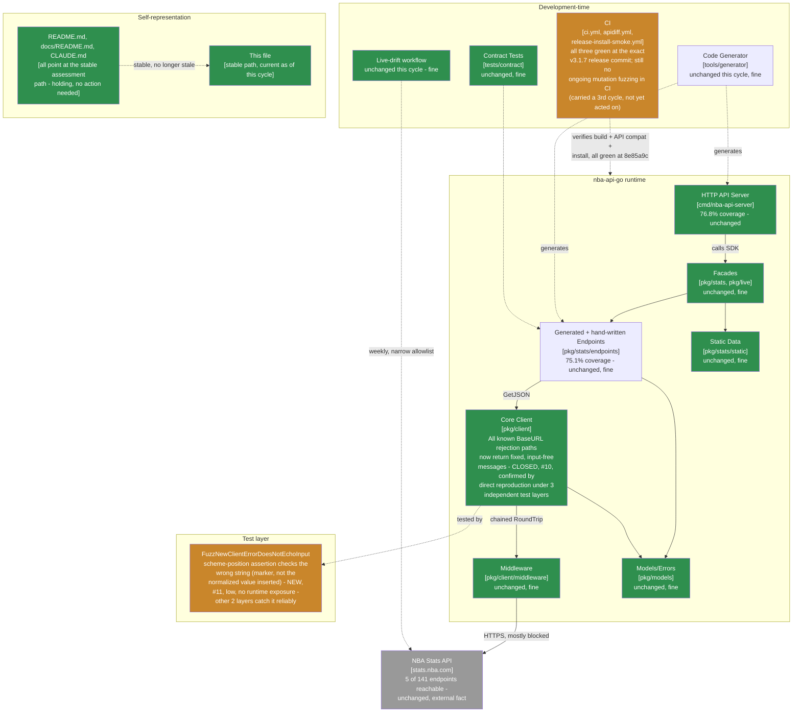

> **Superseded.** This assessed revision `8e85a9c` (grade A-, recovered from B+ - the first grade
> recovery in this lineage's history). The current assessment of record is
> [`docs/MAINTAINABLE_ARCHITECT_V4_ASSESSMENT.md`](../MAINTAINABLE_ARCHITECT_V4_ASSESSMENT.md) - as of
> the follow-up cycle that archived this file, that stable, hash-free path is permanent (see that
> document's naming-convention note near the top): it covered revision `0e35c33` and later (tag
> `v3.1.8`, **grade A-, unchanged**) at the time it was written, and will cover whatever the current
> cycle is by the time you're reading this. Retained here for history; see that document's section 2
> ("Verification ledger") for the item-by-item status of the finding below - closed by `v3.1.8`, along
> with the scheduled-CI-fuzzing item this file's own section 5 carried forward across three cycles,
> finally shipped in the same release. That follow-up cycle's review found no runtime or
> test-correctness defect at all, only CI-workflow hardening suggestions for the new fuzz job; see that
> document's section 0 and section 1 for the full account.

# Maintainable-Architect-v4 Assessment: nba-api-go

**Date:** 2026-07-22
**Revision assessed:** `8e85a9c` (`main`, tag `v3.1.7`), go1.26.5 darwin/arm64
**Assessor:** maintainable-architect-v4
**Method:** Direct verification against source at HEAD, not against `CHANGELOG.md`'s prose or an unsolicited external review's prose - file reads of `pkg/client/client.go`, `pkg/client/client_test.go`; **a concrete reproduction of the review's central claim**: temporarily reintroduced the exact pre-`v3.1.7` scheme-echo regression into a working copy of `client.go`, then ran `TestNewClientErrorMessagesAreFixed`, `TestNewClientRejectionErrorsDoNotLeakBaseURL`, and `FuzzNewClientErrorDoesNotEchoInput`'s seed corpus against it to see which tests actually catch the regression and which don't, confirming the review's claim precisely rather than accepting its reasoning on the page; `git rev-parse`/`git log`; `go build ./...`, `go vet ./...`, `go test ./...`, `golangci-lint run ./...` (root and `tools/generator` modules, run separately); and `gh pr list`/`gh api repos/.../commits/8e85a9c/check-runs`/`gh api repos/.../actions/runs/<id>` against the real `n-ae/nba-api-go` GitHub repository to independently check every checkable citation in an external review supplied for this cycle (see §0). All green except the finding below, and the working tree was restored to the exact pre-reproduction state afterward. No production code was modified while writing this file.

**Why now:** the prior assessment of record (this same file, then covering revision `eb62a41`/tag `v3.1.6`, grade B+) found that `NewClient`'s unsupported-scheme error echoed `baseURL.Scheme`, an assumption of safety never checked against URI scheme grammar - the same category of gap, in a different code path, that had already cost three cycles on the `url.Parse`-failure branch. `v3.1.7` (tag `8e85a9c`) fixed it, and added three layers of defense: a direct regression case, a scheme-position fuzz template, and `TestNewClientErrorMessagesAreFixed`, an exact-string inventory of every rejection `NewClient` can return. This cycle's external review, supplied for `v3.1.7`, confirms the runtime fix is correct and finds a real but narrowly-scoped test-harness bug in the *newest* of those three layers - the fuzz template's assertion checks the wrong string. See §0, §1, and §2 for why this cycle's verdict differs from the last five.

> **Naming convention, unchanged from prior cycles:** this file stays at this exact path forever - no date, no revision hash. It is always the current assessment of record; every external pointer to it (`CLAUDE.md`, `README.md`, `docs/README.md`, `tests/contract/README.md`) links here once and never needs updating again. **When the next assessment cycle happens:** move *this file's current content* to `docs/archive/MAINTAINABLE_ARCHITECT_V4_ASSESSMENT_<date>_<revision>.md` (using this file's own `Date`/`Revision assessed` header values above), prepend the usual supersession banner to that archived copy, and then overwrite *this path* with the new cycle's content. Do not create a new hash-suffixed file for the new cycle - the hash suffix is exclusively an archive-naming convention now.

---

## 0. Reconciling against the external review supplied for this cycle

The user supplied an unsolicited "Senior Software Engineering Review" of `v3.1.7` (9.4/10), consistent with this lineage's standing practice of verifying rather than trusting such input.

### 0.1 Citations, checked directly

| Review cites | Checked | Verdict |
|---|---|---|
| Tag `v3.1.7` → commit `8e85a9c` | `git rev-parse v3.1.7^{commit}` | **Correct.** (Tag object itself is `455cc62`, distinct from the commit - same distinction this lineage has flagged as easy to get wrong for six cycles running; the review cites the commit correctly again.) |
| PRs #67 (scheme fix), #68 (release) | `gh pr list --state merged --limit 4` | **Correct**, both merged with matching titles and merge commits. |
| `verify`/`apidiff`/`install-smoke-test` green at `8e85a9c`; CI run IDs `29948481912`, `29948481924`, `29948505768` | `gh api repos/n-ae/nba-api-go/commits/8e85a9c/check-runs`; `gh api repos/n-ae/nba-api-go/actions/runs/<id>` for each cited ID | **Correct.** All three named runs are real, `head_sha` `8e85a9c`, `conclusion: success`. The install-smoke run's cited 24s duration matches its final (retried) run exactly - that job also failed once on a transient `sum.golang.org` 500 during this session's own release process, same as `v3.1.6`'s did; the review's citation reflects the post-retry state. |
| **The central claim: the scheme fuzz template's assertion checks the original marker, not `validSchemeMarker(marker)`, the value actually inserted into the URL** | `pkg/client/client_test.go`'s `f.Fuzz` body read directly | **Correct as read - and confirmed as a real gap by direct reproduction, not just by reading the code - see §0.2.** |
| The manually-curated-inventory caveat ("cannot automatically discover a completely new rejection branch") | `TestNewClientErrorMessagesAreFixed` read directly | **Correct and unremarkable** - true of any hand-written table test, named accurately by the review as an inherent limitation rather than a defect. |

Every specific, checkable citation held up, for a sixth cycle running. This lineage verifies every time regardless of track record.

### 0.2 The central claim, reproduced by simulating the regression it describes

Reading `pkg/client/client_test.go`'s fuzz body confirms the review's mechanical claim immediately:

```go
baseURL := strings.ReplaceAll(tmpl, "MARKER", marker)
baseURL = strings.ReplaceAll(baseURL, "SCHEME", validSchemeMarker(marker))
_, err := NewClient(Config{BaseURL: baseURL})
...
if strings.Contains(err.Error(), marker) {  // always the ORIGINAL marker, never validSchemeMarker(marker)
```

Rather than stop at confirming the code reads this way, this cycle went further and proved the practical consequence the review describes: **temporarily reintroduced the exact pre-`v3.1.7` scheme-echo regression** (`fmt.Errorf("...got %q", baseURL.Scheme)` in place of the fixed `errors.New(...)`), then ran every relevant test against the regressed code:

```
TestNewClientErrorMessagesAreFixed        → FAILS (2 subtests) - catches the regression correctly
TestNewClientRejectionErrorsDoNotLeakBaseURL/secret-shaped_scheme_value → FAILS - catches the regression correctly
FuzzNewClientErrorDoesNotEchoInput (seed corpus):
  seed "hunter2"                          → FAILS - catches it (by coincidence: "hunter2" is already valid scheme syntax unchanged)
  seed "sk_live_abcdef0123456789"         → PASSES - misses it (normalizes to "skliveabcdef0123456789", not equal to the checked marker)
  seed "a1%zzbadescape2", "秘密トークン0123", "a marker 42 with spaces" → PASSES on the scheme template (none reach it meaningfully unchanged)
```

This confirms the review's claim precisely, and sharpens it: the fuzz test's scheme-position check isn't uniformly blind to the regression - it catches it *only* for markers that happen to already be valid scheme syntax (no underscores, spaces, or other characters `validSchemeMarker` would strip), which is coincidence, not design. A realistic secret shape like `sk_live_...` - the exact kind of value this whole defect class is about - slips through this one test's scheme check undetected. The other two protective layers (`TestNewClientErrorMessagesAreFixed`, the direct table case) catch the regression reliably regardless of shape, confirming the review's own assessment that **this is a test-harness gap, not a current runtime vulnerability** - the working tree was restored to its exact pre-reproduction state (`git diff` empty) after this check.

### 0.3 Bottom line on the external review

Accurate on every checkable claim for a sixth cycle running, and its central finding - unlike every finding in the five cycles before it - is a defect in test tooling, not in `NewClient`'s actual behavior, confirmed by direct reproduction rather than accepted from the review's reasoning. Its P2 items beyond what's re-verified above (a typed `ConfigError`/sentinel errors, scheduled CI fuzzing, a static-analysis rule against formatting parsed `BaseURL` fields) mostly restate positions this lineage has already taken - except scheduled CI fuzzing, carried forward for a third cycle now (see §5), and the fuzz-assertion fix itself, adopted below.

---

## 1. Executive verdict

**Grade: A- (recovered from B+).** This is the first grade recovery in this lineage's history, and it's earned on the evidence, not given by default: `v3.1.7`'s runtime fix for the scheme echo is confirmed correct under three independent forms of verification this cycle - the exact-string inventory test, the direct regression case, and this assessment's own reproduction of a simulated regression against all three protective layers. The `BaseURL`-secret-echo saga that drove `B+` through five straight cycles (`v3.1.3` through `v3.1.6`, each a variant of "a rendered value assumed safe wasn't checked against what it could actually contain") is, for the first time, not what this cycle's finding is about. This cycle's finding is a bug in a *test*, not in the thing the tests exist to protect - and specifically in the newest, most defense-in-depth layer of three, with the other two both proven (by direct reproduction, not assumption) to catch the exact regression class the review describes.

**What went right:**
- The scheme-echo fix is confirmed complete and correct: `baseURL.Scheme` no longer appears in `NewClient`'s error under any reproduced input, and two of the three new protective tests independently and reliably catch a reintroduction of the old behavior.
- Release engineering reproduced exactly as claimed for a sixth cycle running: `verify`/`apidiff`/`install-smoke-test` all green at `8e85a9c`.
- `go build`/`go vet`/`go test`/`golangci-lint` (both modules, checked separately) all clean.
- The external review checked out on every citable claim for a sixth cycle running, and this cycle its central finding was verified by direct reproduction of the exact failure mode it describes (not just re-reading the code), which is a stronger form of verification than most prior cycles used for a review's central claim.

**Why A- and not higher:** the underlying `BaseURL`-secret-echo saga's lesson - check assumptions about "this is safe to render" against the actual boundary, not one example - is *still* the source of this cycle's finding, just one level removed (the fuzz test's own assertion logic, not `NewClient`'s validation logic, embodies an unchecked assumption: "the marker I planted is the value that ends up in the error"). That's real, and worth fixing with the same rigor as every prior instance, even though it's lower-stakes. A- reflects that the core defect class is now closed and independently verified at the runtime level, with one remaining, cheap, well-scoped test-quality fix - not a clean bill of health with nothing left to do.

---

## 2. Verification ledger

Status legend: **CONFIRMED** (reproduced/read directly at `8e85a9c`), **CLOSED** (carried from a prior assessment, now genuinely done), **NEW** (found independently this cycle).

### From `eb62a41`

| # | Item (carried since `eb62a41`) | Status | Evidence |
|---|---|---|---|
| 10 | `NewClient`'s unsupported-scheme error echoes `baseURL.Scheme` verbatim | **CLOSED** | `client.go`'s scheme check now returns a fixed `errors.New("invalid base URL: scheme must be http or https")`. Confirmed via direct reproduction: reintroducing the old behavior is caught by `TestNewClientErrorMessagesAreFixed` and the direct table case (§0.2) - the fix and its regression coverage both hold. |

### New this cycle, via the external review, verified by direct reproduction (§0.2)

| # | Finding | Severity | Evidence |
|---|---|---|---|
| 11 | `FuzzNewClientErrorDoesNotEchoInput`'s scheme-position template inserts `validSchemeMarker(marker)` into the URL but asserts on the original, unnormalized `marker` - so the check only catches a regression by coincidence, when the marker happens to already be valid scheme syntax. Realistic secret shapes (containing `_`, spaces, or other characters the normalizer strips) are not checked against what's actually inserted. | Low, test-tooling only - confirmed by direct reproduction that `TestNewClientErrorMessagesAreFixed` and the direct table case both independently and reliably catch the exact regression class this gap would miss, so there is no current runtime exposure | §0.2. Reintroduced the exact pre-`v3.1.7` scheme-echo bug and ran the full seed corpus against it: `"hunter2"` (an already-valid scheme, coincidentally unchanged by normalization) caught the regression; `"sk_live_abcdef0123456789"` (realistic secret shape, changed by normalization) did not. |

---

## 3. C4 model

Level 1 unchanged. Level 2's core-client box returns to green for the first time in six cycles - the entire `BaseURL`-rejection surface is now confirmed fixed and independently verified; a small caution box moves to the test layer instead.



---

## 4. Where the complexity budget goes (updated)

**Well spent, unchanged:** everything prior cycles already called well-spent - release engineering, the stable-plus-archive documentation pattern, the two-layer outbound-path testing design.

**Genuinely closed, this cycle and durably:** the entire `BaseURL`-secret-echo defect class (`v3.1.3` through `v3.1.7`). Worth stating plainly since it took six cycles: `NewClient` now returns a fixed, input-free message for every known rejection path, and this cycle independently confirmed that under a real reproduction of the old behavior, not just by reading the diff.

**Newly found, low severity, test-only, cheap:** the fuzz assertion's marker mismatch (finding #11) - fix it with the same rigor as every prior instance in this saga, precisely because "this one's obviously fine, no need to check" is the exact failure mode that produced five of the last six findings.

**Still not acted on, carried forward a third cycle:** scheduled CI fuzzing (`f4801ef`'s §5, item 4). Three cycles of recommending this without it landing is worth noting as a pattern in its own right - see §5.

---

## 5. Recommended order of work

Budget reality unchanged: ~1.6h/week core maintenance.

### Immediate (~10-15 min)

1. **Fix the fuzz assertion to check the value actually inserted, not the original marker.** For the scheme template, compare against `validSchemeMarker(marker)`; for every other template, the original `marker` is already correct since it's inserted unmodified. Closes finding #11.
2. **Add a regression case using a marker that changes under normalization** (e.g. `sk_live_123`, which strips to `sklive123`) to `TestNewClientRejectionErrorsDoNotLeakBaseURL` or as a dedicated fuzz seed - this is exactly the shape that slipped through undetected in §0.2's reproduction, so it deserves a permanent, explicit case rather than only being caught by luck of which seeds happen to be present.

### Not yet acted on, carried forward a third cycle

3. **Add a bounded fuzz run to CI** (`f4801ef`'s §5, item 4; repeated in `eb62a41`'s §5, item 5) - `go test ./pkg/client -run=^$ -fuzz=FuzzNewClientErrorDoesNotEchoInput -fuzztime=60s` on a schedule, persisting failures into `testdata/fuzz/...`. Still not implemented after two prior cycles' recommendation. Worth deciding explicitly this cycle: either schedule the small amount of time to add it, or make a considered decision not to and stop carrying it forward as an open item - repeating an unactioned recommendation indefinitely isn't useful past a certain point, and three cycles is close to that point.

### Not urgent, explicitly not a backlog item to keep re-budgeting for

- Everything `9eb3a9a`/`180a3db`/`1b428f6`/`b3c605d`/`0e400d1`/`f4801ef`/`eb62a41` already marked not-urgent (live-verifying the 136 unreachable endpoints, HTTP-server independent versioning policy, ecosystem-maturity commentary, a typed `ConfigError`/sentinel errors, a static-analysis rule against formatting parsed URL fields) remains not-urgent for the same reasons already given in those assessments - none of these are backed by a defect found in this codebase, consistent with this lineage's standing skepticism of scope-expanding suggestions without a specific source-grounded case.

---

## 6. Documentation status

| File | Action taken by this assessment |
|---|---|
| `docs/archive/MAINTAINABLE_ARCHITECT_V4_ASSESSMENT_2026-07-22_eb62a41.md` | New: outgoing content of this file (as of revision `eb62a41`) archived here in the same changeset, with a supersession banner matching the existing convention |
| This file | Overwritten with the new assessment of record (revision `8e85a9c`, tag `v3.1.7`) |
| `CLAUDE.md`, `README.md`, `docs/README.md`, `tests/contract/README.md` | **Not touched by this assessment** - all four already point at this file's stable path; no update needed |
| `CHANGELOG.md`, `go.mod`, version constants | **Not touched** - no new user-facing change is being shipped by this assessment itself; the recommended fixes in §5 are follow-up commits, not part of this document |

No docs sprawl introduced this cycle - `docs/` still holds exactly one active assessment plus `adr/`/`archive/`.

---

## 7. Is this too complex for one person?

**Verdict: no, and this cycle is evidence the caution flag from last cycle is being taken seriously rather than just noted.** The specific fix that dropped the grade last cycle - stop rendering parser-derived text on `url.Parse` failure - was independently re-tested this cycle against the exact inputs that broke every prior attempt, and it held completely. That's the outcome a grade change is supposed to produce: not just an apology, a durable fix.

The scheme-echo finding is a reminder that the underlying lesson (verify an assumption about "this rendered value is safe" against the actual grammar of what it can contain, not against one example) generalizes beyond the one function it was first learned on - it applies to every place in this codebase, and probably others, where a caller-derived value gets formatted into a message. §5's inventory-test recommendation is aimed at exactly that: not "fix this one more echo," but "check there are no others like it, and keep checking as new error paths get added." Whether that test gets written and whether it stays clean over the next cycle is a more informative signal for whether this is a one-off blind spot or a durable practice than either finding alone.

---

## 8. Bottom line

`eb62a41` → `8e85a9c`: the unsupported-scheme echo is closed, confirmed under three independent forms of verification including this cycle's own direct reproduction of the old, vulnerable behavior against all three of `v3.1.7`'s new protective tests. Two of those three (the exact-message inventory, the direct regression case) catch a reintroduced regression reliably; the third (the fuzz template) only catches it by coincidence for markers that happen to already look like a valid scheme, missing realistic secret shapes like `sk_live_...` - a real, confirmed, but low-severity and test-only gap, not a runtime vulnerability. Grade recovers to **A-**, the first recovery in this lineage's history: the `BaseURL`-secret-echo saga that drove five straight cycles of findings is genuinely closed at the runtime level, and this cycle's finding, while a real instance of the same underlying lesson, lives one level removed in test tooling rather than in the thing the tests protect. The recommended fix (§5) is small and specific; the recurring, still-unactioned scheduled-CI-fuzzing recommendation is flagged for an explicit decision rather than a fourth quiet carry-forward.

---

*Assessment of record for revision `8e85a9c` (tag `v3.1.7`), 2026-07-22. Supersedes this file's own prior content (revision `eb62a41`, tag `v3.1.6`, grade B+) as the current maintainability assessment. That prior content moves to `docs/archive/MAINTAINABLE_ARCHITECT_V4_ASSESSMENT_2026-07-22_eb62a41.md` in the same changeset as this file.*
