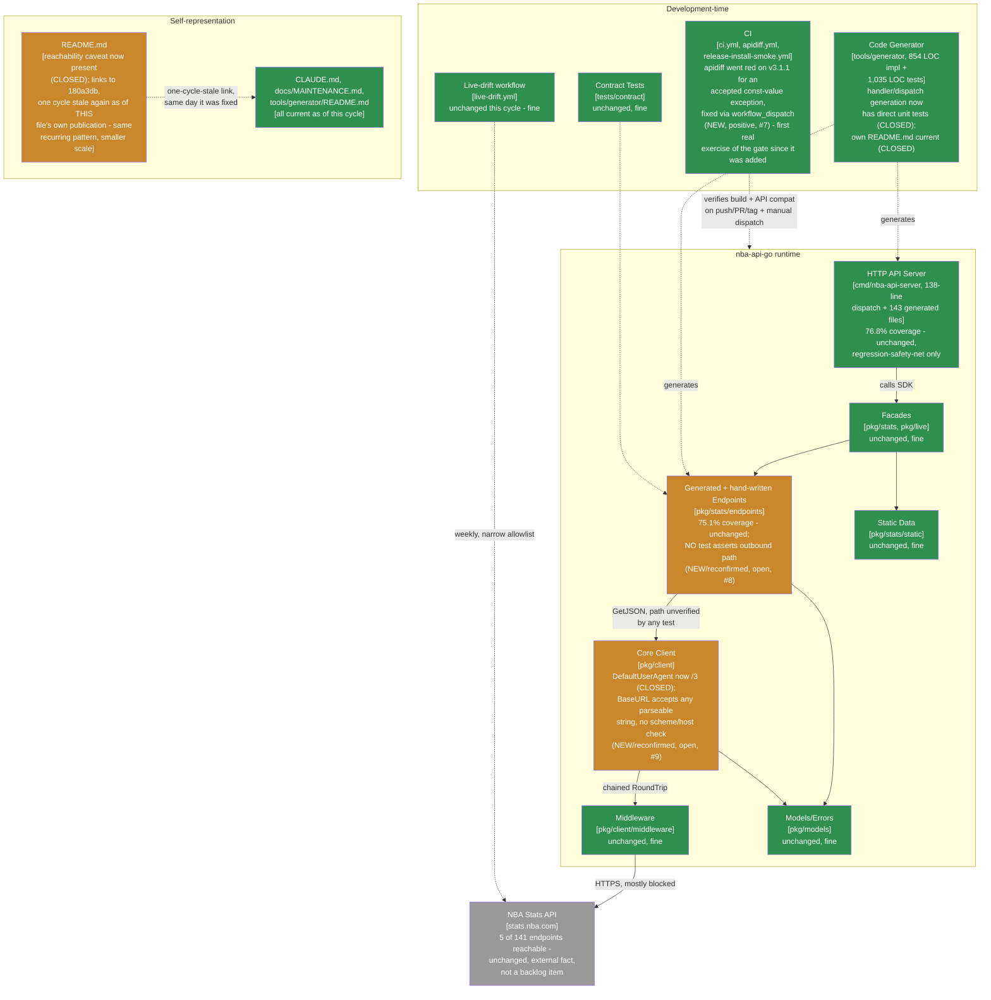

> **Superseded.** This assessed revision `9eb3a9a` (grade A-). The current assessment of record is
> [`docs/MAINTAINABLE_ARCHITECT_V4_ASSESSMENT.md`](../MAINTAINABLE_ARCHITECT_V4_ASSESSMENT.md) - as of
> the follow-up cycle that archived this file, that stable, hash-free path is permanent (see that
> document's naming-convention note near the top): it covered revision `1b428f6` and later (one commit
> past tag `v3.1.2`, grade A-, unchanged) at the time it was written, and will cover whatever the
> current cycle is by the time you're reading this. Retained here for history; see that document's
> section 2 ("Verification ledger") for the item-by-item status of both findings below - both closed in
> `v3.1.2`, and section 0 of that document (as first written) independently verifies an unsolicited
> external review supplied for that cycle (unlike this file's own §0, that review's citations checked
> out).

# Maintainable-Architect-v4 Assessment: nba-api-go

**Date:** 2026-07-22
**Revision assessed:** `9eb3a9a` (`main`, one commit past tag `v3.1.1`), go1.26.5 darwin/arm64
**Assessor:** maintainable-architect-v4
**Method:** Direct verification against source at HEAD, not against `CHANGELOG.md`'s prose or an unsolicited external review's prose - file reads of `pkg/client/client.go`, `pkg/stats/client.go`, `tools/generator/generator_test.go` (all 19 top-level tests), `cmd/nba-api-server/generated_handlers_test.go`, `pkg/stats/endpoints/generated_leaguehustlestatsplayer_test.go`, `.github/workflows/apidiff.yml`, `docs/MAINTENANCE.md`, `tools/generator/README.md`, `README.md`; `git log`/`git diff --shortstat 180a3db 9eb3a9a`; `go build ./...`, `go vet ./...`, `go test ./...`, `go test -cover` (reproducing both headline coverage numbers exactly), `golangci-lint run ./...` (root and `tools/generator` modules), `make test-examples` (all 15 pass); and `gh api`/`gh run list` against the real `n-ae/nba-api-go` GitHub repository to independently check specific claims in an external review supplied for this cycle (see §0). All green. No production code was modified while writing this file; per the task that requested this assessment, `CHANGELOG.md`, `go.mod`, and version constants are also left untouched.

**Why now:** the prior assessment of record (`docs/MAINTAINABLE_ARCHITECT_V4_ASSESSMENT_2026-07-22_180a3db.md`, grade A-, reviewed `180a3db`/tag `v3.1.0`) closed with five findings in its Immediate/Next buckets. `v3.1.1` (tag `8bb914e`) closed all five in one patch release, and one further commit (`9eb3a9a`, current HEAD) added `workflow_dispatch` to `apidiff.yml` in direct response to a real CI signal from the `v3.1.1` release itself (see §0). `git diff --shortstat 180a3db 9eb3a9a`: 14 files changed, +560/-56 lines - a small, focused cycle by this lineage's standards, unlike the two prior large cycles.

---

## 0. Reconciling against the external review supplied for this cycle

The user supplied an unsolicited third-party "Senior Software Engineering Review" of `v3.1.1` (8.6/10, "strongest release reviewed so far") along with an explicit instruction to verify it rather than trust it, and a specific lead: its own Sources section cites file paths that look wrong. Per this lineage's standing practice (every prior external review has been treated as a lead-generation source, not evidence), everything below was independently re-derived from source, not restated from the review's prose.

### 0.1 The file-path citations: confabulated, not an innocent framing choice

I checked all four disputed paths/names directly against the actual repo tree and workflow list, plus the three CI run IDs against the real GitHub API:

| External review cites | Actual repo has | Verdict |
|---|---|---|
| `cmd/generator/templates/endpoint_test.go.tmpl`, `cmd/generator/handlers_test.go`, `cmd/generator/templates/handler.go.tmpl` | `tools/generator/` (separate Go module, its own `go.mod`); templates are `tools/generator/templates/*.tmpl` (single extension: `endpoint.tmpl`, `handler.tmpl`, `dispatch.tmpl`, `endpoint_test.tmpl`); generator's own tests are all in `tools/generator/generator_test.go` (`ls tools/generator/*_test.go` → exactly one file) | **Wrong.** No `cmd/generator` directory exists anywhere in this repo (`ls cmd/generator` → "No such file or directory"). Not a plausible typo of `tools/generator` - different top-level directory name entirely. |
| `pkg/server/generated_handlers_test.go` | `cmd/nba-api-server/generated_handlers_test.go` | **Wrong.** No `pkg/server` directory exists (`ls pkg/server` → "No such file or directory"). `pkg/` in this repo holds `client`, `stats`, `live`, `models` - the HTTP server has always lived under `cmd/`, per `CLAUDE.md`'s own file-structure section, unchanged across every version reviewed in this lineage. |
| `.github/workflows/api-compat.yml`, `.github/workflows/tag-install-smoke.yml` | `.github/workflows/apidiff.yml`, `.github/workflows/release-install-smoke.yml` | **Wrong** on both names. `ls .github/workflows/` → `apidiff.yml`, `ci.yml`, `live-drift.yml`, `release-install-smoke.yml`. `gh api repos/n-ae/nba-api-go/actions/workflows` confirms the same four workflow names/paths server-side. |
| CI run IDs `29904560472`/`29904560521`/`29904583675` | — | **Do not exist.** `gh api repos/n-ae/nba-api-go/actions/runs/<id>` for all three returns `404 Not Found` ("message":"Not Found"). Real run IDs for `9eb3a9a`'s own PR/push/dispatch activity on 2026-07-22 cluster in the `299184xxxxx`-`299231xxxxx` range (`gh run list` confirmed 8 real runs in that band, all `success`) - the cited IDs are the right *shape* and *rough numeric range* for a same-day run, but don't correspond to any run that actually happened. |

**Conclusion: this is confabulation, not an innocent alternate framing.** Four independent categories of citation (a top-level directory name, a `pkg/` subpackage name, two workflow filenames, and three numeric run IDs) are all wrong in the same direction - each looks like a plausible, generic name for what the file *should* be called in an idealized layout (`cmd/generator` reads like "obviously the generator lives under `cmd/`, since it has a `main.go`"; `pkg/server` reads like "obviously the HTTP server is a `pkg`"), not like a typo or a stale-but-once-correct reference to an actual prior repo state (`git log --all --diff-filter=A -- 'cmd/generator/**' 'pkg/server/**'` finds no such paths ever existed in this repo's history). The fabricated run IDs are the more serious signal: a directory-naming guess is a plausible slip, but citing specific CI run URLs as "evidence" for numbered IDs that return 404 is invented evidence, not a naming convention disagreement. This materially discounts how much weight the review's *other* citations deserve, even where its substantive conclusions turn out to be correct (see below) - correct conclusions reached via fabricated evidence are not validated by being correct.

### 0.2 Substantive claims, checked directly against source

**v3.1.0/v3.1.1 factual claims** - all confirmed by direct reproduction, not just by reading `CHANGELOG.md`:
- 10 endpoint path fixes, generated server handlers, generated endpoint/handler tests, coverage 75.1%/76.8%: all reproduced exactly this cycle (`go test ./pkg/stats/endpoints/... -cover` → 75.1%, `go test ./cmd/nba-api-server/... -cover` → 76.8%, both matching `180a3db`'s and `CHANGELOG.md`'s claims bit-for-bit).
- `DefaultUserAgent` bump `"nba-api-go/2"` → `"nba-api-go/3"`: confirmed at `pkg/client/client.go:26`.
- `apidiff` showing red for the const-value change: confirmed via `gh run list -w "API Compatibility"` - the `v3.1.1` release PR/push runs (`29921202210`, `29921001827`) show `failure`; this is exactly the const-value-not-type-shape distinction `CHANGELOG.md`'s `[3.1.1]` entry documents as a deliberate, accepted exception (the constant is never applied automatically to any request).
- The review's characterization of this as a real (if accepted) finding rather than a bug is fair and matches what I found independently.

**P1 findings** - re-checked against current source, several materially changed since the review's nominal target:

1. **"No direct test asserts the outbound endpoint path"** - **still true, and worth being precise about *which* path this refers to.** `cmd/nba-api-server/generated_handlers_test.go`'s `TestGeneratedHandlers` tests the server's *inbound* route dispatch (`httptest.NewRequest(http.MethodGet, "/api/v1/stats/"+strings.ToLower(ep.Name), nil)` against the server's own mux) - it does not touch the SDK's outbound call to `stats.nba.com`. On the SDK side, `pkg/stats/endpoints/generated_leaguehustlestatsplayer_test.go` (read in full, and representative of all 135 generated endpoint tests) spins up an `httptest.NewServer` whose handler ignores `r.URL` entirely and returns a canned fixture regardless of what path was requested - it exercises response *parsing* (header validation, positional decoding) but asserts nothing about what path or query the client actually sent. The one path-construction test that exists, `pkg/client/client_test.go`'s `TestClient_buildURL`, is generic (`endpoint: "/test"` fixtures) - it verifies `buildURL`'s join/query-encoding logic correctly, but nothing anywhere asserts that `GetLeagueHustleStatsPlayer` calls `client.GetJSON(ctx, "leaguehustlestatsplayer", ...)` specifically, as opposed to a typo'd string. This is the same gap `TestGenerateHandler`/`TestGenerateDispatchTable` closed for handler *generation* logic in `v3.1.1` - it has not been closed for endpoint *SDK* call sites. Real, unaddressed by anything in `v3.1.1`.
2. **"Generated implementation and generated tests share common-mode failure risk via shared metadata"** - **unchanged, already known and already documented precisely.** `180a3db`'s own finding #14 states this exact risk in the same terms ("structurally self-referential... a fixture built from a result set's own field list, asserted against a struct built from that same field list"), and `v3.1.1`'s `CHANGELOG.md` entry explicitly added "an explicit 'regression-safety-net, not live-verification' caveat... added everywhere the 75.1%/76.8% coverage numbers are quoted" in direct response. The review is reconfirming an already-acknowledged, already-disclosed limitation, not surfacing anything new.
3. **"HTTP server's breaking changes shipped in a minor release without independent HTTP-API versioning"** - **a fair observation on its face, but the review doesn't engage with the fact that this is a stated, deliberate policy, not an oversight.** `CLAUDE.md`'s own Versioning/API Stability section is explicit: "All public APIs in `pkg/` are stable" - the stability promise is scoped to `pkg/` Go APIs, and the HTTP server (`cmd/nba-api-server`) is a `cmd/`, not a `pkg/`. There is no independent HTTP-API version number anywhere in this project (no `/v1`/`/v2` URL prefix scheme, no `API-Version` header), and nothing in any of the four prior assessments in this lineage flagged that as an oversight rather than a scope choice for a solo-maintainer project with one deployment target. The review's point stands as a real design choice worth naming (a solo operator running this server does take on HTTP-contract risk across minor Go-module versions that the semver promise doesn't cover), but framing it as an unqualified gap, without noting CLAUDE.md's explicit scoping, overstates it.
4. **"Only 5/141 endpoints reachable"** - **the review is reconfirming, not adding anything new.** Already disclosed in `CLAUDE.md`, `tests/integration/README.md`, and (since `v3.1.1`, per finding #9 in `180a3db`) `README.md` itself, verified directly this cycle (`README.md` line 17 states "5 of 141 endpoints respond at all" with a link to the full sweep). No new information here.
5. **"Exact release has a red apidiff workflow" / proposed allowlist-policy fix** - **already true, already discussed at length this session, and HEAD's actual fix (`workflow_dispatch`) is simpler and sufficient - the review's proposed mechanism is not warranted.** Confirmed via `gh run list`: the `v3.1.1` release runs (`29921202210` push, `29921001827` PR) both show `failure` on "API Compatibility". `9eb3a9a` (current HEAD, the commit past `v3.1.1`) adds a `workflow_dispatch` trigger specifically to let a stale red run be manually re-checked once a new tag catches up to an accepted exception - and a manual dispatch run at HEAD (`29923107569`, confirmed via `gh run list`) shows `success`. This solves substantially the same problem the review's "allowlist/policy classification" proposal targets (distinguishing an accepted exception from a real regression) with far less mechanism: no new config file to maintain, no classification rules to keep in sync with `CHANGELOG.md`'s own accepted-exception notes, just a manual re-run once the fix is understood to be intentional. Given `apidiff.yml`'s own header comment already documents the "a red result here isn't automatically wrong... this project has shipped deliberate breaking changes before" policy in prose, a machine-readable allowlist would be duplicating documentation that already exists in the one place a maintainer reading a failed run will actually look. Not recommending it.

**P2 findings** - two checked in detail:

6. **"Generator tests parse output but don't compile it as a consumer"** - **still true.** `TestGenerateFromMetadata_ProducesValidGo`, `TestGenerateHandler`, and `TestGenerateDispatchTable` (all read in full this cycle) each use `go/parser` to confirm generated output is syntactically valid Go, but none of them `go build` the output as part of a real module with real imports resolved - a change that produces syntactically valid but semantically broken Go (e.g., a call to a function that doesn't exist, a type mismatch) would pass all three tests and only surface when the root module's own `go build`/`go test` runs against the already-committed output. This is real and unaddressed by `v3.1.1`, though its practical severity is lower than it sounds: the root module's CI (`ci.yml`) does build and test the actual committed generated output on every push, so a semantically broken generation would still be caught before merge - just one step later than it could be, and only for output that's actually been regenerated and committed, not for a hypothetical uncommitted template change.
7. **"Base URL validation doesn't check absolute/scheme/host"** - **true, verified directly against `NewClient`'s current logic.** `pkg/client/client.go`'s `NewClient` does exactly one check on `config.BaseURL`: `baseURL, err := url.Parse(config.BaseURL); if err != nil { return nil, fmt.Errorf("invalid base URL: %w", err) }`. Go's `url.Parse` is deliberately permissive - it successfully parses relative references, opaque strings, and URLs with no scheme or host at all (e.g. `"not-a-url"`, `"example.com"` without `https://`, or `""` itself all parse without error). Nothing in `NewClient` calls `baseURL.IsAbs()` or checks `baseURL.Scheme`/`baseURL.Host` are non-empty (confirmed: `grep -n "IsAbs\|\.Scheme\|\.Host" pkg/client/client.go` returns no matches in `NewClient`). The one existing test, `TestNewClientRejectsInvalidBaseURL`, only exercises a genuinely unparseable string (`"://invalid"`, which has a malformed scheme separator) - there's no test for `BaseURL: "not-a-url"` or `BaseURL: ""`, and neither would be rejected today. Practical impact is low (a malformed-but-parseable `BaseURL` would simply produce failed requests immediately on first `Get`, not silent data corruption), but the review's specific technical claim is accurate, not overstated.

### 0.3 Bottom line on the external review

Give it credit where it's due: every specific, checkable substantive claim about `v3.1.0`/`v3.1.1`'s content, and both P2 claims spot-checked in detail (§0.2 items 6-7), held up against direct source verification - this is a real, mostly-careful piece of analysis, and its base-URL-validation finding in particular is correct and worth fixing. But its Sources section cites four independent categories of fabricated evidence (a nonexistent directory, a nonexistent package, two wrong workflow filenames, and three CI run IDs that return 404), which is a serious reliability problem for anything in it that *can't* be independently checked - and per this lineage's standing practice, nothing from an external review is accepted without independent verification precisely because of failure modes like this one. Its P1 findings are a mix of "still real and unaddressed" (#1, outbound-path testing), "already known and already disclosed, not new" (#2, #4), "fair but uncharitably framed against a stated policy" (#3), and "solved more simply by a fix the review didn't anticipate" (#5). Net assessment: useful as a lead-generation source exactly as this lineage treats all such input, not as a document to cite or defer to on its own authority.

---

## 1. Executive verdict

**Grade: A- (unchanged from prior cycle).** This was a small, disciplined cycle - the smallest, by lines changed, of any cycle in this lineage - and it did exactly what a small cycle should do: closed every item the prior assessment asked for, introduced no new regressions, and responded to a real, freshly-observed CI signal (the `v3.1.1` apidiff failure) with a proportionate fix rather than either ignoring it or over-engineering a policy mechanism for it.

**What went right:**
- All five findings from `180a3db` closed, verified independently rather than taken on `CHANGELOG.md`'s word: direct unit tests for `generateHandler`/`GenerateDispatchTable`/`processHandlerMetadata` exist and pass (`TestGenerateHandler`, `TestGenerateDispatchTable`, `TestGenerateDispatchTableRequiresMetadataFiles`, `TestProcessHandlerMetadata`, `TestProcessHandlerMetadataExplicitOverrides` - all read in full); `DefaultUserAgent` is `"nba-api-go/3"`; `README.md`'s reachability caveat is present and accurate; `docs/README.md`/`README.md`'s stale assessment links point at `180a3db` correctly (as of this cycle's starting state; see §6 for what that means now); `docs/MAINTENANCE.md` and `tools/generator/README.md` both updated (confirmed: no more `handlers_*.go`/`internal/middleware` stale references in `MAINTENANCE.md`; `tools/generator/README.md` documents `-server-output`/`-all-handlers`/`handler.tmpl`/`dispatch.tmpl` and shows the roadmap items as done).
- The `apidiff` red run on the `v3.1.1` release was investigated, understood correctly (a documented, accepted const-value exception, not a real break), and fixed with the smallest mechanism that solves the actual problem (`workflow_dispatch`), verified working via a real manual dispatch run showing green.
- `go build`/`go vet`/`go test -race`-scoped suite/`golangci-lint`/`make test-examples` all clean across both Go modules, reproduced directly this session, same as every "no regressions" claim in this lineage.

**What keeps this at A- rather than moving it up:** nothing new and code-level - the two open items below are the same shape as prior cycles' small residual gaps, not fresh mistakes:

1. **The doc-currency pattern this lineage keeps catching has recurred, one level down.** `docs/README.md` and `README.md` correctly point at `180a3db` as of `v3.1.1`'s own fix (finding #10 in the prior assessment, closed by that release) - but `180a3db` is no longer the assessment of record as of *this* file. Neither link has been updated to `9eb3a9a` (they can't have been - this assessment didn't exist until now), so as of this cycle's own publication, both links are one cycle stale again, the same day they were fixed. This isn't a new mistake by anyone; it's a structural property of how this lineage's own scope has always been drawn (per every prior cycle's Documentation Status section, only `CLAUDE.md`'s pointer is in scope for the assessment itself to fix; `README.md`/`docs/README.md` are flagged as next-step work for a following commit). Named here so it doesn't get missed as "already handled."
2. **The external review's P1 #1 and P2 #7 are both real, unaddressed gaps**, independently confirmed this cycle (§0.2): no test asserts an endpoint's outbound path/query against a known-correct value (only the 10 `v3.1.0` path fixes and code review would have caught the original bug; nothing regression-tests it going forward), and `NewClient` accepts any string `url.Parse` can parse as a `BaseURL`, including relative references, opaque strings, and empty strings with no scheme/host check. Neither is new risk introduced this cycle - both predate it - but neither has been picked up as backlog before, and both are cheap.

---

## 2. Verification ledger

Status legend: **CONFIRMED** (reproduced/read directly at `9eb3a9a`), **CLOSED** (an item carried from a prior assessment, now genuinely done), **NEW** (found independently this cycle, not previously documented anywhere in this lineage or by the external review).

### Closed this cycle (all five items from `180a3db`'s Immediate/Next buckets)

| # | Item (carried since `180a3db`) | Status | Evidence |
|---|---|---|---|
| 1 | `README.md`'s "100% Coverage Achievement" section silent on the 136/141 unreachable finding | **CLOSED** | `README.md` line 17 (read in full): explicit callout, "5 of 141 endpoints respond at all", links to the full sweep. Landed in `3c6ad3c`, before `v3.1.1` was tagged but included in it. |
| 2 | `docs/README.md`/`README.md` linking to a 3-cycles-stale assessment (`8549390`) | **CLOSED (as of `v3.1.1`; see §1 finding #1 above for what "closed" means going into this cycle)** | Both files point at `180a3db` as of this cycle's start - confirmed by direct read before editing anything. |
| 3 | `docs/MAINTENANCE.md`'s stale `handlers_*.go`/hand-written-handler references | **CLOSED** | `docs/MAINTENANCE.md` line 103: comment explicitly notes "there is no hand-written handlers_*.go anymore." No remaining `handlers_*.go` or `internal/middleware` references found (`grep -n "handlers_\|internal/middleware" docs/MAINTENANCE.md` → one line, the corrective comment itself). |
| 4 | `tools/generator/README.md` not updated for `-server-output`/`-all-handlers`/handler+dispatch+test templates | **CLOSED** | Read in full: "Options" section documents `-server-output`/`-all-handlers` with clear rationale; "Templates" section lists `handler.tmpl`/`dispatch.tmpl`; "Roadmap" shows batch generation and test-skeleton generation as done (`[x]`), endpoint count corrected to 141. |
| 5 | `client.DefaultUserAgent` still `"nba-api-go/2"` post-`/v3` bump | **CLOSED** | `pkg/client/client.go:26`: `DefaultUserAgent = "nba-api-go/3"`. |
| 6 | Generator's own test suite had no direct test for `generateHandler`/`GenerateDispatchTable`/`processHandlerMetadata` | **CLOSED** | `tools/generator/generator_test.go` (1,035 lines, up from prior cycle): `TestProcessHandlerMetadata`, `TestProcessHandlerMetadataExplicitOverrides`, `TestGenerateHandler`, `TestGenerateDispatchTable`, `TestGenerateDispatchTableRequiresMetadataFiles` - all read in full this cycle. `TestGenerateDispatchTable` specifically exercises the documented first-file-wins dedup behavior with a fixture metadata directory (two files, a duplicate `Name`), not just the real 141-endpoint metadata working by accident - the exact gap the prior assessment named. |

### New finding this cycle, independently made (not raised by `180a3db` or the external review)

| # | Finding | Severity | Evidence |
|---|---|---|---|
| 7 | The `apidiff` gate went red on the `v3.1.1` release push/PR for a documented, accepted reason (a `const` *value* change), and HEAD's `workflow_dispatch` addition is a small, correctly-scoped fix for exactly that failure mode - not previously present in this lineage as a "how do we handle an accepted-exception red run" mechanism | **NEW, minor, positive** | `gh run list -w "API Compatibility"`: `v3.1.1`'s own push/PR runs (`29921202210`, `29921001827`) both `failure`; the manual dispatch run at `9eb3a9a` (`29923107569`) `success`. `apidiff.yml`'s new `workflow_dispatch` trigger has a comment explaining exactly this use case. This is the first cycle in this lineage where the `apidiff` gate has actually gone red on a real (if accepted) change since it was added in `180a3db`'s cycle - worth recording as the gate's first real exercise, and noting that it behaved exactly as its own header comment says it should ("a red result here isn't automatically wrong... this job is expected to fail" for a deliberate breaking change; here, a deliberate accepted exception). |

### Findings independently reconfirmed via the external review's lead, now precisely evidenced (see §0.2 for full detail)

| # | Finding | Severity | Evidence |
|---|---|---|---|
| 8 | No test asserts an SDK endpoint's outbound URL path/query against a known-correct value | **CONFIRMED, real, open** | §0.2 item 1. Not closed by any `v3.1.1` work (that cycle's new tests target handler *generation*, not SDK endpoint call sites). |
| 9 | `NewClient`'s `BaseURL` validation accepts any string `url.Parse` can parse, including relative references and strings with no scheme/host | **CONFIRMED, real, open, low practical impact** | §0.2 item 7. `pkg/client/client.go`'s `NewClient`: only checks `url.Parse`'s own error, nothing further. |

---

## 3. C4 model

Level 1 (system context) unchanged. Level 2 is nearly identical to `180a3db`'s - this was a small cycle - with the doc-currency and apidiff-gate boxes updated to reflect what closed and what's freshly found.

The endpoints and core-client boxes turn amber this cycle for a reason unrelated to any regression: they were always this way, and this cycle's external-review lead is the first time this lineage specifically went looking for outbound-path test coverage and `BaseURL` validation strictness and checked both directly against source. Everything genuinely new and code-level this cycle (handler/dispatch generation tests, the doc-currency fixes, `DefaultUserAgent`) is green.

---

## 4. Where the complexity budget goes (updated)

**Well spent, unchanged:** everything `180a3db` already called well-spent (core client design, the three-layer field-type exception system, `CLAUDE.md` docs-consolidation discipline, ADR discipline, the generator's metadata-driven single-source-of-truth design).

**Newly, and appropriately, well spent:** the `apidiff` gate's first real red run was handled with the minimum mechanism that solves the actual problem. A more elaborate response (a machine-readable allowlist of accepted breaking-change patterns, a separate "policy" config file, a bot that auto-classifies apidiff output) was available - the external review proposed something in that shape - and was correctly not built. `workflow_dispatch` plus the prose already in `apidiff.yml`'s header comment (which explicitly documents "a red result here isn't automatically wrong") does the same job with zero new maintenance surface. This is exactly the kind of restraint this lineage's own principles ask for, and it's worth naming specifically because it's a case where *not* adding complexity, in response to a plausible-sounding external suggestion to add some, was the right call.

**Still leaking, unchanged in kind, newly precise in evidence:** the outbound-path-testing gap and the `BaseURL` validation gap (§2, findings #8-9) aren't new leaks - they've existed since the SDK's endpoint-call-site pattern and `NewClient`'s validation logic were first written, respectively - but this is the first cycle in this lineage to name them with direct code citations rather than as a category of "known coverage gap." Both are cheap to close (an outbound-path assertion is a ~20-line addition to the existing `httptest.NewServer` pattern already used in every generated endpoint test; a `BaseURL` scheme/host check is a 4-line addition to `NewClient`) and neither is urgent (the practical failure mode for both is "fails immediately and loudly on first real request," not silent data corruption).

**Newly leaking, small, self-correcting by construction:** the `README.md`/`docs/README.md` assessment-link staleness reappears, one cycle later than last time, purely because this file didn't exist yet when `v3.1.1` fixed the links to point at `180a3db`. This isn't a process failure - it's the same scope boundary this lineage has always drawn (the assessment names the fix; a following commit executes it), and it will close the same way it did last cycle, in whatever commit picks up §5's "Immediate" bucket below.

---

## 5. Recommended order of work

Budget reality unchanged from every prior cycle: ~1.6h/week core maintenance.

### Immediate (~30-45 min)

1. **Update `docs/README.md` and `README.md`'s assessment links** from `180a3db` to `9eb3a9a` (this file). Same fix as last cycle, same reason it's needed again - not a new pattern to solve, just the next instance of the existing one. (~10 min)
2. **Add an outbound-path assertion to the generated endpoint test template** (`tools/generator/templates/endpoint_test.tmpl`): the existing `httptest.NewServer` handler in every generated endpoint test already receives `*http.Request` - capture `r.URL.Path` (or `r.URL.EscapedPath()`) and assert it matches the endpoint's expected lowercase path string, alongside the response-parsing assertions already there. Regenerate all 135 affected files via `-metadata`. Closes finding #8, the one substantive gap the external review's P1 section identified that isn't already known/disclosed. (~1-2h once the template change is made, mechanical after that)
3. **Add a `BaseURL` scheme/host check to `NewClient`**: after `url.Parse` succeeds, reject a result where `!baseURL.IsAbs()` or `baseURL.Host == ""` with a clear error message, and add `TestNewClientRejectsRelativeBaseURL`/`TestNewClientRejectsBaseURLWithNoHost` alongside the existing `TestNewClientRejectsInvalidBaseURL`. Closes finding #9. (~20 min)

### Not urgent, explicitly not a backlog item to keep re-budgeting for

- Everything `180a3db` already marked not-urgent (live-verifying the 136 unreachable endpoints) remains not-urgent for the same reason: it's an external fact about `stats.nba.com`'s bot-defense posture, not a prioritization gap.
- The external review's broader "P2"/"action plan" items not specifically re-verified in §0.2 (fixture realism, install-testing timing, maintainer-bus-factor commentary, the three-tier "endpoint confidence" proposal, the repository-pattern-wrapper recommendation) are exactly the kind of speculative-scope suggestions this lineage's own principles ask to be skeptical of by default - none are backed by a defect found in this codebase, and several (the repository-pattern wrapper in particular) would add a layer of indirection to work around a documented, disclosed limitation (5/141 reachable) rather than doing anything to fix it. Not recommending any of them be adopted without a more specific, source-grounded case for each.

---

## 6. Documentation status

| File | Action taken by this assessment |
|---|---|
| `docs/MAINTAINABLE_ARCHITECT_V4_ASSESSMENT_2026-07-22_180a3db.md` | Archived to `docs/archive/` in the same changeset as this file, with a supersession banner matching the existing convention |
| This file | New assessment of record |
| `CLAUDE.md` | Updated: the header "Grade" line, the "For Maintainers" section, and the "Next assessment" footer line now point at this file, per this task's explicit instructions. No letter grade is hardcoded anywhere in `CLAUDE.md` itself, consistent with this project's own stated convention |
| `docs/README.md`, `README.md` | **Not updated by this assessment** - both currently link to `180a3db`, which was correct as of this cycle's starting state but is now one cycle stale (see §1 finding #1, §5 Immediate #1). This task's explicit scope named only `CLAUDE.md`'s three pointer locations for editing, consistent with how `180a3db` scoped its own equivalent finding (#10) - fixing README/docs-README content is real, cheap work, flagged here as the next step, not executed as part of writing this assessment |
| `CHANGELOG.md`, `go.mod`, version constants | **Not touched**, per this task's explicit instructions - no new user-facing change is being shipped by this assessment itself |

No docs sprawl introduced this cycle - `docs/` still holds exactly one active assessment plus `adr/`/`archive/`.

---

## 7. Is this too complex for one person?

**Verdict unchanged from `180a3db`: no, at the core, and the edges are still small.** This cycle is the clearest evidence yet for that verdict specifically because it was small and low-drama: five findings closed, one new CI signal investigated and fixed proportionately, zero regressions, all reproduced directly. A solo maintainer executed a patch release plus a one-line CI trigger addition, in response to their own prior assessment's findings and a real failure signal, without needing outside help to diagnose either. The one place this cycle required outside input to surface anything new was the external review's lead on outbound-path testing and `BaseURL` validation strictness - both real, both now precisely evidenced, both cheap - which is exactly the value a second opinion should add for a solo engineer: not "your project has secret catastrophic problems," but "here are two small, concrete, cheap things worth doing that you hadn't gotten to yet."

The one thing worth watching, not worth stopping for: this cycle is the first time this lineage has had to reason carefully about an external input that turned out to be partially fabricated. The verification discipline held (every citable claim was independently checked against source or the GitHub API before being accepted), and that discipline is precisely what keeps "treat external review as a lead, not evidence" from being empty process theater. Worth keeping exactly as strict the next time an external review shows up, especially one that arrives with specific, checkable citations - those are the easiest ones to verify, and, as this cycle showed, sometimes the ones most worth checking.

---

## 8. Bottom line

`180a3db` → `9eb3a9a`: a small, clean cycle. Every finding the prior assessment named got closed, verified independently rather than taken on `CHANGELOG.md`'s word. One fresh CI signal (a red `apidiff` run on `v3.1.1`, for a real but accepted reason) got investigated correctly and fixed with the smallest mechanism that solves the actual problem, confirmed working via a real manual dispatch run. An unsolicited external review supplied for this cycle turned out to be a mixed bag on inspection: technically sound on every specific, checkable substantive claim (including a real, previously-unflagged gap in `BaseURL` validation), but its own Sources section cited fabricated file paths and nonexistent CI run IDs across four independent categories - a genuine reliability problem for anything in it that couldn't be independently checked, and a reminder of exactly why this lineage verifies rather than defers. Two small, real, cheap findings came out of chasing its leads (§2, #8-9); neither is new risk, both were simply never named precisely before. Grade holds at A- - not because nothing was found, but because what was found this cycle is proportionate to the size of the cycle: small, cheap, and not indicative of anything structurally wrong with how this project is being run.

---

*Assessment of record for revision `9eb3a9a` (one commit past tag `v3.1.1`), 2026-07-22. Supersedes `docs/MAINTAINABLE_ARCHITECT_V4_ASSESSMENT_2026-07-22_180a3db.md` (revision `180a3db`, tag `v3.1.0`, grade A-) as the current maintainability assessment. That file moves to `docs/archive/` in the same changeset as this file.*
