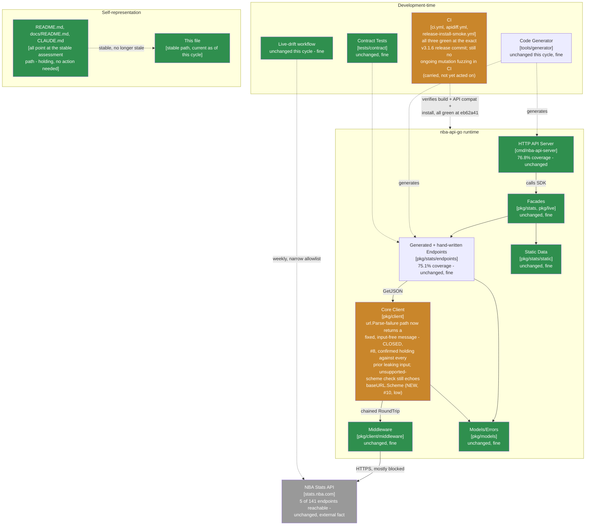

> **Superseded.** This assessed revision `eb62a41` (grade B+, unchanged from the prior cycle). The
> current assessment of record is
> [`docs/MAINTAINABLE_ARCHITECT_V4_ASSESSMENT.md`](../MAINTAINABLE_ARCHITECT_V4_ASSESSMENT.md) - as of
> the follow-up cycle that archived this file, that stable, hash-free path is permanent (see that
> document's naming-convention note near the top): it covered revision `8e85a9c` and later (tag
> `v3.1.7`, **grade A-, recovered from B+** - the first grade recovery in this lineage's history) at
> the time it was written, and will cover whatever the current cycle is by the time you're reading
> this. Retained here for history; see that document's section 2 ("Verification ledger") for the
> item-by-item status of the one finding below - closed by `v3.1.7`, confirmed by directly
> reproducing the old, vulnerable behavior against the new protective tests. A new, test-tooling-only
> finding (not a runtime defect) was found in the same follow-up cycle; see that document's section 0
> and section 1 for the full account and why the grade recovered.

# Maintainable-Architect-v4 Assessment: nba-api-go

**Date:** 2026-07-22
**Revision assessed:** `eb62a41` (`main`, tag `v3.1.6`), go1.26.5 darwin/arm64
**Assessor:** maintainable-architect-v4
**Method:** Direct verification against source at HEAD, not against `CHANGELOG.md`'s prose or an unsolicited external review's prose - file reads of `pkg/client/client.go`, `pkg/client/client_test.go`; a throwaway Go program reproducing the review's exact reported scheme-echo inputs against the real `client.NewClient`; a direct read of `client.go`'s full `NewClient` body to inventory every error-return site and confirm the scheme check is the only one left that echoes a caller-derived value; a direct read of `client_test.go`'s fuzz-target templates to confirm no scheme-position template exists; `git rev-parse`/`git log`; `go build ./...`, `go vet ./...`, `go test ./...`, `golangci-lint run ./...` (root and `tools/generator` modules, run separately); and `gh pr list`/`gh api repos/.../commits/eb62a41/check-runs`/`gh api repos/.../actions/runs/<id>` against the real `n-ae/nba-api-go` GitHub repository to independently check every checkable citation in an external review supplied for this cycle (see §0). All green except the finding below. No production code was modified while writing this file.

**Why now:** the prior assessment of record (this same file, then covering revision `f4801ef`/tag `v3.1.5`, grade B+, the first grade change in this lineage's history) found that three consecutive cycles' fixes for `BaseURL` secret disclosure in `NewClient`'s `url.Parse`-failure path were each checked against only the one input that motivated them, not the actual boundary of what `net/url` can produce. `v3.1.6` (tag `eb62a41`) broke that pattern: instead of finding a fourth "safe" layer of the parser's error to unwrap to, it stopped rendering any parser-derived text at all - reproduced this cycle to hold completely, against every input that broke the three prior attempts (see §2, item 8). This cycle's external review, supplied for `v3.1.6`, found one adjacent gap: the unsupported-scheme check, unrelated to the `url.Parse`-failure path and unchanged since `v3.1.2`, echoes `baseURL.Scheme` - and URI scheme syntax is permissive enough (a letter followed by letters, digits, `+`, `-`, `.`) that a token- or secret-shaped string can occupy it. See §0, §1, and §2.

> **Naming convention, unchanged from prior cycles:** this file stays at this exact path forever - no date, no revision hash. It is always the current assessment of record; every external pointer to it (`CLAUDE.md`, `README.md`, `docs/README.md`, `tests/contract/README.md`) links here once and never needs updating again. **When the next assessment cycle happens:** move *this file's current content* to `docs/archive/MAINTAINABLE_ARCHITECT_V4_ASSESSMENT_<date>_<revision>.md` (using this file's own `Date`/`Revision assessed` header values above), prepend the usual supersession banner to that archived copy, and then overwrite *this path* with the new cycle's content. Do not create a new hash-suffixed file for the new cycle - the hash suffix is exclusively an archive-naming convention now.

---

## 0. Reconciling against the external review supplied for this cycle

The user supplied an unsolicited "Senior Software Engineering Review" of `v3.1.6` (9.2/10), consistent with this lineage's standing practice of verifying rather than trusting such input.

### 0.1 Citations, checked directly

| Review cites | Checked | Verdict |
|---|---|---|
| Tag `v3.1.6` → commit `eb62a41` | `git rev-parse v3.1.6^{commit}` | **Correct.** (Tag object itself is `736d230`, distinct from the commit - same distinction this lineage has flagged as easy to get wrong for five cycles running; the review cites the commit correctly again.) |
| PRs #64 (fixed-message fix), #65 (release) | `gh pr list --state merged --limit 4` | **Correct**, both merged with matching titles and merge commits. |
| `verify`/`apidiff`/`install-smoke-test` green at `eb62a41`; CI run IDs `29945342112`, `29945342198`, `29945365182` | `gh api repos/n-ae/nba-api-go/commits/eb62a41/check-runs`; `gh api repos/n-ae/nba-api-go/actions/runs/<id>` for each cited ID | **Correct.** All three named runs are real, `head_sha` `eb62a41`, `conclusion: success`. The install-smoke run's cited 14s duration matches its final (retried) run exactly - that job failed once on a transient `sum.golang.org` 500 during this session's own release process and was re-run to green before the review's data was captured; the review's citation reflects the post-retry state accurately, not the transient failure. |
| **The central claim: `v3.1.6`'s parser-failure fix is structurally correct and closes the invalid-port/malformed-IPv6 leaks** | `pkg/client/client.go`'s `url.Parse`-failure branch read directly; reproduced the two inputs that broke `v3.1.5` (`https://example.com:sk_live_123/path`, `https://[::1sk_live_123]:443/path`) against the real `client.NewClient` | **Correct.** Both now return the fixed message `invalid base URL: malformed` with no trace of the marker. |
| **The new claim: an unsupported, token-shaped scheme is echoed verbatim in the constructor error** | `pkg/client/client.go`'s scheme check read directly; reproduced with `sklive123://example.com/path`, `hunter2://example.com`, `token42+abc://example.com` against the real `client.NewClient` | **Correct, exactly as described - see §0.2.** |
| **The fuzz-test claim: no template places the marker in the scheme position** | `pkg/client/client_test.go`'s `templates` slice (now 5 entries) read directly | **Correct.** All five templates place `MARKER` in userinfo, a query value, a port, or a malformed IPv6 host - none in the scheme. |

Every specific, checkable citation held up, for a fifth cycle running. This lineage verifies every time regardless of track record.

### 0.2 Both claims, reproduced directly against `NewClient`

**The parser-failure fix holds.** Reproduced with the exact two inputs that leaked through `v3.1.5`'s "unwrap to the inner reason" approach:

```
NewClient(Config{BaseURL: "https://example.com:sk_live_123/path"})
  → invalid base URL: malformed

NewClient(Config{BaseURL: "https://[::1sk_live_123]:443/path"})
  → invalid base URL: malformed
```

Neither leaks. This is worth stating plainly rather than moving straight to the new finding: the structural fix recommended and adopted last cycle - stop rendering any parser-derived text, rather than finding the next safe layer to unwrap to - held completely against the inputs that broke each of the three prior attempts. That's real, verified progress, not just a claim.

**The scheme-echo finding, reproduced directly.** `pkg/client/client.go`'s unsupported-scheme check, unchanged since `v3.1.2` and outside the `url.Parse`-failure branch entirely:

```go
if baseURL.Scheme != "http" && baseURL.Scheme != "https" {
    return nil, fmt.Errorf("invalid base URL: scheme must be http or https, got %q", baseURL.Scheme)
}
```

`baseURL.Scheme` is caller-derived - it's whatever precedes the first `://` in `config.BaseURL`, and RFC 3986's grammar for it (a letter, then any mix of letters, digits, `+`, `-`, `.`) is permissive enough to hold something token- or secret-shaped. Reproduced directly:

```
NewClient(Config{BaseURL: "sklive123://example.com/path"})
  → invalid base URL: scheme must be http or https, got "sklive123"

NewClient(Config{BaseURL: "hunter2://example.com"})
  → invalid base URL: scheme must be http or https, got "hunter2"

NewClient(Config{BaseURL: "token42+abc://example.com"})
  → invalid base URL: scheme must be http or https, got "token42+abc"
```

All three echo the caller-supplied value verbatim. **This is not a reopening of the `url.Parse`-failure defect class the last three cycles fought over** - it's a different code path, one that every prior cycle's assessment (including this lineage's own `b3c605d`, `0e400d1`, and `f4801ef` write-ups) explicitly reviewed and accepted as a deliberate exception: "the scheme error retains only `baseURL.Scheme`, which is useful diagnostic and normally not secret-bearing." That acceptance was never checked against the actual RFC 3986 scheme grammar - the same category of gap (accepting an assumption about what a rendered value can contain, without testing it against the real boundary) that caused the three-cycle `url.Parse` saga, just in a place this lineage's own process hadn't yet pointed the same scrutiny at.

### 0.3 Bottom line on the external review

Accurate on every checkable claim for a fifth cycle running, including confirming the `v3.1.6` fix holds against the specific inputs that broke each prior attempt - not just finding a new gap. Its P2 items beyond what's re-verified above (a typed `ConfigError`, scheduled CI fuzzing, an "allowlisted error-reason inventory" test, HTTP-server independent versioning, ecosystem-maturity commentary) mostly restate positions this lineage has already taken - except the scheduled-CI-fuzzing suggestion (already promoted in `f4801ef`'s §5, not yet acted on, carried forward again below) and the "inventory every constructor error string" suggestion, which this assessment adopts alongside the scheme fix itself - see §5.

---

## 1. Executive verdict

**Grade: B+ (unchanged; not a further drop).** This cycle's finding is real, but it is meaningfully different in kind from the three-cycle pattern that dropped the grade last cycle, and the reasoning matters for calibrating the response correctly: the `v3.1.6` fix that grade change was about - `NewClient`'s `url.Parse`-failure path - was independently re-tested this cycle against the exact inputs that broke it twice before, and it held. This is not a fourth consecutive failure of the same fix; it's a first finding in adjacent code that was explicitly, repeatedly reviewed and accepted as safe without the same scrutiny ever being applied to it. Both are real gaps in verification rigor, but conflating them would overstate this cycle's finding (a low-likelihood echo of a value that would only rarely take a secret's shape) as equivalent to three consecutive failures of an active security fix, which it isn't.

**What went right:**
- `v3.1.6`'s structural fix is confirmed holding: the two inputs that leaked through `v3.1.5` (`sk_live_123` in an invalid port, `sk_live_123` in a malformed IPv6 host) now both return the fixed message with zero trace of the marker.
- Release engineering reproduced exactly as claimed for a fifth cycle running: `verify`/`apidiff`/`install-smoke-test` all green at `eb62a41`; this cycle also confirmed the review's cited install-smoke duration matches this session's own retried (post-transient-failure) run, not a discrepancy.
- `go build`/`go vet`/`go test`/`golangci-lint` (both modules, checked separately) all clean.
- The external review checked out on every citable claim for a fifth cycle running, and it explicitly credits the parser-failure fix as "structurally correct" rather than looking only for new problems - a useful signal that the review process isn't just pattern-matching "find something wrong every time."

**Why B+ holds rather than moving further down:** the scheme-echo finding is lower severity than any of the three `url.Parse`-path findings that motivated the grade drop - a scheme position is a far less natural place for a secret to end up than userinfo, a query value, a port, or a host (those are all places credentials/tokens are commonly, if mistakenly, placed in a URL; a scheme is not), and this project's own documented use case still gives no real caller a reason to do so. The engineering fundamentals remain strong and unaffected. This is one narrowly-scoped, cheap-to-fix gap in a lesson this project has now had to learn twice (once for the parser-failure branch, once here) - worth fixing and worth naming precisely, not worth a second grade movement on its own.

**What would move the grade back toward A-:** confirmation, via the §5 "inventory every constructor error string" test recommended this cycle, that after the scheme fix lands, *nothing* in `NewClient` renders a caller-derived value except where explicitly reviewed and justified (there is currently exactly one such case worth keeping: none, once the scheme fix lands - see §5). A clean inventory, held for a cycle without a new gap surfacing, is what would demonstrate the underlying lesson generalized rather than being re-learned function-by-function.

---

## 2. Verification ledger

Status legend: **CONFIRMED** (reproduced/read directly at `eb62a41`), **CLOSED** (carried from a prior assessment, now genuinely done), **NEW** (found independently this cycle).

### From `f4801ef`

| # | Item (carried since `f4801ef`) | Status | Evidence |
|---|---|---|---|
| 8 | `NewClient`'s unwrapped `url.Parse` reason can still contain attacker-controlled substrings (invalid port, malformed IPv6 host) | **CLOSED** | `client.go`'s `url.Parse`-failure branch now returns a fixed `errors.New("invalid base URL: malformed")` with no wrapped or formatted cause. Reproduced directly: neither of the two inputs that leaked through `v3.1.5` leaks now. |
| 9 | `FuzzNewClientErrorDoesNotEchoInput`'s doc comment overclaimed coverage its three original templates didn't exercise | **CLOSED** | Templates extended to 5 (added port- and host-position cases); comment corrected to distinguish "the fixed-message implementation is the guarantee" from "the templates are regression evidence," confirmed by reading the current comment text directly. |

### New this cycle, via the external review (§0.2)

| # | Finding | Severity | Evidence |
|---|---|---|---|
| 10 | `NewClient`'s unsupported-scheme error (`client.go`, unchanged since `v3.1.2`) echoes `baseURL.Scheme` verbatim. URI scheme grammar permits letters, digits, `+`, `-`, `.` after the first letter - permissive enough for a token- or secret-shaped string, and every prior assessment cycle (including this lineage's own) explicitly reviewed and accepted this as "not secret-bearing" without checking that assumption against the actual grammar. | Low (lower than any `url.Parse`-path finding: a scheme position is a far less natural place for a secret to land than userinfo/query/port/host, and still no documented real-world case) | §0.2. Reproduced directly against `client.NewClient` with `sklive123://...`, `hunter2://...`, `token42+abc://...` - all three echo the caller-supplied scheme verbatim in the returned error. |

---

## 3. C4 model

Level 1 unchanged. Level 2's core-client box moves from caution to a narrower caution - the `url.Parse`-failure branch that carried three cycles of findings is now green; one small, low-severity gap remains in a different, previously-reviewed branch.



---

## 4. Where the complexity budget goes (updated)

**Well spent, unchanged:** everything prior cycles already called well-spent - release engineering, the stable-plus-archive documentation pattern, the two-layer outbound-path testing design.

**Genuinely closed this cycle, and confirmed durable:** the `url.Parse`-failure defect class. Unlike each of the three prior "closed" claims about this exact branch, this one was checked against the specific inputs that broke each prior attempt, and held. Worth naming as the successful outcome of last cycle's grade change - the pressure was warranted and produced a fix that's actually structurally different, not just another patch.

**Newly found, low severity, cheap, but worth fixing for the same reason as before:** the scheme echo (finding #10) - not because of its own severity, which is genuinely low, but because leaving a second, differently-shaped instance of "we assumed this rendered value was safe without checking the grammar" unfixed after just paying down three cycles of exactly that lesson elsewhere in the same function would be an odd place to stop.

**Still not acted on, carried forward a second cycle:** scheduled CI fuzzing (`f4801ef`'s §5, item 4) - not yet implemented. Repeating the recommendation rather than letting it quietly drop.

---

## 5. Recommended order of work

Budget reality unchanged: ~1.6h/week core maintenance.

### Immediate (~15-20 min)

1. **Remove `baseURL.Scheme` from the unsupported-scheme error.** Change `fmt.Errorf("invalid base URL: scheme must be http or https, got %q", baseURL.Scheme)` to a fixed message, e.g. `errors.New("invalid base URL: scheme must be http or https")`. The rejected scheme value isn't necessary to resolve the configuration problem - the caller already knows what they passed. Closes finding #10.
2. **Add a regression test** for a token-shaped scheme (e.g. `sklive123://example.com`), asserting the marker is absent from the error - extending `TestNewClientRejectionErrorsDoNotLeakBaseURL`.
3. **Add a scheme-position fuzz template.** Unlike the other five templates, a marker can't be dropped into the scheme position unmodified (scheme syntax requires a leading letter and excludes most punctuation) - normalize the fuzzed marker to a syntactically valid scheme shape first (leading letter, then keep only `[A-Za-z0-9+.-]`) before building `"MARKER://example.com"`, so the fuzz corpus can actually reach this branch instead of failing `url.Parse` before the scheme check runs.
4. **Add the "allowlisted error-reason inventory" test the review suggests**: a single test that enumerates every distinct error string `NewClient` can return and asserts none of them format in a caller-derived value, except where explicitly justified. After item 1 lands, the justified list should be empty - which is itself a useful invariant to lock in, since the next place a "surely this one's safe" exception gets added is exactly where this lesson needs to be remembered.

### Not yet acted on, carried forward from last cycle

5. **Add a bounded fuzz run to CI** (`f4801ef`'s §5, item 4) - `go test ./pkg/client -run=^$ -fuzz=FuzzNewClientErrorDoesNotEchoInput -fuzztime=60s` on a schedule, persisting failures into `testdata/fuzz/...`. Not yet implemented; repeating rather than dropping.

### Not urgent, explicitly not a backlog item to keep re-budgeting for

- Everything `9eb3a9a`/`180a3db`/`1b428f6`/`b3c605d`/`0e400d1`/`f4801ef` already marked not-urgent (live-verifying the 136 unreachable endpoints, HTTP-server independent versioning policy, ecosystem-maturity commentary, a typed `ConfigError`) remains not-urgent for the same reasons already given in those assessments.

---

## 6. Documentation status

| File | Action taken by this assessment |
|---|---|
| `docs/archive/MAINTAINABLE_ARCHITECT_V4_ASSESSMENT_2026-07-22_f4801ef.md` | New: outgoing content of this file (as of revision `f4801ef`) archived here in the same changeset, with a supersession banner matching the existing convention |
| This file | Overwritten with the new assessment of record (revision `eb62a41`, tag `v3.1.6`) |
| `CLAUDE.md`, `README.md`, `docs/README.md`, `tests/contract/README.md` | **Not touched by this assessment** - all four already point at this file's stable path; no update needed |
| `CHANGELOG.md`, `go.mod`, version constants | **Not touched** - no new user-facing change is being shipped by this assessment itself; the recommended fixes in §5 are follow-up commits, not part of this document |

No docs sprawl introduced this cycle - `docs/` still holds exactly one active assessment plus `adr/`/`archive/`.

---

## 7. Is this too complex for one person?

**Verdict: still no at the core, and this cycle is evidence the caution flag from last cycle is being taken seriously rather than just noted.** The specific fix that dropped the grade last cycle - stop rendering parser-derived text on `url.Parse` failure - was independently re-tested this cycle against the exact inputs that broke every prior attempt, and it held completely. That's the outcome a grade change is supposed to produce: not just an apology, a durable fix.

The scheme-echo finding is a reminder that the underlying lesson (verify an assumption about "this rendered value is safe" against the actual grammar of what it can contain, not against one example) generalizes beyond the one function it was first learned on - it applies to every place in this codebase, and probably others, where a caller-derived value gets formatted into a message. §5's inventory-test recommendation is aimed at exactly that: not "fix this one more echo," but "check there are no others like it, and keep checking as new error paths get added." Whether that test gets written and whether it stays clean over the next cycle is a more informative signal for whether this is a one-off blind spot or a durable practice than either finding alone.

---

## 8. Bottom line

`f4801ef` → `eb62a41`: `v3.1.6`'s structural fix for the `url.Parse`-failure defect class holds - independently re-tested against the exact inputs that broke each of the three prior attempts, with zero leakage. This cycle's external review found one adjacent, lower-severity gap: the unsupported-scheme error, unchanged since `v3.1.2` and previously reviewed and accepted by this lineage's own process without checking that acceptance against the actual URI scheme grammar, echoes a caller-derived value that can be token-shaped. Grade holds at B+ - not a further drop, since this is a new finding in different, previously-accepted code rather than a fourth failure of the fix that motivated last cycle's grade change, but not a recovery to A- either, since the same category of unverified "this is safe" assumption recurred in adjacent code. The recommended fix (§5) closes the specific gap and adds an inventory test designed to catch the next instance of this pattern before an external review has to.

---

*Assessment of record for revision `eb62a41` (tag `v3.1.6`), 2026-07-22. Supersedes this file's own prior content (revision `f4801ef`, tag `v3.1.5`, grade B+) as the current maintainability assessment. That prior content moves to `docs/archive/MAINTAINABLE_ARCHITECT_V4_ASSESSMENT_2026-07-22_f4801ef.md` in the same changeset as this file.*
