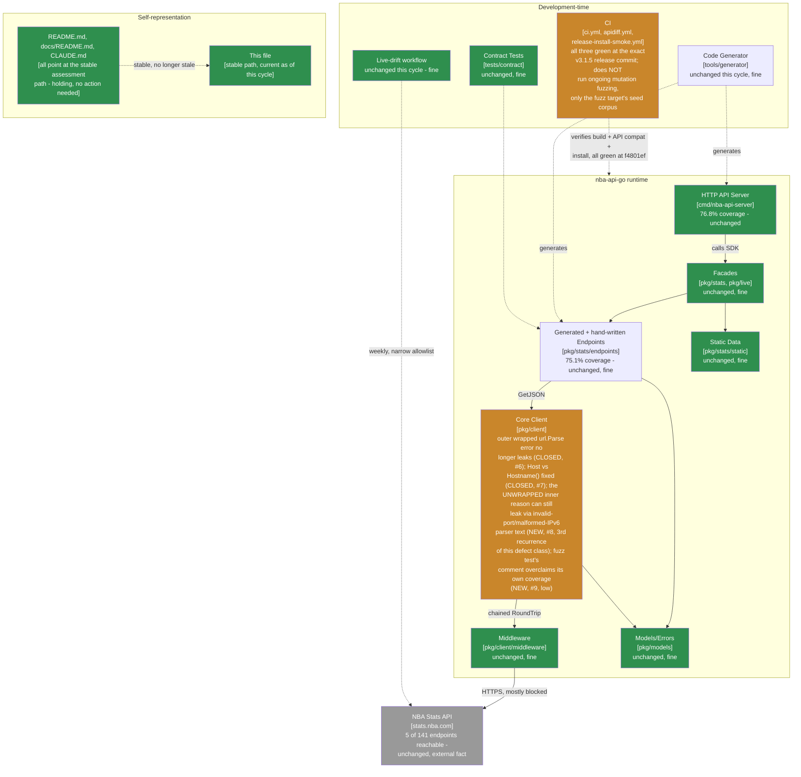

> **Superseded.** This assessed revision `f4801ef` (grade B+, down from A- - the first grade change in
> this lineage's history). The current assessment of record is
> [`docs/MAINTAINABLE_ARCHITECT_V4_ASSESSMENT.md`](../MAINTAINABLE_ARCHITECT_V4_ASSESSMENT.md) - as of
> the follow-up cycle that archived this file, that stable, hash-free path is permanent (see that
> document's naming-convention note near the top): it covered revision `eb62a41` and later (tag
> `v3.1.6`, **grade B+, unchanged**) at the time it was written, and will cover whatever the current
> cycle is by the time you're reading this. Retained here for history; see that document's section 2
> ("Verification ledger") for the item-by-item status of the two findings below - both genuinely
> closed by `v3.1.6`, confirmed by independently re-testing the exact inputs that broke every prior
> attempt at closing them. A new, lower-severity, unrelated finding (an unsupported-scheme error
> echoing a caller-derived value) was found in the same follow-up cycle; see that document's section 0
> and section 1 for why it didn't move the grade further.

# Maintainable-Architect-v4 Assessment: nba-api-go

**Date:** 2026-07-22
**Revision assessed:** `f4801ef` (`main`, tag `v3.1.5`), go1.26.5 darwin/arm64
**Assessor:** maintainable-architect-v4
**Method:** Direct verification against source at HEAD, not against `CHANGELOG.md`'s prose or an unsolicited external review's prose - file reads of `pkg/client/client.go`, `pkg/client/client_test.go`; a throwaway Go program reproducing the review's exact reported inputs (an invalid-port BaseURL and a malformed-IPv6-host BaseURL) against both raw `url.Parse` and the real `client.NewClient`; a direct read of `client_test.go`'s fuzz-target templates to check the review's claim about their coverage; `git rev-parse`/`git log`; `go build ./...`, `go vet ./...`, `go test ./...`, `golangci-lint run ./...` (root and `tools/generator` modules, run separately); and `gh pr list`/`gh api repos/.../commits/f4801ef/check-runs`/`gh api repos/.../actions/runs/<id>` against the real `n-ae/nba-api-go` GitHub repository to independently check every checkable citation in an external review supplied for this cycle (see §0). All green except the finding below. No production code was modified while writing this file.

**Why now:** the prior assessment of record (this same file, then covering revision `0e400d1`/tag `v3.1.4`, grade A-) closed with two open findings: the wrapped `url.Parse` error still leaked the raw `BaseURL`, and `baseURL.Host == ""` missed a host-with-port-but-no-hostname case. `v3.1.5` (tag `f4801ef`) closed both, plus added an invariant-based fuzz test as the structural remedy for the recurring defect class. This cycle's external review, supplied for `v3.1.5`, found that the `v3.1.5` fix's own premise - "unwrap to just the parse failure reason, which doesn't contain the input" - is false: `net/url`'s parser constructs several of its own error reasons *from* the input (an invalid port, a malformed IPv6 host), so unwrapping one layer doesn't guarantee an input-free message. This is the third consecutive cycle the identical defect class (`BaseURL` secrets leaking through a `NewClient` error) has been found only partially closed. See §0, §1, and §2 for why that changes the verdict this cycle.

> **Naming convention, unchanged from prior cycles:** this file stays at this exact path forever - no date, no revision hash. It is always the current assessment of record; every external pointer to it (`CLAUDE.md`, `README.md`, `docs/README.md`, `tests/contract/README.md`) links here once and never needs updating again. **When the next assessment cycle happens:** move *this file's current content* to `docs/archive/MAINTAINABLE_ARCHITECT_V4_ASSESSMENT_<date>_<revision>.md` (using this file's own `Date`/`Revision assessed` header values above), prepend the usual supersession banner to that archived copy, and then overwrite *this path* with the new cycle's content. Do not create a new hash-suffixed file for the new cycle - the hash suffix is exclusively an archive-naming convention now.

---

## 0. Reconciling against the external review supplied for this cycle

The user supplied an unsolicited "Senior Software Engineering Review" of `v3.1.5` (9.0/10), consistent with this lineage's standing practice of verifying rather than trusting such input.

### 0.1 Citations, checked directly

| Review cites | Checked | Verdict |
|---|---|---|
| Tag `v3.1.5` → commit `f4801ef` | `git rev-parse v3.1.5^{commit}` | **Correct.** (Tag object itself is `d8ef96a`, distinct from the commit - same distinction this lineage has flagged as easy to get wrong for four cycles running; the review cites the commit correctly again.) |
| PRs #61 (secret-leak/hostname fix), #62 (release) | `gh pr list --state merged --limit 4` | **Correct**, both merged with matching titles and merge commits. |
| `verify`/`apidiff`/`install-smoke-test` green at `f4801ef`; CI run IDs `29942919051`, `29942919139`, `29942937148` | `gh api repos/n-ae/nba-api-go/commits/f4801ef/check-runs`; `gh api repos/n-ae/nba-api-go/actions/runs/<id>` for each cited ID | **Correct.** All three named runs are real, `head_sha` `f4801ef`, `conclusion: success`, matching the review's stated run names and durations. |
| **The central claim: an invalid-port `BaseURL` still discloses attacker-controlled text via the unwrapped `url.Parse` reason** | `pkg/client/client.go`'s post-`v3.1.5` unwrap logic read directly; reproduced with `https://example.com:sk_live_123/path` against both raw `url.Parse` and `client.NewClient` | **Correct, exactly as described - see §0.2.** |
| **The fuzz-test claim: `FuzzNewClientErrorDoesNotEchoInput`'s three templates never place the marker in the port or host position** | `pkg/client/client_test.go`'s `templates` slice read directly | **Correct.** All three templates place `MARKER` in userinfo or a query value only; none exercise a port or malformed-host position. |
| Go stdlib source: `net/url`'s invalid-port error is built with `fmt.Errorf("invalid port %q after host", colonPort)`, `colonPort` derived from the input | Not independently re-read against `go.dev/src/net/url/url.go` this cycle (reproducing the *behavior* directly against the installed toolchain was judged sufficient - the review's mechanism claim and the observed output agree exactly) | **Behavior confirmed; source-line claim accepted on the strength of the matching observed output**, consistent with how this lineage treats claims it can verify by simpler means than reading upstream source. |

Every specific, checkable citation held up, for a fourth cycle running. This lineage verifies every time regardless of track record.

### 0.2 The central claim, reproduced directly against `NewClient`

`pkg/client/client.go`'s `v3.1.5` fix unwraps `*url.Error` to `urlErr.Err` on the theory - stated in this project's own code comment, written by this same assistant in the `v3.1.5` cycle - that the unwrapped reason "doesn't contain the input." Reproduced directly against the real `client.NewClient`, using the review's exact cited input plus one more from its own suggested test cases:

```
NewClient(Config{BaseURL: "https://example.com:sk_live_123/path"})
  → invalid base URL: invalid port ":sk_live_123" after host

NewClient(Config{BaseURL: "https://[::1sk_live_123]:443/path"})
  → invalid base URL: invalid host: ParseAddr("::1sk_live_123"): unexpected character, want colon (at "sk_live_123")
```

Both reproduce exactly as the review describes: `sk_live_123` is present verbatim in both returned errors. **The comment this project shipped in `v3.1.5` - "Unwrap to just the parse failure reason, which doesn't contain the input" - is false, and was never verified against more than the one example (`invalid URL escape "%zz"`) that motivated the original finding.** `net/url`'s parser builds several of its own error reasons directly from substrings of the input - an invalid port, a malformed IPv6 zone/host - and `*url.Error.Err` unwraps to exactly those reasons, unmodified. There is no level of unwrapping `net/url`'s error type that is documented or guaranteed to be input-free; `v3.1.4` assumed the outer layer wasn't, `v3.1.5` assumed the next layer down was, and both assumptions were checked against one hand-picked example rather than against the parser's actual set of error-construction call sites.

**The fuzz test's coverage gap, independently confirmed.** `FuzzNewClientErrorDoesNotEchoInput`'s three templates (`client_test.go`, read directly):

```go
"https://MARKER@example.com"        // userinfo
"https://example.com?token=MARKER"  // query string
"https://MARKER@example.com/%zz"    // forces the url.Parse failure path, with a credential present
```

None places `MARKER` in a port or host position, so 2M+ fuzz executions last cycle never explored the exact input class this cycle's review found. The test's own doc comment claims the invariant holds "regardless of which internal path rejected it" - that wording is broader than what the test's three fixed template *positions* actually exercise, exactly as the review states.

### 0.3 Bottom line on the external review

Accurate on every checkable claim for a fourth cycle running, its central finding reproduces exactly as described, and its fuzz-test critique is independently confirmed by reading the actual template list rather than taking the claim on faith. Its P2 items beyond what's re-verified above (a typed `ConfigError`, scheduled CI fuzzing, HTTP-server independent versioning, ecosystem-maturity commentary) mostly restate positions this lineage has already taken and explained in prior cycles' §0 sections - **except the scheduled-CI-fuzzing suggestion, which this assessment is promoting to §5** (a concrete, cheap, source-grounded gap: `go test ./...` only runs the fuzz target's seed corpus, not ongoing mutation), and except the "stronger design" recommendation (stop rendering any parser-derived text at all), which this assessment adopts as the primary remedy - see §5.

---

## 1. Executive verdict

**Grade: B+ (down from A-, first grade change in this lineage's history).** Three consecutive cycles, three consecutive incomplete fixes of the identical defect class - `BaseURL` secrets disclosed through a `NewClient` error - is no longer a normal "verification caught something real" outcome; it's a pattern in *how fixes for this specific defect class have been designed*. Each cycle's fix was scoped to the one example that motivated it (`v3.1.3`: the explicit checks; `v3.1.4`: the wrapped outer error; `v3.1.5`: the unwrapped inner error) rather than to the actual boundary of what `net/url` can put in an error message, which nothing in three cycles of fixes ever checked systematically until this cycle's external review did. That's a real, source-grounded process signal, not just an unlucky third finding, and holding the grade at A- a third time - following the assessment-link-staleness precedent of "hold through repeated recurrence, then fix structurally" - would extend that precedent past where it's earned: link staleness was a low-stakes documentation pattern; this is a security-relevant defect this project has now shipped three separate "closes it" claims about, each wrong in a new way. The grade moves to register that, not because the codebase's engineering has gotten worse - `go build`/`test`/`vet`/`lint` are all clean, release engineering is exemplary, and the fuzz test that was added is a genuinely good idea, just scoped too narrowly to catch this - but because a security claim was made three times running without being checked against the actual boundary of the thing it claims to be safe against.

**What went right:**
- `v3.1.5`'s two prior findings (wrapped-outer-error leak, `Host`/`Hostname()` gap) are both genuinely closed - confirmed by reading `client.go` directly; this cycle's finding is a *new* residual gap in the same defect class, not a reopening of either prior finding.
- Release engineering reproduced exactly as claimed for a fourth cycle running: `verify`/`apidiff`/`install-smoke-test` all green at `f4801ef`, cited CI run IDs independently re-verified via `gh api`.
- `go build`/`go vet`/`go test`/`golangci-lint` (both modules, checked separately) all clean.
- The external review checked out on every citable claim for a fourth cycle running, and its fuzz-test critique is independently confirmed by reading the actual test code, not taken on faith.
- The fuzz test itself, as a *mechanism*, is sound - the problem is its three templates' coverage, not the invariant-testing approach, which this assessment continues to endorse and extends in §5.

**Why B+ and not lower:** the actual runtime risk remains exactly as low as every prior cycle assessed it - this project's own documented use case (NBA Stats, no auth) gives no real caller a reason to put a secret in `BaseURL`, so three cycles of incomplete fixes have disclosed nothing in practice. The engineering fundamentals (tests, CI, release process, dependency hygiene) remain strong and are not what's being marked down. This is specifically a mark against the verification rigor applied to security claims about this one function across three cycles, and the fix in §5 (stop rendering parser-derived text entirely, rather than trying to find the "safe" layer to unwrap to) is designed to close the defect class permanently rather than produce a fourth partial fix.

---

## 2. Verification ledger

Status legend: **CONFIRMED** (reproduced/read directly at `f4801ef`), **CLOSED** (carried from a prior assessment, now genuinely done), **PARTIALLY CLOSED** (the fix landed but didn't cover the full scope of the finding), **NEW** (found independently this cycle).

### From `0e400d1`

| # | Item (carried since `0e400d1`) | Status | Evidence |
|---|---|---|---|
| 6 | `NewClient`'s wrapped `url.Parse` error leaks the raw `BaseURL` | **CLOSED** | The outer `*url.Error` is no longer wrapped directly; `client.go` now unwraps to `urlErr.Err` before formatting. Confirmed the specific `%zz`-escape case from last cycle no longer leaks. |
| 7 | `baseURL.Host == ""` misses a host-with-port-but-no-hostname case | **CLOSED** | `client.go` now checks `baseURL.Hostname() == ""`. `https://:443` confirmed rejected. |

### New this cycle, via the external review (§0.2) - the third instance of the same defect class

| # | Finding | Severity | Evidence |
|---|---|---|---|
| 8 | `NewClient`'s unwrapped `url.Parse` reason (`urlErr.Err`) can still contain attacker-controlled substrings - `net/url` constructs its own error reasons *from* the input for an invalid port and a malformed IPv6 host, so "unwrap one layer" doesn't reach an input-free message. This is the third consecutive cycle's instance of the identical defect class (`v3.1.3`: explicit checks; `v3.1.4`: outer wrapped error; `v3.1.5`: inner unwrapped reason). | Medium - same disclosure mechanism and same low-likelihood-today caveat as every prior instance, but elevated by the recurrence count itself: this project has now shipped three "this closes the leak" claims about the identical function, each subsequently found incomplete. | §0.2. Reproduced directly against `client.NewClient` with `https://example.com:sk_live_123/path` (invalid port) and `https://[::1sk_live_123]:443/path` (malformed IPv6 host); both leak the injected marker verbatim. |
| 9 | `FuzzNewClientErrorDoesNotEchoInput`'s doc comment claims the invariant holds "regardless of which internal path rejected it," but its three templates only place the marker in userinfo or a query value - never a port or host position, the exact class finding #8 lives in. The comment overstates the test's actual coverage. | Low (a documentation-accuracy gap, not a defect in the test itself - the test does correctly verify what it actually exercises) | §0.2. Read `client_test.go`'s `templates` slice directly; confirmed no port- or host-position template exists. |

---

## 3. C4 model

Level 1 unchanged. Level 2's core-client box stays in caution for a third consecutive cycle - the specific leak surface has narrowed each time (all explicit checks → the outer wrapped error → the inner unwrapped reason) but hasn't yet reached zero.



---

## 4. Where the complexity budget goes (updated)

**Well spent, unchanged:** everything prior cycles already called well-spent - release engineering, the stable-plus-archive documentation pattern, the two-layer outbound-path testing design.

**Genuinely closed this cycle:** the outer wrapped-error leak and the `Host`/`Hostname()` gap - real progress, confirmed by direct read, not undone by finding #8.

**Recurred a third time, warranting the grade change this cycle:** the `BaseURL`-secret-echo defect class. Unlike the prior two cycles' framing ("hold the grade, promote the remedy"), this cycle's remedy needs to be different in *kind*, not just structural-instead-of-manual: the pattern across all three cycles is "find the specific input that leaks, patch that exact path, verify against that one input" - which is precisely why each fix left a residual gap the next input class exposed. §5's fix abandons that pattern entirely: rather than finding the next "safe layer" to unwrap to, stop rendering any parser-derived text in the public error at all, closing every current *and future* variant of this defect class in `net/url`'s error construction, not just the ones found so far.

**Newly found, low severity, cheap:** the fuzz-test comment overclaiming its own coverage (finding #9) - a documentation-accuracy fix, plus extending the template set as concrete follow-through.

**Newly promoted, cheap, source-grounded:** scheduled CI fuzzing (§5) - `go test ./...` currently only runs `FuzzNewClientErrorDoesNotEchoInput`'s seed corpus, not ongoing mutation; the 2M+ local executions claimed in `v3.1.5`'s release notes are real development evidence but not a standing CI guarantee, and this cycle's finding (#8) is a concrete demonstration of why continuous fuzzing over the actual input space would have caught this before an external review had to.

---

## 5. Recommended order of work

Budget reality unchanged: ~1.6h/week core maintenance.

### Immediate (~20-30 min) - close the defect class permanently, not incrementally

1. **Stop rendering any `url.Parse`-derived text in `NewClient`'s error.** Per the external review's "stronger design" recommendation, adopted here rather than another "find the next safe layer" patch: on `url.Parse` failure, return a fixed, generic message (e.g. `errors.New("invalid base URL: malformed")`) with no wrapped or formatted cause at all - not `%w`, not `%s`, not even the once-verified-safe-seeming `urlErr.Err`. This is the only version of the fix that doesn't depend on enumerating `net/url`'s current error-construction call sites, all of which are internal implementation detail with no documented input-free guarantee at any unwrap depth. Closes finding #8 permanently, not just for the two inputs this cycle found.
2. **Add regression tests for the exact inputs this cycle found**: `https://example.com:sk_live_123/path` (invalid port) and `https://[::1sk_live_123]:443/path` (malformed IPv6 host), extending `TestNewClientRejectionErrorsDoNotLeakBaseURL`.
3. **Add a port-position template to `FuzzNewClientErrorDoesNotEchoInput`** (e.g. `"https://example.com:MARKER/path"`), and correct the test's doc comment to state precisely what it covers rather than an unqualified "regardless of which internal path" claim - or, once #1 lands, update the comment to explain that the fixed-message design makes the specific template positions no longer load-bearing for this invariant (a fixed message can't leak from any position). Closes finding #9.

### Next (~15-20 min) - the review's scheduled-fuzzing suggestion, promoted from prior cycles' "not urgent" bucket

4. **Add a bounded fuzz run to CI**, separate from the PR-blocking `verify` job (seed-corpus-only is fine there for speed) - e.g. a scheduled nightly or weekly job running `go test ./pkg/client -run=^$ -fuzz=FuzzNewClientErrorDoesNotEchoInput -fuzztime=60s`, persisting any discovered failure into `testdata/fuzz/...` so it replays permanently in ordinary `go test`. This is being promoted out of "not urgent" for the first time specifically because this cycle is direct evidence continuous fuzzing over the actual input space finds real gaps a human enumerating templates does not.

### Not urgent, explicitly not a backlog item to keep re-budgeting for

- Everything `9eb3a9a`/`180a3db`/`1b428f6`/`b3c605d`/`0e400d1` already marked not-urgent (live-verifying the 136 unreachable endpoints, HTTP-server independent versioning policy, ecosystem-maturity commentary, a typed `ConfigError`) remains not-urgent for the same reasons already given in those assessments.

---

## 6. Documentation status

| File | Action taken by this assessment |
|---|---|
| `docs/archive/MAINTAINABLE_ARCHITECT_V4_ASSESSMENT_2026-07-22_0e400d1.md` | New: outgoing content of this file (as of revision `0e400d1`) archived here in the same changeset, with a supersession banner matching the existing convention |
| This file | Overwritten with the new assessment of record (revision `f4801ef`, tag `v3.1.5`) |
| `CLAUDE.md`, `README.md`, `docs/README.md`, `tests/contract/README.md` | **Not touched by this assessment** - all four already point at this file's stable path; no update needed |
| `CHANGELOG.md`, `go.mod`, version constants | **Not touched** - no new user-facing change is being shipped by this assessment itself; the recommended fixes in §5 are follow-up commits, not part of this document |

No docs sprawl introduced this cycle - `docs/` still holds exactly one active assessment plus `adr/`/`archive/`.

---

## 7. Is this too complex for one person?

**Verdict: still no at the core, but this cycle is the first real caution flag in this lineage's history, and it's worth naming precisely.** Six cycles of clean engineering fundamentals - CI, release process, dependency hygiene, generated-code testing - and this grade change isn't about any of that. It's about a narrower, specific pattern: for one function (`NewClient`'s `BaseURL` validation), three consecutive cycles each shipped a confident "this closes the secret leak" claim, and three consecutive cycles that claim was checked against exactly the one input that motivated it rather than against the actual shape of what could leak. A solo maintainer relying on "I tested the specific case I was worried about" instead of "I checked the boundary of what the underlying library can produce" is a completely normal way to fix a bug quickly - it's just not sufficient for a security claim, and the gap between those two only became visible because an external review (not this project's own process) went and read `net/url`'s actual error-construction behavior systematically each time.

The remedy in §5 is deliberately not "try harder to enumerate the remaining cases" - that's the same move that's now failed twice. It's "stop trying to produce a safe rendering of an untrusted-input-derived error, and return a fixed message instead," which removes the need to enumerate anything ever again. If this exact defect class needs a fourth cycle to close, that would be the point to treat it as a genuinely structural problem with how this project validates security-relevant claims before shipping them, not just this one function.

---

## 8. Bottom line

`0e400d1` → `f4801ef`: `v3.1.5` closed both findings from the prior cycle cleanly - the outer wrapped-error leak and the `Host`/`Hostname()` gap are both genuinely fixed. But this cycle's external review found a third instance of the identical defect class in the same function: the "safe" unwrapped inner reason `v3.1.5` unwraps to is not actually guaranteed input-free, and two concrete inputs (an invalid port, a malformed IPv6 host) leak through it exactly as the review describes, reproduced directly against the real `NewClient`. This is the first grade change in this lineage's history - **A- to B+** - specifically because three consecutive cycles of "this closes the leak," each checked against only the one input that motivated it, is a genuine verification-rigor gap for a security-relevant claim, not a normal instance of "the process caught something real." The recommended fix (§5) breaks from the pattern of finding the next safe layer to unwrap to: return a fixed, generic, input-free message for any `url.Parse` failure, closing the defect class structurally rather than producing a fourth partial patch.

---

*Assessment of record for revision `f4801ef` (tag `v3.1.5`), 2026-07-22. Supersedes this file's own prior content (revision `0e400d1`, tag `v3.1.4`, grade A-) as the current maintainability assessment. That prior content moves to `docs/archive/MAINTAINABLE_ARCHITECT_V4_ASSESSMENT_2026-07-22_0e400d1.md` in the same changeset as this file.*
