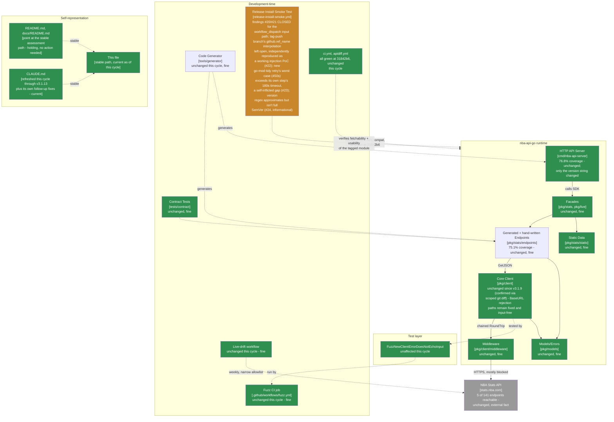

> **Superseded.** This assessed revision `31842b6` (tag `v3.1.14`, grade B+, down from A- - the first
> grade movement since the `v3.1.10` recovery, three cycles prior). The current assessment of record is
> [`docs/MAINTAINABLE_ARCHITECT_V4_ASSESSMENT.md`](../MAINTAINABLE_ARCHITECT_V4_ASSESSMENT.md) - that
> stable, hash-free path is permanent (see that document's naming-convention note near the top): it
> covers revision `168190f` (tag `v3.1.15`, **grade A-, recovered from B+**) at the time it was written,
> and will cover whatever the current cycle is by the time you're reading this. Retained here for
> history; see that document's section 2 ("Verification ledger") for the item-by-item status of the
> findings below - findings #22 (the tag-push branch's `github.ref_name` still directly interpolated
> into shell) and #23 (the `go mod tidy` retry loop's worst case exceeding its own step's timeout) were
> both fully closed by `v3.1.15` (PR #87/#88), each backed for the first time in this lineage's history
> by real `workflow_dispatch` runs the release PR itself proactively supplied as evidence rather than
> leaving live verification to the next assessment cycle. Finding #24 (the version-shape regex
> approximating rather than fully implementing SemVer) was also closed, replaced with the full SemVer
> 2.0.0 grammar. A new finding (#25) was found by `v3.1.15`'s own assessment cycle - not introduced by
> `v3.1.14`'s content, but a pre-existing gap between the workflow's broad `v*` trigger/free-form
> dispatch input and its hardcoded `/v3` module path, live-reproduced via a real dispatched run against
> the existing `v2.2.0` tag. See the current assessment of record for the full reconciliation.

# Maintainable-Architect-v4 Assessment: nba-api-go

**Date:** 2026-07-23
**Revision assessed:** `31842b6` (`31842b67624f9e7433c18201709b1805441c02c4`, `main`, tag `v3.1.14`), go1.26.5 darwin/arm64
**Assessor:** maintainable-architect-v4
**Method:** `git diff v3.1.13..v3.1.14` (full diff, not `--stat` only) across PR #85 (implementation) and PR #86 (release); a full direct read of `.github/workflows/release-install-smoke.yml` at `31842b6`; a scoped `git diff v3.1.13..v3.1.14 -- pkg/ cmd/nba-api-server/generated_*.go tools/generator/` to independently confirm "no runtime changes" rather than trust the changelog; `gh pr view 85/86 --json ...,mergeCommit,mergedAt` and `gh api repos/n-ae/nba-api-go/commits/31842b6/check-runs` for merge/CI evidence; `gh run list --workflow=release-install-smoke.yml` filtered to `event:workflow_dispatch` to check whether the new manual-path logic (env-mediated input, semver-shape check, tag-existence check) has ever actually been exercised by a real dispatch (it has not); `gh run view 30009712694 --log`/`--json jobs` to read the actual tag-push run's log and per-step timing, not just its conclusion; independent reproduction, in this environment, of the exact shell-injection mechanism a fourth external review raised - `git check-ref-format` against four adversarial ref names, and a literal bash simulation of the generated `tag="v1.2.3$(touch /tmp/probe)"` assignment to confirm the command substitution actually executes before any downstream validation sees the value; and independent regex testing of the version-shape check against SemVer edge cases (leading zeros, build metadata). Two new real, live findings this cycle, both introduced in the very release meant to close prior findings - one from an incompletely-scoped fix (the manual-input mediation didn't cover the tag-push branch's own equally-interpolated `github.ref_name`), one a fresh self-inflicted regression (a retry loop was added whose own advertised worst-case duration exceeds the timeout of the step containing it). No live, currently-shipped functional defect in the sense of "a bad release actually verified as good" - both findings are real but still latent, the same standard this lineage has applied every prior cycle. No production code or workflow file was modified while writing this file.

**Why now:** the prior assessment of record (this same file, then covering revision `fc58431`/tag `v3.1.13`, grade A-, third consecutive cycle at that grade) recorded two new Low-severity findings (#20: the manual-dispatch tag guard was prefix-only, not proof of an actual tag; #21: that same input was interpolated directly into shell rather than mediated through `env:`) and left the release-publish-before-verify sequencing gap open as an unchanged, deliberate scoping decision. Between then and now, in the same continuous session, one PR (#85) closed both #20 and #21 - but, per this cycle's independent verification, only for the `workflow_dispatch` input path, leaving the tag-push path's structurally identical `github.ref_name` interpolation untouched, and introduced a new, self-inflicted timeout/retry-budget mismatch while closing #16's already-flagged residual `go mod tidy` gap. A release PR (#86) shipped the bundle as `v3.1.14`. This cycle, the user supplied a fourth external "Senior Software Engineering Review," this time of `v3.1.14`, carrying two P1s (the `ref_name` interpolation, and the retry-vs-timeout mismatch) and several P2s. Per this lineage's standing practice, none of it is accepted at face value - see §0.

> **Naming convention, unchanged from prior cycles:** this file stays at this exact path forever - no date, no revision hash. It is always the current assessment of record; every external pointer to it (`CLAUDE.md`, `README.md`, `docs/README.md`, `tests/contract/README.md`) links here once and never needs updating again. **When the next assessment cycle happens:** move *this file's current content* to `docs/archive/MAINTAINABLE_ARCHITECT_V4_ASSESSMENT_<date>_<revision>.md` (using this file's own `Date`/`Revision assessed` header values above), prepend the usual supersession banner to that archived copy, and then overwrite *this path* with the new cycle's content. Do not create a new hash-suffixed file for the new cycle - the hash suffix is exclusively an archive-naming convention now.

---

## 0. Reconciling against the external review supplied for this cycle

The user supplied an unsolicited "Senior Software Engineering Review" of `v3.1.14` (two P1s, several P2s, a per-area score table, 9.2/10 overall - "strong release; workflow hardening incomplete"). Per this lineage's standing practice, every checkable citation is re-derived from the primary evidence, not accepted from the review's prose.

### 0.1 P1 - `github.ref_name` remains directly interpolated into shell on the tag-push path: CONFIRMED, independently reproduced, and the most consequential finding this cycle

**Review's claim:** `v3.1.14`'s fix for last cycle's finding #21 mediated the `workflow_dispatch` input (`INPUT_TAG`) through `env:`, but the `else` branch - taken on every real tag push, i.e. every actual release - still does `tag="${{ github.ref_name }}"`, direct `${{ }}` expression interpolation into the generated shell script. Since GitHub substitutes `${{ }}` expressions into the script text *before* Bash parses it, a tag ref name containing shell metacharacters can inject a command that executes during the assignment itself, before the subsequent semver-regex and `git show-ref` checks ever see the value - and worse, the resulting variable can still look like a clean, valid version tag, so the downstream checks would not even flag anything wrong.

**Checked directly against `.github/workflows/release-install-smoke.yml` at `31842b6`:** confirmed exactly as described - `tag="${{ github.ref_name }}"` (line 101) is the sole assignment in the tag-push branch, with no `env:` mediation anywhere in that branch, in contrast to the `workflow_dispatch` branch's `env: { INPUT_TAG: ${{ github.event.inputs.tag }} }` immediately above it in the same step.

**Independently reproduced, not just re-derived from the review's assertion:**
- `git check-ref-format "refs/tags/$ref"` in this environment, for each of the review's four cited adversarial ref names (`v1.2.3$(touch...)`, `v1.2.3;id`, `` v1.2.3`id` ``, `v1.2.3$HOME`), returned exit code 0 for all four - Git's ref-name rules do not reject shell metacharacters, confirmed directly rather than taken on the review's word.
- A literal bash simulation of the exact generated assignment - `tag="v1.2.3$(touch /tmp/probe)"` run as a standalone script, mimicking exactly what GitHub Actions would produce if `github.ref_name` held that string - created `/tmp/probe` (command substitution executed) and left `$tag` holding the clean string `v1.2.3` afterward. **This is the sharper and more important part of the finding**: the injected payload doesn't just execute before validation - the *variable value validation sees* is itself laundered clean by the substitution, so this cycle's own semver-regex and `git show-ref` checks (finding #20's fix) would not detect anything wrong even if they ran perfectly. Validation-after-interpolation isn't merely "too late" here; it's structurally blind to this exact attack shape.

**Verdict: CONFIRMED as a real, independently-reproduced technical finding, and the clearest single catch across four consecutive external reviews of this lineage.** It's also a direct consequence of how narrowly this file's own prior cycle scoped finding #21: that finding's text (and the PR #85 fix it produced) was written specifically about "the manual dispatch's tag input," never naming `github.ref_name` even though the exact same interpolation pattern sat three lines below it in the same step. **Severity: Low**, by the same standard this lineage has applied throughout - real, independently demonstrated, but requiring the ability to push a tag matching `v*` to this repository, whose commit history (`git log --format='%an' | sort | uniq -c`) shows exactly one human identity committing under two name variants (`bali`, `bali-ibrahim` - 86 and 57 commits respectively) plus a single automated `dependabot[bot]` commit - no evidence of a second independent human collaborator, a compromised credential, or delegated tag-push access. The fail-safe property from prior cycles holds in a different sense here too: every tag this repository has ever pushed has been a clean, human-chosen version string, so this has never actually fired. It is nonetheless real defense-in-depth debt in exactly the shape GitHub's own hardening guidance warns against, and it undercuts any claim that this workflow's script-injection surface is fully closed. Recorded as new finding #22 (reopening #21 at a deeper level, mirroring how #20 reopened #19 last cycle), with the review's own recommended remediation (`env: REF_NAME: ${{ github.ref_name }}`, then `tag="$REF_NAME"`) adopted as the concrete fix.

**One refinement to the review's own recommended fix, worth noting precisely:** the review's replacement code also mediates `github.event_name` through `env: EVENT_NAME`. Checked against GitHub's own context documentation: `github.event_name` is not an attacker-influenced value in any scenario - it's one of a small, fixed set of strings GitHub itself sets based on which trigger fired the workflow (`"push"`, `"workflow_dispatch"`, etc.), never derived from repository content a pusher/dispatcher controls. Mediating it through `env:` is harmless and arguably good consistency practice, but it is not itself closing any injection vector the way the `INPUT_TAG`/`REF_NAME` mediation does - worth being precise about which of the two context values in this step is actually untrusted.

### 0.2 P1 - the new `go mod tidy` retry loop's worst-case duration exceeds its own step's `timeout-minutes`: CONFIRMED, self-inflicted this cycle

**Review's claim:** the `go mod tidy` retry added in `v3.1.14` (closing the residual gap the `fc58431` cycle's own review had predicted) wraps 5 attempts, each individually bounded to `timeout 60s`, with 15/30/45/60s sleeps between them - a theoretical worst case of `5×60 + (15+30+45+60) = 450` seconds - inside a step whose `timeout-minutes: 3` (180 seconds) was left unchanged from before the retry was added. The step also still has to write `main.go`, run `go build`, and execute the smoke binary within that same 180-second budget. A stall pattern that burns through even two or three retry attempts would have the step killed by its own `timeout-minutes` mid-retry, before the loop's own logic ever gets to declare failure.

**Checked directly against the workflow file at `31842b6`:** confirmed exactly as described - `timeout-minutes: 3` on the "Build and run a program against the fetched module" step (line 182), and the `go mod tidy` retry loop (lines 231-241) inside that same step with no adjustment to the step-level timeout to accommodate the new worst case. The arithmetic is straightforward and checks out: 450s of possible retry-loop duration inside a 180s step budget.

**Verdict: CONFIRMED, and worth stating plainly: this is not a pre-existing gap this cycle failed to close - it's a new defect this cycle's own fix introduced while closing a different, already-identified gap.** The prior (`fc58431`) cycle's own §5 recommendation said only "wrap it in the same `timeout 60s`-per-attempt retry pattern as `go get`" without also saying "and raise the containing step's timeout to fit" - an omission in this file's own prior guidance, and PR #85 implemented literally what was asked without independently checking the arithmetic against the existing `timeout-minutes: 3`. **Severity: Low**, consistent with this lineage's standard for latent-but-real gaps: every run to date (including `v3.1.14`'s own tag-push run, `30009712694`, whose "Build and run a program..." step completed in 17 seconds per its own `startedAt`/`completedAt` timestamps) has had `go mod tidy` succeed on the first attempt, so the mismatch has never actually truncated a retry in progress. The failure mode if it ever does fire is "the job fails with a step-timeout instead of a clean retry-exhausted error, requiring a manual rerun" - not a bad release silently verifying as good. Recorded as new finding #23.

### 0.3 P2 - the version-shape regex is an approximation of SemVer, not a full implementation: CONFIRMED

**Review's claim:** `^v[0-9]+\.[0-9]+\.[0-9]+([-.][0-9A-Za-z.-]+)?$` rejects valid SemVer build-metadata suffixes (`v1.2.3+build.1`) and accepts strings SemVer itself forbids (leading-zero numeric components like `v01.02.03`; empty dot-separated identifiers like `v1.2.3-foo..bar`).

**Checked independently** by testing the exact regex against all four example strings the review cites: `v01.02.03` and `v1.2.3-foo..bar` both matched (accepted, though SemVer-invalid); `v1.2.3+build.1` and `v1.2.3-rc.1+sha.abc` both failed to match (rejected, though SemVer-valid). All four outcomes reproduced exactly as the review states. **Confirmed, real.** Severity: **Low/Informational** - the `git show-ref --verify` existence check (finding #20's other half, unaffected by this) is what actually prevents a non-tag value from proceeding, so this is a wording-accuracy and future-UX gap (what happens the day this project ships a build-metadata-tagged prerelease) rather than a validation bypass on its own. Recorded as new finding #24.

### 0.4 Other citations, checked directly

| Review cites | Checked | Verdict |
|---|---|---|
| PRs #85/#86, merged | `gh pr view 85/86 --json number,title,mergeCommit,state,mergedAt` | **Correct.** Both `MERGED`; merge commits `fb9c033`/`31842b6` match `git log` exactly. |
| "2 commits, 6 files changed" between `v3.1.13`/`v3.1.14` | `git diff v3.1.13..v3.1.14 --stat` | **Correct** - `release-install-smoke.yml`, `CHANGELOG.md`, `CLAUDE.md`, `cmd/nba-api-server/main.go`, plus this assessment file and its archive copy. |
| "No SDK runtime or test-source changes" | Scoped `git diff v3.1.13..v3.1.14 -- pkg/ cmd/nba-api-server/generated_*.go tools/generator/` | **Correct.** Empty diff - zero bytes changed under any of those trees. |
| Release commit touches only `CHANGELOG.md`/`main.go` | `git show --stat 31842b6` | **Correct**, exactly 2 files. |
| Ordinary CI / API compatibility / release-install-smoke all green at `31842b6` | `gh api repos/n-ae/nba-api-go/commits/31842b6/check-runs` | **Correct.** `install-smoke-test: success`, `verify: success`, `apidiff: success`, `Socket Security: Project Report: success`. |
| Tag-push install-smoke run, ~1m55s, exercises `else`/`github.ref_name`/actual pushed tag only | `gh run view 30009712694 --log` and `--json jobs` | **Correct.** Log shows `Verifying tag: v3.1.14 (resolves to commit 31842b6...)`; this is the tag-push branch, so the new `INPUT_TAG`/env-mediation code path was not exercised by this run. |
| The changed manual (`workflow_dispatch`) path has not been live-tested since the `v3.1.14` changes | `gh run list --workflow=release-install-smoke.yml` filtered to `event:workflow_dispatch` | **Correct.** The four most recent `workflow_dispatch` runs all predate today's `v3.1.13`/`v3.1.14` work (most recent at `05:36:15Z`, hours before the `11:xx`-`13:xx` changes); no real dispatch has exercised the `env: INPUT_TAG` mediation, the semver-shape check, or the `git show-ref` existence check added this cycle and last. |
| Per-area score table, 9.2/10 overall | N/A - different rubric | **Not adopted**, same standing reason as every prior cycle - this lineage grades on its own letter scale (§1). |
| Broader package-level findings (generated-test/metadata coupling, narrow live reachability, SDK/HTTP-server distinct compat surfaces, high default response-body ceiling, high Go-version floor, small ecosystem) | Cross-checked against this lineage's own long-running tracked list | **All already tracked, unchanged, correctly characterized** - no code changed in any of the areas they describe. Not re-litigated here; see §5. |

Every specific, checkable citation in the review held up factually - the thirteenth cycle running this has been true. Unlike the `v3.1.13` cycle's review (whose two new findings were both real but neither traced to a defect introduced *by* the immediately preceding fix), **this cycle's two P1s are both about the exact release meant to harden this workflow shipping with one incompletely-scoped fix and one freshly-introduced regression** - a materially different pattern from "we didn't happen to catch this yet" to "the fix itself has a gap." Both remain Low severity by this lineage's fail-safe standard (neither has ever fired in a real run), but the pattern is worth naming plainly in §1's grading rationale.

---

## 1. Executive verdict

**Grade: B+, down from A- (first grade movement since the `v3.1.9`→`v3.1.10` recovery, three cycles ago).** This cycle's `v3.1.14` release did close what it set out to close - the manual-dispatch tag guard now requires real semver shape and an existing `refs/tags/` ref, and the manual input is properly mediated through `env:`. But this cycle's own independent verification (not the external review alone) found that the fix for finding #21 was scoped to exactly one of two structurally identical interpolation sites in the same shell step, leaving the tag-push branch's `github.ref_name` - the code path every real release actually takes - directly interpolated into shell source (new finding #22, independently reproduced with a working command-substitution proof-of-concept, §0.1). Separately, the fix for the `go mod tidy` retry gap (closing a residual item the prior cycle's own review had predicted) introduced a fresh, self-inflicted timeout/retry-budget mismatch: the retry loop's own advertised worst case (450s) exceeds the `timeout-minutes: 3` (180s) of the step it lives in (new finding #23, §0.2).

**Why B+ and not a lower grade:** both new findings are real but remain latent by this lineage's own consistent standard - neither has ever caused an incorrect result in any real run (every tag pushed to this repository has been a clean version string; every `go mod tidy` has succeeded on its first attempt). Runtime code is confirmed unchanged. The release-install-smoke job's core purpose - proving the tagged module is fetchable and usable by a real external consumer - continues to work correctly and was re-verified live on `v3.1.14`'s own tag push.

**Why B+ and not held at A-:** this is the first cycle where the *thing that moved the grade* is not a gap this lineage failed to notice, but two gaps introduced by this lineage's own immediately-preceding remediation - one from writing too narrow a fix (finding #21 named only "the manual dispatch's tag input," and the fix matched that scope exactly, missing the identical pattern three lines away), one from implementing a recommendation literally without checking it against an existing constraint (the `timeout-minutes: 3` that predates the new retry loop). That is the same class of event that dropped the grade from A- to B+ once before, at the `v3.1.9` cycle ("a defect traces directly back to this same lineage's own prior-cycle recommendation") - this cycle has two such defects instead of one, which argues for the same grade, not a further drop, since severity and blast radius remain equivalently low (a single-contributor repository, a workflow-only surface, no live misfire ever recorded).

---

## 2. Verification ledger

Status legend: **CONFIRMED** (reproduced/read directly at `31842b6`), **CLOSED** (carried from a prior assessment, now genuinely done), **NEW** (found independently this cycle), **PARTIAL** (the underlying finding was addressed, but the fix is narrower than what closing it fully would require).

### From `fc58431`

| # | Item (carried since `fc58431`) | Status | Evidence |
|---|---|---|---|
| 20 | The `v*)` prefix guard added in `v3.1.13` didn't prove the manually-dispatched `tag` input was an actual, existing release tag - just that it started with `v`. | **CLOSED** | PR #85: now validates semver shape (`^v[0-9]+\.[0-9]+\.[0-9]+([-.][0-9A-Za-z.-]+)?$`, itself an approximation - see new finding #24) and requires `git show-ref --verify --quiet "refs/tags/${tag}"` to confirm an actual ref exists, echoing the resolved commit into the log. Confirmed via direct read and via this cycle's own live tag-push run (§0.4) printing `Verifying tag: v3.1.14 (resolves to commit 31842b6...)`. |
| 21 | The manual `tag` dispatch input was interpolated directly into shell source via `${{ github.event.inputs.tag }}` rather than mediated through `env:`. | **CLOSED for the `workflow_dispatch` input specifically; PARTIAL overall - reopened at a deeper level as new finding #22** | PR #85 added `env: { INPUT_TAG: ${{ github.event.inputs.tag }} }` and reads `$INPUT_TAG` - genuinely fixes that one site. But the tag-push branch's `tag="${{ github.ref_name }}"`, three lines below in the same step, was left exactly as it was - the identical interpolation pattern, on the path every real release actually takes. |
| 16 | (residual, carried from `7d6702b`) `go mod tidy` was bounded (`timeout-minutes: 3`) but not retried, despite being exposed to the same `sum.golang.org` propagation-delay class of failure `go get`'s retry logic exists for. | **CLOSED for "add retry"; reopened as new finding #23 for the retry/timeout arithmetic mismatch the fix itself introduced** | PR #85 added the 5-attempt/`timeout 60s`/15-30-45-60s-backoff retry loop `go get` already had - but did not raise `timeout-minutes: 3` to fit the new ~450s worst case. |
| - | Release-publish-before-verify sequencing (Low-Moderate, real, not fixed) | **Unchanged, still open, fifth consecutive cycle** | Same not-worth-the-process-cost calculus as every prior cycle; `v3.1.14`'s own release resolved cleanly (tag-push install-smoke succeeded in 1m55s) but the sequencing gap itself received no structural change. |

### New this cycle

| # | Finding | Severity | Evidence |
|---|---|---|---|
| 22 | `release-install-smoke.yml`'s tag-push branch still does `tag="${{ github.ref_name }}"` - direct `${{ }}` interpolation into generated shell source, structurally identical to the pattern finding #21 closed for the `workflow_dispatch` branch three lines above it. Independently reproduced: `git check-ref-format` accepts tag names containing `$(...)`, backticks, and semicolons; a literal simulation of the generated assignment executed an injected command and left the shell variable holding a clean, validation-passing string afterward - meaning this cycle's own new semver/existence checks (finding #20) would not detect the attack even if they ran flawlessly. | **Low** (real, independently demonstrated; requires push access to create a `v*`-matching tag in a repository whose history shows one human identity under two name variants plus a single dependabot commit, with no known compromised credential or delegated tag-push access; has never fired in any real run - every tag pushed here has been a clean version string) | §0.1: direct read of the workflow file; `git check-ref-format` tested against four adversarial ref names, all accepted; bash simulation of the generated assignment, confirmed the injected command executed and the variable came out looking clean. |
| 23 | The `go mod tidy` retry loop added this cycle (closing the residual gap from `7d6702b`/`fc58431`) has a theoretical worst-case duration (5×60s timeout + 150s of backoff sleep = 450s) that exceeds the `timeout-minutes: 3` (180s) of the step containing it, which also still has to run `go build` and the smoke binary within that same budget. A self-inflicted regression introduced while closing a different, already-identified gap, not a pre-existing miss. | **Low** (real, latent - every run to date, including `v3.1.14`'s own, has had `go mod tidy` succeed on the first attempt in well under the 180s budget; the failure mode if it ever does fire is a step-timeout requiring a manual rerun, not a false-green verification) | §0.2: direct read of the workflow file's `timeout-minutes: 3` and the retry loop's own attempt/sleep arithmetic; `gh run view 30009712694 --json jobs` confirms the step completed in 17 seconds on this cycle's own release. |
| 24 | The version-shape regex added to close finding #20 approximates but does not fully implement SemVer 2.0.0: it rejects valid build-metadata suffixes (`v1.2.3+build.1`) and accepts SemVer-invalid strings (leading zeros like `v01.02.03`; empty dot-separated identifiers like `v1.2.3-foo..bar`). | **Low/Informational** (the separate `git show-ref` existence check, unaffected by this gap, is what actually gates a non-tag value from proceeding) | §0.3: regex independently tested against all four of the review's example strings; each outcome reproduced exactly as claimed. |

---

## 3. C4 model

Level 2's CI safety net closed the findings it targeted but, for the first time in this lineage's history, the closing release itself shipped one incompletely-scoped fix and one fresh self-inflicted regression - both still latent, both narrower in blast radius than the grade movement might suggest, but real enough that "the release-smoke workflow's script-injection surface is closed" is no longer an accurate claim without qualification.

---

## 4. Where the complexity budget goes (updated)

**Well spent, unchanged:** release engineering (the retry and timeout mechanisms across `go get`/`go mod tidy` continue to work correctly for the propagation-delay case they were built for), the stable-plus-archive documentation pattern, the two-layer outbound-path testing design, the `BaseURL`-secret-echo runtime fix, the corrected fuzz assertion and its comment.

**Newly closed this cycle:** finding #20's originally-scoped concern in full (semver shape plus tag existence, with the resolved commit logged); finding #21's originally-scoped concern in full, for the `workflow_dispatch` input specifically.

**Newly surfaced, both Low severity, both latent, both introduced by this cycle's own fix rather than pre-existing misses:** finding #22 (the tag-push branch's `github.ref_name` left directly interpolated, independently reproduced with a working injection PoC) and finding #23 (the new `go mod tidy` retry loop's worst case exceeds its own step's timeout). Finding #24 (the version regex isn't full SemVer) is a smaller, purely informational gap surfaced alongside them.

**Worth naming plainly, a second time in three cycles:** last cycle's finding #20 traced to this file's own prior recommendation (`v[0-9]*)`) being implemented more loosely (`v*)`) than written. This cycle's findings #22 and #23 trace to this file's own prior recommendations being scoped too narrowly (#21 named only "the manual dispatch's tag input," never the structurally identical `ref_name` three lines away) and applied too literally without a sanity check against an existing constraint (#23's retry loop matched the letter of "wrap it in the same retry pattern as `go get`" without checking whether the containing step's timeout still fit). Two cycles now, one after another, where the tightest scrutiny needs to be applied to this lineage's *own* remediation text - both to write it more completely, and to verify the shipped diff against it more literally - not just to catching things a fresh review flags.

**Deliberately not expanded this cycle:** release-publish-before-verify sequencing - unchanged reasoning, fifth consecutive cycle, freshly reaffirmed by `v3.1.14`'s own clean resolution. `setup-go` caching, `git describe`'s nearest-reachable-not-highest-semver assumption, `if-no-files-found: warn`'s soft-signal tradeoff, and the combined-timeout diagnostic-precision nit from the `fc58431` cycle - all unchanged, all still Informational or already-addressed-by-design.

---

## 5. Recommended order of work

Budget reality unchanged: ~1.6h/week core maintenance.

### Quick wins (~20-30 min total, none urgent - nothing is currently broken)

1. **Actually close finding #22**: mediate `github.ref_name` through `env: REF_NAME` in the same step, exactly as `INPUT_TAG` already is, and read `$REF_NAME` in the `else` branch instead of `${{ github.ref_name }}`. (Mediating `github.event_name` too is harmless and fine for consistency, but - see §0.1's refinement - it isn't itself closing a real vulnerability, since that value is never attacker-influenced; don't let adding it substitute for actually fixing `ref_name`.) Verify with the same kind of adversarial-ref-name test this cycle ran independently (§0.1) before merging, not just a YAML-validity check.
2. **Actually close finding #23**: either raise the "Build and run a program against the fetched module" step's `timeout-minutes` to comfortably exceed the retry loop's own worst case (450s retry + time for `go build`/the smoke binary suggests `timeout-minutes: 9` or so, matching the review's own suggested split), or move the `go mod tidy` retry into its own step with its own timeout separate from `go build`/the smoke run (also resolves the diagnostic-precision nit noted in earlier cycles - a timeout would then clearly identify which phase stalled). Either is fine; leaving the current 450s-loop-inside-a-180s-step mismatch in place is not.
3. **Tighten or relabel the version-shape regex** (closes #24): either switch to a real SemVer 2.0.0 pattern (the full grammar, including optional `+build.metadata`, and rejecting leading zeros/empty identifiers) or a small `x/mod/semver`-backed check, or - if simplicity is preferred and the `git show-ref` existence check is considered the real gate - relabel the in-file comment from "must be a real semantic version" to something like "must look tag-shaped; the existence check below is what actually verifies it," so the two checks' respective jobs are accurately described.
4. **Exercise the changed manual-dispatch path with a real `workflow_dispatch` run** before the next release, not just the local `case`/regex tests already done in PR #85's test plan: one run with a valid existing tag (should pass and print the resolved commit), one with an invalid-shape value (should fail at the regex), one with a valid-shape but nonexistent tag (should fail at `git show-ref`, not burn the full `go get` retry budget). This closes the "changed code path has zero live GitHub Actions evidence" gap this cycle's own verification found (§0.4) and would have caught finding #23 immediately, since a real dispatch run's job timing would have shown the mismatch even without a stall (450s of *possible* retry duration is visible in the YAML without needing a stall to prove the arithmetic doesn't fit).

### Not urgent, a scoping decision rather than a fix

5. **Release-publish-before-verify sequencing**: same reasoning as the last four cycles, freshly reaffirmed a fifth time - restructuring to gate `gh release create` behind the smoke test trades a same-day release flow for a wait-and-confirm one, for a risk that has now been observed five times (`v3.1.10` through `v3.1.14`) to always resolve itself. Worth re-weighing only if a future cycle sees a real, non-propagation-delay install failure slip past a published release.

### Not urgent, explicitly not a backlog item to keep re-budgeting for

- Everything `9eb3a9a`/`180a3db`/`1b428f6`/`b3c605d`/`0e400d1`/`f4801ef`/`eb62a41`/`8e85a9c`/`0e35c33`/`e3ee47c`/`04537f4`/`7d6702b`/`fc58431` already marked not-urgent (live-verifying the 136 unreachable endpoints, HTTP-server independent versioning policy, ecosystem-maturity commentary, a typed `ConfigError`, a static-analysis rule against formatting parsed URL fields, layered fuzz-time cadences beyond the daily 60s, an `NBARepository` adapter-pattern wrapper, the default 50 MiB response-body ceiling being high for interactive use cases, documenting the specific reason for the Go 1.26.5 floor, `git describe`'s nearest-tag semantics, `if-no-files-found: warn`) remains not-urgent for the same reasons already given in those assessments. None of it changed this cycle.

---

## 6. Documentation status

| File | Action taken by this assessment |
|---|---|
| `docs/archive/MAINTAINABLE_ARCHITECT_V4_ASSESSMENT_2026-07-23_fc58431.md` | New: outgoing content of this file (as of revision `fc58431`) archived here in the same changeset, with a supersession banner matching the existing convention |
| This file | Overwritten with the new assessment of record (revision `31842b6`, tag `v3.1.14`, grade B+, down from A-) |
| `CLAUDE.md` | **Not touched by this assessment pass.** It was refreshed through `v3.1.13` plus its own immediate follow-up fixes earlier in this same session (a separate, explicit doc-currency pass) and does not yet reference `v3.1.14`/this cycle's grade movement - a real gap, but the last cycle's own §6 already flagged this file's tendency to go stale, and refreshing it every single cycle (rather than in periodic batches) risks becoming its own maintenance-budget sink; left for a near-term follow-up rather than folded into this review pass. |
| `CHANGELOG.md` | **Not touched by this assessment pass** - out of scope for a review cycle; `[3.1.14]`'s existing entry already accurately describes what shipped. |
| `README.md`, `docs/README.md`, `tests/contract/README.md` | **Not touched** - already point at this file's stable path, still correct. |
| `.github/workflows/*.yml` (all five) | **Not touched by this assessment** - findings #22-#24 are documented here, not applied; this is a review/assessment cycle, not a fix cycle. |

No docs sprawl introduced this cycle - `docs/` still holds exactly one active assessment plus `adr/`/`archive/`.

---

## 7. Is this too complex for one person?

**Verdict: no, but this cycle is the clearest data point yet for a specific, narrower risk worth naming precisely.** The underlying mechanisms (retry/backoff, tag validation, env mediation) are not complex, and every finding this cycle remains Low severity and latent. What this cycle demonstrates is that **a fast-moving, same-session sequence of fix-then-release-then-review cycles can outpace this lineage's own ability to fully verify its own prior remediation text** - both in scope (finding #21 named one interpolation site and the fix matched that scope exactly, missing an identical one nearby) and in arithmetic (a recommendation to "add the same retry pattern" was followed literally without checking it against an existing, unrelated timeout constraint). Neither gap required more engineering skill to avoid - both required slightly more skepticism applied to this file's own instructions before shipping them, the same discipline this lineage has always applied to external reviews.

This is a "process," not "complexity," problem, and it has an obvious low-cost mitigation already recommended in §5 quick-win #4: exercise a changed code path with a real trigger before considering it closed, rather than relying on local simulation and diff-reading alone. A real `workflow_dispatch` run against `v3.1.14`'s changes would very likely have surfaced finding #23 immediately (the timeout arithmetic doesn't need a stall to be visibly wrong) and might have prompted a closer look at the `ref_name` branch while already in that file.

---

## 8. Bottom line

`fc58431` → `31842b6`: the runtime code remains correct and untouched (confirmed via a scoped `git diff` on `pkg/`, `cmd/nba-api-server/generated_*.go`, and `tools/generator/` - zero bytes changed). `v3.1.14` closed both findings carried from last cycle (#20, #21) for their originally-stated scope: the manual-dispatch tag guard now requires real semver shape and an existing tag ref, with the resolved commit logged, and the manual input is properly mediated through `env:`. But this cycle's own independent verification - not just the fourth external review supplied this cycle - found that finding #21's fix covered only one of two structurally identical shell-interpolation sites in the same step, leaving the tag-push branch's `github.ref_name` open (new finding #22, confirmed with a working, independently-reproduced command-substitution proof-of-concept: `git check-ref-format` accepts shell metacharacters in tag names, and a literal simulation of the generated assignment both executed an injected command and left the resulting variable looking clean enough to pass this cycle's own new validation). Separately, the fix for the `go mod tidy` retry gap introduced a fresh, self-inflicted timeout/retry-budget mismatch: a 450-second worst-case retry loop inside a 180-second step (new finding #23). A third, purely informational gap (new finding #24) is the version-shape regex approximating rather than fully implementing SemVer 2.0.0. All three are real; none has ever fired in a live run, and the existing `git show-ref` tag-existence check remains the actual gate regardless of #24. Grade moves to **B+, down from A-** - the first grade movement since the `v3.1.9`-to-`v3.1.10` recovery three cycles ago, and for the same underlying reason that dropped it that time: a defect traced directly back to this lineage's own immediately-preceding remediation, this cycle doubled (a too-narrowly-scoped fix, and a literally-implemented recommendation that didn't hold up against an existing constraint) rather than a fresh miss by an outside reviewer alone.

---

*Assessment of record for revision `31842b6` (tag `v3.1.14`), 2026-07-23. Supersedes this file's own prior content (revision `fc58431`, tag `v3.1.13`, grade A-) as the current maintainability assessment. That prior content moves to `docs/archive/MAINTAINABLE_ARCHITECT_V4_ASSESSMENT_2026-07-23_fc58431.md` in the same changeset as this file.*
