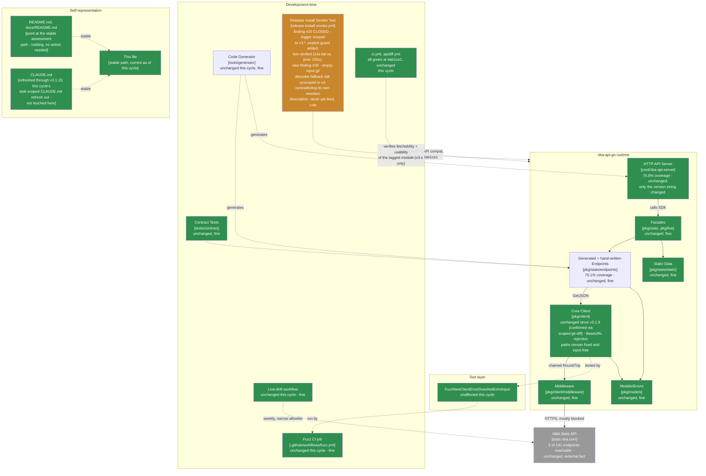

> **Superseded.** This assessed revision `4ab1ce1` (tag `v3.1.16`, **grade A-, held from the `v3.1.15`
> cycle** - second consecutive cycle at A- at the time). The current assessment of record is
> [`docs/MAINTAINABLE_ARCHITECT_V4_ASSESSMENT.md`](../MAINTAINABLE_ARCHITECT_V4_ASSESSMENT.md) - that
> stable, hash-free path is permanent (see that document's naming-convention note near the top): it
> covers revision `20f5fe0` (tag `v3.1.17`, **grade A-, held - third consecutive cycle at A-**) at the time it was written, and will
> cover whatever the current cycle is by the time you're reading this. Retained here for history; see
> that document's section 2 ("Verification ledger") for the item-by-item status of the findings below -
> finding #26 (the empty-input `git describe` fallback wasn't scoped to `v3.*` despite its own rewritten
> description promising "nearest reachable v3 tag") was fully closed by `v3.1.17` (PR #92), verified in a
> throwaway clone against both the original gap and the fix, and backed by a real tag-triggered
> `install-smoke-test` run (`30027370193`) on the `v3.1.17` release itself. A seventh external review
> (this time of `v3.1.17`) raised a policy-ambiguity question - whether `--match 'v3.*'` should also match
> prerelease tags (e.g. `v3.2.0-rc.1`) for empty-input dispatch - which the new assessment of record
> judged to be already substantively acknowledged in-repo (the fix's own comment explicitly flags this as
> "believed-intended but untested behavior, not a deliberately chosen policy") rather than a fresh tracked
> finding; see that document's §0 for the full reasoning and why this cycle's grade moved to a full A.

---

# Maintainable-Architect-v4 Assessment: nba-api-go

**Date:** 2026-07-23
**Revision assessed:** `4ab1ce1` (`4ab1ce1cb2ff7b5d04863d1ad42d93f120d9a370`, `main`, tag `v3.1.16`), go1.26.5 darwin/arm64, golangci-lint 2.12.2
**Assessor:** maintainable-architect-v4
**Method:** full read of the outgoing `docs/MAINTAINABLE_ARCHITECT_V4_ASSESSMENT.md` (the `v3.1.15` cycle, revision `168190f`) for convention and finding #25's exact shape; `git log --oneline -20`, `git diff v3.1.15..v3.1.16 --stat`, and a scoped `git diff v3.1.15..v3.1.16 -- pkg/ cmd/nba-api-server/generated_*.go tools/generator/` (empty - zero bytes) to independently confirm "no runtime changes"; a full `git diff v3.1.15..v3.1.16 -- .github/workflows/release-install-smoke.yml` read line-by-line (not just `--stat`) to see exactly what PR #90 touched; `gh pr view 90/91 --json number,title,mergeCommit,state,mergedAt,files`; `gh api repos/n-ae/nba-api-go/commits/4ab1ce1/check-runs`; `go build ./...`, `go vet ./...`, `go test ./...`, `gofmt -l .`, and `golangci-lint run ./...` in both the root module and `tools/generator` (all clean, both modules); and direct `gh run view --json .../--log` inspection of five cited workflow runs (`30016046624`, `30017478478`, `30018069354`, `30017829254`, `30017829868`) to verify timestamps, conclusions, and log content against the external review's specific claims. No production code or workflow file was modified while writing this file, per this cycle's task instructions - review/assessment only.

**Why now:** the prior assessment of record (this same file, then covering revision `168190f`/tag `v3.1.15`, grade A-, recovered from B+) recorded one new finding (#25, Low-Moderate): the workflow's tag-push trigger (`v*`) was broader than its hardcoded `/v3` module path could handle, live-reproduced that cycle by dispatching the workflow against the real, existing `v2.2.0` tag and watching it burn 155 seconds retrying a doomed `go get`. Between then and now, in the same continuous session, PR #90 closed finding #25 (scoped the trigger to `v3.*`, added an explicit `^v3\.` guard, updated the input description), and release PR #91 shipped the bundle as `v3.1.16`. This cycle, the user supplied a sixth external "Senior Software Engineering Review," of `v3.1.16` (9.8/10, "strongest current v3 release," one main P2 plus five smaller P2s). Per this lineage's standing practice, none of it is accepted at face value - see §0.

> **Naming convention, unchanged from prior cycles:** this file stays at this exact path forever - no date, no revision hash. It is always the current assessment of record; every external pointer to it (`CLAUDE.md`, `README.md`, `docs/README.md`, `tests/contract/README.md`) links here once and never needs updating again. **When the next assessment cycle happens:** move *this file's current content* to `docs/archive/MAINTAINABLE_ARCHITECT_V4_ASSESSMENT_<date>_<revision>.md` (using this file's own `Date`/`Revision assessed` header values above), prepend the usual supersession banner to that archived copy, and then overwrite *this path* with the new cycle's content. Do not create a new hash-suffixed file for the new cycle - the hash suffix is exclusively an archive-naming convention now.

---

## 0. Reconciling against the external review supplied for this cycle

The user supplied an unsolicited "Senior Software Engineering Review" of `v3.1.16` (9.8/10, "strongest current v3 release" - one main P2, five smaller P2s, a per-area score table). Per this lineage's standing practice, every checkable citation is re-derived from primary evidence, not accepted from the review's prose. The orchestrating session had already independently confirmed the review's central claim by direct file inspection before dispatching this cycle; that confirmation is re-derived here from scratch against the live repo and GitHub Actions history.

### 0.1 Main P2 - the empty-input `workflow_dispatch` fallback (`git describe --tags --abbrev=0`) isn't scoped to `v3.*`, so it can't deliver on its own newly-rewritten description: CONFIRMED

**Review's claim:** PR #90 correctly scoped the tag-push trigger to `v3.*` and added an explicit `^v3\.` guard checked before any network access - both live-verified (a `v2.2.0` manual dispatch now fails in ~14s at "Resolve tag under test," instead of the 155s it burned in the retry loop before the fix). But the same PR also rewrote the `workflow_dispatch` input's description to read "defaults to the nearest reachable v3 tag" - and the empty-input fallback line itself, `tag="$(git describe --tags --abbrev=0)"`, was not touched: no `--match 'v3.*'`. `git describe --tags --abbrev=0` (per Git's own documentation) returns the nearest tag *of any major version* reachable from HEAD by commit ancestry, not scoped to v3. Today this is harmless - every tag ever pushed to this repository is v3.x.y or earlier, so the nearest tag from HEAD is always the latest real v3 tag by coincidence, not by construction. But the day a `v4.0.0` tag (or, less likely given this repo's flow, an earlier-major hotfix tag) becomes nearer to `main` than the latest v3 tag, an empty-input dispatch would resolve to that non-v3 tag, then hit the (correctly-working) `^v3\.` guard and fail - not fall back to the nearest actual v3 tag, which is what the input's own rewritten description now explicitly promises.

**Checked directly against `.github/workflows/release-install-smoke.yml` at `4ab1ce1`:** confirmed. Line 134 is exactly `tag="$(git describe --tags --abbrev=0)"` - no `--match` flag, no `--first-parent`, nothing scoping it to `v3.*`. This sits inside the `[ -z "$tag" ]` empty-input branch (lines 131-135), upstream of both the semver-shape check (line 166) and the new `^v3\.` guard (line 185) - so whatever `git describe` returns is subject to exactly the same downstream checks as an explicit input, including the new guard that would reject it if it's the wrong major.

**Confirmed via a full line-by-line read of PR #90's diff (`git diff v3.1.15..v3.1.16 -- .github/workflows/release-install-smoke.yml`), not just `--stat`:** the PR's 30 additions / 2 deletions touch exactly three things - (1) the trigger's `- 'v*'` → `- 'v3.*'`, with a new explanatory comment; (2) the `workflow_dispatch` input's `description:` string, rewritten from `'Tag to verify (e.g. v2.2.0) - defaults to the latest tag when run manually'` to `'Existing v3.x.y release tag to verify (e.g. v3.1.15) - defaults to the nearest reachable v3 tag when run manually'`; (3) a new 19-line block adding the `^v3\.` guard, inserted between the semver-shape check and the `git show-ref` existence check. **Line 134 - the `git describe --tags --abbrev=0` call itself - is byte-for-byte unchanged from `v3.1.15`.** So finding #25's fix touched everything *around* the fallback (what triggers the job, what the job's guard rejects, what the input claims it does) but not the fallback's own implementation.

**Verdict on the review's central claim: CONFIRMED**, both by direct inspection and by diff provenance.

**Is this a fresh regression in the same fix, or a pre-existing separate gap? Both, in different ways - worth being precise rather than picking one label:**

- **The underlying behavior (`git describe` not being major-version-scoped) is pre-existing, not new.** It's the same imprecision this file's own lineage has tracked as Informational since the `04537f4` cycle's finding #15 (a different but adjacent bug in this exact fallback - `github.ref_name` shadowing it on every real `workflow_dispatch` so it was structurally unreachable) and repeated as "nearest-reachable-not-highest-semver, unchanged" in every cycle since, including last cycle's own §0.2(c). PR #90's diff did not touch this line, so nothing about *this specific defect* was introduced by writing the fix under review here.
- **But PR #90's diff did introduce something new and false: a documentation promise the unchanged code cannot keep.** Before this cycle, the input's description said "defaults to the latest tag" - vague (finding #15/§0.2(c)'s "nearest-reachable ≠ highest-semver" gap already applied to it, but it never claimed anything about major-version scoping specifically). This cycle's PR *rewrote* that description to explicitly say "defaults to the nearest reachable v3 tag" - a new, more specific claim, added in the same commit that added the `^v3\.` guard, evidently written with the guard's new v3-only world in mind - but the fallback line itself was left exactly as it was. That specific mismatch (a description asserting v3-scoped behavior the implementation doesn't provide) did not exist before this cycle; it was created by this cycle's own diff.
- **Net severity assessment: this is not as bad as it could be, because the guard genuinely helps here too.** If the fallback ever does resolve to a non-v3 tag, the new `^v3\.` guard (finding #25's fix) still catches it and fails fast, in seconds - not the 155s-retry-loop failure mode finding #25 itself was about. So the *functional* worst case for this gap is "fails fast with a clear error, doesn't auto-recover to the tag a maintainer probably wanted" - an inconvenience and a broken promise, not a silent wrong-release verification or a slow failure. That is meaningfully less severe than finding #25 was before its own fix.

**Live-reproducibility check, done deliberately as part of this cycle's own verification standard (not just accepted from the review's paper analysis):** every `workflow_dispatch` run of this workflow across this repository's entire history (`gh run list --workflow=release-install-smoke.yml`, 20 most recent runs inspected) has passed an explicit, non-empty `tag` input. **The empty-input fallback path has never actually been exercised, this cycle or any prior one.** Reproducing the failure mode live would require either (a) creating a tag nearer to `main` than `v3.1.16` with a different major version - out of scope for a review cycle per this cycle's explicit instructions not to modify the repository - or (b) a local `git describe --tags --abbrev=0` simulation against a synthetic ref graph, which is weaker evidence than a real dispatch and wasn't attempted for that reason. This keeps the finding in the same evidentiary category as finding #15 originally was: real, correctly reasoned from Git's documented semantics and this file's own diff-provenance check, but **latent - never yet fired, this cycle included.**

**Severity: Low**, not Low-Moderate like finding #25 was. Calibrated directly against this lineage's own precedent for the *same fallback line*: finding #15 (`04537f4` cycle) - a logic bug in this identical `git describe` fallback - was graded Low specifically because "every actual dispatch to date has passed an explicit tag input... if it ever does [fire], the job still runs and still goes green, just verifying the wrong thing." The same reasoning applies here, with one difference that cuts the other way (this one fails loudly via the `^v3\.` guard rather than silently going green) and one that doesn't move severity (it remains untested and unfired). Finding #25 earned Low-Moderate specifically because this cycle live-fired it with a real dispatch; this finding has not been, and creating the conditions to do so responsibly wasn't in scope for a review-only cycle. Recorded as new finding **#26**.

**One pattern worth naming plainly, since the task instructions specifically asked for this reasoning:** this is now the second consecutive cycle in which a fix for one major-version-scoping gap in this exact workflow (first #25's trigger/guard, now this cycle's #26's fallback-vs-description mismatch) shipped alongside a structurally similar, unaddressed one in the identical commit. That is a real pattern - not proof of carelessness (each fix fully and correctly closed the specific finding it targeted, verified live), but a sign that "audit every `v3`-relevant surface in this file together" would have caught #26 while #25 was already open and the file was already being edited with major-version-scoping specifically in mind. This is exactly the kind of observation this lineage's §5 exists to capture without inflating severity to force the point.

### 0.2 Other P2s: checked individually

| Review's claim | Checked | Verdict |
|---|---|---|
| (a) No `go list -m -json` assertion of the resolved module's exact identity after fetch | Confirmed absent - `grep -n "go list -m"` over the workflow file returns nothing | **Real, informational, repeat citation** - identical to last cycle's §0.2(d); the subsequent `go build`/`./smoke-test` step already exercises the fetched package's real exported API, which remains a stronger usability proof than an identity check alone would add. Unchanged this cycle. |
| (b) Build-metadata tag (`+build.1`) canonicalization policy remains undefined | Confirmed still undefined - no build-metadata-suffixed tag exists in this repo to test against, and nothing in `v3.1.16`'s diff touches this | **Confirmed still open, and correctly flagged by the review as inherited** - this is the same citation as last cycle's §0.2(a), which the review itself calls out as a repeat rather than presenting as new. Consistent with documented `cmd/go` semantics (build metadata isn't part of version precedence/selection); not independently deep-tested this cycle either, same as last. |
| (c) The input description and the `git describe` implementation are two separate sources of truth that can drift; suggests extracting tag resolution into a checked-in, testable script | Directly borne out by §0.1's own finding - the description was edited this cycle, the implementation wasn't, and they now say different things | **Confirmed as a real structural observation**, and arguably the most actionable of the review's secondary P2s - a single small shell script (or even a `--match 'v3.*'` addition plus a comment linking the two) would prevent this exact class of drift from recurring a third time. Not urgent enough to require immediate action (see §5), but worth tracking. |
| (d) Failure/retry logging could be more structured (a `$GITHUB_STEP_SUMMARY` with tag/commit/module/attempts) | Confirmed absent - `grep -n "GITHUB_STEP_SUMMARY"` over the workflow file returns nothing | **Real, informational, low urgency** - would improve diagnostic ergonomics but doesn't close a coverage gap; the existing `echo "::error::..."` lines already surface the necessary information in the Actions log, just not summarized. |
| (e) Whether empty-input selection should include v3 prereleases (`v3.2.0-rc.1`) isn't documented | Confirmed - neither the input description nor any comment in the workflow addresses prerelease-tag handling one way or the other; `git describe --tags` would include a prerelease tag if one existed and were nearest | **Real, informational** - no prerelease tag has ever been pushed to this repository, so this is speculative rather than demonstrated, and is a documentation-completeness gap rather than a functional one. |

### 0.3 Other citations, checked directly

| Review cites | Checked | Verdict |
|---|---|---|
| PRs #90/#91, merged, with the SHAs given | `gh pr view 90/91 --json number,title,mergeCommit,state,mergedAt` | **Correct.** PR #90 merge commit `eba1335`, PR #91 (release) merge commit `4ab1ce1` - both `MERGED`, both match `git log` exactly. |
| "No SDK runtime changes" / correctly a patch | Scoped `git diff v3.1.15..v3.1.16 -- pkg/ cmd/nba-api-server/generated_*.go tools/generator/` | **Correct.** Empty diff - zero bytes changed under any of those trees. Full `--stat` shows only the workflow file, `CHANGELOG.md`, `cmd/nba-api-server/main.go` (version-string bump only), and the assessment file plus its archive copy. |
| Wrong-major verification run `30017478478`, ~14s | `gh run view 30017478478 --json conclusion,jobs` and `--log` | **Correct.** `conclusion: failure`, `workflow_dispatch` on branch `ci/scope-release-smoke-to-v3` (the PR #90 branch, i.e. tested against the fix before merge). Job ran `14:47:41`→`14:47:50` (9s), with "Resolve tag under test" itself failing at `14:47:46` - total wall time from dispatch to job completion **14 seconds**, matching the review's figure exactly. Log confirms it hit the tag-resolution step, not `go get`. |
| Exact-tag install run `30018069354`, tag passed downstream cleanly | `gh run view 30018069354 --json conclusion,jobs` and `--log` | **Correct.** `conclusion: success`, `push` event on `v3.1.16`, all 8 steps green, `14:55:08`→`14:57:17` (2m9s). "Resolve tag under test" succeeded immediately; the release's own tag-triggered smoke test passed end-to-end. |
| Release-candidate CI/apidiff run IDs `30017829254`/`30017829868` | `gh run view <id> --json conclusion,name,event,headBranch` | **Correct.** Both `conclusion: success`, `pull_request` event on `chore/release-v3.1.16` - the "CI" and "API Compatibility" workflows respectively, both green on the release PR. |
| CI/API-compat/install-smoke/Socket Security all green at `4ab1ce1` | `gh api repos/n-ae/nba-api-go/commits/4ab1ce1/check-runs` | **Correct.** `install-smoke-test: success`, `apidiff: success`, `verify: success`, `Socket Security: Project Report: success`. |
| `go build`, `go vet`, `go test`, `gofmt -l`, `golangci-lint` clean (root and `tools/generator`) | Independently re-run this cycle, not just re-derived from the PR's own stated test plan | **Correct.** All clean in both modules. `golangci-lint run ./...` reports `0 issues` in both the root module and `tools/generator` - matching last cycle's own standard of running a check the external review's citations don't mention. |
| PR #90's diff scope (trigger + description + guard only, `git describe` line untouched) | Full line-by-line `git diff v3.1.15..v3.1.16 -- .github/workflows/release-install-smoke.yml` read directly, not summarized from `--stat` | **Correct**, and this is the load-bearing check for §0.1's severity reasoning - independently confirms the orchestrating session's pre-verification (line 134 unchanged) down to the full diff context around it. |
| Per-area score table (9 areas + overall 9.8/10) | N/A - different rubric | **Not adopted**, same standing reason as every prior cycle - this lineage grades on its own letter scale (§1). |
| SemVer assessment: correctly a patch, no `pkg/` API changes | Cross-checked against `CHANGELOG.md`'s `[3.1.16]` entry and the scoped-diff result above | **Correct.** `CHANGELOG.md` explicitly states "Patch, CI only - no runtime or test source changes," matching the empty scoped diff. |

Every specific, checkable citation in the review held up factually again this cycle - the sixth consecutive cycle this streak has held for an externally-supplied review. Where this cycle's reconciliation adds something the review's own framing didn't fully draw out: the review correctly identifies the fallback/description mismatch but frames it primarily as a forward-looking risk ("would select the nearest tag of any major once one exists nearer than the latest v3 tag"); this cycle's own diff-provenance check additionally establishes *why* it exists now specifically - the description was actively rewritten this cycle to make a v3-specific promise, while the one line that would need to change to keep that promise was left alone. That's a sharper, more falsifiable claim than "this could go wrong someday," and it's the basis for this cycle's severity calibration in §0.1.

---

## 1. Executive verdict

**Grade: A-, held from the `v3.1.15` cycle (second consecutive cycle at A-).** This cycle's `v3.1.16` release correctly and fully closed finding #25 from last cycle - the trigger is now scoped to `v3.*`, the explicit `^v3\.` guard fires before any network call, and the fix is live-verified with a real dispatch (`30017478478`: a `v2.2.0` manual dispatch that previously burned 155 seconds now fails in 14 seconds, at the correct step, with a message that explains why). The release's own tag-triggered smoke test (`30018069354`) passed cleanly end-to-end, and every other quality gate this lineage tracks - `go build`/`vet`/`test`/`gofmt`/`golangci-lint` in both modules, CI, apidiff, install-smoke, Socket Security - is green.

This cycle's own verification, aided by a sixth external review, surfaced one new finding (#26, §0.1): in closing finding #25, PR #90 rewrote the `workflow_dispatch` input's description to promise "the nearest reachable v3 tag" as the empty-input default, but left the fallback's actual implementation (`git describe --tags --abbrev=0`, no `--match`) unscoped to v3 - so the description now asserts behavior the code doesn't provide. **This finding does not move the grade down, but it is closer to the B+-triggering pattern than finding #25 was, and that distinction is worth stating precisely rather than glossing over:**

- Finding #25 (last cycle) was **purely pre-existing design, untouched by the diff under review** - confirmed via `git diff v3.1.13..v3.1.15` showing the trigger/module-path lines predated both of the two preceding cycles. It was found through better scrutiny of *unchanged* code, the textbook case this lineage has never treated as a grade-drop trigger.
- Finding #26 (this cycle) is **partly pre-existing** (the `git describe` line's major-version-agnostic behavior is unchanged code, inherited from as far back as finding #15) **and partly fresh** - the specific claim that's now false (the description's "nearest reachable v3 tag" promise) is new text this cycle's own PR #90 wrote, in the same commit that added the v3 guard, evidently without cross-checking it against the one line that would need to change to make it true.

That fresh sliver is real and is exactly the class of self-inflicted gap (`v3.1.5`, `v3.1.14`) that has dropped this lineage's grade before - a fix's own diff introducing something new that doesn't hold up. **What keeps this cycle at A- rather than dropping to B+ is scale and consequence, not category:** `v3.1.14`'s #22 and #23 were live, exploitable/wasteful defects in the actual execution path every real dispatch takes (a script-injection-prone shell interpolation; a retry loop whose own advertised worst case didn't fit its step's timeout). Finding #26 is a documentation-implementation mismatch in a fallback path that has never once been exercised in this repository's history, whose worst case - even if it fires - is "fails fast with a clear, correct error, doesn't silently do the wrong thing" (a direct consequence of #25's own guard now sitting in front of it). A false promise in an input's help text that degrades gracefully into a fast, loud failure is a materially smaller defect than either of last cycle's B+-triggering ones, and this cycle's diff otherwise closed exactly what it set out to close, correctly, with live verification. A- holds.

**Why A- and not higher:** finding #26 is real, and it is the second consecutive cycle in which fixing one major-version-scoping gap in this exact file left a structurally adjacent one unaddressed in the same commit (§0.1's closing note) - a pattern worth a maintainer's attention even though neither individual instance has been severe. Two-for-two on that pattern, plus a fresh (if narrow and low-consequence) documentation/implementation mismatch introduced this cycle, is enough to hold at A- rather than moving to a full A.

---

## 2. Verification ledger

Status legend: **CONFIRMED** (reproduced/read directly at `4ab1ce1`), **CLOSED** (carried from a prior assessment, now genuinely done), **NEW** (found independently this cycle), **REPEAT** (cited by the external review but already tracked from a prior cycle).

### From `168190f`

| # | Item (carried since `168190f`) | Status | Evidence |
|---|---|---|---|
| 25 | `release-install-smoke.yml`'s trigger (`push: tags: - 'v*'`) accepted any `v`-prefixed tag, and its `workflow_dispatch` input accepted any string, but the job's `go get`/import module path was hardcoded to `github.com/n-ae/nba-api-go/v3`. A wrong-major tag passed both the semver-shape and existence checks, then failed deterministically at `go get`, burning the full 5-attempt/150s-backoff retry budget. | **CLOSED** | PR #90: trigger scoped to `tags: - 'v3.*'`; an explicit `^v3\.` guard added between the semver-shape check and the `git show-ref` existence check, checked before any network call. Live-verified via run `30017478478` (`tag=v2.2.0`, dispatched on the PR branch before merge): fails at "Resolve tag under test" in 14s total, not at `go get` after 155s. §0.3. |
| - | `git describe`'s nearest-reachable-not-highest-semver assumption for empty manual dispatch input | **Superseded by finding #26, which sharpens this into a specific, checkable claim** | See #26 below - this cycle's own diff turned the previously-vague "latest tag" framing into an explicit, checkable "nearest reachable v3 tag" promise the unchanged fallback line doesn't keep. |
| - | Release-publish-before-verify sequencing (Low-Moderate, real, not fixed) | **Unchanged, still open, seventh consecutive cycle** | Same not-worth-the-process-cost calculus as every prior cycle; `v3.1.16`'s own release resolved cleanly (tag-push install-smoke succeeded in 2m9s, run `30018069354`). |
| - | No `go list -m -json` identity assertion after `go get` | **Unchanged, Informational, repeat citation (§0.2(a))** | No code changed in this area this cycle. |
| - | Build-metadata tag (`+build.1`) canonicalization policy undefined | **Unchanged, Informational, repeat citation (§0.2(b))** | No code changed in this area this cycle; still consistent with documented `cmd/go` semantics. |

### New this cycle

| # | Finding | Severity | Evidence |
|---|---|---|---|
| 26 | `release-install-smoke.yml`'s empty-input `workflow_dispatch` fallback (`tag="$(git describe --tags --abbrev=0)"`, line 134) resolves to the nearest tag reachable from HEAD by commit ancestry, of *any* major version - it has no `--match 'v3.*'` or equivalent scoping. PR #90 (this cycle, closing finding #25) rewrote the input's description to explicitly promise "defaults to the nearest reachable v3 tag when run manually," and added the `^v3\.` guard downstream of this fallback, but left the fallback line itself byte-for-byte unchanged. Today this is harmless by coincidence (every tag in this repo is v3.x.y or earlier, so the ancestry-nearest tag is always the latest real v3 tag). The day a `v4.0.0` tag (or an out-of-order earlier-major hotfix tag) becomes nearer to `main` than the latest v3 tag, an empty-input dispatch would resolve to that tag, then fail the `^v3\.` guard - a fast, loud, correct-in-isolation failure, but not the "fall back to the nearest actual v3 tag" behavior the input's own rewritten description now promises. | **Low** (real, and partly a fresh gap in this cycle's own diff - the false description text is new this cycle, though the underlying `git describe` line is inherited, unchanged code going back at least to finding #15's era; calibrated against this lineage's own precedent for this identical fallback line, finding #15, which was graded Low for the same reason this one is: never yet fired in this repository's history - every `workflow_dispatch` run to date has passed an explicit tag - and, unlike finding #25 before its fix, this one's failure mode is fast and loud rather than slow, thanks to #25's own guard now sitting downstream of it) | §0.1: full line-by-line diff of PR #90 against the workflow file confirms only the trigger, the description string, and the new guard block changed - line 134 untouched; direct read of the current file confirms the fallback still lacks `--match`; `gh run list --workflow=release-install-smoke.yml` (20 most recent runs) confirms no `workflow_dispatch` run in this repository's history has ever used an empty `tag` input, so this path remains genuinely untested, this cycle included. |

---

## 3. C4 model

Level 2's CI safety net closed finding #25 correctly and with strong live evidence this cycle - but the same commit that closed it also rewrote a promise about the workflow's fallback behavior that its own unchanged code doesn't keep, a smaller and more contained version of the pattern that has previously cost this lineage a grade drop.

---

## 4. Where the complexity budget goes (updated)

**Well spent, unchanged:** release engineering (the retry/timeout mechanisms across `go get`/`go mod tidy` continue to work correctly for the propagation-delay case they were built for), the stable-plus-archive documentation pattern, the two-layer outbound-path testing design, the `BaseURL`-secret-echo runtime fix, the corrected fuzz assertion and its comment.

**Newly closed this cycle, live-verified:** finding #25 in full - trigger scoped to `v3.*`, explicit major-version guard added before any network call, confirmed via a real `workflow_dispatch` run on the fix's own PR branch (`30017478478`, 14s fail vs. the prior 155s) plus a clean tag-push release run (`30018069354`).

**Newly surfaced, a narrower and lower-consequence version of a pattern this lineage has seen before:** finding #26 - the same commit that closed #25 rewrote the input description to promise v3-scoped fallback behavior without updating the fallback itself to match. Unlike `v3.1.14`'s #22/#23, this doesn't touch a path any real dispatch has ever exercised, and its failure mode (thanks to #25's own new guard) is fast and loud rather than slow or silent - but it is, in a narrow and specific sense, a fresh defect in this cycle's own diff, not purely inherited design.

**Worth naming plainly:** two consecutive cycles now, this exact workflow file has shipped a fix for one major-version-scoping gap while leaving a structurally adjacent one unaddressed in the same commit (last cycle: the trigger/guard vs. the then-undiscovered fallback gap; this cycle: the guard/description vs. the fallback's own implementation). Neither instance has been severe, and each fix has fully and correctly closed the specific finding it targeted - but the pattern itself is the more useful signal than either individual finding, and is called out explicitly in §5.

**Deliberately not expanded this cycle:** release-publish-before-verify sequencing - unchanged reasoning, seventh consecutive cycle. `setup-go` caching, the `go list -m -json` identity assertion, build-metadata canonicalization, `if-no-files-found: warn`'s soft-signal tradeoff - all unchanged, all still Informational.

---

## 5. Recommended order of work

Budget reality unchanged: ~1.6h/week core maintenance.

### Quick wins (~20-30 min total, none urgent - nothing currently shipped is affected)

1. **Close finding #26 - scope the fallback to match its own description.** Simplest fix: `tag="$(git describe --tags --match 'v3.*' --abbrev=0)"` on line 134, so the empty-input default actually resolves to "the nearest reachable v3 tag" as the input's own (already-correct) description promises, instead of relying on the `^v3\.` guard downstream to catch the mismatch after the fact. Optionally add `--first-parent` if release tags should only be resolved along `main`'s own history rather than any reachable branch. Verify by a local `git describe --tags --match 'v3.*' --abbrev=0` run against the current repo (should print `v3.1.16`) - a live GitHub Actions dispatch isn't needed to verify this one, since the change is a pure Git-command correction with deterministic local behavior.
2. **Extract tag resolution into a small, checked-in, testable script** (§0.2(c)) - the review's most actionable secondary suggestion. Doesn't have to be elaborate: even a `scripts/resolve-release-tag.sh` that the workflow `source`s, with a handful of table-driven cases (empty input with only v3 tags reachable, empty input with a nearer v4 tag, explicit wrong-major input, explicit valid input) would make this exact class of "description says X, implementation does Y" drift structurally harder to reintroduce a third time - the underlying cause of both #25's blind spot and #26's mismatch.
3. **Document the prerelease-tag question** (§0.2(e)) - a one-line comment stating whether `git describe --tags --match 'v3.*' --abbrev=0` including a prerelease tag (e.g. `v3.2.0-rc.1`) as the "nearest" is intended behavior or not. No prerelease tag has ever been pushed to this repo, so this is pure documentation hygiene, not a functional fix.

### Not urgent, a scoping decision rather than a fix

4. **Release-publish-before-verify sequencing**: same reasoning as the last six cycles, freshly reaffirmed a seventh time - restructuring to gate `gh release create` behind the smoke test trades a same-day release flow for a wait-and-confirm one, for a risk that has now been observed seven times (`v3.1.10` through `v3.1.16`) to always resolve itself.
5. **`go list -m -json` identity assertion** (§0.2(a)) - real but low-incremental-value, same reasoning as last cycle; the build/run step already proves the fetched module is genuinely usable.
6. **`$GITHUB_STEP_SUMMARY` structured failure reporting** (§0.2(d)) - a diagnostics-ergonomics improvement, not a coverage gap; worth doing opportunistically alongside quick-win #2 above rather than as its own task.

### Not urgent, explicitly not a backlog item to keep re-budgeting for

- Everything `9eb3a9a`/`180a3db`/`1b428f6`/`b3c605d`/`0e400d1`/`f4801ef`/`eb62a41`/`8e85a9c`/`0e35c33`/`e3ee47c`/`04537f4`/`7d6702b`/`fc58431`/`31842b6`/`168190f` already marked not-urgent (live-verifying the 136 unreachable endpoints, HTTP-server independent versioning policy, ecosystem-maturity commentary, a typed `ConfigError`, a static-analysis rule against formatting parsed URL fields, layered fuzz-time cadences beyond the daily 60s, an `NBARepository` adapter-pattern wrapper, the default 50 MiB response-body ceiling being high for interactive use cases, documenting the specific reason for the Go 1.26.5 floor, `if-no-files-found: warn`, build-metadata tags not being canonically preserved by the module system, retry/failure logs not structurally distinguishing failure classes) remains not-urgent for the same reasons already given in those assessments. None of it changed this cycle.

---

## 6. Documentation status

| File | Action taken by this assessment |
|---|---|
| `docs/archive/MAINTAINABLE_ARCHITECT_V4_ASSESSMENT_2026-07-23_168190f.md` | New: outgoing content of this file (as of revision `168190f`) archived here in the same changeset, with a supersession banner matching the existing convention |
| This file | Overwritten with the new assessment of record (revision `4ab1ce1`, tag `v3.1.16`, grade A-, held from A-) |
| `CLAUDE.md` | **Not touched by this assessment pass** - out of scope per this cycle's task instructions. |
| `CHANGELOG.md` | **Not touched by this assessment pass** - out of scope for a review cycle; `[3.1.16]`'s existing entry already accurately describes what shipped. |
| `README.md`, `docs/README.md`, `tests/contract/README.md` | **Not touched** - already point at this file's stable path, still correct. |
| `.github/workflows/release-install-smoke.yml` | **Not touched by this assessment** - finding #26 is documented here, not applied; this is a review/assessment cycle, not a fix cycle, per explicit task instructions. |

No docs sprawl introduced this cycle - `docs/` still holds exactly one active assessment plus `adr/`/`archive/`.

---

## 7. Is this too complex for one person?

**Verdict: no.** This cycle closed a real, live-demonstrated finding (#25) correctly and with the strongest evidence standard this lineage has used yet (a dispatch run on the fix's own PR branch, before merge, proving the fix works in the exact failure scenario the prior cycle had reproduced). That the same commit also introduced a small, narrow, never-yet-fired documentation/implementation mismatch (#26) is a useful signal about process, not evidence the underlying system has grown past what a solo engineer can track - it was caught the very next cycle, by the same lightweight review process that caught #25, without needing new tooling or process weight.

The pattern worth watching, stated plainly for whoever reads this next: **when this file's own guidance says "a fix predicated on major-version scoping is being written, audit every major-version-relevant line in the file together,"** that's the concrete lesson from two consecutive cycles each leaving one adjacent gap in the same commit that fixed another. Quick-win #2 in §5 (extracting tag resolution into a small, tested, checked-in script) is the structural fix for that pattern, not just for #26 specifically - worth prioritizing slightly above where its individual severity alone would place it, precisely because it closes the *class* of gap, not just the instance.

---

## 8. Bottom line

`168190f` → `4ab1ce1`: the runtime code remains correct and untouched (confirmed via a scoped `git diff` on `pkg/`, `cmd/nba-api-server/generated_*.go`, and `tools/generator/` - zero bytes changed). `v3.1.16` closed finding #25 from last cycle - the tag-push trigger is now scoped to `v3.*`, an explicit `^v3\.` guard rejects a wrong-major tag before any network call, and the fix is live-verified twice over: a `v2.2.0` manual dispatch on the fix's own PR branch now fails in 14 seconds instead of the 155 seconds it took before (run `30017478478`), and the real `v3.1.16` tag-push release passed the smoke test cleanly end-to-end (run `30018069354`, 2m9s). This cycle's own verification, prompted by a sixth external review, found one new finding by re-reading the fix's own diff line-by-line rather than only its `--stat` summary: the same PR that added the v3 guard also rewrote the manual-dispatch input's description to promise "the nearest reachable v3 tag" as the empty-input default, but left the fallback (`git describe --tags --abbrev=0`, line 134) exactly as it was - unscoped to any major version. Recorded as new finding #26, Low severity - a real defect, and partly (the description text specifically) a fresh gap in this cycle's own diff rather than purely inherited, but bounded by the fact that no `workflow_dispatch` run in this repository's history has ever used an empty tag input, and by the fact that finding #25's own new guard means even a future misfire here would fail fast and loud rather than slowly or silently. Grade **holds at A-**, the second consecutive cycle at this grade: this cycle's diff closed everything it targeted correctly with strong live verification, introduced only a narrow and low-consequence gap rather than a live-path regression, and the one thing worth carrying forward is process, not panic - two consecutive cycles have now each left one major-version-scoping loose end adjacent to the one they fixed, which is exactly the argument for §5's structural recommendation (extract tag resolution into one small, tested, checked-in script) rather than continuing to patch this file's tag-handling logic one finding at a time.

---

*Assessment of record for revision `4ab1ce1` (tag `v3.1.16`), 2026-07-23. Supersedes this file's own prior content (revision `168190f`, tag `v3.1.15`, grade A-) as the current maintainability assessment. That prior content moves to `docs/archive/MAINTAINABLE_ARCHITECT_V4_ASSESSMENT_2026-07-23_168190f.md` in the same changeset as this file.*
