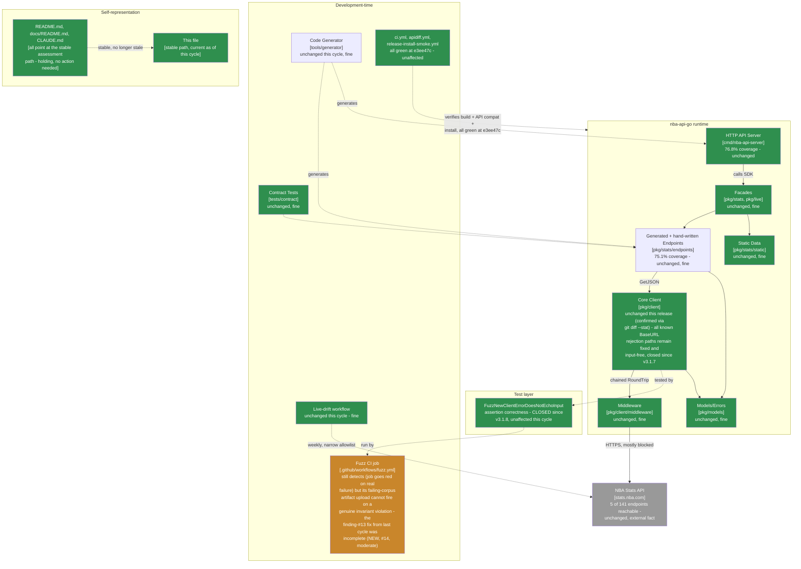

> **Superseded.** This assessed revision `e3ee47c` (tag `v3.1.9`, grade B+, down from A- - the first
> defect this lineage found in a shipped release in a long time, and the first time a defect traced
> back to this same lineage's own prior-cycle recommendation). The current assessment of record is
> [`docs/MAINTAINABLE_ARCHITECT_V4_ASSESSMENT.md`](../MAINTAINABLE_ARCHITECT_V4_ASSESSMENT.md) - that
> stable, hash-free path is permanent (see that document's naming-convention note near the top): it
> covers revision `04537f4` and later (tag `v3.1.10`, **grade A-, recovered from B+**) at the time it
> was written, and will cover whatever the current cycle is by the time you're reading this. Retained
> here for history; see that document's section 2 ("Verification ledger") for the item-by-item status
> of the findings below - finding #14 (the fuzz-job corpus-upload condition missing an explicit GHA
> status-check function) was closed by `v3.1.10` (PR #75) and, unlike `v3.1.9`'s own incomplete
> "verified on a real run" claim, this time verified live on **both** the success path and the actual
> failure path (a throwaway branch with a sentinel corpus file and a forced `exit 1`) before merging.
> An external review supplied for the `v3.1.10` cycle raised a "P1 — exact tag install workflow failed
> at release time" concern that this lineage's independent re-verification (with the actual failed-run
> log showing a transient `sum.golang.org` 500, and the actual retry-run log confirming the exact tag
> `v3.1.10` was tested, not a `main`-branch fallback) downgraded to a correctly self-healed transient
> infrastructure flake, not a live defect; see that document's section 0 for the full reconciliation,
> including a newly-confirmed, genuinely real P2 (the same workflow's manual-dispatch tag-resolution
> fallback silently defaults to the triggering branch, not "the latest tag" as its own input
> description promises, whenever `workflow_dispatch` is fired with no `tag` input on a branch).

# Maintainable-Architect-v4 Assessment: nba-api-go

**Date:** 2026-07-23
**Revision assessed:** `e3ee47c` (`main`, tag `v3.1.9`), go1.26.5 darwin/arm64
**Assessor:** maintainable-architect-v4
**Method:** Direct verification against source at HEAD, not against `CHANGELOG.md`'s prose or an unsolicited external review's prose - a direct read of `.github/workflows/fuzz.yml` and a line-by-line reasoning trace through documented GitHub Actions `if:` evaluation semantics (implicit `success()` unless a status-check function appears) to independently confirm this cycle's central claim before accepting it; `git diff v3.1.8..v3.1.9` (full diff, not just `--stat`) to see exactly what changed in the workflow file and confirm the change was in fact PR #73's finding-#13 fix, not something else; `gh api repos/.../actions/runs/29955646493/jobs` to read the actual step outcomes of the one real GitHub Actions run PR #73 cited as verification, and confirm that run only exercised the success path (fuzz step passed, upload step correctly shows `skipped`) and never exercised the failure path the step exists to serve; `git rev-parse`/`git log`; `go build ./...`, `go vet ./...`, `go test ./...`, `golangci-lint run ./...` (root and `tools/generator` modules, run separately); a repo-wide `grep` across all five `.github/workflows/*.yml` files to re-check the permissions/concurrency/SHA-pinning convention claim; and `gh pr list`/`gh api repos/.../commits/e3ee47c/check-runs`/`gh api repos/.../actions/workflows/fuzz.yml/runs` against the real `n-ae/nba-api-go` GitHub repository to independently check every checkable citation in the external review supplied for this cycle (see §0). One real, live defect found and documented (not fixed - see the task scope note below); everything else green. No production code or workflow file was modified while writing this file.

**Why now:** the prior assessment of record (this same file, then covering revision `0e35c33`/tag `v3.1.8`, grade A-) found two low-severity CI-hardening gaps in the brand-new `.github/workflows/fuzz.yml` - a job-scoped rather than step-scoped artifact-upload condition (#13), and an overly categorical failure-cause comment (#12) - and recommended fixing both. `v3.1.9` (PR #73, released via PR #74) did exactly that: added `id: fuzz` to the fuzz step and changed the upload step's condition from `if: failure()` to `if: steps.fuzz.outcome == 'failure'`, and rewrote the comment to distinguish invariant violations from infrastructure failures. PR #73's own description claims this was "verified on a real GitHub Actions run" (run `29955646493`). This cycle's external review disputes that the fix actually works, on GitHub Actions semantics grounds independent of anything in this codebase: `if: steps.fuzz.outcome == 'failure'` contains no explicit status-check function, so GitHub Actions implicitly ANDs it with `success()`; by the time that condition is evaluated, the fuzz step has already failed, so the job's status is already failing and the implicit `success()` is false - meaning the upload step **can never run when the fuzz step actually fails**, the one case the whole mechanism exists for. This is the first cycle since `8e85a9c`→`0e35c33` (where the review found nothing) to find a live, currently-shipped defect, and the first ever where a defect traces directly back to a fix this same assessment lineage recommended last cycle. See §0, §1, and §2 for the full account.

> **Naming convention, unchanged from prior cycles:** this file stays at this exact path forever - no date, no revision hash. It is always the current assessment of record; every external pointer to it (`CLAUDE.md`, `README.md`, `docs/README.md`, `tests/contract/README.md`) links here once and never needs updating again. **When the next assessment cycle happens:** move *this file's current content* to `docs/archive/MAINTAINABLE_ARCHITECT_V4_ASSESSMENT_<date>_<revision>.md` (using this file's own `Date`/`Revision assessed` header values above), prepend the usual supersession banner to that archived copy, and then overwrite *this path* with the new cycle's content. Do not create a new hash-suffixed file for the new cycle - the hash suffix is exclusively an archive-naming convention now.

---

## 0. Reconciling against the external review supplied for this cycle

The user supplied an unsolicited "Senior Software Engineering Review" of `v3.1.9` (P1 finding, 9.1/10 overall), per this lineage's standing practice of verifying rather than trusting such input. The orchestrating session had already independently read `fuzz.yml` and reasoned through the GHA semantics before dispatching this assessment; this section re-derives that finding from scratch and checks every other citation in the review.

### 0.1 The central claim, re-derived independently

**Claim:** the artifact-upload step's `if: steps.fuzz.outcome == 'failure'` (introduced by PR #73 / `v3.1.9`, replacing the prior job-scoped `if: failure()`) will never actually run when the fuzz step fails for real.

**Independent verification, not just agreement with the review's prose:**

1. Read `.github/workflows/fuzz.yml` directly at `e3ee47c`. The upload step's condition is exactly `if: steps.fuzz.outcome == 'failure'` - no `success()`, `failure()`, `always()`, or `cancelled()` anywhere in the expression.
2. GitHub Actions' documented rule: unless an `if:` expression contains one of those four status-check functions, the whole expression is implicitly evaluated as `success() && <expression>`. This is documented GHA behavior, not project-specific and not something that requires triggering a real failing run to confirm - it follows from the published evaluation semantics.
3. The fuzz step (`id: fuzz`) is the step immediately before the upload step, with no `continue-on-error`. If it fails, the job's running status becomes "failing" from that point forward.
4. Therefore, by the time the upload step's `if:` is evaluated after a genuine fuzz failure, the implicit `success()` is already false, so the entire condition (`success() && steps.fuzz.outcome == 'failure'`) evaluates to false regardless of `steps.fuzz.outcome`. The upload step is skipped precisely in the one case it exists to serve.
5. Checked what PR #73 actually verified: `gh api repos/n-ae/nba-api-go/actions/runs/29955646493/jobs` shows the fuzz step's outcome as `success` and the upload step's outcome as `skipped` on that run - i.e., PR #73's "verified on a real GitHub Actions run" claim is true but verifies only that the upload step correctly stays skipped **when nothing fails**. It never exercised the failure path. The dispatched run's `head_sha` is `69e91ceb5679f106dd302ddbd8b2b13aaf38a296`, matching the review's citation exactly (see §0.2).

**Verdict: CONFIRMED**, independently, not by deferring to either the orchestrating session's pre-check or the external review's prose. This is a real, currently-shipped defect in `main` at `e3ee47c`/`v3.1.9`.

**Severity calibration, in this lineage's own terms rather than adopting the review's numeric score wholesale:** the fuzz job itself still goes visibly red on a genuine invariant violation (the fuzz step's own failure fails the job, which GitHub surfaces as a failed scheduled-workflow run to repository watchers by default) - so this is not a silent, undetectable failure. What's actually lost is the specific remediation artifact the job's own runbook comment depends on: "download the artifact, copy its file into `pkg/client/testdata/fuzz/...`, fix the underlying leak, and commit the corpus file" is the documented recovery path, and it has no input to act on without the upload. A maintainer would still learn something is wrong; they would have to re-run fuzzing locally (with no guarantee of hitting the exact same failing case quickly) to get the artifact this mechanism was built to hand them automatically. That's a real, worth-fixing defect in a security-relevant safety net, not a cosmetic one - but it is bounded by the job's own red-status visibility, not a total blind spot.

### 0.2 Other citations, checked directly

| Review cites | Checked | Verdict |
|---|---|---|
| Tag `v3.1.9` → commit `e3ee47c` | `git rev-parse v3.1.9^{commit}` | **Correct.** |
| Implementation PR #73, release PR #74 | `gh pr list --state merged --limit 5`, `gh pr view 73/74` | **Correct**, both merged with matching titles, matching merge commits (`acd45d6`, `e3ee47c`), and PR #73's body independently confirms it implements exactly the finding-#12/#13 fix described above - including its own (incomplete) verification claim. |
| CI run "CI #162" | `gh api .../actions/runs/29956674001 --jq '{run_number,name}'` | **Correct.** `run_number: 162`, `name: "CI"`, `head_sha e3ee47c`, `conclusion: success`. |
| CI run "API Compatibility #88" | `gh api .../actions/runs/29956674913` | **Correct.** `run_number: 88`, `head_sha e3ee47c`, `conclusion: success`. |
| CI run "Release Install Smoke Test #11" | `gh api .../actions/runs/29956693186` | **Correct.** `run_number: 11`, `head_sha e3ee47c`, `conclusion: success`. |
| "Fuzz #2" on commit `69e91ce` | `gh api .../actions/workflows/fuzz.yml/runs` | **Correct.** `run_number: 2`, `head_sha: 69e91ceb5679f106dd302ddbd8b2b13aaf38a296` (PR #73's branch tip, one commit before the merge commit `acd45d6`), `conclusion: success`, `event: workflow_dispatch`. |
| "No runtime changes" / patch-level SemVer correctness | `git diff v3.1.8..v3.1.9 --stat` | **Correct.** Five files changed: `.github/workflows/fuzz.yml`, `CHANGELOG.md`, `cmd/nba-api-server/main.go` (version constant only), and this assessment file plus its archive copy. No file under `pkg/`, `cmd/nba-api-server/generated_*.go`, or `tools/generator/` changed. Patch bump is correct; no Go `pkg/` API surface moved. |
| No explicit `permissions:` block; mutable major-tag action pinning (`@v7`/`@v4`); no `concurrency:` policy; implicit `if-no-files-found` | `grep -L "permissions:"` / `grep -L "concurrency:"` / `grep -rn "uses: actions/"` / `grep -rn "if-no-files-found"` across all five workflow files | **Correct as stated, and still repo-wide, not `fuzz.yml`-specific** - identical to last cycle's finding, unchanged by `v3.1.9` (PR #73 explicitly declined to touch this, matching last cycle's own recommended scoping - see its PR body). `if-no-files-found` being unset is also low-stakes: `actions/upload-artifact`'s own default for that input is `warn`, not a silent `ignore`, so the unset value is already the safer of the two non-explicit outcomes. |
| The suggested corrected condition, `failure() && steps.fuzz.outcome == 'failure'` | Reasoned through independently in §0.1 | **Correct as a fix.** Prepending an explicit status-check function (`failure()` or `always()`) removes the implicit-`success()` wrapping GHA would otherwise add, so the condition evaluates on the step's own outcome regardless of overall job status - the same idiom this project would need for the fix to actually work. |
| Overall severity/verdict framing: P1, "the mechanism can never fire on a real failure" | §0.1 | **Matches this assessment's own independent conclusion.** Severity label (P1) is reasonable; this assessment additionally notes the job still goes visibly red (§0.1's calibration paragraph), which the review's prose does not dwell on but does not contradict either. |
| Numeric score, 9.1/10 | N/A - different rubric | **Not adopted.** This lineage grades on its own letter scale (§1) calibrated against this project's own history, not a generic 10-point engineering rubric; see §1 for this cycle's grade and reasoning. |
| Recommended `NBARepository` adapter-pattern application architecture | Read in the pasted review text | **Not adopted, same standing reason as every prior cycle's declined architectural suggestions**: not backed by a maintainability defect found in this codebase, and this project already has a clean two-layer boundary (`pkg/stats/endpoints` ↔ `pkg/client`) that a repository-pattern wrapper would duplicate rather than fix. Restated here for completeness, not a new finding. |

Every specific, checkable citation in the review held up - the ninth cycle running this has been true. Unlike the `v3.1.8` cycle, this time the review's central finding is a real, live, currently-shipped defect, not a hardening suggestion for an already-correct mechanism.

### 0.3 The more important finding this reconciliation surfaces: this lineage's own prior recommendation was the proximate cause

Finding #13 from the `v3.1.8` cycle (this same file, then at revision `0e35c33`) explicitly recommended: *"change the upload step's condition to `if: steps.fuzz.outcome == 'failure'`"* - with no mention of also needing an explicit status-check function. PR #73 implemented that recommendation exactly as written. The bug the external review found this cycle is a direct, mechanical consequence of that recommendation being incomplete, not of anything the PR's author did wrong relative to what was asked. This is worth stating plainly rather than folding quietly into "the review found a bug": **the defect traces back to this assessment lineage's own §5, not to independent implementation error.**

This is also structurally the same failure mode as the `v3.1.6`→`v3.1.7` episode that dropped this lineage's grade to B+ before: a security-relevant safety mechanism that looked fixed, was described as "verified," and wasn't actually correct - discovered only because a fresh, skeptical pass (an external review that cycle, this cycle's external review plus independent re-derivation) checked the actual failure path rather than accepting a passing CI run at face value. See §1 for why this repeats that grade movement.

---

## 1. Executive verdict

**Grade: B+ (down from A-).** The `v3.1.8`→`v3.1.9` change was meant to close out the `BaseURL`-secret-echo saga's last loose end - CI-hardening polish on an already-correct runtime fix and an already-correct fuzz assertion. Instead, this cycle's reconciliation (independently re-derived, not just accepted from the external review) confirms that the "fix" shipped in `v3.1.9` leaves the fuzz job's own failure-artifact mechanism non-functional on a genuine invariant violation - the exact scenario the entire `.github/workflows/fuzz.yml` file exists to serve. The runtime code itself remains correct and unchanged (confirmed via `git diff --stat`: no file under `pkg/` moved), and the fuzz job still goes visibly red on a real failure, so this is not a silent blind spot for detection - but the specific, documented remediation path (download the corpus artifact, commit it as a permanent regression case) is currently dead on arrival for the one case it was built for. That is a genuine regression in this cycle's release, not a pre-existing gap merely re-described, and it followed directly from this lineage's own prior recommendation - both reasons this moves the grade down rather than holding at A-, mirroring the one other cycle in this project's history (`v3.1.6`→`v3.1.7`) where a "verified" security-relevant fix turned out to verify the wrong thing.

**What went right:**
- The runtime code is unchanged and remains correct: `git diff v3.1.8..v3.1.9 --stat` confirms zero files under `pkg/` or `cmd/nba-api-server/generated_*.go` changed. The `BaseURL`-secret-echo saga's actual runtime fix is not implicated.
- `go build`/`go vet`/`go test`/`golangci-lint` (both modules, checked separately) all clean at `e3ee47c`.
- Every specific, checkable citation in the external review held up on independent re-verification, including four separately-confirmed CI run numbers and one specific commit SHA (`69e91ce`).
- The finding-#12 comment fix (distinguishing invariant violations from infrastructure failures) is correct and unaffected by the #13 regression.
- Release engineering reproduced exactly as claimed: `CI #162`, `API Compatibility #88`, `Release Install Smoke Test #11` all green at `e3ee47c`.
- The defect, once found, is small and precisely scoped: a one-line condition change (§5), not a design problem.

**Why B+, not a further drop:** the underlying runtime invariant this whole apparatus protects (`NewClient` not leaking `BaseURL` into error messages) is still correctly enforced by three independent layers - the deterministic unit tests, the corrected fuzz assertion, and the fuzz job's own pass/fail signal (still real, just missing its artifact on failure). Nothing here means a leak could ship undetected; it means a leak, if the fuzzer ever found one, would be harder to diagnose and reproduce than the runbook promises. That is a real defect in a safety net's usability, not a defect in the safety net's ability to detect at all - the same distinction that separated B+ from a lower grade last time this pattern occurred.

---

## 2. Verification ledger

Status legend: **CONFIRMED** (reproduced/read directly at `e3ee47c`), **CLOSED** (carried from a prior assessment, now genuinely done), **NEW** (found independently this cycle), **REOPENED** (previously marked closed, found to be incomplete).

### From `0e35c33`

| # | Item (carried since `0e35c33`) | Status | Evidence |
|---|---|---|---|
| 12 | `fuzz.yml`'s "a red run means a real finding" comment didn't distinguish invariant violation from infrastructure failure | **CLOSED** | Read the current comment in `fuzz.yml` directly: it now explicitly separates "fails with a `fuzz-failure-corpus` artifact attached" (real finding) from "a red run with no artifact ... is an infrastructure failure" (ordinary triage). Correct and unaffected by finding #14 below - the comment's own logic is sound even though the mechanism it describes doesn't currently work as documented. |
| 13 | Artifact-upload step's `if: failure()` was job-scoped, not fuzz-step-scoped | **REOPENED as #14** | The step is now scoped to `steps.fuzz.outcome`, which is the right idea, but the implementation omits the explicit status-check function GHA requires for that scoping to actually take effect on a real failure. See #14. |

### New this cycle - a live defect, independently re-derived (§0.1)

| # | Finding | Severity | Evidence |
|---|---|---|---|
| 14 | `fuzz.yml`'s artifact-upload step condition, `if: steps.fuzz.outcome == 'failure'`, has no explicit GHA status-check function, so it is implicitly ANDed with `success()` - and since the fuzz step failing already puts the job in a failing state, the upload step can never run on a genuine invariant violation, the one case it exists to serve. | **Moderate** (real defect in a security-relevant safety net's usability; the net still detects and still turns the job red, so this is a diagnosability gap, not a detection gap) | §0.1: read `fuzz.yml` directly, reasoned through documented GHA `if:` semantics, and confirmed via `gh api .../actions/runs/29955646493/jobs` that the one real-run "verification" PR #73 cites only exercised the success path (upload step outcome: `skipped`), never the failure path. |
| - | No `permissions:`/`concurrency:` block; major-tag action pinning; unset `if-no-files-found` | Low, still repo-wide not `fuzz.yml`-specific | Re-confirmed via the same `grep` sweep as last cycle; unchanged by `v3.1.9`, which explicitly declined to touch this per last cycle's own recommended scoping. `if-no-files-found`'s unset value already matches the action's own safe default (`warn`). |

---

## 3. C4 model

Level 2 regains one caution box this cycle - not on the runtime client (still fully green, unchanged) but on the CI safety net that was supposed to have closed out last cycle's findings.



---

## 4. Where the complexity budget goes (updated)

**Well spent, unchanged:** release engineering, the stable-plus-archive documentation pattern, the two-layer outbound-path testing design, the `BaseURL`-secret-echo runtime fix, and the corrected fuzz assertion - none of this cycle's finding touches any of it.

**Newly reopened, moderate severity, CI-only:** the fuzz job's failure-artifact upload (#14) - a one-line fix, but a real usability defect in the mechanism this project built specifically to catch future regressions in its one hand-audited security invariant. Worth prioritizing precisely because the job whose job is to be a safety net should itself be trustworthy without a second assessment cycle needing to catch its own bugs.

**Deliberately not expanded this cycle:** repo-wide `permissions:`/`concurrency:`/SHA-pinning - unchanged reasoning from last cycle, still a real but low-stakes, non-`fuzz.yml`-specific hardening idea, not promoted to immediate.

**A process observation worth recording once, not repeating every cycle:** this is the first defect in this lineage's history that traces directly back to this same file's own prior recommendation rather than to code written independently of it. That's not a reason to distrust future recommendations wholesale, but it is a concrete argument for this file's own recommendations to be checked as rigorously as the code they describe - in this case, spelling out the exact corrected GHA idiom (§5) rather than a condition that reads right but omits the status-check function GHA requires.

---

## 5. Recommended order of work

Budget reality unchanged: ~1.6h/week core maintenance.

### Immediate (~5 min)

1. **Fix the artifact-upload step's condition** to include an explicit status-check function so the implicit `success()` wrapping doesn't suppress it on a real failure:
   ```yaml
   if: failure() && steps.fuzz.outcome == 'failure'
   ```
   (`always() && steps.fuzz.outcome == 'failure'` is an equally correct alternative.) Closes finding #14. This assessment intentionally does not apply this fix itself - see the task scope note at the top of this cycle's brief; it is recommended here as a small, well-scoped follow-up commit, same as prior cycles' immediate items.
2. **Verify the fix for real, on the failure path this time** - not just YAML-validated, and not just a success-path dispatch like PR #73's. The cheapest way: temporarily set `-fuzztime=1ns` (or otherwise force a deliberate failure) on a throwaway branch, dispatch the workflow, confirm the upload step's outcome is `success` (not `skipped`) and an artifact is actually attached, then revert the temporary change before merging the real fix. This is the verification step PR #73 should have included and didn't.

### Not urgent, a scoping decision rather than a fix

3. **`permissions:`/`concurrency:`/SHA-pinning**: unchanged reasoning from last cycle - real, reasonable hardening, but scoped as a repo-wide decision across all five workflow files together, not a `fuzz.yml`-specific gap. Not promoted to immediate.

### Not urgent, explicitly not a backlog item to keep re-budgeting for

- Everything `9eb3a9a`/`180a3db`/`1b428f6`/`b3c605d`/`0e400d1`/`f4801ef`/`eb62a41`/`8e85a9c`/`0e35c33` already marked not-urgent (live-verifying the 136 unreachable endpoints, HTTP-server independent versioning policy, ecosystem-maturity commentary, a typed `ConfigError`, a static-analysis rule against formatting parsed URL fields, layered fuzz-time cadences beyond the daily 60s, an `NBARepository` adapter-pattern wrapper) remains not-urgent for the same reasons already given in those assessments.

---

## 6. Documentation status

| File | Action taken by this assessment |
|---|---|
| `docs/archive/MAINTAINABLE_ARCHITECT_V4_ASSESSMENT_2026-07-22_0e35c33.md` | New: outgoing content of this file (as of revision `0e35c33`) archived here in the same changeset, with a supersession banner matching the existing convention |
| This file | Overwritten with the new assessment of record (revision `e3ee47c`, tag `v3.1.9`, grade B+, down from A-) |
| `CLAUDE.md`, `README.md`, `docs/README.md`, `tests/contract/README.md` | **Not touched by this assessment** - all four already point at this file's stable path; no update needed. Per this cycle's task scope, `CLAUDE.md`'s version-history prose and `CHANGELOG.md` are explicitly out of scope for this pass. |
| `.github/workflows/fuzz.yml` | **Not touched by this assessment** - the recommended fix (§5) is documented here, not applied; this is a review/assessment cycle, not a fix cycle. |

No docs sprawl introduced this cycle - `docs/` still holds exactly one active assessment plus `adr/`/`archive/`.

---

## 7. Is this too complex for one person?

**Verdict: no, but this cycle is a useful reminder that "verified" needs to mean verifying the actual failure path, not just that CI stayed green.** The runtime code remains simple, correct, and unchanged. The one defect found this cycle is not architectural complexity biting back - it's a one-line GHA idiom gap in a 71-line workflow file, the kind of thing that's easy to get exactly backwards (a condition that reads intuitively correct in English can silently mean the opposite in GHA's actual evaluation model) and easy to miss if "verified on a real run" is accepted without checking which path that run actually exercised.

The one judgment call worth naming: this assessment lineage's own prior recommendation (§0.3) was the proximate cause of this cycle's defect. That's a argument for this file, going forward, to spell out exact syntax for any GHA `if:`-condition recommendation rather than describing the intent and trusting the implementer to get the idiom right - a small process change, not a sign the project itself has grown too complex for its solo maintainer.

---

## 8. Bottom line

`0e35c33` → `e3ee47c`: the runtime code remains correct and untouched (confirmed via `git diff --stat` - no `pkg/` file changed), and last cycle's finding-#12 comment fix landed correctly. But last cycle's finding-#13 fix - re-scoping the fuzz job's artifact-upload step from job-level `failure()` to step-level `steps.fuzz.outcome == 'failure'` - is incomplete: without an explicit GHA status-check function, the condition is implicitly ANDed with `success()`, which is already false by the time a genuine fuzz failure reaches that step, so the upload can never fire in the one case it exists to serve. Independently re-derived from GHA's documented `if:` semantics (not just accepted from the external review's prose), and confirmed against the one real CI run PR #73 cited as verification, which turns out to have only exercised the success path. Every other citation in the external review checked out. Grade moves to B+, down from A-: the underlying security invariant is still correctly enforced by two other layers (deterministic tests, the corrected fuzz assertion) and the job still turns visibly red on failure, so this is a diagnosability gap in a safety net rather than a detection gap - the same category, and the same grade movement, as the one other cycle in this project's history where a "verified" fix turned out to verify the wrong thing.

---

*Assessment of record for revision `e3ee47c` (tag `v3.1.9`), 2026-07-23. Supersedes this file's own prior content (revision `0e35c33`, tag `v3.1.8`, grade A-) as the current maintainability assessment. That prior content moves to `docs/archive/MAINTAINABLE_ARCHITECT_V4_ASSESSMENT_2026-07-22_0e35c33.md` in the same changeset as this file.*
