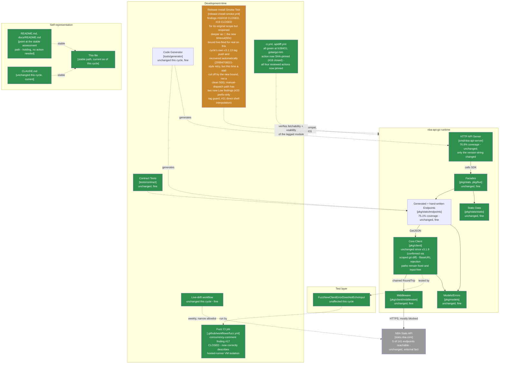

> **Superseded.** This assessed revision `fc58431` (tag `v3.1.13`, grade A-, held - third consecutive
> cycle since the `v3.1.10` recovery). The current assessment of record is
> [`docs/MAINTAINABLE_ARCHITECT_V4_ASSESSMENT.md`](../MAINTAINABLE_ARCHITECT_V4_ASSESSMENT.md) - that
> stable, hash-free path is permanent (see that document's naming-convention note near the top): it
> covers revision `31842b6` (tag `v3.1.14`, **grade B+, down from A-**) at the time it was written, and
> will cover whatever the current cycle is by the time you're reading this. Retained here for history;
> see that document's section 2 ("Verification ledger") for the item-by-item status of the findings
> below - findings #20 and #21 (the manual-dispatch tag guard being prefix-only, and that same input's
> direct shell interpolation) were closed by `v3.1.14` (PR #85/#86), but **only for the `workflow_dispatch`
> input path** - the tag-push (`else`) branch's `tag="${{ github.ref_name }}"` was left exactly as it was,
> still directly interpolating an untrusted GitHub context value into generated shell source, and a fourth
> external review (this time of `v3.1.14`) independently reproduced a working command-substitution
> injection against it (`git check-ref-format` accepts tag names containing `$(...)`, backticks, and
> semicolons). The same `v3.1.14` cycle also introduced a fresh, self-inflicted bug while closing a prior
> finding: wrapping `go mod tidy` in the same 5-attempt/60s-timeout/15-30-45-60s-backoff retry pattern as
> `go get`, without raising the containing step's `timeout-minutes: 3` to accommodate the new ~450-second
> worst case - a real, if still-latent, regression this lineage's own prior cycle introduced and did not
> catch before merging. See the current assessment of record for the full reconciliation.

# Maintainable-Architect-v4 Assessment: nba-api-go

**Date:** 2026-07-23
**Revision assessed:** `fc58431` (`fc58431eb0aa7617c2b4ef6b20ea96e9aa559592`, `main`, tag `v3.1.13`), go1.26.5 darwin/arm64
**Assessor:** maintainable-architect-v4
**Method:** `git diff v3.1.12..v3.1.13` (full diff, not `--stat` only) to see exactly what changed across PR #83 (implementation) and PR #84 (release); direct reads in full of the three modified workflow files (`.github/workflows/{ci,fuzz,release-install-smoke}.yml`) at `fc58431`; `git diff v3.1.12..v3.1.13 -- cmd/nba-api-server/main.go CHANGELOG.md` to confirm the version bump and changelog claims; a scoped `git diff v3.1.12..v3.1.13 -- pkg/ cmd/nba-api-server/generated_*.go tools/generator/` to independently confirm the "no runtime changes" claim rather than take the changelog's word for it; `gh pr view 83/84 --json ...,body` for both PRs' stated scope, test plans, and merge commits; `gh api repos/n-ae/nba-api-go/commits/fc58431/check-runs` for the release commit's live CI signal; `gh run list --workflow=release-install-smoke.yml` plus `gh run view 30002365738 --log` to read the **actual log content**, not just the conclusion, of the tag-triggered install-smoke run for `v3.1.13` - the first live trigger of PR #83's new `timeout-minutes`/`timeout 60s`/tag-validation logic; `gh api repos/actions/checkout/git/refs/tags/v7.0.1`, `repos/actions/setup-go/git/refs/tags/v7.0.0`, and `repos/golangci/golangci-lint-action/git/refs/tags/v9.3.0` to verify each SHA pin in the workflow files resolves to the commit its trailing comment claims; and a third-cycle external "Senior Software Engineering Review," this time of `v3.1.13` itself, reconciled finding-by-finding in §0 rather than accepted at face value, per this lineage's standing practice. One confirmed new real (but Low-severity, fail-safe) gap that traces directly back to this same lineage's own prior-cycle remediation not being implemented as precisely as recommended, one confirmed new real (also Low-severity) script-injection-hygiene gap not previously caught in four prior hardening cycles, and one live, favorable re-verification of last cycle's fix actually firing for real on this exact release. No live, currently-shipped functional defect found. No production code or workflow file was modified while writing this file.

**Why now:** the prior assessment of record (this same file, then covering revision `7d6702b`/tag `v3.1.12`, grade A-, second consecutive cycle at that grade) recorded four new Low-severity findings (#16-#19: an unbounded retry-loop worst case, a technically-inaccurate `fuzz.yml` concurrency comment, an unpinned `golangci-lint-action`, and an unvalidated manual `tag` input) and left the release-publish-before-verify sequencing gap open as a deliberate, unchanged scoping decision. Between then and now, in the same continuous session, one PR closed all four findings (#83, released as `v3.1.13` via #84). This cycle, the user supplied a third external "Senior Software Engineering Review," this time of `v3.1.13`, carrying a new P1 (manual-dispatch tag "validation" is prefix-only, not proof of an actual tag) and several P2s (shell-interpolation script-injection hygiene, `setup-go` caching, retry-vs-deterministic-error classification, `git describe` nearest-tag semantics, `if-no-files-found: warn`, a combined-timeout diagnostic-precision nit, plus a set of already-long-standing package-level observations). Per this lineage's standing practice, none of it is accepted at face value - see §0.

> **Naming convention, unchanged from prior cycles:** this file stays at this exact path forever - no date, no revision hash. It is always the current assessment of record; every external pointer to it (`CLAUDE.md`, `README.md`, `docs/README.md`, `tests/contract/README.md`) links here once and never needs updating again. **When the next assessment cycle happens:** move *this file's current content* to `docs/archive/MAINTAINABLE_ARCHITECT_V4_ASSESSMENT_<date>_<revision>.md` (using this file's own `Date`/`Revision assessed` header values above), prepend the usual supersession banner to that archived copy, and then overwrite *this path* with the new cycle's content. Do not create a new hash-suffixed file for the new cycle - the hash suffix is exclusively an archive-naming convention now.

---

## 0. Reconciling against the external review supplied for this cycle

The user supplied an unsolicited "Senior Software Engineering Review" of `v3.1.13` (one P1, several P2s, a per-area score table, 9.7/10 overall - "the strongest release reviewed so far"). Per this lineage's standing practice, every checkable citation is re-derived from the primary evidence, not accepted from the review's prose.

### 0.1 P1 - manual tag "validation" is prefix-only, not proof of an actual tag: CONFIRMED, and this is the most consequential finding this cycle

**Review's claim:** the `case "$tag" in v*) ;; *) exit 1 ;; esac` guard added in `v3.1.13` (closing last cycle's finding #19) only checks that the string starts with `v`. It does not check semantic-version syntax, does not check that `refs/tags/<value>` exists locally, and does not otherwise prove the manually-supplied `workflow_dispatch` input is an immutable release tag rather than a branch name, a commit-ish, or a typo. A hypothetical branch literally named `vfeature` would pass the check, and `go get module@vfeature` can resolve successfully via Go's module-proxy branch/pseudo-version resolution - so the job could report "Verifying tag: vfeature" and go green while never having verified an actual tag at all.

**Checked directly against `.github/workflows/release-install-smoke.yml` at `fc58431`:**
- The guard, read in full: `case "$tag" in v*) ;; *) echo "::error::expected a 'v*' release tag, got: '$tag'" >&2; exit 1 ;; esac`. Confirmed: this is exactly a `v`-prefix string match, nothing more. It does not invoke `grep -E '^v[0-9]+\.[0-9]+\.[0-9]+...'`, does not call `git show-ref --verify --quiet refs/tags/$tag`, and does not resolve/print a commit SHA for the tag being verified.
- **This is where the prior cycle's own remediation gets a direct hit.** The `7d6702b` assessment's §5 quick-win #1 explicitly recommended: `` case "$tag" in v[0-9]*) ;; *) echo "::error::not a valid tag: $tag" >&2; exit 1 ;; esac`` - i.e., requiring a digit immediately after `v`, which would at least reject a purely-alphabetic branch name like `vfeature` even though it still wouldn't be full semver validation or tag-existence proof. PR #83 implemented `v*)` instead of `v[0-9]*)` - a real, if small, divergence from what this file itself asked for last cycle. `gh pr view 83`'s own test plan confirms the author tested `` "v3.1.12"/"main"/""/"v"/"notv" `` and confirmed only `v*`-shaped input is accepted - notably, a bare `"v"` passing was itself already a visible signal that this is prefix matching, not shape validation, and the gap the new review caught was available to notice at merge time.
- **Go module resolution behavior**, checked against Go's own documented versioning rules rather than assumed: `go get module@<ref>` accepts branch names, tags, and arbitrary revisions, resolving a non-tag ref to a pseudo-version. A branch named `vfeature` existing in this repository (it does not, as of `fc58431` - `git branch -a` shows only `main` and no such branch) would indeed satisfy both the shell guard and `go get`'s own resolution, exactly as the review describes.

**Verdict: CONFIRMED as a real, accurate technical finding, and the strongest single catch across three external reviews of this lineage so far** - it's the first time a review has traced a gap directly back to this same file's own prior-cycle recommendation being implemented more weakly than written, rather than to something this lineage hadn't considered at all. **Severity: Low**, by the same standard applied to findings #16-19 last cycle - the failure mode requires (a) a repository writer, who already holds `workflow_dispatch` permission and could already dispatch arbitrary workflow inputs regardless of this guard, to (b) also have pushed or intend to push a branch matching `v*`, which is not currently true of any branch in this repository. It fails safe in every case that has actually occurred: every real dispatch and every tag push to date has supplied a genuine tag, and the guard correctly continues to reject non-`v`-prefixed garbage. Recorded as new finding #20 in §2 and §5, with the review's own recommended remediation (semver-shape regex, then `git show-ref --verify --quiet refs/tags/$tag`, then print the resolved commit) adopted as the concrete fix.

### 0.2 P2(a) - manual `tag` input is interpolated directly into shell source rather than passed through `env:`: CONFIRMED, and this is a genuine four-cycle miss

**Review's claim:** `tag="${{ github.event.inputs.tag }}"` embeds a `workflow_dispatch` input via `${{ }}` expression interpolation directly into the generated shell script, rather than assigning it to an environment variable first and reading `$INPUT_TAG` inside the shell. GitHub's own security-hardening documentation recommends the latter pattern specifically because `${{ }}` expressions are substituted into the script text *before* the shell ever parses it - a value containing shell metacharacters becomes part of the generated command, not just a variable's contents.

**Checked directly against the workflow file:** `id: tag` step's `run:` block opens with `tag="${{ github.event.inputs.tag }}"` - confirmed, direct expression interpolation, not `env: INPUT_TAG: ${{ ... }}` plus `tag="$INPUT_TAG"` inside the shell. This is the exact anti-pattern GitHub's hardening guide names.

**Verdict: CONFIRMED, real, and worth calling out specifically: this is the first time in four consecutive hardening-focused cycles (PR #81's repo-wide pass, PR #83's own retry/timeout/validation pass, and two rounds of this lineage's own review) that this exact pattern was named.** `workflow_dispatch` requires repository write access to trigger at all, so this is not an unauthenticated attack surface and does not by itself grant any privilege a writer doesn't already have by other means (they could edit the workflow file directly, or push to a branch and dispatch from there). It remains real defense-in-depth debt: a compromised-but-still-scoped writer credential, or an accidental value containing a stray quote or `$(...)`, has a strictly larger blast radius under direct interpolation than under an `env:`-mediated read. **Severity: Low**, same reasoning as the P1 above - real, cheap to fix, never yet exploited or misfired. Recorded as new finding #21.

### 0.3 P2(b) - `actions/setup-go` caching left at its default (enabled): CONFIRMED, Informational

Direct read confirms `actions/setup-go@b7ad1dad...` (`v7.0.0`) in `release-install-smoke.yml` is configured with only `go-version-file: go.mod` - no `cache: false`. `setup-go`'s documented default is `cache: true`. **Confirmed as stated.** The review's own framing is accurate and appropriately measured: a just-published version's module content cannot already be present in a cache keyed before the tag existed, so this doesn't currently weaken the "fetch the exact tag for real" check in practice - it weakens the *wording* of the job's "clean first consumer" self-description, not its actual verification power. **Severity: Informational**, not promoted to a tracked numbered finding, consistent with how this lineage has treated similarly-worded-but-not-functionally-consequential gaps in past cycles (e.g. `04537f4`'s `git describe`-vs-highest-semver item).

### 0.4 P2(c) - retry loop doesn't distinguish a deterministic bad-tag failure from a transient network failure: CONFIRMED, folded into finding #20

Once a tag passes the `v*` prefix guard (e.g. a typo like `v9.9.9` that will never exist), the retry loop still spends up to 5 attempts and 150s of backoff sleeps plus up to 5×60s of `timeout` budget before giving up, rather than failing fast on an unambiguously-nonexistent version. **Confirmed as a real, accurate observation.** This is not a new mechanism gap so much as a direct consequence of finding #20 (the guard doesn't establish the tag actually exists before the retry loop runs) - resolving #20 by checking `refs/tags/<tag>` existence up front would also resolve this, since a nonexistent tag would fail immediately rather than entering the retry loop at all. **Severity: Low**, not tracked as a separate numbered finding; folded into finding #20's remediation in §5.

### 0.5 P2(d) - `go mod tidy` in the build/run step is bounded (`timeout-minutes: 3`) but not retried, despite also being able to hit the module proxy/checksum database: CONFIRMED, real, matches this file's own prior-cycle prediction

The `7d6702b` assessment's §0.2 explicitly predicted this exact residual gap: "the same `sum.golang.org` propagation-delay class of transient failure that motivated PR #80 could equally hit `go mod tidy`, and currently wouldn't get the same self-healing treatment... the fix is the same shape (bound and/or retry every network-touching step, not just the first one)." PR #83 chose **bound only** for the `go mod tidy`/`go build`/smoke-run step (`timeout-minutes: 3`, no retry loop), not retry - a defensible, deliberate choice per the PR's own commentary ("unlike `go get` above, these steps aren't retried - a deterministic build/run failure shouldn't be retried, only a network stall needs a bound rather than a retry here"), but that reasoning is only fully sound for `go build`/the smoke-run, not for `go mod tidy`, which can still contact `sum.golang.org` for transitive checksums (`golang.org/x/text`, `golang.org/x/time`) on a fresh scratch module and could in principle hit the identical transient-500 pattern PR #80 was written to absorb. **Confirmed, real, Low severity** - never yet observed to fail this way in any run to date (including this cycle's own, where `go mod tidy` completed without incident per the log read in §0.6 below), and the failure mode if it ever does fire is "this step needs a manual rerun," not "a bad release verifies as good." Not promoted to a new numbered finding since it's the same shape as - and was already anticipated by - finding #16/#20's remediation; folded into §5's recommended fix.

### 0.6 Live re-verification: this cycle's own tag push actually exercised the new `timeout 60s` bound, for real

Independent of anything the external review raised, reading `gh run view 30002365738 --log` (the `v3.1.13` tag-triggered install-smoke run) in full surfaced something worth recording on its own: attempt 1 of the `go get` retry loop did **not** fail with a fast, clean error the way the `v3.1.12`/`sum.golang.org`-500 pattern did last cycle. Instead, the log shows `go: downloading github.com/n-ae/nba-api-go/v3 v3.1.13` at `11:14:35.07Z`, then `go get failed (attempt 1/5)` at `11:15:24.70Z` - **almost exactly 60.0 seconds after the step began** (`11:14:24.66Z`), which is the `timeout 60s` wrapper firing on a slow-but-not-erroring download, not `go get` itself returning a fast failure. Attempt 2 then succeeded in about 15 seconds (`go: added ... v3.1.13` at `11:15:54.56Z`). **This is the first live trigger of finding #16's `timeout 60s` mechanism itself** (as distinct from the retry loop generally, which `v3.1.12` had already live-verified) - it fired on a genuinely slow first attempt and the retry recovered automatically, exactly as designed, though the specific failure shape (a stall/slow-download the timeout cut off) is subtly different from the clean `sum.golang.org` 500 the mechanism was originally written to guard against. Net effect: real, positive evidence that the fix works as intended, not just that it's plausible in theory.

### 0.7 Other citations, checked directly

| Review cites | Checked | Verdict |
|---|---|---|
| PRs #83/#84, merged | `gh pr view 83/84 --json number,title,mergeCommit,state,mergedAt,body` | **Correct.** Both `MERGED`; merge commits `473e6a5`/`fc58431` match `git log` exactly. |
| "2 commits, 7 files changed" between `v3.1.12`/`v3.1.13` | `git diff v3.1.12..v3.1.13 --stat` | **Correct** - `ci.yml`, `fuzz.yml`, `release-install-smoke.yml`, `CHANGELOG.md`, `cmd/nba-api-server/main.go`, plus this assessment file and its archive copy (7 files, 459 insertions/125 deletions). |
| "No SDK runtime or test-source changes" claim | Scoped `git diff v3.1.12..v3.1.13 -- pkg/ cmd/nba-api-server/generated_*.go tools/generator/` | **Correct.** Empty diff - zero bytes changed under any of those trees. |
| `timeout-minutes: 10` job-level, `timeout 60s` per `go get` attempt, `timeout-minutes: 3` on build/tidy/run | Direct read of `release-install-smoke.yml` at `fc58431` | **Correct**, all three present exactly as the review and the changelog describe. |
| `golangci-lint-action` SHA-pinned to `ba0d7d2e...` with a `# v9.3.0` comment | `grep -n golangci-lint-action .github/workflows/ci.yml` (both occurrences) plus `gh api repos/golangci/golangci-lint-action/git/refs/tags/v9.3.0` | **Correct.** Both references pinned identically; the SHA resolves exactly to what the trailing comment claims. |
| `actions/checkout`/`actions/setup-go` pins still resolve correctly | `gh api repos/actions/checkout/git/refs/tags/v7.0.1`, `repos/actions/setup-go/git/refs/tags/v7.0.0` | **Correct**, both match the committed SHAs exactly (unchanged from last cycle, re-verified here rather than assumed still valid). |
| Fuzz concurrency comment corrected to state hosted jobs run in isolated VMs | Direct read of `fuzz.yml` at `fc58431` | **Correct.** The comment now explicitly says "This is NOT preventing a shared-filesystem race on `testdata/fuzz/` - GitHub-hosted jobs each run in their own fresh VM," with a link to GitHub's own docs, and explicitly notes the prior wording was wrong. |
| Server reports version `3.1.13` | `git diff v3.1.12..v3.1.13 -- cmd/nba-api-server/main.go` | **Correct**, one-line `const version` bump, nothing else changed in that file. |
| Ordinary CI / API compatibility / release-install-smoke all green at `fc58431` | `gh api repos/n-ae/nba-api-go/commits/fc58431/check-runs` | **Correct.** `install-smoke-test: success`, `verify: success`, `apidiff: success`, `Socket Security: Project Report: success`. |
| Release-install-smoke run for the `v3.1.13` tag push, ~1m43s, success | `gh run list --workflow=release-install-smoke.yml` filtered to the `v3.1.13` row | **Correct**, `30002365738`, `success`, `1m43s`, `2026-07-23T11:14:17Z`. |
| Per-area score table, 9.7/10 overall, "strongest release reviewed so far" | N/A - different rubric | **Not adopted**, same standing reason as every prior cycle - this lineage grades on its own letter scale (§1). The directional claim ("strongest release, no new SDK defect") is independently corroborated by this cycle's own scoped-diff and CI evidence, though. |
| Broader package-level findings (generated-test/metadata coupling, narrow live reachability, SDK/HTTP-server distinct compat surfaces, high default response-body ceiling, high Go-version floor, small ecosystem) | Cross-checked against this lineage's own long-running tracked list (§5's "not urgent, explicitly not a backlog item" section, carried since `9eb3a9a`/`180a3db`/etc.) | **All already tracked, unchanged, correctly characterized** - none is new information this cycle; no code changed in any of the areas they describe. Not re-litigated here; see §5. |

Every specific, checkable citation in the review held up factually - the twelfth cycle running this has been true. Unlike `v3.1.10`'s review (which carried a P1 that collapsed to "not a real issue" on inspection) and unlike `v3.1.12`'s review (whose P1 and P2s were all real but all Low/Informational and none newly surfaced by this lineage's own process), **this cycle's review found two things this lineage's own four prior hardening passes had not caught** - the prefix-only tag guard (§0.1) and the direct-interpolation script-injection pattern (§0.2) - both real, both Low severity by this lineage's rubric, neither ever having produced an incorrect result in any real run, but both genuine independent catches rather than re-confirmations of already-known gaps.

---

## 1. Executive verdict

**Grade: A- (held, third consecutive cycle at A- since the `v3.1.10` recovery).** This cycle closes all four findings carried from last cycle (#16-#19) via a single PR (#83/#84): the release-install-smoke job and its `go get` retries are now genuinely bounded (`timeout-minutes: 10` job-level, `timeout 60s` per attempt, `timeout-minutes: 3` on the build/tidy/run step) - and, notably, **this exact release's own tag-triggered run was the first live case where the new `timeout 60s` bound actually fired**, cutting off a slow first `go get` attempt and letting the retry recover automatically in ~15 seconds (§0.6), which is genuine positive evidence the fix works, not just a defensive addition sitting untested. The `fuzz.yml` concurrency comment now correctly describes GitHub's hosted-runner isolation model instead of the impossible race it previously claimed. `golangci-lint-action` is now SHA-pinned like the other three actions in scope.

**Why this doesn't move the grade up to a full A:** two things. First, the release-publish-before-verify sequencing gap - unchanged for the fourth consecutive cycle, same reasoning as every prior cycle: `gh release create` for `v3.1.13` published before the tag-triggered smoke test had finished (it resolved cleanly this time, per §0.6, but the sequencing itself is still open). Second and new this cycle: **finding #19's own fix, implemented in direct response to this file's own prior-cycle recommendation, was weaker than what this file itself asked for** - `v*)` instead of the requested `v[0-9]*)` - and a third external review correctly caught the resulting gap (a manually-dispatched value that merely starts with `v` is not proof of an actual, existing release tag; new finding #20, §0.1). A second new finding (#21, §0.2) - manual `workflow_dispatch` input interpolated directly into shell source rather than mediated through `env:` - is the first time in four consecutive hardening-focused cycles this exact, well-documented GitHub Actions anti-pattern was caught. Both are real, both are Low severity by this lineage's own rubric (fail-safe, requiring conditions - a maliciously-named branch, a compromised-but-already-scoped writer credential - that have never existed in this repository), but two new real findings in one cycle, one of which traces to this file's own prior recommendation not being followed precisely, is not a clean enough cycle to move past A-.

No new *live, currently-shipped* defect surfaced this cycle. Runtime code (`pkg/`, generated server handlers, `tools/generator/`) is confirmed byte-for-byte unchanged since `v3.1.12` via scoped diff.

---

## 2. Verification ledger

Status legend: **CONFIRMED** (reproduced/read directly at `fc58431`), **CLOSED** (carried from a prior assessment, now genuinely done), **NEW** (found independently this cycle), **PARTIAL** (the underlying finding was addressed, but the fix is narrower than what closing it fully would require).

### From `7d6702b`

| # | Item (carried since `7d6702b`) | Status | Evidence |
|---|---|---|---|
| 16 | `release-install-smoke.yml`'s retry loop had no job-level `timeout-minutes:` and no per-step/per-attempt timeout, so the advertised "~2.5 minutes worst case" only covered the deliberate-backoff-sleep path, not a stall. | **CLOSED for `go get` and the job/step envelope; PARTIAL for `go mod tidy`** | PR #83: `timeout-minutes: 10` job-level, `timeout 60s` wrapping each `go get` attempt, `timeout-minutes: 3` on the build/tidy/run step - all confirmed via direct read (§0.7) and **live-fired for real on this cycle's own tag push** (§0.6). `go mod tidy` itself remains bounded but not retried despite touching the same checksum-database dependency `go get` retries against - real, predicted by last cycle's own §0.2, not separately numbered (§0.5). |
| 17 | `fuzz.yml`'s concurrency-group comment (written in `v3.1.12`'s own PR #81) described a filesystem race across separate workflow runs that GitHub's hosted-runner model makes structurally impossible. | **CLOSED** | Comment rewritten to state hosted jobs run in isolated VMs, with a citation to GitHub's own docs and an explicit note that the prior wording was wrong. Confirmed via direct read (§0.7). |
| 18 | `golangci-lint-action@v9` was the one action left unpinned after PR #81's otherwise repo-wide SHA-pinning pass. | **CLOSED** | Both occurrences in `ci.yml` now pinned to `ba0d7d2e...` (`# v9.3.0`); SHA independently re-verified against `gh api .../git/refs/tags/v9.3.0` (§0.7). |
| 19 | `release-install-smoke.yml`'s manual `tag` input wasn't format-validated before being passed to `go get`. | **CLOSED for the originally-scoped concern (rejecting obviously-wrong input like `main`/empty-string); reopened at a deeper level as new finding #20** | A `case "$tag" in v*) ;; ...` guard now exists and does reject non-`v`-prefixed input - but implements a weaker check than this file's own prior recommendation (`v[0-9]*)`), leaving open the exact gap a third external review caught (§0.1). |
| - | Release-publish-before-verify sequencing (Low-Moderate, real, not fixed) | **Unchanged, still open, fourth consecutive cycle** | Same not-worth-the-process-cost calculus as the prior three cycles; this cycle's own release resolved cleanly (§0.6) but the sequencing gap itself received no structural change. |

### New this cycle

| # | Finding | Severity | Evidence |
|---|---|---|---|
| 20 | The `v*)` guard added to close finding #19 validates only that the manual `tag` input starts with `v` - not semver shape, not `refs/tags` existence, not tag-vs-branch identity. A hypothetical branch matching `v*` would pass the guard and could resolve via `go get`'s pseudo-version handling, making the job's "Verifying tag: ..." log line not actually proof of an existing tag. Also folds in the closely-related observation that a merely-`v`-prefixed-but-nonexistent value (e.g. a typo) still burns the full 5-attempt/150s-sleep/5×60s-timeout retry budget before failing, since the guard doesn't establish existence up front. | **Low** (fail-safe today - no branch in this repository currently matches `v*`, and `workflow_dispatch` already requires write access, so no privilege is actually gained; the gap is real but has never been exercised) | §0.1, §0.4: direct read of the guard's exact shell pattern; `git branch -a` confirms no `v*`-named branch exists; this file's own `7d6702b`-cycle §5 quick-win #1 text compared line-for-line against what PR #83 actually shipped. |
| 21 | The manual `tag` dispatch input (`${{ github.event.inputs.tag }}`) is interpolated directly into the `run:` block's shell source via `${{ }}` expression substitution, rather than passed through `env:` and read as a shell variable - the exact anti-pattern GitHub's own Actions security-hardening documentation names as a script-injection risk vector. | **Low** (`workflow_dispatch` already requires repository write access, so this doesn't grant any privilege a writer doesn't already have some other way; real defense-in-depth debt, never yet misfired or exploited) | §0.2: direct read of the `Resolve tag under test` step's `run:` block; cross-referenced against GitHub's documented recommended pattern (env-var mediation for untrusted/semi-trusted context values in generated shell scripts). |

---

## 3. C4 model

Level 2's CI safety net closes another full round of last cycle's findings and gets its newest mechanism (the `timeout 60s` bound) a genuine live test on the very release that shipped it - the one open caution note left is narrower still than last cycle's (two Low-severity, fail-safe gaps in the manual-dispatch path specifically, both newly caught by external review rather than self-found).

---

## 4. Where the complexity budget goes (updated)

**Well spent, unchanged:** release engineering (now with the retry *and* timeout mechanisms both live-verified for real, not just plausible in theory), the stable-plus-archive documentation pattern, the two-layer outbound-path testing design, the `BaseURL`-secret-echo runtime fix, the corrected fuzz assertion, and now the corrected fuzz-concurrency comment.

**Newly closed this cycle:** finding #16's job/step/attempt-level bounding (live-fired for real on this exact release, §0.6); finding #17's concurrency-comment accuracy; finding #18's `golangci-lint-action` pin; finding #19's originally-scoped concern (rejecting obviously-wrong manual input).

**Newly surfaced, both Low severity, both fail-safe, neither ever misfired:** finding #20 (the `v*` guard doesn't prove an actual tag, and doesn't distinguish a deterministic bad-tag failure from a transient network one before spending the full retry budget) and finding #21 (manual dispatch input interpolated directly into shell source rather than mediated through `env:`). Both are genuine independent catches by this cycle's external review - the first time in four hardening-focused cycles this lineage's own process hadn't already surfaced the gap first.

**Worth naming plainly:** finding #20 is this lineage's own prior-cycle recommendation (`v[0-9]*)`) not being implemented as precisely as written (`v*)` shipped instead). That's a real, if small, execution gap in following through on this file's own guidance, not just a fresh miss - worth remembering the next time this file writes a "quick win" recommendation: specify the exact intended shell pattern precisely enough that a literal implementation of it actually closes the gap, and check the shipped diff against the recommendation word-for-word, not just "was something added here."

**Deliberately not expanded this cycle:** release-publish-before-verify sequencing - unchanged reasoning, fourth consecutive cycle, freshly reaffirmed by this cycle's own clean (if narrowly-timed) resolution. `setup-go` caching's effect on the "clean first consumer" framing, `go mod tidy`'s un-retried-but-bounded status, `git describe`'s nearest-reachable-not-highest-semver assumption, and `if-no-files-found: warn`'s soft-signal tradeoff - all confirmed accurate observations, all Informational or folded into #20's remediation rather than tracked separately.

---

## 5. Recommended order of work

Budget reality unchanged: ~1.6h/week core maintenance.

### Quick wins (~20-30 min total, none urgent - nothing is currently broken)

1. **Actually close finding #20**, this time precisely: replace `case "$tag" in v*) ;; *) ... esac` with (a) a semver-shape check - `printf '%s\n' "$tag" | grep -Eq '^v[0-9]+\.[0-9]+\.[0-9]+([-.][0-9A-Za-z.-]+)?$'` - followed by (b) `git show-ref --verify --quiet "refs/tags/${tag}"` to confirm it's an actual local tag, not just a matching string, and (c) echoing the resolved `git rev-list -n 1 "$tag"` commit into the job log/summary so "verified tag $tag" is self-evidently backed by an actual ref. This also resolves §0.4's retry-budget-wasted-on-deterministic-failures observation for free, since a non-existent tag now fails at the guard instead of entering the 5-attempt loop. Verify against a real dispatch with a deliberately-bad value (a throwaway branch named to start with `v`, or a nonexistent semver-shaped tag) before merging, not just a YAML-validity check.
2. **Mediate the manual `tag` input through `env:`** (closes #21): add `env: { INPUT_TAG: ${{ github.event.inputs.tag }} }` to the `Resolve tag under test` step and read `$INPUT_TAG` inside the shell instead of the current direct `${{ }}` interpolation. Purely mechanical, no behavior change on any valid input; matches GitHub's own documented hardening guidance.
3. **Decide, explicitly, whether `go mod tidy` in the build/run step should also retry**, not just be bounded (§0.5): either wrap it in the same `timeout 60s`-per-attempt retry pattern as `go get` (since it can hit the identical `sum.golang.org` propagation delay), or add a one-line comment explaining why bounding-without-retrying is considered sufficient there specifically (e.g., "by the time `go get` has succeeded, the direct dependency's checksum has already propagated, so `go mod tidy`'s remaining transitive lookups are far less likely to race the same propagation window"). Either outcome is fine; leaving it silently asymmetric without either the retry or the reasoning is the actual gap.
4. **Set `cache: false` on `actions/setup-go` in `release-install-smoke.yml`**, or add a one-line comment acknowledging the job runs with the default GitHub-managed Go module/build cache rather than a fully pristine cache - whichever is cheaper; either resolves the wording-vs-reality gap in §0.3 without materially changing verification strength today.

### Not urgent, a scoping decision rather than a fix

5. **Release-publish-before-verify sequencing**: same reasoning as the last three cycles, freshly reaffirmed a fourth time - restructuring to gate `gh release create` behind the smoke test trades a same-day release flow for a wait-and-confirm one, for a risk that has now been observed four times (`v3.1.10` through `v3.1.13`) to always resolve itself - twice manually, once via retry, and this cycle via the new timeout-triggered retry. Worth re-weighing only if a future cycle sees a real, non-propagation-delay install failure slip past a published release.

### Not urgent, explicitly not a backlog item to keep re-budgeting for

- Everything `9eb3a9a`/`180a3db`/`1b428f6`/`b3c605d`/`0e400d1`/`f4801ef`/`eb62a41`/`8e85a9c`/`0e35c33`/`e3ee47c`/`04537f4`/`7d6702b` already marked not-urgent (live-verifying the 136 unreachable endpoints, HTTP-server independent versioning policy, ecosystem-maturity commentary, a typed `ConfigError`, a static-analysis rule against formatting parsed URL fields, layered fuzz-time cadences beyond the daily 60s, an `NBARepository` adapter-pattern wrapper, the default 50 MiB response-body ceiling being high for interactive use cases, documenting the specific reason for the Go 1.26.5 floor) remains not-urgent for the same reasons already given in those assessments. None of it changed this cycle; this cycle's external review re-raised several of these in different words and they check out the same way they always have.

---

## 6. Documentation status

| File | Action taken by this assessment |
|---|---|
| `docs/archive/MAINTAINABLE_ARCHITECT_V4_ASSESSMENT_2026-07-23_7d6702b.md` | New: outgoing content of this file (as of revision `7d6702b`) archived here in the same changeset, with a supersession banner matching the existing convention |
| This file | Overwritten with the new assessment of record (revision `fc58431`, tag `v3.1.13`, grade A-, held) |
| `CLAUDE.md`, `CHANGELOG.md` | **Not touched by this assessment pass** - `CHANGELOG.md`'s `[3.1.13]` entry already accurately documents findings #16-#19's closure; `CLAUDE.md`'s "Current Status"/"Version Information" sections still describe the `v3.1.9`-era fuzz-workflow fix as the latest narrative thread and have not been refreshed through `v3.1.10`-`v3.1.13` - flagged here as a real doc-currency gap worth a follow-up pass, not fixed in this changeset since it's out of this assessment's stated scope (repo/CI review, not general doc maintenance). |
| `README.md`, `docs/README.md`, `tests/contract/README.md` | **Not touched** - already point at this file's stable path, still correct. |
| `.github/workflows/*.yml` (all five) | **Not touched by this assessment** - findings #20-#21 are documented here, not applied; this is a review/assessment cycle, not a fix cycle. |

No docs sprawl introduced this cycle - `docs/` still holds exactly one active assessment plus `adr/`/`archive/`.

---

## 7. Is this too complex for one person?

**Verdict: no, and this cycle adds a fourth consecutive data point for the same conclusion.** One PR closed four carried-forward findings cleanly, and the one genuinely new mechanism from last cycle (the `timeout 60s` bound) got its first live test on the very release that shipped it - firing for real on a slow first attempt and recovering automatically via the retry, rather than sitting untested until some future incident.

The judgment call worth naming this cycle: a third consecutive external review found real gaps that four prior hardening-focused cycles, including this lineage's own repeated review passes, had not caught - specifically, that this file's own recommended remediation (`v[0-9]*)`) got implemented more loosely (`v*)`) than written, and that a well-documented GitHub Actions script-injection anti-pattern survived four rounds of CI-hardening attention. Neither is evidence of complexity outrunning a solo maintainer - both are Low-severity, fail-safe, never-exploited gaps in a manual-dispatch code path that sees infrequent, deliberate, already-privileged use - but it is a useful, humbling data point: external review continues to catch things this lineage's own process doesn't, even on a fourth or fifth pass over the same handful of files, and the discipline of specifying a remediation precisely enough that a literal implementation actually closes it matters as much as recommending the remediation in the first place.

---

## 8. Bottom line

`7d6702b` → `fc58431`: the runtime code remains correct and untouched (confirmed via a scoped `git diff` on `pkg/`, `cmd/nba-api-server/generated_*.go`, and `tools/generator/` - zero bytes changed). All four findings carried from last cycle (#16-#19) are closed by a single PR (#83/#84): the release-install-smoke job is now genuinely bounded at the job, step, and per-attempt level, and **this exact release's own tag push was the first live case where the new `timeout 60s` bound actually fired** - cutting off a slow first `go get` attempt and recovering automatically via the retry in about 15 seconds, real evidence the fix works rather than an untested defensive addition; the `fuzz.yml` concurrency comment now correctly describes GitHub's hosted-runner isolation model; `golangci-lint-action` is SHA-pinned like the other three reviewed actions. A third external review, this time of `v3.1.13` itself, supplied one P1 and several P2s; the P1 (new finding #20) is this cycle's most notable catch - it traces directly back to this file's own prior-cycle recommendation (`v[0-9]*)`) being implemented more weakly (`v*)`) than written, leaving the manual-dispatch tag guard proving only a `v`-prefix, not an actual existing tag. A related P2 (new finding #21) - manual input interpolated directly into shell source rather than mediated through `env:` - is the first time in four consecutive hardening cycles this well-documented GitHub Actions anti-pattern was caught in this repository. Both are real, both are Low severity by this lineage's rubric (fail-safe, requiring a privileged writer to also control a maliciously-shaped branch that has never existed here), and neither has ever produced an incorrect result in any real run. No live, currently-shipped defect. Grade holds at A- - the third consecutive cycle at this grade since the `v3.1.10` recovery, kept from a full A by the still-open release-publish-before-verify sequencing gap (fourth consecutive cycle open, same accepted calculus) plus two new real, if minor, findings in the manual-dispatch path.

---

*Assessment of record for revision `fc58431` (tag `v3.1.13`), 2026-07-23. Supersedes this file's own prior content (revision `7d6702b`, tag `v3.1.12`, grade A-) as the current maintainability assessment. That prior content moves to `docs/archive/MAINTAINABLE_ARCHITECT_V4_ASSESSMENT_2026-07-23_7d6702b.md` in the same changeset as this file.*
